# GraftVision Logical API Specification

## 1. Document Information

| Field | Value |
|---|---|
| Product | GraftVision |
| Document | Logical API Specification |
| Version | 1.0 Draft |
| Status | Proposed for product-owner, clinical, security, privacy, and engineering review |
| Date | 25 July 2026 |
| Product owner | Haris Liaqat |
| Initial clinical approver | Dr Sheraz |
| Initial validation clinic | FACE Aesthetic Clinic Lahore |
| Initial launch market | Pakistan |
| Role model | Thirteen approved roles |
| API posture | Private product API; no public external API in MVP |
| Recommended next document | `docs/UI_UX_GUIDELINES.md` |

This document is an implementation-neutral contract. Suggested methods, routes, payloads, limits, and statuses guide design; they do not assert endpoints exist. “Required” is a release condition, “recommended” is preferred unless an approved equivalent exists, “proposed” needs approval, and “unresolved” is not final.

## 2. Purpose

The API contract connects web, scan, and presentation clients to trusted domain behaviour without weakening tenant isolation, Doctor authority, version integrity, patient-safe disclosure, or manual fallback. It defines requests, server verification, resources, actions, safe failure, and traceability.

It guides backend and client integration, database/RLS alignment, tests, security review, documentation, possible client generation, and later integrations without defining executable code, infrastructure, or vendors.

## 3. Relationship to Other Documents

| Document | Authority for this specification |
|---|---|
| `docs/VISION.md` | Enduring patient journey, shared SaaS, Doctor control, manual utility, and patient-safe communication |
| `docs/PRD.md` | Product requirements, acceptance criteria, MVP boundaries, ownership, and commercial context |
| `docs/ROLE_PERMISSIONS.md` | Thirteen roles, permissions, temporary access, separation of duties, and unresolved visibility policy |
| `docs/PRODUCT_PRINCIPLES.md` | Safe defaults, provenance, failure/recovery, honest precision, and disclosure principles |
| `docs/USER_FLOWS.md` | Actors, state transitions, handoffs, negative paths, and recovery expectations |
| `docs/SYSTEM_ARCHITECTURE.md` | Application/service boundaries, trusted server, realtime, jobs, storage, and environment separation |
| `docs/DATABASE_SCHEMA.md` | Resource ownership, tenant keys, versions, approvals, statuses, grants, audit, and retention model |
| `docs/SECURITY.md` | Authentication, authorisation, RLS, token separation, private files, monitoring, and incident requirements |

The thirteen-role and tenant models are aligned. This specification preserves outstanding clinical, privacy, retention, support, combined-role, and legal decisions as explicit gates.

## 4. API Principles

| ID | Principle |
|---|---|
| API-PRINCIPLE-001 | Default deny. A route’s existence and a visible control never imply authority. |
| API-PRINCIPLE-002 | Derive tenant context from trusted identity, active membership, or a purpose-limited token; never from `clinic_id` alone. |
| API-PRINCIPLE-003 | Represent consequential state changes as explicit actions with validation, concurrency control, idempotency, and audit. |
| API-PRINCIPLE-004 | Return minimum role- and purpose-appropriate projections; patient-safe is an allowlist, not a filtered internal record. |
| API-PRINCIPLE-005 | Keep authentication, membership, permission, resource state, Doctor approval, and disclosure authority separate. |
| API-PRINCIPLE-006 | Preserve source data, derived output, draft versions, approved versions, corrections, and supersession. |
| API-PRINCIPLE-007 | Make retry safe and failure visible; never imply completion before durable confirmation. |
| API-PRINCIPLE-008 | Use asynchronous jobs for expensive or failure-prone processing while preserving manual continuation. |
| API-PRINCIPLE-009 | Separate full user sessions from scan, presentation, report-share, support, upload, and service credentials. |
| API-PRINCIPLE-010 | Correlate requests, jobs, events, approvals, shares, exports, and audit without logging clinical content or secrets. |
| API-PRINCIPLE-011 | Keep the MVP private and evolvable; external integration requires a separately approved contract. |
| API-PRINCIPLE-012 | Do not expose database rows, service credentials, object keys, stack traces, or another tenant’s resource existence. |

## 5. API Goals

### Stable API requirements

| ID | Requirement | Endpoint family | Primary actors | Authentication | Authorisation | Tenant scope | Idempotency | Audit | Stage | Acceptance criteria |
|---|---|---|---|---|---|---|---|---|---|---|
| API-AUTH-001 | Authenticate every non-public operation with the correct credential class. | All protected | All actors | User, temporary, share, or service credential | Credential type plus current state | Credential-bound | Action dependent | Auth events | MVP | One token class cannot call another class’s routes |
| API-TENANT-001 | Verify clinic ownership through every synchronous and asynchronous path. | Clinic resources | Clinic/platform actors | Trusted session/token | Membership/grant and resource scope | Required | Required for sensitive creates | Yes | MVP | Foreign IDs reveal no data and cause no mutation |
| API-RBAC-001 | Enforce thirteen-role permissions on the trusted server. | Domain/admin | Staff | User session | Central permission plus resource state | Required | Action dependent | Sensitive actions | MVP | Direct calls fail when the corresponding role action is denied |
| API-REQUEST-001 | Use typed, bounded, explicit requests. | All | Clients/services | As applicable | Before mutation | Preserved | Client request ID where useful | Failures safely | MVP | Unknown sensitive fields and invalid units/statuses are rejected |
| API-RESPONSE-001 | Return minimum stable contracts with request correlation. | All | Clients | As applicable | Projection-aware | Preserved | Repeat result where promised | No clinical payloads | MVP | Responses expose no persistence or secret details |
| API-ERROR-001 | Use safe machine-readable errors and recovery guidance. | All | Clients | As applicable | No existence leak | Preserved | Conflict represented | Error event as required | MVP | Errors include code/request ID/retryability without internals |
| API-VALIDATE-001 | Revalidate identity, tenant, permission, state, version, and input server-side. | Mutations/actions | All | Correct credential | Resource/action check | Required | Before commit | Yes where sensitive | MVP | Client validation cannot bypass any invariant |
| API-PAGE-001 | Page collections with stable tenant-scoped ordering. | Lists/search/audit | Staff | User session | Collection permission and masking | Required | Not applicable | Query metadata only where needed | MVP | No page crosses tenant or role projection |
| API-IDEMPOTENCY-001 | Make sensitive creates/actions safely repeatable. | Registration, sessions, uploads, approvals, reports, grants, exports, deletion | Authorised actors | Correct credential | Rechecked on replay | Actor+tenant+operation | Required | First and replay outcome | MVP | Same key/body returns same result; changed body conflicts |
| API-CONCURRENCY-001 | Reject stale clinical and configuration writes. | Versioned resources | Editors/approvers | User session | Edit/approve permission | Required | Compatible with action key | Conflict and success | MVP | No silent last-write-wins for clinical state |
| API-RATE-001 | Limit authentication, search, upload, shares, jobs, exports, and expensive actions. | Public/sensitive/costly | All | Actor or anonymous context | Entitlement/policy | Tenant-aware | Does not defeat idempotency | Abuse signals | MVP | Abuse is slowed without silently losing accepted work |
| API-JOB-001 | Represent durable processing with scoped status and attempts. | Media, 3D, AI, report, export | Requesters/workers | User/service | Request, inspect, cancel policy | Immutable job scope | Required enqueue | Lifecycle | MVP | Worker cannot change tenant/source/output scope |
| API-REALTIME-001 | Publish minimal authorised events with sequence and replay rules. | Scan/presentation/jobs | Scoped clients | Session/token | Channel/resource grant | Channel-bound | Event dedupe | Connection/security events | MVP | A client cannot subscribe outside its exact scope |
| API-UPLOAD-001 | Authorise private pending uploads and verify before readiness. | Media/files | Clinical staff/scan | User/scan token | Patient/context/category | Required | Reserve/finalise | Lifecycle | MVP | Unverified objects never become clinical Ready media |
| API-DOWNLOAD-001 | Issue short-lived private delivery only after current checks. | Media/report/export | Permitted actors/recipients | Session or purpose token | Resource/version/action | Required | Grant creation as needed | Download/share | MVP | Copied object reference grants no permanent access |
| API-SCAN-001 | Bind capture to one clinic, patient, consultation, and session. | Scan | Initiator/paired device | User then scan token | Capture permission and active state | Immutable | Events deduplicated | Full lifecycle | MVP | Scan client cannot list or search clinic patients |
| API-PRESENT-001 | Expose only one approved patient-safe manifest. | Presentation | Doctor/Presentation User/display | User then presentation token | Create/control/display distinctions | Immutable | Control commands sequenced | Full lifecycle | MVP | Display cannot call general patient/report/media APIs |
| API-REPORT-001 | Separate internal and patient-safe report contracts and approvals. | Reports/shares | Doctor/Coordinator/permitted staff | User/share token | Type, version, approval, action | Required | Generate/approve/share | Full lifecycle | MVP | Internal or unapproved content cannot use patient links |
| API-AI-001 | Keep AI derived, scoped, optional, and non-authoritative. | AI jobs/suggestions | Clinical actors/services | User/service | Use-case and source permission | Immutable | Required enqueue | Request/model/review | Conditional | AI cannot approve, overwrite source, or block manual work |
| API-MODEL-001 | Keep 3D upload/processing/calibration versioned and optional. | 3D | Clinical actors/services | User/service | Source/model permission | Required | Required processing | Lifecycle | MVP upload; reconstruction conditional | Failure preserves source and manual workflow |
| API-PATIENT-001 | Protect patient identity and cross-patient context. | Patients | Permitted clinic roles | User session | Create/read/update/search projection | Required | Create required | Sensitive lifecycle | MVP | Every child operation rechecks patient and clinic |
| API-CONSULT-001 | Preserve consultation status, sources, versions, and completion rules. | Consultations | Clinical team | User session | Role plus patient/episode state | Required | Create/complete | Lifecycle | MVP | Completion cannot bypass required evidence or documented exception |
| API-GRAFT-001 | Separate planned graft allocations from procedure actuals. | Plans/counts | Clinical team | User session | Draft/edit/Doctor approve distinctions | Required | Approval/finalisation | Full lifecycle | MVP | Plan, extracted, discarded, usable, and implanted remain distinct |
| API-PROC-001 | Reconcile procedure records without rewriting approved plans. | Procedure | Procedure team/Doctor | User session | Field and approval boundaries | Required | Count/finalise | Full lifecycle | MVP | Arithmetic discrepancies block completion or require authorised exception |
| API-FOLLOW-001 | Keep follow-ups longitudinal, dated, source-aware, and reviewable. | Follow-ups/comparison | Clinical team | User session | Patient/procedure/role | Required | Create/capture | Lifecycle | MVP | Comparisons expose condition/reliability limitations |
| API-EXPORT-001 | Generate only approved clinic-owned data packages. | Exports | Elevated clinic roles | User plus step-up if approved | Scope/hold/entitlement | Required | Required | Request/download/expiry | MVP | Package excludes other clinics and platform IP |
| API-DELETE-001 | Use staged approval for permanent deletion. | Archive/deletion | Authorised approvers | User plus step-up if approved | Holds/separation/state | Required | Required | Every stage | MVP logical | Ordinary generic delete cannot permanently erase clinical data |
| API-AUDIT-001 | Provide immutable evidence and read-only scoped retrieval. | Audit | Authorised reviewers/platform security | User session | Audit permission and masking | Required | No mutation | Audit access audited | MVP | Normal clients cannot create, edit, or delete audit events |

## 6. API Scope

Scope includes private web APIs, trusted server actions/internal RPC, scan and presentation session interfaces, private upload/download grants, realtime events, job control, worker callbacks, report shares, administrative operations, audit retrieval, and logical provider boundaries. It includes positive, denial, expiry, replay, conflict, cancellation, supersession, and recovery behaviour.

## 7. API Non-Scope

This specification excludes executable handlers, generated schemas, SDKs, migrations, ORM models, UI, infrastructure, vendor configuration, public signup, billing, patient payments, patient portal, native-app contracts, multi-branch hierarchy, mandatory reconstruction, autonomous clinical decisions, and public partner APIs.

## 8. API Style Decision

| Style | Benefits | Risks | MVP suitability | Upgrade trigger and migration path |
|---|---|---|---|---|
| REST | Familiar resource/action semantics, cache and HTTP tooling, explicit security review, easy generated documentation | Endpoint count and over-fetching if projections are careless | Recommended for domain resources and explicit actions | Publish stable OpenAPI later; introduce partner subset behind separate version/auth |
| GraphQL | Flexible projections and composition | Field-level authorisation, query cost, tenant leakage, cache and audit complexity | Not recommended for MVP | Consider only after measured client complexity and a mature field-policy/cost layer |
| RPC/server actions | Strong monorepo typing and convenient trusted UI integration | Framework coupling, implicit contracts, harder external reuse | Recommended selectively for internal UI orchestration | Keep domain service semantics independent; expose REST contract when reuse emerges |
| Hybrid internal API | REST domain boundary, internal RPC convenience, async jobs, realtime sessions | Duplicate paths or inconsistent policy without one shared domain layer | Recommended | Maintain one authorisation/validation/audit core; adapt transports without duplicating rules |

Decision: use REST-style domain endpoints for core resources; trusted server actions or internal RPC for same-repository orchestration; durable asynchronous job resources for media, AI, 3D, reports, and exports; narrowly scoped realtime channels for scan and presentation; and no public external API in MVP. The API contract, not the transport, owns tenant, permission, state, concurrency, idempotency, and audit rules.

## 9. API Versioning

Use a major version in private HTTP paths, proposed as `/api/v1`. Additive optional fields may remain within a major version; removed fields, changed meanings, tightened enum interpretation that breaks valid clients, or altered workflow semantics require compatibility handling or a new major version. Resource versions and clinical revisions are not API versions.

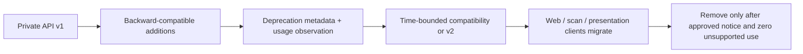

The monorepo may deploy clients and server together, but scan sessions on mobile browsers, open presentation displays, queued jobs, and signed links can outlive a deployment. Compatibility must cover those lifetimes. Final deprecation windows remain proposed.

## 10. Base URL and Environment Strategy

Use environment-specific first-party origins with `/api/v1`; caller-selected environment or tenant paths never grant authority. Local, staging, and production have separate credentials, data services, queues, signing material, and test data. Production patient data is prohibited in lower environments.

Clients reject unexpected origins and do not silently fall back between environments. Responses may identify a non-sensitive environment label for diagnostics. Host, forwarded-header, callback, and redirect validation prevent origin confusion. Exact domains and regional hosting remain deployment and privacy decisions, not API contracts.

## 11. Authentication Model

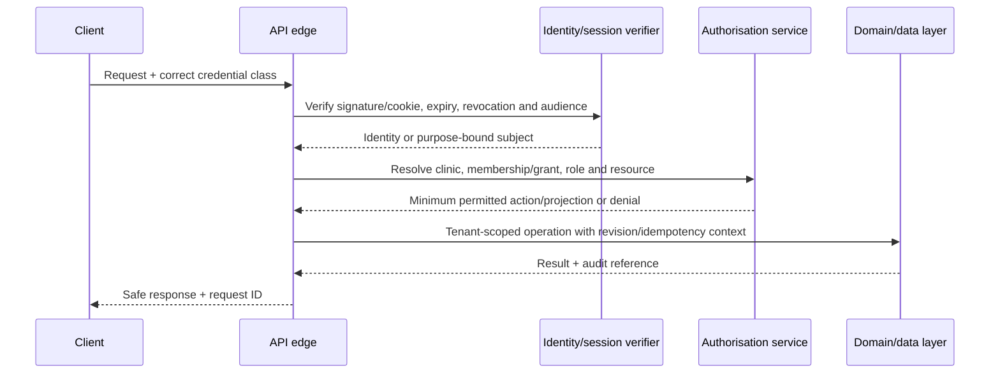

Credential classes are: full user session, temporary scan token, temporary presentation token, external report token, support grant attached to a named user session, signed upload/download grant, and internal service credential. They have separate issuers/audiences or verifiable purposes and are never interchangeable. A support grant is not standalone identity. Workers use narrowly scoped service identity plus immutable job context.

Only report verification metadata explicitly approved for public access may be unauthenticated. Generic authentication errors avoid account, clinic, patient, or token-state enumeration. Deactivation, role change, MFA recovery, clinic suspension, grant expiry, and incident response propagate revocation according to `SECURITY.md`.

## 12. Authorisation Model

Every operation evaluates: credential type; active identity or purpose; active clinic membership or grant; thirteen-role permission; resource clinic/patient ownership; resource state and version; Doctor verification for Doctor-only actions; entitlement without weakening baseline security; temporary scope; separation-of-duties rules; and relevant hold, suspension, or deletion state.

Collection permission does not imply item permission; read does not imply write; prepare does not imply approve; approve does not imply share; download does not imply external share; operational support does not imply clinical access; and platform administration does not imply patient access. Denials return safe codes and may be audited without confirming a foreign resource.

## 13. Tenant Scoping

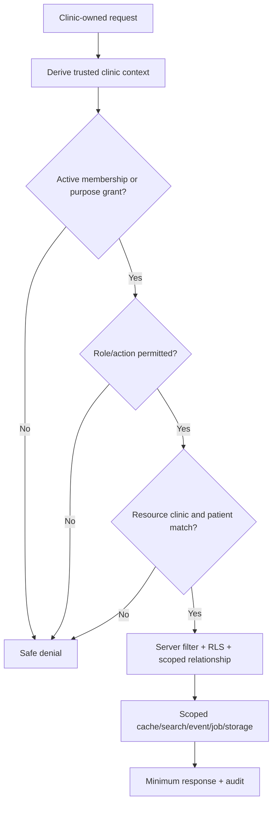

API-TENANT-001 applies to paths, body references, query filters, cursors, object grants, events, callbacks, jobs, exports, audit queries, report shares, presentation manifests, and restored data. Informational `clinicId` may appear in responses or payload examples, but a caller-provided value is never sufficient authority. Cross-clinic identifier handling should normally use `RESOURCE_NOT_FOUND` or a generic denial according to enumeration risk; internal telemetry records the scoped violation.

## 14. Role and Permission Enforcement

The central permission catalogue uses all thirteen roles: Platform Owner, Platform Administrator, Platform Support Engineer, Clinic Owner, Clinic Administrator, Doctor or Hair-Transplant Surgeon, Clinical Assistant, Procedure Technician, Reception User, Report Coordinator, Presentation User, Read-Only Clinical Reviewer, and Patient. Patient API access remains outside MVP unless a purpose-limited report link applies.

The server maps endpoint actions to permissions and then evaluates resource/state predicates. The UI may use capabilities to render controls, but capabilities are hints rather than credentials. Combined roles produce the approved union except where separation of duties, Doctor-only authority, support rules, or privacy masking explicitly constrain it.

## 15. Resource Ownership

Clinic-owned roots include patients, memberships, consultations, media, models, regions, measurements, designs, plans, procedures, follow-ups, reports, manifests, shares, grants, exports, and clinic audit events. Patient children must match both clinic and patient lineage. Platform-owned resources include product configuration, supported plans/entitlements, provider administration, and minimum operational/security metadata.

Clinics own their clinic and patient data and receive controlled export. GraftVision owns software, proprietary algorithms, internal tooling, architecture, and shared platform configuration. Derived AI/3D output retains provenance but never replaces source or gains approval authority.

## 16. Request Conventions

Use UTF-8 JSON for structured requests and signed direct upload for large files. Multipart is reserved for small, justified cases. Timestamps use ISO 8601 with an offset; stored/canonical event time is UTC, while clinic timezone is explicit presentation context. Dates without time are ISO calendar dates. Units are explicit and never inferred for final clinical values.

Mutations identify the intended action, source/version, expected revision, and client request ID or idempotency key where required. Unknown security-sensitive fields are rejected. Empty, omitted, and explicit null have documented meanings. Final decisions have no hidden clinical defaults. Boolean flags never smuggle multiple status transitions. Identifiers are opaque, case-sensitive, and not clinically meaningful.

## 17. Response Conventions

Direct resource responses are recommended for single resources; collection and action responses add consistent metadata. A logical success envelope may contain `data`, `meta.requestId`, `meta.warnings`, `meta.deprecations`, `meta.page`, and `links` where genuinely useful. An accepted asynchronous action returns the job and target references plus current status, not a false completed resource.

Responses contain server-authoritative identifiers, status, version/revision, timestamps, allowed next actions where safely computed, and minimum projection. They omit internal columns, RLS details, object keys, raw provider payloads, secrets, token hashes, stack traces, and fields the role cannot view. A warning does not convert an invalid final decision into success.

## 18. Error Model

Errors use a stable shape containing `code`, safe `message`, `requestId`, `retryable`, optional `fieldErrors`, optional current revision/status, and safe `recovery`. HTTP status remains semantically appropriate, but clients branch primarily on stable application code.

| Code | Typical meaning | Retry | Safe recovery |
|---|---|---:|---|
| `AUTHENTICATION_REQUIRED` | Missing, expired, revoked, or wrong credential class | Sometimes | Authenticate with the required context |
| `PERMISSION_DENIED` | Actor lacks action authority | No | Request an authorised actor; do not retry unchanged |
| `TENANT_SCOPE_VIOLATION` | Trusted context and requested scope conflict; generally masked externally | No | Clear context and reselect authorised resource |
| `RESOURCE_NOT_FOUND` | Missing or intentionally undisclosed resource | No | Refresh authorised collection |
| `VALIDATION_FAILED` | Field/schema/invariant failure | After correction | Use field errors and resubmit |
| `VERSION_CONFLICT` | Expected revision/version is stale | After review | Fetch current version, compare, and deliberately retry |
| `IDEMPOTENCY_CONFLICT` | Key reused with different operation/body | No with same key | Use original body or a new key for a new intent |
| `INVALID_STATUS_TRANSITION` | Action is not legal from current state | After state change | Refresh and follow allowed transition |
| `DOCTOR_APPROVAL_REQUIRED` | Final action lacks active authorised Doctor approval | No | Route exact version to Doctor |
| `REPORT_NOT_APPROVED` | Report/type/version is not eligible to download/share | No | Approve current patient-safe version |
| `PRESENTATION_SESSION_EXPIRED` | Display/control grant ended or was revoked | New session | Doctor creates a new session |
| `SCAN_SESSION_EXPIRED` | Pairing/capture grant ended or was revoked | New/resumed session | Revalidate patient and issue approved session |
| `SUPPORT_ACCESS_REQUIRED` | Platform support lacks an active matching grant | No | Clinic requests/approves scoped grant |
| `CALIBRATION_REQUIRED` | Exact physical measurement lacks valid scale | After calibration/manual method | Calibrate or use labelled manual fallback |
| `MEASUREMENT_UNAVAILABLE` | Required source/method cannot produce a valid value | After correction | Correct source or document manual value |
| `FILE_REJECTED` | Object failed type, size, integrity, malware, or context checks | Maybe | Select valid file or recapture |
| `PROCESSING_FAILED` | Async processing failed safely | Policy dependent | Inspect safe error; retry or continue manually |
| `RATE_LIMITED` | Request exceeds actor/tenant/action policy | Yes later | Respect retry metadata; do not parallel flood |
| `EXPORT_NOT_READY` | Export is queued, processing, failed, expired, or unauthorised | Later if active | Inspect job/status |
| `DELETION_NOT_APPROVED` | Hold, approval, separation, or state gate blocks deletion | No | Complete policy workflow; never bypass |

Errors never include another tenant’s existence, raw queries, provider credentials, patient narrative, signed URLs beyond a current authorised success response, or internal exception text.

## 19. Validation Model

Validation occurs in layers: transport/schema; canonical format; field bounds; trusted identity and tenant; role/action; ownership relationships; resource state; concurrency; clinical/business invariants; entitlement; and provider/file output. Client validation improves usability only.

The server revalidates after queue delay and immediately before approval, finalisation, share, signed delivery, export, support activation, deletion, and worker commit. Validation is atomic: a failed request leaves no partial clinical state unless the contract explicitly creates a visible resumable draft. Normalisation never silently alters clinical evidence or identity.

## 20. Pagination

Cursor pagination is recommended for patients, consultations, media, jobs, reports, audit, and other changing collections. Proposed default is 25 and proposed maximum is 100; audit/export-adjacent lists may use lower limits. Final limits require performance and clinic validation.

Cursors are opaque, signed or integrity-protected, tenant/query/projection bound, expiring where appropriate, and do not expose database offsets. Ordering includes a unique tie-breaker. Offset pagination is acceptable for small stable administrative catalogues. Changing filter, sort, active clinic, or role invalidates a cursor.

## 21. Filtering

Filters use documented allowlists and typed operators, with bounded counts and complexity. Tenant criteria are server-enforced and not optional filters. Patient/status/date/assigned-Doctor/report/procedure/follow-up filters respect role masking. Unsupported fields and unsafe free-form query fragments are rejected.

Clinical text, notes, token values, object keys, and internal provider states are not generic filters. Date ranges use clinic-facing timezone semantics but canonical UTC boundaries. Filter choices are returned as safe normalized metadata when useful.

## 22. Sorting

Each collection defines allowed stable sort keys and a deterministic identifier tie-breaker. Proposed defaults favour newest relevant clinical event or patient name/number according to workflow. Sorting by restricted fields must not reveal them through ordering.

Arbitrary expressions, raw column names, locale-dependent unstable ordering, and client-provided null behaviour are prohibited. Cursors embed the exact sort contract. Server defaults are explicit in response metadata.

## 23. Search

MVP search is private, PostgreSQL-backed, and tenant scoped. It supports patient number, normalized patient name, approved phone lookup, assigned Doctor, and workflow dates/statuses defined by the schema. Search results are minimum summaries, not complete records.

Queries are bounded, throttled, normalized, and protected against wildcard/filter injection. Short or broad searches may require additional context. Temporary scan, presentation, report-share, and service credentials cannot use general search. Cross-tenant duplicate-looking identities are expected and never merged.

## 24. Field Selection

MVP should prefer named projections such as `summary`, `clinical-detail`, `patient-safe`, and `audit-summary` rather than arbitrary field selection. This makes role review, caching, and disclosure testing tractable. A limited `include` may add documented relationships when independently authorised and bounded.

Graph-style arbitrary expansion, field-name probing, and nested unbounded includes are prohibited. Patient-safe projections are built from approved snapshots/manifests and do not dynamically subtract internal fields.

## 25. Idempotency

Sensitive creates and actions accept an `Idempotency-Key` or equivalent client request identifier. Scope is credential subject, trusted clinic, endpoint action, and canonical request digest. Proposed retention is at least 24 hours for ordinary creates and long enough to cover the business risk for approvals, report shares, support grants, exports, deletion, and procedure finalisation; final periods remain unresolved.

The first committed outcome, including a safe deterministic failure where appropriate, is replayed. Concurrent duplicates serialize around one result. Reuse with a different digest returns `IDEMPOTENCY_CONFLICT`. Authorisation, revocation, and resource eligibility are rechecked when replay could expose a previously authorised result. Audit distinguishes first execution from replay without duplicating the domain event.

## 26. Concurrency Control

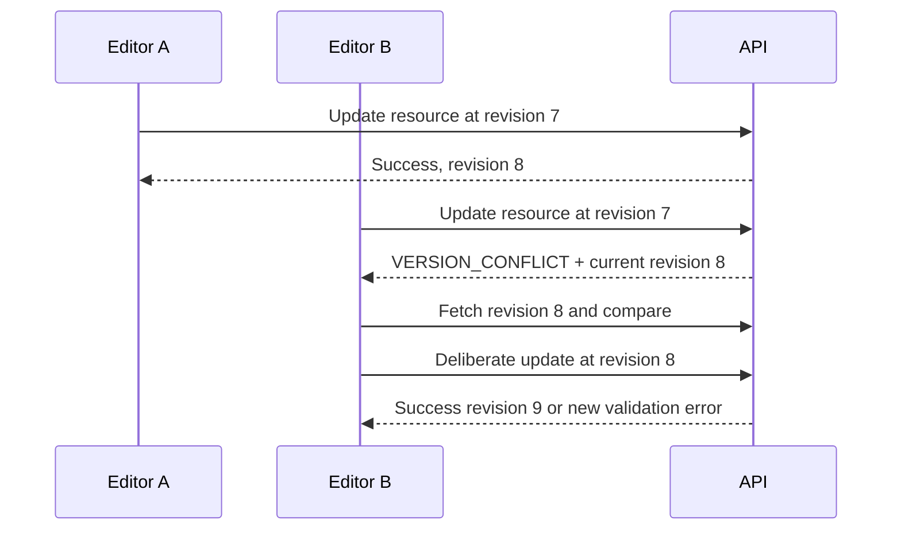

Clinical resources, membership/configuration, manifests, grants, and other consequential state use optimistic concurrency. The contract accepts a body revision, `If-Match`-style token, or equivalent; one consistent mechanism should be selected before implementation. Conflicts return current revision/status and, only where privacy-safe, changed field names. They never auto-merge approved or Doctor-controlled content.

## 27. Optimistic Locking

Draft updates increment a revision. Material edits to an approved resource create a new draft/version or invalidate the active approval according to the source model; they do not mutate the approved snapshot in place. Approval locks or transactionally verifies exact source versions and dependency revisions.

Bulk and background operations capture expected revisions and fail or skip explicitly when sources change. Clients present conflict recovery rather than silently retrying with the newest revision. Realtime change notices improve awareness but are not locking authority.

## 28. Request Correlation

Every request receives a server-generated opaque request ID. Clients may submit a separate client request ID for diagnostics and deduplication, but cannot choose the authoritative audit identifier. IDs propagate to jobs, events, provider calls, and safe errors without containing clinic, patient, email, or token data.

Trusted services validate incoming correlation format and create a new boundary ID when crossing trust domains. Logs use IDs to locate protected records; they do not duplicate protected payloads.

## 29. Audit Correlation

Sensitive actions produce an immutable domain/audit event tied to request ID, actor, active clinic, role/grant, resource, action, outcome, version, and reason where required. Job attempts, report artefacts, shares, downloads, exports, approval, support access, deletion, and revocation retain lineage.

The API returns an audit reference only when useful and authorised. Audit creation is part of the trusted transaction/outbox path, not a caller-supplied event. Normal clients cannot mutate audit evidence.

## 30. Rate Limiting

API-RATE-001 applies layered limits by IP/network, identity, credential, clinic, route/action, resource, and provider cost. Authentication, recovery, invitations, search, token redemption, signed grants, file reservation/finalisation, report sharing, AI/3D jobs, exports, deletion, verification, and admin operations receive tailored limits.

Accepted idempotent work is not lost when later polls are limited. Responses use `RATE_LIMITED`, a safe retry time, and request ID. Limits do not reveal whether an account, patient, share, or clinic exists. Exact values are proposed after pilot and load testing.

## 31. Abuse Protection

Abuse controls include bounded payloads, pagination, query depth/complexity limits, quotas for expensive jobs/storage/shares, duplicate detection, suspicious token/login monitoring, progressive delays, short-lived grants, and entitlement checks. Essential tenant isolation, privacy, audit, and recovery never weaken on a lower plan.

Clinical staff retain a manual path when automation is unavailable. Repeated wrong-tenant, replay, share, pairing, export, or file failures can trigger challenge, denial, alert, and incident review.

## 32. Retry Behaviour

Clients retry only operations marked retryable. Safe reads may use bounded exponential backoff with jitter. Mutations retry only with the same idempotency key and unchanged body. Validation, permission, tenant, version, status, approval, and deletion-policy failures require a state or user decision change.

Jobs expose attempts and next eligibility; clients poll at server-advised intervals or use authorised realtime. A timeout does not prove failure: clients inspect by idempotency key, resource, or job before creating duplicate work. Manual fallback remains available.

## 33. Timeout Behaviour

API handlers have bounded execution and move long work to jobs. Proposed interactive target timeouts are transport-specific and require performance approval; no client assumes that connection closure rolled back accepted work. The response or later lookup distinguishes not accepted, accepted/processing, succeeded, failed, cancelled, and unknown/reconcile states.

Signed upload/download, scan pairing, presentation, report share, support grant, and export grants use explicit server expiry independent of transport timeout. Workers apply provider timeouts, cancellation, retry caps, and safe late-result rejection.

## 34. Background Job API Pattern

Jobs have opaque ID, immutable clinic/patient/source scope, type, requester, idempotency key, priority policy, status, progress where meaningful, attempts, safe error, model/processor version, output references, created/started/completed timestamps, and cancellation/invalidation state. Suggested statuses are `queued`, `running`, `succeeded`, `failed`, `cancel_requested`, `cancelled`, and `invalidated`.

Creating a job validates source and action. Inspecting requires current authority. Cancellation is best effort and does not erase already committed evidence. Retry creates a traceable attempt or successor job, never silently rewrites history. Worker callbacks use service identity and validate the stored job; clients cannot submit success.

## 35. Webhook Strategy

MVP has no general outbound clinic webhook product. Provider callbacks for identity, email, storage, malware, AI/3D, or other approved services are internal integration endpoints. They require provider-specific signature verification, timestamp/replay limits, expected source/audience, bounded schema, idempotency, tenant/job lookup from stored context, and safe acknowledgement.

Callbacks match supplied clinic, patient, object, status, and destination to an existing request. Secrets rotate without unsigned fallback. Raw payload retention is minimised. Future clinic webhooks require event allowlists, per-clinic secrets, replay controls, endpoint verification, egress protection, privacy review, and opt-in governance.

| Operation | Method | Suggested route | Purpose | Actors | AuthN | AuthZ | Tenant | Request | Response | Idempotency | Audit | Stage |
|---|---|---|---|---|---|---|---|---|---|---|---|---|
| Provider callback | POST | `/internal/v1/provider-callbacks/{provider}` | Reconcile approved external work | Approved provider | Verified signature | Stored job/provider binding | From stored job | Provider event reference and bounded result | Safe acknowledgement | Provider event ID | Integration event | MVP/conditional |
| Clinic webhook management | — | Reserved | Future external event delivery | Clinic admin/integration | Separate integration auth | Explicit event permission | Clinic | Endpoint and event allowlist | Subscription | Required | Full lifecycle | Post-MVP |

## 36. Real-Time Event Strategy

Realtime carries change notification and temporary-session coordination, never primary authority. Authorisation occurs when joining and on sensitive commands; server/data policies remain authoritative. Channels are exact-resource scoped and expire with the user or temporary session.

Every event contains an opaque event ID, clinic-bound channel context, resource type/ID, occurred time, actor class where safe, sequence or revision, minimal payload, and schema version. Clients deduplicate by event ID and order by resource sequence. Gaps trigger an authorised state refresh. Reconnect revalidates access and does not replay content outside current scope.

| Event family | Subscribers | Minimum examples | Prohibited payload |
|---|---|---|---|
| Scan | Initiating laptop and paired phone | `scan.session.created`, `scan.device.paired`, `scan.capture.completed`, `scan.upload.progress`, `scan.session.completed` | Patient list, medical history, other media |
| Processing | Current authorised clinical viewers | `model.processing.updated`, `ai.job.updated`, `report.job.updated` | Raw provider response, secrets, unrelated patients |
| Presentation | Controller and one display session | `presentation.state.updated`, `presentation.session.expired` | Internal report, notes, contacts, general navigation |
| Support | Clinic leadership and named support actor | `support.grant.revoked` | Clinical content or another grant |

## 37. File Upload Strategy

Uploads use a pending record and scoped signed storage grant. The ten-step flow is: request authorisation; validate actor/tenant/patient/context/category/limits; create pending media; issue short-lived upload details; upload to private storage; finalise; verify metadata/checksum; enqueue safe processing; mark Ready or Rejected; audit. No client can mark an object Ready.

Allowed type, size, dimensions, duration, checksum algorithm, duplicate handling, and malware strategy are policy by file category. Original filename is display metadata only; the server generates opaque object keys. Pending/orphan objects expire and are cleaned after reconciliation. Wrong-patient prevention requires visible context at reservation and immutable binding thereafter.

| Operation | Method | Suggested route | Purpose | Actors | AuthN | AuthZ | Tenant | Request | Response | Idempotency | Audit | Stage |
|---|---|---|---|---|---|---|---|---|---|---|---|---|
| Reserve upload | POST | `/clinical-media/uploads` | Create pending media and grant | Clinical staff/scan device | User or scan token | Create media in exact context | Bound from credential/resource | Category, patient/source, type, size, checksum | Pending media + upload grant | Required | `media.upload_reserved` | MVP |
| Finalise upload | POST | `/clinical-media/{mediaId}/finalise` | Verify stored object and enqueue checks | Same scoped actor | Matching credential | Finalise pending object | Stored media scope | Checksum, storage receipt, expected revision | Media status + job | Required | `media.upload_finalised` | MVP |
| Abandon upload | POST | `/clinical-media/{mediaId}/abandon` | Mark pending item for cleanup | Creator/permitted clinical actor | User/scan token | Same patient/session | Stored media scope | Reason, revision | Abandoned media | Required | `media.upload_abandoned` | MVP |

Illustrative finalisation payload:

```jsonc
{
  "mediaId": "media_example_001",
  "expectedRevision": 1,
  "uploadReceipt": "opaque_storage_receipt",
  "checksum": {"algorithm": "sha256", "value": "example_checksum"},
  "clientRequestId": "request_example_004",
  "statusExpected": "pending_upload"
}
```

## 38. Signed Upload Strategy

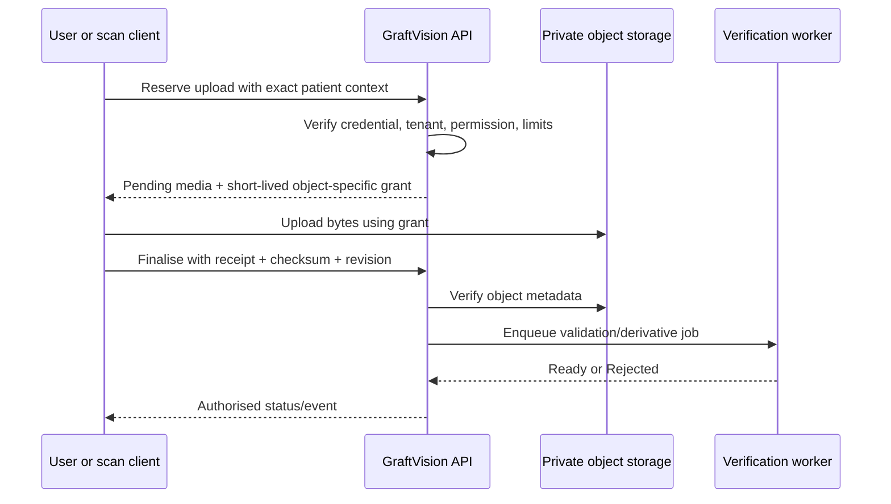

Upload grants permit one method, object, content constraints, and short expiry. They cannot list, read, overwrite another object, choose a public ACL, or change tenant/patient metadata. Proposed expiry is minutes rather than hours and requires provider validation. A retry reuses the pending record where safe or creates a traceable replacement; it never attaches the same unverified object to a new patient.

## 39. Signed Download Strategy

The API first verifies the current user permission, presentation/share/export grant, resource state, version, and patient/clinic scope. It then returns a very short provider URL or a revocation-aware delivery exchange. Signed URLs are delivery credentials, not persistent resource fields.

| Operation | Method | Suggested route | Purpose | Actors | AuthN | AuthZ | Tenant | Request | Response | Idempotency | Audit | Stage |
|---|---|---|---|---|---|---|---|---|---|---|---|---|
| Request media download | POST | `/clinical-media/{mediaId}/download-grants` | Deliver private media | Permitted clinical roles | User | `media.download` plus current state | Resource clinic/patient | Intended use, version | Expiring URL/grant | Optional key | Download grant/event | MVP |
| Request report download | POST | `/reports/{reportId}/versions/{versionId}/download-grants` | Deliver eligible PDF | Permitted role | User | Type/version/download permission | Resource clinic | Purpose | Expiring PDF grant | Optional | Report download | MVP |
| Redeem export | POST | `/exports/{exportId}/download-grants` | Deliver approved package | Named requester/approver | User + step-up if policy | Current ready export | Resource clinic | Export revision | Expiring grant | Required | Export download | MVP |

Responses set safe disposition, content type, cache, and referrer behaviour. Expired, revoked, superseded, suspended, deleted, or foreign resources receive no reusable provider reference.

## 40. Media Processing API

Media processing is asynchronous and derives thumbnails, normalised display variants, quality metadata, or approved format conversions without altering the original. Status transitions are `pending_upload` → `uploaded` → `verifying` → `processing` → `ready`, `needs_review`, or `rejected`; exact names must align with the schema.

| Operation | Method | Suggested route | Purpose | Actors | AuthN | AuthZ | Tenant | Request | Response | Idempotency | Audit | Stage |
|---|---|---|---|---|---|---|---|---|---|---|---|---|
| Inspect media | GET | `/clinical-media/{mediaId}` | View authorised metadata/status | Clinical roles | User | Media projection permission | Required | Projection | Media summary/detail | N/A | Sensitive access as policy | MVP |
| Reprocess | POST | `/clinical-media/{mediaId}/processing-jobs` | Retry approved processing | Clinical actor/support with grant | User | Retry permission and safe state | Required | Processor/version/reason | Job | Required | Processing requested | MVP |
| Review rejection | POST | `/clinical-media/{mediaId}/review` | Record accept/recapture decision where allowed | Clinical actor | User | Category-specific review | Required | Decision, reason, revision | Updated status | Required | Review event | MVP |

Processor output is untrusted until schema, source, scope, and staleness checks pass. Quality warnings do not automatically become clinical conclusions.

## 41. 3D Processing API

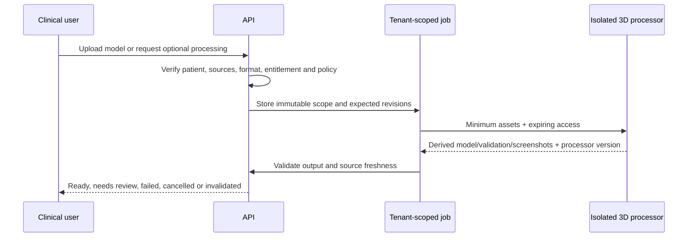

| Operation | Method | Suggested route | Purpose | Actors | AuthN | AuthZ | Tenant | Request | Response | Idempotency | Audit | Stage |
|---|---|---|---|---|---|---|---|---|---|---|---|---|
| Create processing job | POST | `/three-d-models/processing-jobs` | Validate/simplify/reconstruct model | Doctor/Assistant as permitted | User | Model create/process | Exact patient/source | Mode, source refs, expected revisions | Job + draft model ref | Required | `model.processing_requested` | Upload processing MVP; reconstruction conditional |
| Inspect model | GET | `/three-d-models/{modelId}` | View model status/provenance | Permitted clinical roles | User | Model read | Required | Projection | Model metadata + authorised assets | N/A | As policy | MVP |
| Calibrate model | POST | `/three-d-models/{modelId}/calibrations` | Add scale evidence | Permitted clinical editor | User | Calibration create | Required | Method, evidence, units, revision | Calibration/version | Required | `model.calibrated` | MVP where supported |

Illustrative 3D job payload:

```jsonc
{
  "patientId": "patient_example_001",
  "mode": "validate_uploaded_model",
  "sourceModelMediaId": "media_example_glb_001",
  "sourceRevision": 3,
  "requestedOutputs": ["validated_model", "patient_safe_screenshots"],
  "automaticReconstructionRequired": false,
  "clientRequestId": "request_example_019"
}
```

## 42. AI Processing API

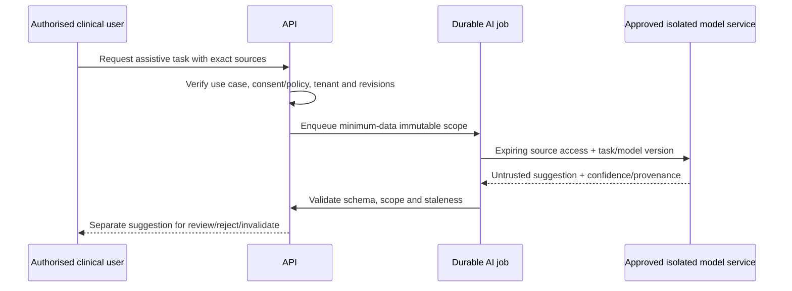

| Operation | Method | Suggested route | Purpose | Actors | AuthN | AuthZ | Tenant | Request | Response | Idempotency | Audit | Stage |
|---|---|---|---|---|---|---|---|---|---|---|---|---|
| Create AI job | POST | `/ai-suggestions/jobs` | Request approved assistive task | Doctor/Assistant where permitted | User | Use-case permission | Exact patient/source | Task, sources, revisions, model policy | Job | Required | `ai.job_requested` | Conditional |
| Inspect suggestion | GET | `/ai-suggestions/{suggestionId}` | Review derived output | Permitted clinical roles | User | Suggestion read | Required | Projection | Suggestion, confidence, provenance, status | N/A | Review access as policy | Conditional |
| Review suggestion | POST | `/ai-suggestions/{suggestionId}/reviews` | Accept as input, reject, or invalidate | Doctor/clinical actor by task | User | Task review; not approval | Required | Decision, reason, revision | Review + possible new draft reference | Required | `ai.suggestion_reviewed` | Conditional |

Illustrative AI job payload:

```jsonc
{
  "patientId": "patient_example_001",
  "task": "image_quality_assessment",
  "sourceMediaIds": ["media_example_001", "media_example_002"],
  "sourceRevisions": {"media_example_001": 2, "media_example_002": 1},
  "requestedModelPolicy": "approved_clinic_assistive",
  "manualFallbackAvailable": true,
  "clientRequestId": "request_example_018"
}
```

The API never exposes an `approve` AI action. Acceptance creates or informs a human-owned draft with provenance; an authorised Doctor separately approves the exact resulting clinical version.

## 43. Report Generation API

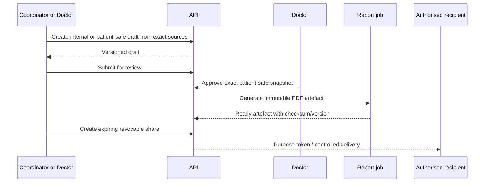

Generation, approval, artefact production, download, external share, correction, and supersession are separate operations. An internal report can be generated for authorised clinical use but cannot enter the patient-share contract. Patient-safe generation begins from an allowlisted immutable snapshot and requires Doctor approval.

| Operation | Method | Suggested route | Purpose | Actors | AuthN | AuthZ | Tenant | Request | Response | Idempotency | Audit | Stage |
|---|---|---|---|---|---|---|---|---|---|---|---|---|
| Generate artefact | POST | `/reports/{reportId}/versions/{versionId}/generation-jobs` | Render exact eligible snapshot | Doctor/Coordinator | User | Generate permission; approval rules | Required | Expected version, template/version | Job | Required | Generation lifecycle | MVP |
| Inspect generation | GET | `/reports/{reportId}/versions/{versionId}/generation-jobs/{jobId}` | Observe safe status | Permitted report roles | User | Report/job read | Required | None | Job safe projection | N/A | As policy | MVP |

## 44. Presentation Session API

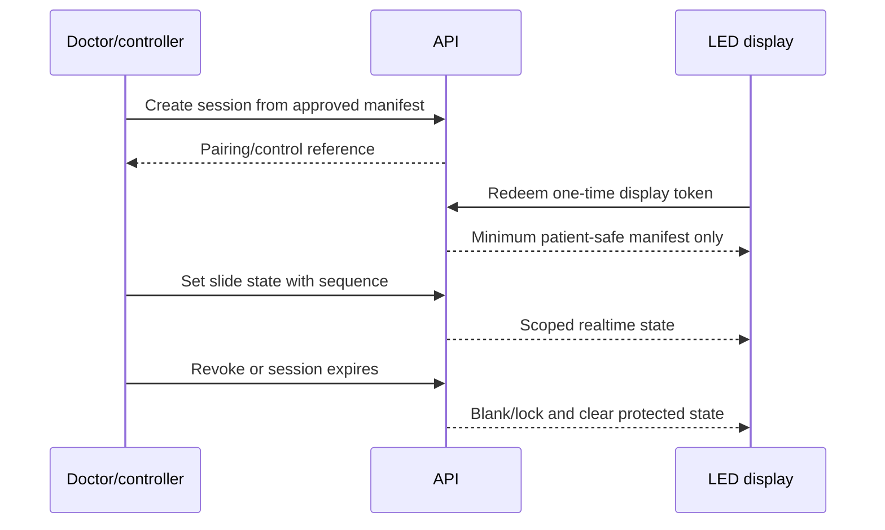

| Operation | Method | Suggested route | Purpose | Actors | AuthN | AuthZ | Tenant | Request | Response | Idempotency | Audit | Stage |
|---|---|---|---|---|---|---|---|---|---|---|---|---|
| Create session | POST | `/presentation-sessions` | Bind one approved patient-safe manifest | Doctor/permitted initiator | User | Presentation create | Exact clinic/patient/consultation | Manifest version, expiry request | Session + one-time pairing | Required | Session created | MVP |
| Redeem display | POST | `/presentation-sessions/{id}/pair` | Attach one display | Display token | One-time presentation token | Active exact session | Token bound | Pairing proof | Display session + manifest ref | One redemption | Device paired | MVP |
| Set state | POST | `/presentation-sessions/{id}/state` | Control approved slide | Doctor/Presentation User per policy | User control session | Control permission | Session-bound | Slide ID, sequence, revision | Current state | Required/sequence | State changed | MVP |
| Revoke | POST | `/presentation-sessions/{id}/revoke` | Blank display immediately | Doctor/authorised controller | User | Revoke permission | Required | Reason, revision | Revoked session | Required | Session revoked | MVP |

Illustrative presentation payload:

```jsonc
{
  "patientId": "patient_example_001",
  "consultationId": "consultation_example_001",
  "manifestVersionId": "manifest_version_example_003",
  "expectedManifestRevision": 3,
  "requestedDurationMinutes": 15,
  "clientRequestId": "request_example_014",
  "statusExpected": "approved"
}
```

## 45. Scan Session API

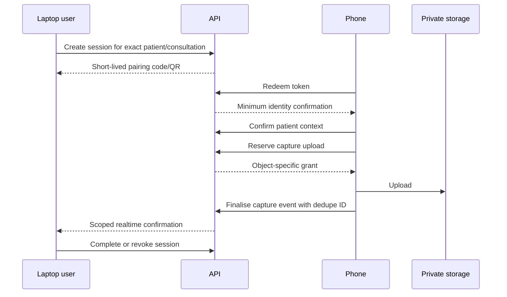

| Operation | Method | Suggested route | Purpose | Actors | AuthN | AuthZ | Tenant | Request | Response | Idempotency | Audit | Stage |
|---|---|---|---|---|---|---|---|---|---|---|---|---|
| Create session | POST | `/scan-sessions` | Start patient-bound capture | Doctor/Assistant/permitted staff | User | Capture-session create | Exact patient/consultation | Protocol, expected context revisions | Session + pairing reference | Required | Created | MVP |
| Pair device | POST | `/scan-sessions/{id}/pair` | Redeem one-time token | Phone | Pairing token | Active unused token | Stored session | Pair proof/device nonce | Temporary scan credential + minimum patient confirmation | One redemption | Paired | MVP |
| Confirm context | POST | `/scan-sessions/{id}/confirm-patient` | Prevent wrong-patient capture | Paired phone | Scan token | Active exact session | Token bound | Confirmation value | Confirmed session | Required | Context confirmed | MVP |
| Submit capture event | POST | `/scan-sessions/{id}/captures` | Reserve/finalise required view | Paired phone | Scan token | View/session permission | Token bound | View, media, event ID, sequence | Capture state | Event ID | Capture lifecycle | MVP |
| Complete/revoke | POST | `/scan-sessions/{id}/{action}` | End session safely | Initiator/permitted actor | User | Complete or revoke | Required | Revision, reason/exceptions | Final session status | Required | Completed/revoked | MVP |

Illustrative scan-session payload:

```jsonc
{
  "patientId": "patient_example_001",
  "consultationId": "consultation_example_001",
  "captureProtocolId": "protocol_example_standard_001",
  "patientRevision": 4,
  "consultationRevision": 2,
  "requestedPairingMinutes": 5,
  "clientRequestId": "request_example_003"
}
```

The phone receives no clinic patient list, clinic search, unrelated media, medical history, report, or internal navigation.

## 46. Support Access API

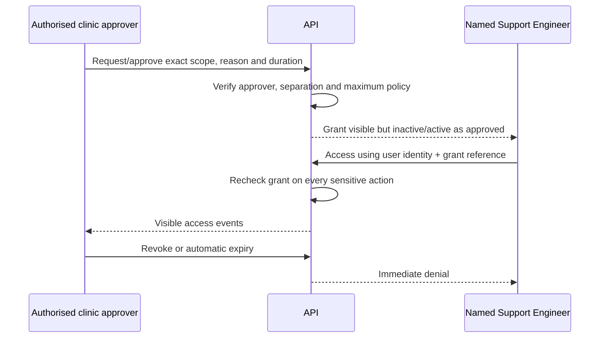

| Operation | Method | Suggested route | Purpose | Actors | AuthN | AuthZ | Tenant | Request | Response | Idempotency | Audit | Stage |
|---|---|---|---|---|---|---|---|---|---|---|---|---|
| Request grant | POST | `/support-access-grants` | Propose named bounded support | Clinic leader/requester | User | Request support permission | Exact clinic/module/patient | Engineer, reason, scope, duration | Requested grant | Required | Requested | MVP |
| Approve/activate | POST | `/support-access-grants/{id}/approve` | Authorise valid scope | Approved clinic authority | User + step-up if policy | Approve; no invalid self-approval | Required | Revision, approved scope/duration | Approved/active grant | Required | Approved/activated | MVP |
| Revoke | POST | `/support-access-grants/{id}/revoke` | End access | Clinic approver/security | User | Revoke permission | Required | Reason, revision | Revoked grant | Required | Revoked | MVP |
| List events | GET | `/support-access-grants/{id}/events` | Review attributable use | Clinic leadership/security | User | Grant-audit read | Required | Cursor/filter | Masked events | N/A | Audit access | MVP |

Illustrative support request:

```jsonc
{
  "supportEngineerUserId": "user_example_support_001",
  "scope": {"module": "clinical_media", "patientId": "patient_example_001"},
  "permittedActions": ["read_metadata", "retry_processing"],
  "reason": "Investigate failed image processing requested by clinic",
  "requestedDurationMinutes": 30,
  "clientRequestId": "request_example_015"
}
```

No support route can approve clinical work, change roles, create patient shares, perform unrestricted export/deletion, or cross the stored grant.

## 47. Export API

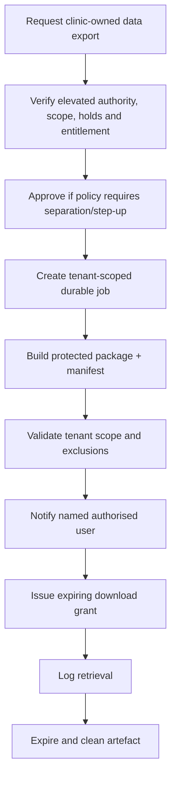

| Operation | Method | Suggested route | Purpose | Actors | AuthN | AuthZ | Tenant | Request | Response | Idempotency | Audit | Stage |
|---|---|---|---|---|---|---|---|---|---|---|---|---|
| Request export | POST | `/exports` | Define authorised package | Clinic Owner/approved role | User + proposed step-up | Export request and scope | Active clinic | Scope, format, purpose, expected config revision | Requested export/job | Required | Requested | MVP |
| Approve export | POST | `/exports/{id}/approve` | Satisfy elevated/separation policy | Approved authority | User + step-up | Export approve | Required | Revision, decision/reason | Approved/rejected export | Required | Approval | MVP |
| Inspect/cancel | GET/POST | `/exports/{id}` or `/exports/{id}/cancel` | Track or stop eligible work | Requester/approver | User | Export read/cancel | Required | Revision for cancel | Export/job status | Cancel required | Lifecycle | MVP |

Illustrative export request:

```jsonc
{
  "scope": {"type": "clinic_data", "includeArchived": true},
  "format": "graftvision_portable_package",
  "purpose": "Clinic-controlled data portability",
  "expectedClinicRevision": 12,
  "exclude": ["platform_source_code", "proprietary_algorithms", "other_tenants"],
  "clientRequestId": "request_example_016"
}
```

## 48. Archive and Deletion API

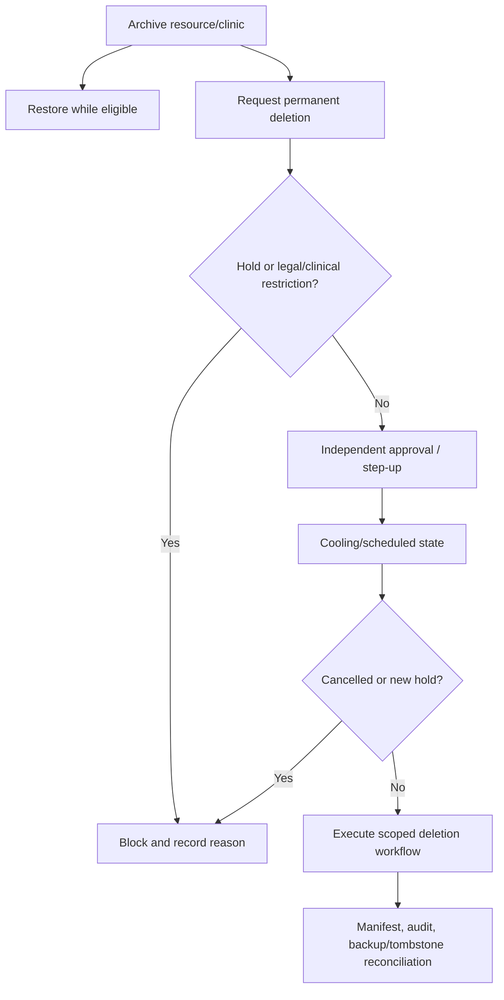

| Operation | Method | Suggested route | Purpose | Actors | AuthN | AuthZ | Tenant | Request | Response | Idempotency | Audit | Stage |
|---|---|---|---|---|---|---|---|---|---|---|---|---|
| Archive/restore | POST | `/{resource}/{id}/archive` or `/restore` | Reversible lifecycle action | Permitted clinic roles | User | Resource archive/restore | Required | Revision, reason | Updated lifecycle | Required | Action event | MVP |
| Request deletion | POST | `/deletion-requests` | Start governed permanent deletion | Clinic Owner/approved role | User + proposed step-up | Request scope | Required | Resource scope, reason, revision | Requested deletion | Required | Requested | MVP logical |
| Approve/hold/cancel | POST | `/deletion-requests/{id}/{action}` | Apply approval or protection | Distinct approved actors | User + step-up as policy | Action-specific | Required | Revision, reason/hold basis | Updated request | Required | Every action | MVP logical |
| Execute | POST | `/internal/v1/deletion-requests/{id}/execute` | Run approved scheduled workflow | Restricted worker | Service | Current approved state | Stored scope | Job/reference | Execution status | Required | Full manifest | MVP logical |

Illustrative deletion request:

```jsonc
{
  "scope": {"type": "patient", "patientId": "patient_example_001"},
  "reason": "Approved clinic data-lifecycle request",
  "expectedResourceRevision": 9,
  "holdCheckRequired": true,
  "requestedExecutionAfter": "2026-09-01T00:00:00Z",
  "clientRequestId": "request_example_017"
}
```

Permanent deletion is never a generic `DELETE /patients/{id}` or cascading client action.

## 49. Platform Administration API

Platform administration manages manually onboarded clinics, platform users, product plans, entitlements, suspension, operational metadata, and provider-safe status. It does not grant default clinical access.

| Operation | Method | Suggested route | Purpose | Actors | AuthN | AuthZ | Tenant | Request | Response | Idempotency | Audit | Stage |
|---|---|---|---|---|---|---|---|---|---|---|---|---|
| Create clinic | POST | `/platform/clinics` | Manual onboarding | Platform Owner/Administrator | User + MFA | `platform.clinic.create` | Platform; new tenant | Approved clinic profile/plan | Clinic shell | Required | Clinic created | MVP |
| Configure/suspend clinic | PATCH/POST | `/platform/clinics/{id}` or `/{id}/suspend` | Govern lifecycle | Platform Owner/Administrator | User + MFA | Action-specific | Target clinic metadata only | Revision, bounded changes/reason | Updated clinic/status | Required for action | Full | MVP |
| Inspect platform health metadata | GET | `/platform/operations` | Operational support without clinical data | Platform roles | User + MFA | Operational projection | Platform/minimum clinic refs | Filters | Safe summaries | N/A | Sensitive access | MVP |

## 50. Clinic Administration API

Clinic administration covers branding, approved configuration, capture/report templates, clinic timezone, staff policy, and operational settings. It cannot weaken tenant isolation, patient safety, Doctor approval, audit, or baseline security.

| Operation | Method | Suggested route | Purpose | Actors | AuthN | AuthZ | Tenant | Request | Response | Idempotency | Audit | Stage |
|---|---|---|---|---|---|---|---|---|---|---|---|---|
| Read configuration | GET | `/clinic` | Current active clinic configuration | Clinic Owner/Admin/permitted roles | User | Projection permission | Active clinic | Projection | Clinic config/revision | N/A | As policy | MVP |
| Update configuration | PATCH | `/clinic` | Change bounded settings | Clinic Owner/Admin | User | `clinic.configure` and field policy | Active clinic | Revision + explicit fields | Updated config | Key recommended | Config changed | MVP |
| Manage templates | POST/PATCH | `/clinic/templates` | Version approved capture/report/presentation templates | Approved admins/clinical actors | User | Template-specific | Active clinic | Type, content, revision | Versioned template | Required for create | Full | MVP |

## 51. User and Membership API

User identity is platform-global; clinic access is an explicit membership with one or more approved roles. Invitations, acceptance, deactivation, reactivation, and role changes are separate from authentication recovery.

| Operation | Method | Suggested route | Purpose | Actors | AuthN | AuthZ | Tenant | Request | Response | Idempotency | Audit | Stage |
|---|---|---|---|---|---|---|---|---|---|---|---|---|
| Invite member | POST | `/memberships/invitations` | Create clinic-bound invitation | Clinic Owner/Admin | User | Invite proposed roles | Active clinic | Identity target, roles, expiry | Invitation summary | Required | Invitation created | MVP |
| List memberships | GET | `/memberships` | Manage current clinic staff | Approved clinic roles | User | Membership read/projection | Active clinic | Cursor/status | Membership page | N/A | Sensitive reads as policy | MVP |
| Change roles | POST | `/memberships/{id}/roles` | Replace approved role set | Clinic Owner/Admin | User + step-up if policy | Role assignment and separation | Required | Expected revision, roles, reason | Membership/revocation result | Required | Role changed | MVP |
| Deactivate/reactivate | POST | `/memberships/{id}/{action}` | Revoke/restore clinic access | Clinic Owner/Admin | User | Membership lifecycle | Required | Revision, reason | Status + revoked sessions/grants summary | Required | Full | MVP |

## 52. Role and Permission API

MVP role definitions are platform managed; clinics assign roles but do not author permissions. Capability responses may guide UI, but server checks remain mandatory.

| Operation | Method | Suggested route | Purpose | Actors | AuthN | AuthZ | Tenant | Request | Response | Idempotency | Audit | Stage |
|---|---|---|---|---|---|---|---|---|---|---|---|---|
| List role catalogue | GET | `/role-definitions` | Display approved thirteen roles | Authenticated staff | User | Minimum catalogue read | Platform/current clinic applicability | None | Role summaries | N/A | No | MVP |
| Get capabilities | GET | `/{resource}/{id}/capabilities` | Inform UI of current actions | Current authorised user | User | Resource read | Required | Resource/revision | Safe action names | N/A | No authority effect | MVP |
| Custom roles | — | Reserved | Future bounded role composition | Clinic leadership | User | Policy | Required | Rules | Versioned role | Required | Full | Post-MVP |

## 53. Patient API

Patient operations use minimum demographic/contact data approved for Pakistan launch. Search and duplicate suggestions never merge across clinics. Archive is reversible; permanent deletion uses section 48.

| Operation | Method | Suggested route | Purpose | Actors | AuthN | AuthZ | Tenant | Request | Response | Idempotency | Audit | Stage |
|---|---|---|---|---|---|---|---|---|---|---|---|---|---|
| Create patient | POST | `/patients` | Register clinic patient | Reception/clinical roles as permitted | User | `patient.create` | Active clinic server-derived | Approved identity/contact fields | Patient summary | Required | Patient created | MVP |
| List/search | GET | `/patients` | Find authorised patient | Permitted clinic roles | User | Patient search projection | Active clinic | Cursor/allowlisted filters | Summary page | N/A | Search access as policy | MVP |
| Read/update/archive | GET/PATCH/POST | `/patients/{id}` and `/{id}/archive` | Manage record lifecycle | Role-dependent | User | Field/action permission | Resource clinic | Projection or revision+fields | Resource/new revision | Update key recommended; archive required | Sensitive lifecycle | MVP |

Illustrative patient creation:

```jsonc
{
  "clientRequestId": "request_example_001",
  "patientNumber": "PATIENT-EXAMPLE-001",
  "name": {"display": "Example Patient"},
  "contact": {"phone": "+92-300-0000000", "email": "example.invalid@example.test"},
  "preferredTimezone": "Asia/Karachi",
  "privacyAcknowledgementId": "ack_example_001",
  "status": "active"
}
```

The clinic is omitted because the server derives it from the active trusted membership.

## 54. Consent and Privacy API

Consent, acknowledgement, disclosure authority, and access permission are distinct. The API records the approved consent/acknowledgement type, text/version, purpose, subject, capture method, actor, time, withdrawal/status, and evidence reference without inventing legal meaning.

| Operation | Method | Suggested route | Purpose | Actors | AuthN | AuthZ | Tenant | Request | Response | Idempotency | Audit | Stage |
|---|---|---|---|---|---|---|---|---|---|---|---|---|
| Record acknowledgement | POST | `/patients/{patientId}/privacy-acknowledgements` | Record approved notice/consent event | Permitted clinic staff | User | Privacy record permission | Patient clinic | Type/version/purpose/evidence | Immutable record | Required | Created | MVP where policy requires |
| Withdraw/update status | POST | `/privacy-acknowledgements/{id}/withdraw` | Record later status without erasing history | Permitted actor | User | Policy-specific | Required | Revision, time, reason | New status/event | Required | Full | MVP logical |
| Inspect eligibility | GET | `/patients/{id}/privacy-eligibility` | Support approved workflow gates | Permitted clinical actor | User | Minimum privacy projection | Required | Purpose | Eligible/blocked + safe reasons | N/A | As policy | MVP |

## 55. Medical History API

Medical history remains clinical, versioned, and role-projected. The API avoids speculative medical fields and supports approved structured responses plus narrative where required. Doctor-only notes use a separate permission/projection and never enter patient-safe output by default.

| Operation | Method | Suggested route | Purpose | Actors | AuthN | AuthZ | Tenant | Request | Response | Idempotency | Audit | Stage |
|---|---|---|---|---|---|---|---|---|---|---|---|---|---|
| Create history version | POST | `/patients/{patientId}/medical-history/versions` | Record assessment source | Doctor/Assistant within boundary | User | History draft permission | Patient clinic | Approved fields, source, expected patient revision | Draft version | Required | Created | MVP |
| Read current/history | GET | `/patients/{patientId}/medical-history` | View permitted history | Clinical roles/reviewer | User | Projection incl. Doctor-private policy | Required | Version/projection | Masked history | N/A | Sensitive access as policy | MVP |
| Submit/review | POST | `/medical-history/versions/{id}/{action}` | Controlled review state | Clinical actor/Doctor | User | Action-specific | Required | Revision, reason | Updated version | Required | Transition | MVP |

## 56. Consultation API

Consultations belong to one patient and episode, have explicit status, assigned team, sources, required capture/assessment completeness, and manual exception path. Completion is a controlled action.

| Operation | Method | Suggested route | Purpose | Actors | AuthN | AuthZ | Tenant | Request | Response | Idempotency | Audit | Stage |
|---|---|---|---|---|---|---|---|---|---|---|---|---|
| Create consultation | POST | `/patients/{patientId}/consultations` | Start consultation episode | Reception/clinical roles as permitted | User | Consultation create | Patient clinic | Type/date/team/source | Consultation draft | Required | Created | MVP |
| Read/update | GET/PATCH | `/consultations/{id}` | Manage permitted fields | Clinical team | User | Field/action projection | Required | Revision + explicit changes | New revision | Update key recommended | Changes | MVP |
| Complete/reopen | POST | `/consultations/{id}/complete` or `/reopen` | Controlled lifecycle | Doctor/approved role | User | Completeness/exception authority | Required | Revision, checklist, reason | Status/version | Required | Transition | MVP |

Illustrative consultation creation:

```jsonc
{
  "consultationType": "initial_hair_restoration",
  "scheduledAt": "2026-08-15T10:00:00+05:00",
  "assignedDoctorMembershipId": "membership_example_doctor_001",
  "captureProtocolId": "protocol_example_standard_001",
  "patientRevision": 4,
  "status": "draft",
  "clientRequestId": "request_example_002"
}
```

## 57. Capture Session API

Capture session is the authenticated clinic-side workflow record; scan session is the temporary phone pairing. Capture records required views, completion, exceptions, quality findings, and accepted media while preserving originals.

| Operation | Method | Suggested route | Purpose | Actors | AuthN | AuthZ | Tenant | Request | Response | Idempotency | Audit | Stage |
|---|---|---|---|---|---|---|---|---|---|---|---|---|
| Create capture session | POST | `/consultations/{id}/capture-sessions` | Instantiate protocol checklist | Clinical staff | User | Capture create | Consultation clinic/patient | Protocol/version, revision | Capture session/views | Required | Created | MVP |
| Record view decision | POST | `/capture-sessions/{id}/views/{viewId}/review` | Accept/retake/exception | Clinical actor | User | Review boundary | Required | Media, decision, reason, revision | Updated view/session | Required | Review | MVP |
| Complete/resume | POST | `/capture-sessions/{id}/complete` or `/resume` | Controlled lifecycle | Clinical staff | User | Completeness/exception | Required | Revision/checklist | Status and missing items | Required | Transition | MVP |

## 58. Clinical Media API

Clinical media separates immutable original, verified derivatives, patient-safe derivatives, annotations, and processing metadata. Read access is purpose and role projected; an approved patient-safe derivative does not make its original public.

| Operation | Method | Suggested route | Purpose | Actors | AuthN | AuthZ | Tenant | Request | Response | Idempotency | Audit | Stage |
|---|---|---|---|---|---|---|---|---|---|---|---|---|---|
| List media | GET | `/patients/{id}/clinical-media` | View permitted sources/derivatives | Clinical roles | User | Media projection | Patient clinic | Cursor/category/context | Media summaries | N/A | As policy | MVP |
| Annotate | POST | `/clinical-media/{id}/annotations` | Create separate annotation | Permitted clinical editor | User | Annotation create | Required | Geometry/note/type/source revision | Annotation version | Required | Created | MVP |
| Mark patient-safe candidate | POST | `/clinical-media/{id}/patient-safe-candidates` | Propose approved derivative | Doctor/permitted preparer | User | Prepare; separate approval | Required | Derivative/version/purpose | Candidate status | Required | Candidate created | MVP |

## 59. 3D Model API

3D model resources represent uploaded or derived versions, validation, compatibility, provenance, scale status, and private assets. Viewer readiness does not imply calibrated clinical measurement.

| Operation | Method | Suggested route | Purpose | Actors | AuthN | AuthZ | Tenant | Request | Response | Idempotency | Audit | Stage |
|---|---|---|---|---|---|---|---|---|---|---|---|---|---|
| Create uploaded model | POST | `/patients/{id}/three-d-models` | Register verified uploaded asset | Clinical staff | User | Model create | Patient clinic | Media ref, format, source/revision | Draft model | Required | Created | MVP |
| Create version/screenshot | POST | `/three-d-models/{id}/versions` or `/screenshots` | Preserve model evolution/output | Clinical staff/service | User/service | Action-specific | Required | Source version/revision/view | New version/asset | Required | Versioned | MVP |
| Archive/invalidate | POST | `/three-d-models/{id}/{action}` | Remove from active use without erasing lineage | Permitted actor | User | Model lifecycle | Required | Revision/reason | Status | Required | Action | MVP |

## 60. Calibration API

Calibration links a method and evidence to an exact source/model version and defines units, scale, uncertainty/limitations, author, and status. It cannot be silently reused after a material source change.

| Operation | Method | Suggested route | Purpose | Actors | AuthN | AuthZ | Tenant | Request | Response | Idempotency | Audit | Stage |
|---|---|---|---|---|---|---|---|---|---|---|---|---|
| Create calibration | POST | `/three-d-models/{id}/calibrations` | Record physical scale evidence | Permitted clinical editor | User | Calibration create | Required | Method/evidence/unit/source revision | Calibration draft | Required | Created | MVP where measurement method supports |
| Validate/approve | POST | `/calibrations/{id}/validate` | Mark verified for defined use | Doctor/authorised role per policy | User | Calibration validation | Required | Revision/decision/limitations | Validated status | Required | Validated | MVP |
| Invalidate | POST | `/calibrations/{id}/invalidate` | Prevent stale use | Doctor/system on source change | User/service | Invalidate rule | Required | Reason/source change | Invalid status | Required | Invalidated | MVP |

## 61. Scalp Region API

Regions are versioned geometry tied to an exact 2D/3D source, coordinate system, scale state, author/method, label, and patient. Draft deletion/archive does not erase approved lineage.

| Operation | Method | Suggested route | Purpose | Actors | AuthN | AuthZ | Tenant | Request | Response | Idempotency | Audit | Stage |
|---|---|---|---|---|---|---|---|---|---|---|---|---|
| Create region | POST | `/patients/{id}/scalp-regions` | Define manual or derived region draft | Doctor/Assistant as permitted | User | Region draft create | Patient clinic | Source, geometry, method, revision | Region version | Required | Created | MVP manual |
| Update/version | POST | `/scalp-regions/{id}/versions` | Preserve geometry edit | Permitted editor | User | Region edit | Required | Expected revision/new geometry/reason | New version | Required | Versioned | MVP |
| Submit/approve | POST | `/scalp-regions/{id}/{action}` | Control final use | Preparer/Doctor | User | Submit vs Doctor approval | Required | Exact version/revision | Status/approval | Required | Transition/approval | MVP |

Illustrative scalp region:

```jsonc
{
  "patientId": "patient_example_001",
  "source": {"type": "three_d_model_version", "id": "model_version_example_002", "revision": 5},
  "label": "recipient_frontal_example",
  "geometry": {"coordinateSystem": "model_local", "polygonRef": "geometry_example_001"},
  "method": "manual_trace",
  "scaleStatus": "calibrated",
  "expectedPatientRevision": 4,
  "status": "draft",
  "clientRequestId": "request_example_005"
}
```

## 62. Measurement API

Measurements record value, explicit unit, method, source versions, scale/calibration, stage (`preliminary` or approved final context), precision, limitations, author, and approval lineage. An unavailable automatic measurement remains unavailable rather than fabricated.

| Operation | Method | Suggested route | Purpose | Actors | AuthN | AuthZ | Tenant | Request | Response | Idempotency | Audit | Stage |
|---|---|---|---|---|---|---|---|---|---|---|---|---|
| Create measurement | POST | `/scalp-regions/{id}/measurements` | Record manual/calculated draft | Doctor/Assistant within boundary | User | Measurement draft | Region patient/clinic | Value/unit/method/source/calibration/revision | Measurement version | Required | Created | MVP |
| Recalculate | POST | `/measurements/{id}/recalculate` | Create derived successor | Permitted actor | User | Recalculate permission | Required | Algorithm/version/sources | Job or new draft | Required | Requested/result | Conditional |
| Approve/invalidate | POST | `/measurements/{id}/{action}` | Control final measurement | Doctor/system | User/service | Doctor approval or source rule | Required | Exact version/reason | Status/approval | Required | Full | MVP |

Illustrative measurement:

```jsonc
{
  "regionVersionId": "region_version_example_001",
  "kind": "surface_area",
  "value": 42.6,
  "unit": "cm2",
  "method": "manual_calibrated_region",
  "calibrationId": "calibration_example_001",
  "sourceRevision": 5,
  "precisionLabel": "estimated",
  "status": "draft",
  "clientRequestId": "request_example_006"
}
```

## 63. AI Suggestion API

Suggestions retain task, sources, model/version, confidence, provenance, review, and invalidation. Raw provider output is retained only if approved and never returned unfiltered to patient-facing clients.

| Operation | Method | Suggested route | Purpose | Actors | AuthN | AuthZ | Tenant | Request | Response | Idempotency | Audit | Stage |
|---|---|---|---|---|---|---|---|---|---|---|---|---|
| List suggestions | GET | `/patients/{id}/ai-suggestions` | View task-derived candidates | Permitted clinical actors | User | Task projection | Patient clinic | Task/status/cursor | Suggestion summaries | N/A | As policy | Conditional |
| Get provenance | GET | `/ai-suggestions/{id}/provenance` | Review model/source context | Doctor/reviewer | User | Suggestion review | Required | None | Safe provenance | N/A | Review | Conditional |
| Invalidate | POST | `/ai-suggestions/{id}/invalidate` | Prevent stale use | Doctor/system | User/service | Invalidate rule | Required | Reason/revision | Invalid status | Required | Invalidated | Conditional |

## 64. Hairline Design API

Hairline designs are versioned drafts tied to patient, consultation, sources, landmarks, units/scale where applicable, author, method, and warnings. Derived or AI-assisted geometry remains a suggestion until a human-owned draft and Doctor approval.

| Operation | Method | Suggested route | Purpose | Actors | AuthN | AuthZ | Tenant | Request | Response | Idempotency | Audit | Stage |
|---|---|---|---|---|---|---|---|---|---|---|---|---|
| Create design | POST | `/consultations/{id}/hairline-designs` | Start manual design | Doctor/Assistant within boundary | User | Design draft create | Consultation clinic/patient | Sources/geometry/method/revisions | Design draft | Required | Created | MVP |
| Create version | POST | `/hairline-designs/{id}/versions` | Preserve edits | Permitted clinical editor | User | Design edit | Required | Revision/geometry/reason | New version | Required | Versioned | MVP |
| Submit/approve | POST | `/hairline-designs/{id}/{action}` | Review exact design | Preparer/Doctor | User | Submit vs Doctor approval | Required | Exact version/revision | Status/approval | Required | Full | MVP |

## 65. Graft Plan API

Graft plans contain versioned zones, planned graft range/allocation, method, assumptions, donor considerations, linked measurements/hairline, warnings, author, and exact approval. They do not contain procedure actual counts.

| Operation | Method | Suggested route | Purpose | Actors | AuthN | AuthZ | Tenant | Request | Response | Idempotency | Audit | Stage |
|---|---|---|---|---|---|---|---|---|---|---|---|---|---|
| Create plan | POST | `/consultations/{id}/graft-plans` | Create draft from exact sources | Doctor/Assistant within boundary | User | Plan draft create | Consultation clinic/patient | Source versions, assumptions, ranges | Plan draft | Required | Created | MVP |
| Manage zones/version | POST | `/graft-plans/{id}/zones` or `/versions` | Add allocation/edit successor | Permitted editor | User | Plan edit | Required | Revision, zone allocation | New revision/version | Required | Changed | MVP |
| Submit/reject | POST | `/graft-plans/{id}/submit-for-review` or `/reject` | Controlled review | Preparer/Doctor | User | Action-specific | Required | Exact version/reason | Status | Required | Transition | MVP |

Illustrative graft plan:

```jsonc
{
  "consultationId": "consultation_example_001",
  "sourceVersions": {
    "measurementId": "measurement_version_example_001",
    "hairlineDesignId": "hairline_version_example_001"
  },
  "plannedGraftRange": {"minimum": 2200, "maximum": 2600, "unit": "grafts"},
  "zones": [
    {"zoneId": "zone_example_frontal", "plannedMinimum": 1400, "plannedMaximum": 1600},
    {"zoneId": "zone_example_mid", "plannedMinimum": 800, "plannedMaximum": 1000}
  ],
  "method": "manual_clinical_planning",
  "expectedConsultationRevision": 6,
  "status": "draft",
  "clientRequestId": "request_example_007"
}
```

## 66. Doctor Approval API

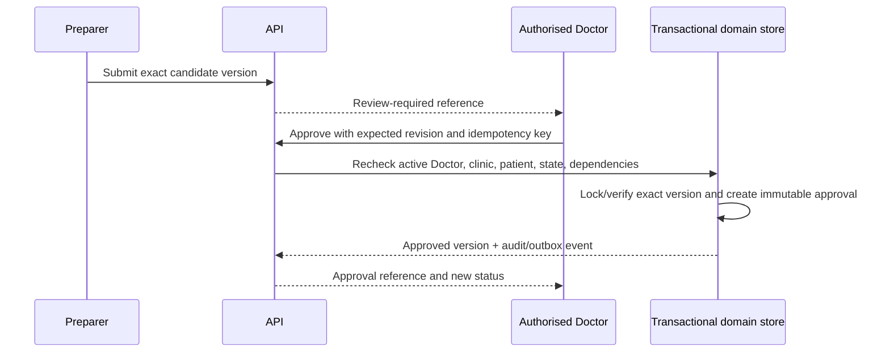

Doctor approval is a reusable action pattern for measurements, regions, hairline designs, graft plans, surgery-day assessment, procedure record, follow-up assessment where required, and patient-safe report. It requires a current verified Doctor membership in the same clinic, exact candidate version, expected revision, required completeness, and no prohibited self/separation state.

| Operation | Method | Suggested route | Purpose | Actors | AuthN | AuthZ | Tenant | Request | Response | Idempotency | Audit | Stage |
|---|---|---|---|---|---|---|---|---|---|---|---|---|
| Approve resource | POST | `/{resource}/{id}/approve` | Create immutable Doctor approval | Doctor | User session; step-up if approved | Doctor-only exact resource action | Required | Version, revision, attestation/reason | Approval + approved version | Required | Approval | MVP |
| Revoke/supersede approval | POST | `/approvals/{id}/supersede` | Record invalidation/correction lineage | Doctor/system rule | User/service | Policy-specific | Required | Reason/new version reference | Superseded approval | Required | Supersession | MVP |

Illustrative graft-plan approval:

```jsonc
{
  "resourceType": "graft_plan",
  "resourceId": "graft_plan_example_001",
  "versionId": "graft_plan_version_example_004",
  "expectedRevision": 8,
  "sourceRevisions": {
    "measurement": 3,
    "hairlineDesign": 5
  },
  "decision": "approve",
  "clinicalAttestationVersion": "attestation_example_001",
  "clientRequestId": "request_example_008"
}
```

## 67. Surgery-Day Assessment API

The surgery-day assessment records final condition, measurements, donor/recipient findings, changes from approved consultation plan, method, evidence, and Doctor decision. It creates a new final version rather than rewriting the consultation.

| Operation | Method | Suggested route | Purpose | Actors | AuthN | AuthZ | Tenant | Request | Response | Idempotency | Audit | Stage |
|---|---|---|---|---|---|---|---|---|---|---|---|---|
| Create assessment | POST | `/patients/{id}/surgery-day-assessments` | Record procedure-day evaluation | Doctor/Assistant within fields | User | Assessment draft | Patient clinic | Procedure/plan sources, findings, revision | Draft assessment | Required | Created | MVP |
| Amend/version | POST | `/surgery-day-assessments/{id}/versions` | Preserve correction | Permitted editor | User | Edit boundary | Required | Revision/changes/reason | New version | Required | Versioned | MVP |
| Approve | POST | `/surgery-day-assessments/{id}/approve` | Final Doctor assessment | Doctor | User | Doctor-only | Required | Exact version/revisions | Approval | Required | Approved | MVP |

## 68. Procedure API

Procedure creation references an approved final plan and surgery-day assessment but maintains separate actuals. Team assignment, start, intraoperative recording, exceptions, completion, Doctor review, and approval are controlled actions.

| Operation | Method | Suggested route | Purpose | Actors | AuthN | AuthZ | Tenant | Request | Response | Idempotency | Audit | Stage |
|---|---|---|---|---|---|---|---|---|---|---|---|---|
| Create from plan | POST | `/procedures` | Open procedure record | Doctor/Clinic Admin as permitted | User | Procedure create from approved sources | Exact clinic/patient | Plan/assessment versions, schedule, team | Procedure draft | Required | Created | MVP |
| Start/complete | POST | `/procedures/{id}/start` or `/complete` | Explicit lifecycle | Procedure team/Doctor | User | Action and completeness | Required | Revision/checklist/exceptions | Updated status | Required | Transition | MVP |
| Assign team | POST | `/procedures/{id}/team-members` | Record active clinical team | Doctor/authorised admin | User | Team assignment | Required | Membership IDs/roles/revision | Team revision | Required | Team changed | MVP |
| Submit/approve | POST | `/procedures/{id}/submit-for-review` or `/approve` | Final review | Technician/Doctor | User | Submit vs Doctor-only approval | Required | Exact procedure version | Status/approval | Required | Full | MVP |

## 69. Graft Count API

Counts distinguish extracted grafts, grafts by follicular-unit type, discarded/non-usable grafts, calculated usable grafts, implanted grafts by zone, remaining/unreconciled amounts, method, actor, time, and correction reason. Derived totals are server-calculated from recorded components and returned with reconciliation status.

| Operation | Method | Suggested route | Purpose | Actors | AuthN | AuthZ | Tenant | Request | Response | Idempotency | Audit | Stage |
|---|---|---|---|---|---|---|---|---|---|---|---|---|
| Record count event | POST | `/procedures/{id}/graft-count-events` | Append actual count evidence | Procedure Technician/Doctor | User | Field/event boundary | Procedure clinic/patient | Type/value/time/sequence/revision | Event + live totals | Required/event ID | Count event | MVP |
| Correct event | POST | `/graft-count-events/{id}/correct` | Preserve original and correction | Authorised technician/Doctor | User | Correction policy | Required | Replacement/reason/revision | Correction + totals | Required | Corrected | MVP |
| Reconcile/finalise | POST | `/procedures/{id}/graft-counts/reconcile` | Validate totals before completion | Technician prepares; Doctor final authority | User | Reconcile/finalise distinction | Required | Expected counts/revision/exceptions | Reconciliation result/status | Required | Reconciled | MVP |

Illustrative count event:

```jsonc
{
  "eventId": "count_event_example_001",
  "countType": "extracted_by_graft_type",
  "graftType": "two_hair",
  "quantity": 620,
  "recordedAt": "2026-08-20T11:30:00+05:00",
  "expectedProcedureRevision": 7,
  "status": "recorded",
  "clientRequestId": "request_example_009"
}
```

Illustrative reconciliation:

```jsonc
{
  "expectedProcedureRevision": 18,
  "totals": {
    "extracted": 2480,
    "discarded": 45,
    "usable": 2435,
    "implanted": 2425,
    "unreconciled": 10
  },
  "exception": {
    "required": true,
    "reason": "Example documented variance pending Doctor review"
  },
  "statusExpected": "in_progress",
  "clientRequestId": "request_example_010"
}
```

## 70. Postoperative Record API

The postoperative record captures immediate outcome documentation, instructions/version, media, exceptions, medication/instruction references where approved, team, timestamps, and Doctor approval without making unsupported outcome claims.

| Operation | Method | Suggested route | Purpose | Actors | AuthN | AuthZ | Tenant | Request | Response | Idempotency | Audit | Stage |
|---|---|---|---|---|---|---|---|---|---|---|---|---|
| Create record | POST | `/procedures/{id}/postoperative-records` | Start postoperative documentation | Procedure team | User | Post-op draft fields | Procedure clinic/patient | Sources/findings/instructions version | Draft record | Required | Created | MVP |
| Add media/instructions | POST | `/postoperative-records/{id}/items` | Link verified content | Permitted team | User | Item/category permission | Required | Media/instruction refs/revision | Updated draft | Required | Item added | MVP |
| Submit/approve | POST | `/postoperative-records/{id}/{action}` | Complete Doctor review | Team/Doctor | User | Submit vs Doctor approval | Required | Exact version/revision | Status/approval | Required | Full | MVP |

## 71. Follow-Up API

Follow-ups are dated visits linked to patient and procedure, scheduled or unscheduled, with capture protocol, donor/recipient healing observations, patient-reported satisfaction, Doctor assessment, next action, and comparison sources. API fields and permissions distinguish staff observations from Doctor assessment and patient-reported content.

| Operation | Method | Suggested route | Purpose | Actors | AuthN | AuthZ | Tenant | Request | Response | Idempotency | Audit | Stage |
|---|---|---|---|---|---|---|---|---|---|---|---|---|---|
| Schedule follow-up | POST | `/procedures/{id}/follow-ups` | Create expected checkpoint | Reception/clinical roles | User | Follow-up schedule | Procedure clinic/patient | Date/type/assignee | Scheduled follow-up | Required | Scheduled | MVP |
| Record visit | POST/PATCH | `/follow-ups/{id}/visits` | Capture visit findings and sources | Clinical staff | User | Field-specific follow-up edit | Required | Revision, observations, media, conditions | Visit version | Required | Visit recorded | MVP |
| Doctor assessment | POST | `/follow-ups/{id}/doctor-assessments` | Record clinical assessment | Doctor | User | Doctor-only assessment | Required | Exact visit/source versions | Assessment draft/version | Required | Assessment recorded | MVP |
| Schedule next/report | POST | `/follow-ups/{id}/next` or `/reports` | Continue longitudinal care | Permitted roles | User | Action-specific | Required | Revision/date/report type | New follow-up/report draft | Required | Action | MVP |

Illustrative follow-up visit:

```jsonc
{
  "procedureId": "procedure_example_001",
  "visitType": "scheduled_checkpoint",
  "occurredAt": "2026-11-20T14:00:00+05:00",
  "captureSessionId": "capture_session_example_followup_001",
  "observations": {
    "donorHealing": "example_structured_status",
    "recipientHealing": "example_structured_status"
  },
  "patientReportedSatisfaction": {"scaleVersion": "example_scale_001", "value": 4},
  "comparisonConditions": {"lightingMatched": true, "angleMatched": false},
  "expectedFollowUpRevision": 2,
  "status": "draft",
  "clientRequestId": "request_example_020"
}
```

## 72. Comparison API

Comparisons bind baseline and follow-up sources, dates, capture conditions, view alignment, processing method/version, limitations, and reviewer. Visual or computed differences are derived evidence, not guaranteed outcome or diagnosis.

| Operation | Method | Suggested route | Purpose | Actors | AuthN | AuthZ | Tenant | Request | Response | Idempotency | Audit | Stage |
|---|---|---|---|---|---|---|---|---|---|---|---|---|---|
| Create comparison | POST | `/patients/{id}/comparisons` | Compare approved source set | Clinical staff | User | Comparison create | Patient clinic | Baseline/follow-up versions, method | Draft comparison or job | Required | Created/requested | MVP manual/basic |
| Inspect/review | GET/POST | `/comparisons/{id}` or `/{id}/review` | View limitations and decision | Clinical roles/Doctor | User | Projection/review action | Required | Review revision/decision | Comparison/review | Review required | Review event | MVP |
| Patient-safe candidate | POST | `/comparisons/{id}/patient-safe-candidates` | Prepare disclosure item | Doctor/permitted preparer | User | Prepare; separate report approval | Required | Version/crops/disclaimer | Candidate | Required | Candidate created | MVP |

## 73. Report API

Report resources declare `internal` or `patient_safe` disclosure class at creation. Versions reference exact source revisions and a frozen content snapshot. Only a Doctor may approve patient-safe clinical content; a Report Coordinator may prepare, generate, and coordinate delivery within permission but cannot alter or approve clinical sources.

| Operation | Method | Suggested route | Purpose | Actors | AuthN | AuthZ | Tenant | Request | Response | Idempotency | Audit | Stage |
|---|---|---|---|---|---|---|---|---|---|---|---|---|
| Create report draft | POST | `/patients/{id}/reports` | Start internal or patient-safe report | Doctor/Report Coordinator | User | Report create by type | Patient clinic | Type/template/sources | Draft/version | Required | Created | MVP |
| Create/update version | POST | `/reports/{id}/versions` | Preserve corrected content | Doctor/Coordinator within fields | User | Report prepare | Required | Snapshot candidates/revision | New version | Required | Versioned | MVP |
| Submit/approve/reject | POST | `/reports/{id}/versions/{versionId}/{action}` | Review exact snapshot | Coordinator/Doctor | User | Submit vs Doctor-only approve | Required | Revision/decision/reason | Status/approval | Required | Full | MVP |
| Supersede/correct | POST | `/reports/{id}/versions/{versionId}/correct` | Preserve prior artefact/share history | Doctor/Coordinator | User | Correction permission | Required | Reason/source changes | New draft version | Required | Corrected | MVP |

Illustrative patient-safe report draft:

```jsonc
{
  "patientId": "patient_example_001",
  "disclosureClass": "patient_safe",
  "templateVersionId": "report_template_example_003",
  "sourceVersions": {
    "consultation": "consultation_version_example_006",
    "graftPlan": "graft_plan_version_example_004",
    "hairlineDesign": "hairline_version_example_005"
  },
  "contentManifest": {
    "patientSafeMediaIds": ["media_derivative_example_010"],
    "includeApprovedGraftRange": true,
    "includeDoctorPrivateNotes": false
  },
  "expectedPatientRevision": 9,
  "status": "draft",
  "clientRequestId": "request_example_011"
}
```

Illustrative report approval:

```jsonc
{
  "reportId": "report_example_001",
  "versionId": "report_version_example_003",
  "expectedRevision": 7,
  "snapshotChecksum": "example_snapshot_checksum",
  "sourceRevisions": {
    "graftPlan": 8,
    "hairlineDesign": 5
  },
  "decision": "approve",
  "disclosureClassExpected": "patient_safe",
  "clientRequestId": "request_example_012"
}
```

Approval success may enqueue PDF generation but does not automatically create an external share.

## 74. Report Share API

Shares reference one approved patient-safe report version and artefact, not a mutable report head. Tokens are random, stored hashed where practical, expiring, revocable, minimum-disclosure, and distinct from verification references. Internal reports are ineligible at contract and server-policy levels.

| Operation | Method | Suggested route | Purpose | Actors | AuthN | AuthZ | Tenant | Request | Response | Idempotency | Audit | Stage |
|---|---|---|---|---|---|---|---|---|---|---|---|---|---|
| Create share | POST | `/reports/{id}/versions/{versionId}/shares` | Authorise controlled external access | Doctor/Coordinator/permitted role | User | Share permission + active approval | Required | Recipient/channel ref, expiry, purpose | Share summary + one-time token delivery | Required | Share created | MVP |
| Inspect/list | GET | `/reports/{id}/shares` | Manage report disclosure | Permitted clinic roles | User | Share read | Required | Cursor/status | Masked shares | N/A | Access as policy | MVP |
| Revoke | POST | `/report-shares/{id}/revoke` | End access immediately | Issuer/approved role | User | Share revoke | Required | Revision/reason | Revoked share | Required | Revoked | MVP |
| Redeem | POST/GET | `/shared-reports/{token}` | Deliver exact eligible artefact | Recipient | Report token | Active share/version | Token-bound | Optional approved verification | Minimum report/download response | Redemption dedupe/rate policy | Access outcome | MVP |

Illustrative share creation:

```jsonc
{
  "reportVersionId": "report_version_example_003",
  "expectedRevision": 7,
  "recipientReference": {"type": "patient_phone", "maskedValue": "***0000"},
  "channel": "controlled_link",
  "purpose": "Patient consultation report delivery",
  "expiresAt": "2026-08-22T12:00:00Z",
  "allowDownload": true,
  "clientRequestId": "request_example_013"
}
```

The API never returns the stored token verifier after creation. Forwarding risk remains an approved policy consideration; revocation and short expiry limit it.

## 75. Presentation API

The broader presentation family manages patient-safe manifest construction, review, approval, and session history; section 44 manages live sessions. A manifest is an immutable ordered allowlist of approved slides/assets with purpose, consultation, patient, source versions, and disclosure metadata.

| Operation | Method | Suggested route | Purpose | Actors | AuthN | AuthZ | Tenant | Request | Response | Idempotency | Audit | Stage |
|---|---|---|---|---|---|---|---|---|---|---|---|---|
| Create manifest | POST | `/patients/{id}/presentation-manifests` | Prepare patient-safe slide set | Doctor/permitted preparer | User | Manifest prepare | Patient clinic | Approved item refs/order/source revisions | Draft manifest | Required | Created | MVP |
| Approve manifest | POST | `/presentation-manifests/{id}/approve` | Freeze patient-safe content | Doctor | User | Doctor-only approval | Required | Exact version/revision | Approved manifest | Required | Approved | MVP |
| List sessions/history | GET | `/presentation-sessions` | Review active/past display sessions | Doctor/clinic leadership as permitted | User | Session audit projection | Active clinic | Patient/status/date/cursor | Session summaries | N/A | Access audited as policy | MVP |

## 76. Notification API

Notifications are requests to an approved delivery provider, not proof of delivery or consent. Clinical content is minimised; messages generally carry safe action prompts rather than raw reports, notes, or full patient identity. Fully automated WhatsApp delivery is not required for MVP.

| Operation | Method | Suggested route | Purpose | Actors | AuthN | AuthZ | Tenant | Request | Response | Idempotency | Audit | Stage |
|---|---|---|---|---|---|---|---|---|---|---|---|---|
| Create notification | POST | `/notifications` | Queue approved operational communication | System/permitted staff | User/service | Template/channel/purpose | Required where clinic-owned | Template/version, recipient ref, resource ref | Notification/job | Required | Requested | MVP limited |
| Inspect/cancel | GET/POST | `/notifications/{id}` or `/{id}/cancel` | Track safe delivery status | Permitted staff | User | Notification read/cancel | Required | Revision for cancel | Masked status | Required for cancel | Lifecycle | MVP |
| Provider event | POST | `/internal/v1/notifications/provider-events` | Reconcile delivery | Provider | Signed callback | Stored notification binding | Stored scope | Event ID/status | Acknowledgement | Event ID | Provider event | MVP |

## 77. Audit API

Audit retrieval is read-only, paginated, role-masked, tenant-scoped, and itself audited. Audit records contain identifiers and safe change metadata, not duplicated clinical notes, images, raw reports, passwords, tokens, or secrets.

| Operation | Method | Suggested route | Purpose | Actors | AuthN | AuthZ | Tenant | Request | Response | Idempotency | Audit | Stage |
|---|---|---|---|---|---|---|---|---|---|---|---|---|
| List audit events | GET | `/audit-events` | Review authorised clinic actions | Clinic leadership/reviewer roles | User | Audit read and masking | Active clinic | Actor/patient/action/date/cursor | Event page | N/A | Audit query event | MVP |
| Get event | GET | `/audit-events/{id}` | Inspect one safe event | Same | User | Event projection | Required | None | Masked event detail | N/A | Audit access | MVP |
| Export audit subset | POST | `/audit-exports` | Govern larger evidence retrieval | Elevated role | User + proposed step-up | Audit export | Required | Scope/date/purpose | Export job | Required | Export lifecycle | Conditional/MVP if required |

There are no normal-client create, update, or delete audit endpoints. Domain actions create audit evidence inside trusted transactions/outbox flows.

## 78. Subscription and Entitlement API

The founding commercial offer—PKR 30,000 onboarding and PKR 30,000 monthly—is a pilot-stage manually sold decision, not permanent global pricing. API resources represent plan, entitlement, clinic subscription status, effective dates, and approved limits; they do not implement automatic recurring billing or patient payments.

| Operation | Method | Suggested route | Purpose | Actors | AuthN | AuthZ | Tenant | Request | Response | Idempotency | Audit | Stage |
|---|---|---|---|---|---|---|---|---|---|---|---|---|
| Inspect entitlements | GET | `/entitlements` | Determine enabled product capabilities | Clinic/platform actors | User | Minimum plan projection | Active clinic | None | Effective entitlement list | N/A | No sensitive data | MVP |
| Assign/change plan | POST | `/platform/clinics/{id}/subscription` | Manual commercial administration | Platform Owner/Admin | User + MFA | Subscription manage | Target clinic metadata | Plan/effective date/reason/revision | Subscription version | Required | Changed | MVP |
| Suspend/resume service | POST | `/platform/clinics/{id}/subscription/{action}` | Apply approved service lifecycle | Platform Owner/Admin | User + MFA | Action policy | Target clinic | Revision/reason | New status | Required | Full | MVP |

Entitlement checks cannot disable tenant isolation, private storage, audit, Doctor approval, export ownership, incident controls, or other baseline safety.

## 79. Usage API

Usage records support operational limits and future plan decisions with minimum metadata. They are not patient or staff surveillance and contain no clinical narrative. Usage does not become a financial ledger.

| Operation | Method | Suggested route | Purpose | Actors | AuthN | AuthZ | Tenant | Request | Response | Idempotency | Audit | Stage |
|---|---|---|---|---|---|---|---|---|---|---|---|---|
| Read usage summary | GET | `/usage` | Show authorised clinic consumption | Clinic Owner/Admin/platform billing ops | User | Usage summary permission | Active/target clinic | Period/category | Aggregated usage | N/A | Access as policy | MVP limited |
| Record usage | POST | `/internal/v1/usage-events` | Capture trusted product event | Trusted service | Service | Approved event catalogue | Stored clinic scope | Event ID/category/quantity/resource ref | Acknowledgement | Event ID | Operational event | MVP |
| Correct aggregate | POST | `/platform/usage-adjustments` | Preserve correction lineage | Platform admin | User + MFA | Usage adjustment | Target clinic | Period/category/reason | Adjustment | Required | Full | Post-MVP/conditional |

## 80. Background Job API

The external/private client can request, inspect, cancel, and where permitted retry jobs; enqueue, claim, heartbeat, complete, and fail are internal worker operations. Safe errors describe recovery without provider secrets or patient content.

| Operation | Method | Suggested route | Purpose | Actors | AuthN | AuthZ | Tenant | Request | Response | Idempotency | Audit | Stage |
|---|---|---|---|---|---|---|---|---|---|---|---|---|
| Inspect/list jobs | GET | `/background-jobs` or `/{id}` | Track authorised processing | Requester/permitted roles | User | Job/resource read | Active clinic | Type/status/resource/cursor | Safe job projection | N/A | As policy | MVP |
| Cancel/retry | POST | `/background-jobs/{id}/cancel` or `/retry` | Govern processing lifecycle | Permitted requester | User | Job action and source state | Required | Revision/reason | Updated/successor job | Required | Action | MVP |
| Worker claim/complete | POST | `/internal/v1/background-jobs/{id}/{action}` | Execute durable work | Approved worker | Service credential | Worker type/job lease | Stored immutable scope | Lease/result schema/source revisions | Safe acknowledgement | Attempt/event ID | Full lifecycle | MVP |

## 81. Status Transition API

Consequential statuses change through action endpoints, not unrestricted field mutation. The API publishes each resource’s allowed transition catalogue internally and may return safe `allowedActions`; it still rechecks on execution.

| Pattern | Examples | Required controls |
|---|---|---|
| Submit/review | `submit-for-review`, `reject`, `return-to-draft` | Exact revision, role separation, reason |
| Approve/supersede | Doctor approval, report approval, correction | Exact version/dependencies, immutable approval, idempotency |
| Start/complete | Consultation, capture, procedure, follow-up | Completeness, exceptions, current actor/team |
| Activate/revoke/expire | Scan, presentation, support, shares | Purpose token/grant, clock, immediate denial |
| Archive/restore/delete | Patient/clinical resource/clinic | Holds, approval, audit, backup reconciliation |

`PATCH {"status":"approved"}` is prohibited for controlled clinical states. Invalid attempts return `INVALID_STATUS_TRANSITION` with current status and safe next actions.

## 82. Bulk Operation API

MVP bulk operations are narrow, asynchronous, previewable, tenant-bound, and unavailable for Doctor approval, permanent deletion, unrestricted export, or cross-patient clinical mutation. Examples may include notification scheduling, non-clinical assignment, or bounded archive proposals after approval.

| Operation | Method | Suggested route | Purpose | Actors | AuthN | AuthZ | Tenant | Request | Response | Idempotency | Audit | Stage |
|---|---|---|---|---|---|---|---|---|---|---|---|---|
| Preview bulk action | POST | `/bulk-operations/preview` | Resolve exact candidate set | Approved clinic role | User | Bulk action permission | Active clinic | Explicit IDs/filter snapshot/action | Count, exclusions, preview token | Required | Preview | Post-MVP unless needed |
| Execute bulk action | POST | `/bulk-operations` | Run approved immutable set | Same/elevated role | User + step-up where required | Recheck every item | Bound snapshot | Preview token/revision | Job | Required | Per batch/item | Post-MVP |
| Inspect/cancel | GET/POST | `/bulk-operations/{id}` or `/cancel` | Track safe progress | Requester/approver | User | Bulk read/cancel | Required | Revision | Status/results | Required for cancel | Lifecycle | Post-MVP |

Partial outcomes identify safe item references and reasons. One item’s failure cannot broaden or silently retarget the set.

## 83. Import API

General self-service import is not required for MVP. Manual onboarding may use a restricted, reviewed migration process. Any future import uses staging, schema validation, deduplication, mapping preview, tenant binding, file scanning, explicit commit, rollback/reconciliation, and provenance.

| Operation | Method | Suggested route | Purpose | Actors | AuthN | AuthZ | Tenant | Request | Response | Idempotency | Audit | Stage |
|---|---|---|---|---|---|---|---|---|---|---|---|---|
| Create import | POST | `/imports` | Stage approved clinic-owned data | Restricted onboarding role | User + MFA | Import permission | Exact target clinic | Type/file ref/mapping version | Import job/preview | Required | Created | Post-MVP or controlled onboarding |
| Validate/preview | POST | `/imports/{id}/validate` | Show issues and proposed mapping | Same | User | Import read/validate | Required | Revision | Counts/errors/mapping | Required | Validated | Conditional |
| Commit/cancel | POST | `/imports/{id}/{action}` | Apply or abandon reviewed set | Distinct approved authority | User + step-up | Commit/cancel | Required | Preview checksum/revision | Job/status | Required | Full | Conditional |

Imports never trust supplied clinic IDs, create Doctor approvals, mark unverified files Ready, or treat legacy patient-safe status as approved without mapping review.

## 84. External Integration API

No public external API exists in MVP. Provider integrations use narrow internal adapters. Future clinic/partner integrations require explicit use case, data minimisation, tenant administrator approval, credential lifecycle, scopes, rate limits, audit, webhook security, sandbox/synthetic testing, contract/privacy/security review, and revocation.

| Operation | Method | Suggested route | Purpose | Actors | AuthN | AuthZ | Tenant | Request | Response | Idempotency | Audit | Stage |
|---|---|---|---|---|---|---|---|---|---|---|---|---|
| Manage integration | POST/PATCH | `/integrations` | Future clinic-approved connection | Clinic Owner/Admin | User + step-up | Integration manage | Active clinic | Provider/scopes/config refs | Integration metadata | Required | Full | Post-MVP |
| Exchange service token | POST | `/integration-token-exchanges` | Issue narrow short-lived service access | Approved integration | Strong client auth | Registered scopes | Exact clinic | Audience/purpose | Short-lived token | Required | Token event | Post-MVP |
| Read/write allowed resource | Various | `/partner/v1/...` | Future separate public contract | Approved partner | Integration credential | Scope + resource policy | Credential bound | Versioned partner schema | Minimum projection | Action dependent | Full | Post-MVP |

The migration path is a curated subset derived from the internal domain contract, not exposure of private endpoints.

## 85. Health and Readiness API

Health endpoints reveal minimum status. Liveness indicates the process can respond; readiness indicates required internal dependencies for traffic; deeper diagnostics require restricted operations access. Public responses never list providers, versions exploitable by attackers, credentials, patient counts, clinic identities, queue payloads, or database details.

| Operation | Method | Suggested route | Purpose | Actors | Authentication | Response | Stage |
|---|---|---|---|---|---|---|---|
| Liveness | GET | `/health/live` | Process supervision | Platform/runtime | Network/platform policy | Generic healthy/unhealthy | MVP |
| Readiness | GET | `/health/ready` | Traffic admission | Platform/runtime | Restricted or network policy | Generic ready/not-ready | MVP |
| Operational diagnostics | GET | `/platform/health` | Authorised support/operations | Platform admin/operations | User + MFA and operational permission | Masked subsystem state/request ID | MVP |

Readiness failure does not expose diagnostics to an untrusted caller. Optional AI/3D unavailability may produce degraded capability rather than fail the core manual API.

## 86. API Security Requirements

The API preserves all `SECURITY.md` controls: server-side default-deny authorisation; trusted tenant derivation; RLS as defence in depth; private storage; no service-role credential in clients; token class separation; secure cookie/session behaviour; CSRF protection where cookies authenticate state change; validation and contextual output encoding; injection, SSRF, traversal, file, and replay controls; rate limiting; audit; safe errors; short-lived purpose grants; and cross-tenant tests.

Security-sensitive route families—authentication, memberships, support, upload/download, report/share, scan, presentation, exports, deletion, provider callbacks, worker interfaces, platform administration, and audit—require explicit threat review. CORS, origin, host, content type, cache, and redirect behaviour is allowlisted. Public verification/share surfaces receive enumeration and abuse controls.

Different tokens have distinct audience, purpose, expiry, revocation, and route allowlist. A valid token does not bypass resource state or tenant checks. Service routes are not secured merely by obscurity. Every privileged database/storage/provider capability stays server/worker side and repeats application invariants before use.

## 87. API Privacy Requirements

API design minimises fields, joins, expansions, logs, provider transfers, local persistence, realtime payloads, notifications, and exports. Projections distinguish internal, Doctor-private, patient-safe, operational, audit, and platform metadata. A patient-safe response originates from an approved immutable snapshot/manifest.

Privacy acknowledgement, consent, access authority, disclosure approval, and legal basis remain separate concepts. Exact Pakistan requirements, retention, cross-border transfer, data-subject requests, photography, biometric/facial processing, AI classification, and breach notification require qualified legal and clinical review.

Responses and errors avoid unnecessary patient identity. Temporary display/scan clients receive only their purpose data. Logs use opaque references. Test environments use synthetic data. Provider requests use minimum assets and approved retention/deletion terms.

## 88. API Observability

Observability captures availability, latency, safe error category, rate limiting, authentication, permission denial, jobs, event gaps, upload validation, temporary grants, shares, exports, deletion, and provider health. It never records passwords, tokens, signed URLs, reports, photographs, notes, or unbounded payloads.

Metrics use safe route templates, status, environment, job type, and controlled tenant reference only where necessary. General telemetry excludes patient IDs. Request IDs connect protected logs and audit.

Proposed service objectives, alert thresholds, sampling, retention, and on-call ownership remain operational decisions. Confirmed tenant-isolation and patient-disclosure incidents target zero.

## 89. API Testing Requirements

Every family requires contract, authentication, role, tenant, relationship, state, validation, concurrency, idempotency, rate, audit, and safe-error tests. Fixtures include two clinics, duplicate-looking patients, thirteen roles, combined/multi-membership users, stale versions, expired grants, failed jobs, and both report classes.

Negative tests cover cross-tenant/patient IDs; role escalation; restricted notes; non-Doctor approval; support/report bypass; expired or replayed tokens; wrong-patient/duplicate upload; malicious files; cache/search/realtime/job/storage leakage; stale writes; approval tampering; deactivation; RLS; export; deletion/hold; recovery; rate limits; and audit.

Contract tests assert stable error codes, projections, status transitions, cursor binding, event schemas, job state, deprecation metadata, and payload backward compatibility. Security tests bypass the UI and application filters to exercise RLS and storage policy. Recovery tests cover timeout-after-acceptance and reconnect/event gaps.

## 90. API Change Management

Every change identifies owner, requirement/flow/resource, affected roles, tenant impact, security/privacy classification, request/response/event change, state/migration consequence, compatibility, test evidence, documentation, rollout, monitoring, and rollback. Clinical semantics, report disclosure, approvals, support, exports, deletion, temporary tokens, and provider data flows require cross-functional review.

Contract-first review applies even when client and server share a monorepo. Generated schemas may later verify implementation; emergency fixes still receive retrospective documentation and compatibility review.

## 91. Deprecation Strategy

Deprecation is explicit, measurable, and time bounded. Responses or documentation identify deprecated route/field/event, replacement, first warning date, proposed removal date, and affected clients. Server observes usage without logging sensitive payloads. Exact notice periods remain proposed because the MVP API is private.

Removal requires migrated supported clients, no queued jobs or active grants relying on the old contract, passing compatibility tests, and approved communication. Security defects may require faster restriction with safe recovery.

## 92. Compatibility Strategy

Within v1, additive optional response fields are allowed; clients ignore unknown fields. New required request fields need defaults only when clinically and securely valid—never hidden defaults for final decisions—or a new action/version. Enum additions require clients to handle unknown values safely. Meaning changes are breaking.

Jobs store contract/model/processor version; events carry schema version and sequence. Active snapshots, approvals, tokens, grants, and temporary sessions retain issued semantics subject to revocation and an approved migration window.

Database schema, API resource version, clinical revision, report version, template version, model version, and API major version remain distinct identifiers.

## 93. MVP Endpoint Scope

MVP logical endpoint support includes manual clinic onboarding; authentication integration; thirteen-role memberships; clinic configuration and entitlements; patient registration/search; consent/privacy records as approved; medical history; consultations; capture and scan sessions; private media; uploaded 3D models; calibration where supported; manual regions/measurements; hairline design; graft plans; Doctor approvals; surgery-day assessment; procedure/team/count/reconciliation; postoperative record; follow-up/comparison; internal and patient-safe reports; PDF jobs; shares; presentation; notifications as approved; audit; scoped support; export; archive/deletion workflow; usage; jobs; realtime; and health.

The MVP does not require public external API, public signup, automatic recurring billing, patient payment, patient portal, native-app-specific API, mandatory reconstruction, autonomous diagnosis/planning, multi-branch hierarchy, broad bulk/import, or fully automated WhatsApp delivery.

## 94. Post-MVP API Evolution

Possible evolution includes a curated external API, partner OAuth/scopes, webhooks, enterprise SSO/SCIM, patient portal, multi-branch hierarchy, advanced imports/bulk work, clinic-configurable roles within safe boundaries, mandatory/risk-based MFA, richer notification channels, automated 3D reconstruction, validated AI services, analytics projections, research governance, regional/data-residency variants, and enterprise physical isolation.

Upgrade requires workflow evidence, legal/security readiness, provider maturity, and supportability. New APIs preserve manual paths, lineage, tenant isolation, Doctor approval, patient-safe disclosure, audit, and compatibility.

## 95. Risks and Mitigations

| Risk | Mitigation | Residual owner/decision |
|---|---|---|
| Cross-tenant or cross-patient ID use | Trusted context, ownership checks, RLS, scoped storage/events/jobs, negative tests | Security + engineering |
| Frontend capability treated as authority | Central server permission/action map and direct-call tests | Engineering |
| REST/internal RPC drift | One domain policy/validation/audit layer and contract tests | Engineering architecture |
| Excess endpoint complexity | Resource/action conventions, shallow nesting, named projections | Product + engineering |
| Silent stale clinical overwrite | Revision tokens, immutable versions, conflict UX | Clinical + engineering |
| Duplicate actions after timeout | Idempotency, lookup/reconciliation, durable jobs | Engineering |
| Token-class confusion | Separate audience/purpose/route allowlists and tests | Security |
| Patient-safe/internal contamination | Separate report/manifest contracts and negative tests | Clinical + privacy/security |
| Wrong-patient scan/upload | Immutable context, patient confirmation, event sequence, visible audit | Clinic validation + engineering |
| Support overreach | Named user plus scoped expiring grant; no approval/export shortcuts | Product + security + clinic |
| File/provider compromise | Private grants, quarantine, verification, least-data jobs | Security + engineering |
| AI/3D output treated as final | Separate derived suggestions, human draft, Doctor approval, manual fallback | Clinical |
| Export leaks platform IP/other tenants | Scope manifest, protected job, package validation, audit | Product + security |
| Deletion bypasses holds/backups | Explicit workflow, separation, scheduled execution, reconciliation | Privacy/legal + engineering |
| API change breaks active sessions/jobs | Versioning, schema versions, compatibility window, revocation | Engineering |
| Logs/errors expose clinical data | Safe codes, redaction, minimum telemetry, protected correlation | Security/operations |
| Proposed limits harm clinic workflow | Pilot validation and configurable policy within safe bounds | Product + clinic |
| Pakistan obligations unresolved | Qualified legal/clinical review before production | Product + privacy/legal |

## 96. Open API Decisions

| Decision | Safe interim position | Required approval |
|---|---|---|
| Exact REST versus internal server-action boundary | REST is logical domain contract; internal adapter cannot bypass it | Engineering architecture + security |
| Standard success envelope versus direct resources | Direct resources plus consistent metadata; errors always standard | Engineering |
| Concurrency header/body token | Require one consistent revision mechanism before implementation | Engineering + client owners |
| Cursor format and page limits | Opaque bound cursor; proposed 25 default/100 maximum | Engineering + product |
| Idempotency retention by action | Retain through realistic replay risk; longer for consequential actions | Security + engineering |
| MFA/step-up endpoints and actions | Follow approved SECURITY policy; privileged actions fail closed | Product + security |
| Doctor verification and combined-role separation | No Doctor-only success without approved verification | Clinical + product + security |
| Support approver, scope and maximum duration | Disabled by default; explicit clinic approval and short expiry | Product + clinic + security |
| Scan/presentation token duration and reconnect grace | Short, purpose bound, blank/deny on uncertainty | Clinical + security + clinic |
| Report share expiry/channel/recipient verification | Short, revocable, approved patient-safe version only | Product + privacy/legal + security |
| Upload categories, limits, malware provider | Conservative allowlist/quarantine until approved | Security + engineering |
| AI/3D providers, models, retention, data region | External processing disabled per use case until approved | Clinical + privacy/security + product |
| Report templates, fields and verification response | No patient-safe sharing until allowlist and wording approved | Clinical + privacy/legal + product |
| Procedure count exception and approval policy | Preserve discrepancy and require authorised reason/Doctor review | Clinical |
| Export formats, encryption, approval and package retention | Minimum clinic-owned data, protected delivery, short retention | Product + security + privacy |
| Retention, deletion, holds and backup reconciliation | No permanent execution before policy/legal approval | Privacy/legal + product + engineering |
| Notification providers/channels | Minimum content and approved channel only | Product + privacy/security |
| Public verification endpoint | Reveal minimum authenticity/status only, with abuse controls | Product + security + privacy |
| API deprecation windows | No removal while supported clients/jobs/sessions depend on contract | Engineering + product |
| External API/webhooks | Excluded from MVP | Product + security + engineering |

## 97. API Approval Checklist

### API summary

GraftVision uses a private hybrid API: REST-style domain resources and explicit action endpoints, trusted internal RPC/server actions where convenient, durable asynchronous jobs for expensive work, and narrowly scoped realtime for scan and presentation. Every path derives trusted tenant context, enforces thirteen-role permission and resource state, preserves clinical versions and Doctor approval, returns minimum projections, and correlates safe audit evidence.

### MVP endpoint-family checklist

- [ ] Every section 43–85 MVP family maps to owned implementation contracts and automated tests.
- [ ] Core manual workflow remains complete when AI or automatic 3D reconstruction is unavailable.
- [ ] Important transitions use explicit actions; no unrestricted clinical status mutation exists.
- [ ] Async work exposes accepted, queued, running, failed, cancelled, invalidated, and succeeded behaviour accurately.
- [ ] No public signup, payment, patient portal, or public external partner API entered MVP scope.

### Tenant-scope checklist

- [ ] Clinic context comes from trusted session/token membership or grant, never `clinic_id` alone.
- [ ] Paths, bodies, relationships, cursors, search, cache, storage, realtime, jobs, exports, shares, audit, and restore remain tenant scoped.
- [ ] Child resources match both clinic and patient lineage.
- [ ] Platform roles have no default clinical projection.
- [ ] Two-clinic and duplicate-looking-patient negative tests pass through server checks and RLS.

### Temporary-session checklist

- [ ] User, scan, presentation, report-share, support, upload/download, and service credentials are non-interchangeable.
- [ ] Each temporary grant has one purpose, audience, clinic/resource, short expiry, revocation, replay control, and audit.
- [ ] Scan phone cannot search patients; presentation display cannot call general patient/report/media routes.
- [ ] Expiry/revocation clears access immediately and reconnect revalidates authority.
- [ ] Tokens, token hashes, signed URLs, and patient content are absent from general logs.

### Clinical-approval checklist

- [ ] Authentication and role do not alone produce approval; active verified Doctor authority is checked transactionally.
- [ ] Approval references exact resource version and dependency revisions.
- [ ] Material changes create a new draft/version and require reapproval.
- [ ] AI/3D output remains separate derived evidence and cannot approve or publish.
- [ ] Planned, extracted, discarded, usable, implanted, and unreconciled grafts remain distinct.
- [ ] Internal and patient-safe reports have separate contracts; only approved patient-safe versions can be shared.

### API security checklist

- [ ] Default-deny server authorisation, RLS, private storage, token separation, validation, encoding, rate limiting, and safe errors are verified.
- [ ] Idempotency, optimistic concurrency, controlled transitions, and immutable audit cover consequential actions.
- [ ] Uploads are pending/private until checksum, metadata, type, malware, and context verification pass.
- [ ] Worker/provider callbacks use strong service identity, stored scope, replay control, and minimum data.
- [ ] Cross-tenant, cross-patient, role, token, file, share, support, export, deletion, cache, realtime, job, and recovery tests pass.

### API risks

Highest API risks are tenant or patient scope defects, token confusion, stale clinical writes, replayed consequential actions, wrong-patient capture, internal/patient-safe contamination, support overreach, private file misdelivery, provider/AI leakage, graft-count semantic conflation, export scope error, deletion/backup conflict, unsafe change rollout, and sensitive observability.

### Unresolved API decisions

Section 96 remains open. Production blockers include final authentication/step-up policy, Doctor verification, support and temporary-session policies, report disclosure/share rules, file limits and processing, provider/data-region approval, procedure exception rules, export/retention/deletion policy, and Pakistan privacy/legal obligations.

### API approval checklist

- [ ] Haris Liaqat approves API scope, private MVP posture, product actions, entitlements, export, deletion, providers, and unresolved product policy.
- [ ] Dr Sheraz approves clinical resources, field/approval boundaries, measurement/calibration, planning, graft-count semantics, reports, follow-up, and manual fallback.
- [ ] FACE Aesthetic Clinic Lahore validates endpoint-driven workflow practicality, scan/presentation recovery, shared devices, roles, and proposed limits.
- [ ] Security approves authentication, tenant/RBAC/RLS enforcement, token classes, files, support, rate limits, callbacks, jobs, audit, and negative tests.
- [ ] Privacy/legal reviewers approve Pakistan patient fields, consent/acknowledgement, report sharing, hosting/providers, export, retention, deletion, and notifications.
- [ ] Engineering approves API style, naming, versioning, concurrency, idempotency, events, job contracts, compatibility, observability, and implementability.
- [ ] Each stable API requirement maps to endpoint contracts, tests, owner, stage, and release evidence.
- [ ] No production patient data or public external access is enabled before all blocking decisions and gates are approved.

## 98. Recommended Next Document

The recommended next document is `docs/UI_UX_GUIDELINES.md`.

It should translate these roles, resource states, safe projections, action boundaries, warnings, errors, conflicts, temporary-session lifecycles, asynchronous progress, and manual recovery paths into a coherent clinical interface without moving security or clinical authority into the frontend.
