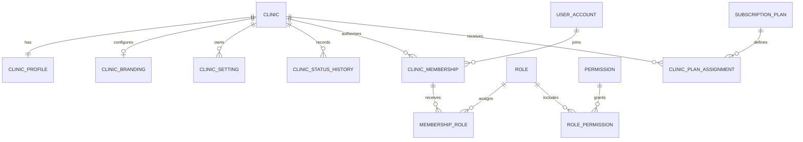
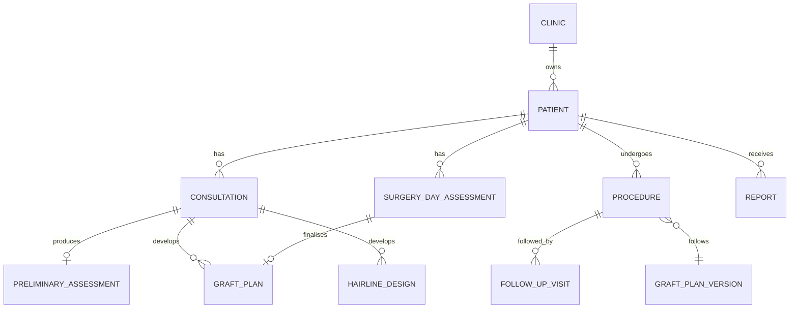
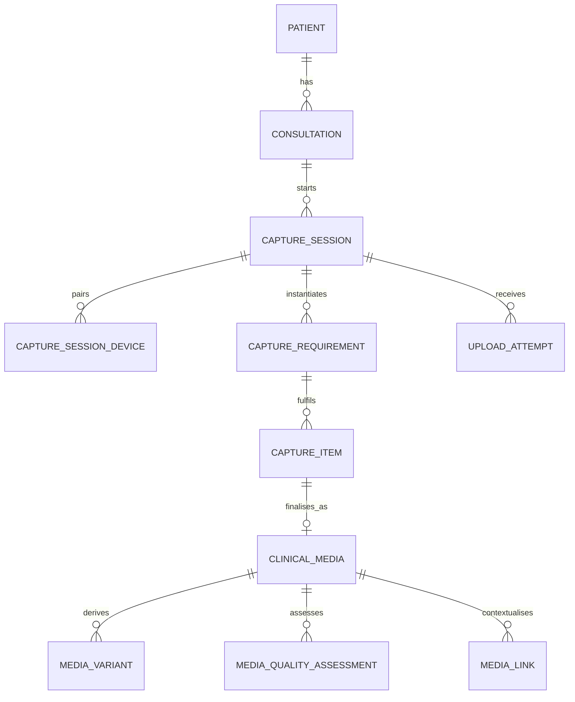
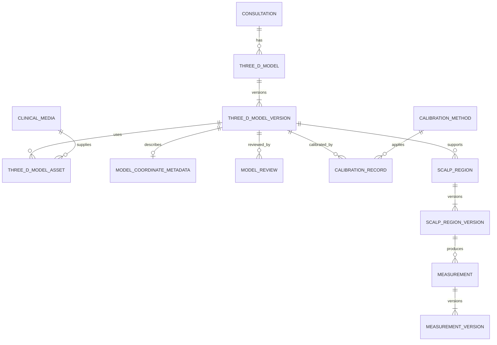
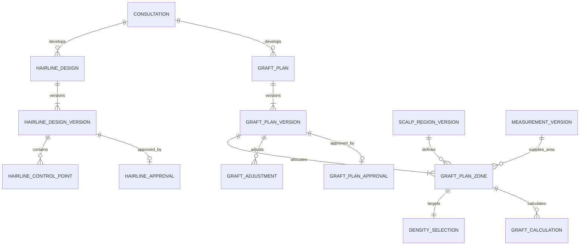
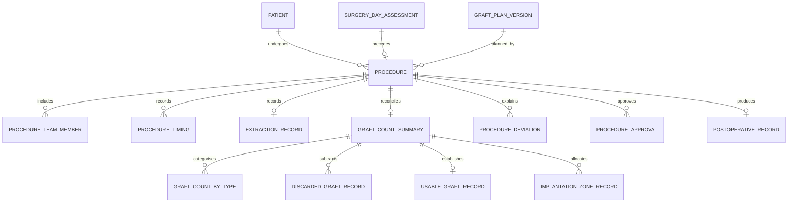
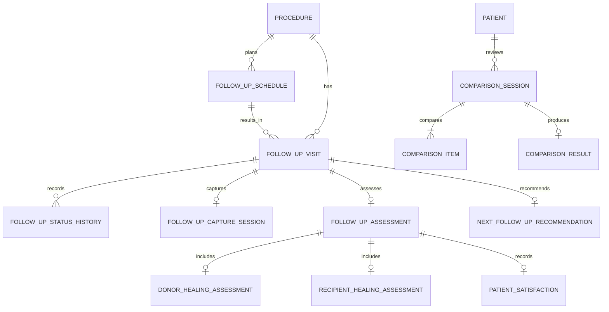
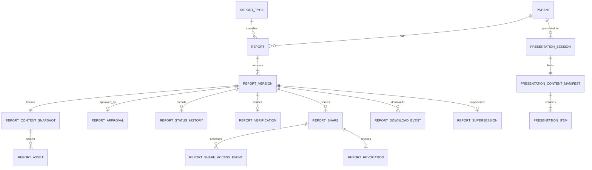
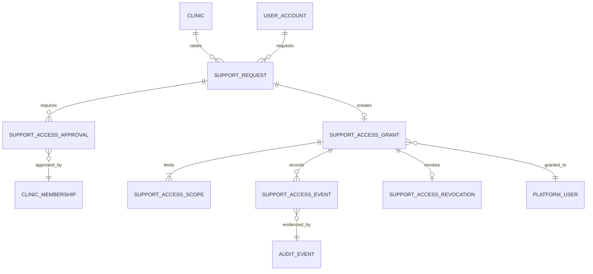
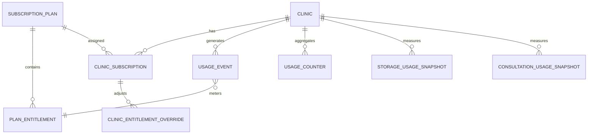

# GraftVision Logical Database Schema

## 1. Document Information

| Field | Value |
|---|---|
| Product | GraftVision |
| Document | Logical Database Schema |
| Version | 1.0 Draft |
| Status | Proposed for product-owner, clinical, privacy, security, and engineering review |
| Date | 25 July 2026 |
| Product owner | Haris Liaqat |
| Initial clinical approver | Dr Sheraz |
| Initial validation clinic | FACE Aesthetic Clinic Lahore |
| Initial launch market | Pakistan |
| Role model | Thirteen roles aligned across the approved working documents |
| Model | Shared PostgreSQL database and schema with layered tenant isolation and Row-Level Security |
| Scope | Logical entities, relationships, lifecycle, integrity, versioning, privacy, and operational data |
| Next document | `docs/SECURITY.md` |

This is logical guidance, not SQL, migrations, ORM models, endpoints, or a retention schedule.

## 2. Purpose

This document defines GraftVision’s logical entities, ownership, relationships, states, versions, and integrity invariants. It guides PostgreSQL, RLS, API, job, export, migration, test, clinical, privacy, security, and audit design without inventing product behaviour.

Priorities:

1. reliable clinic isolation;
2. one stable patient record with multiple clinical episodes;
3. clear separation of preliminary, final, planned, and actual values;
4. immutable approved versions and traceable corrections;
5. explicit source and derivation lineage;
6. private-file metadata without public URLs;
7. temporary scan, presentation, share, and support grants;
8. exportability, archival, retention, and controlled deletion; and
9. an understandable, extensible MVP model.

## 3. Relationship to Other Documents

| Document | Schema authority | Schema consequence |
|---|---|---|
| `docs/VISION.md` | Enduring patient-journey, privacy, Doctor-control, manual-fallback, and shared-product principles | Preserve longitudinal truth and avoid automation-dependent entities |
| `docs/PRD.md` | Product scope, requirements, lifecycle, acceptance criteria, and thirteen roles | Every Must Have data need must be representable without adding scope |
| `docs/ROLE_PERMISSIONS.md` | Authoritative role, permission, separation-of-duty, and temporary-access rules | Memberships, roles, grants, approvals, and audit must support server enforcement |
| `docs/PRODUCT_PRINCIPLES.md` | Failure, precision, versioning, portability, and disclosure rules | Preserve source, uncertainty, failed states, and safe defaults |
| `docs/USER_FLOWS.md` | Actor handoffs, status transitions, recovery, and lifecycle order | State/history entities must support every approved transition |
| `docs/SYSTEM_ARCHITECTURE.md` | Shared PostgreSQL/RLS, private storage, trusted-server, job, and deployment boundaries | Physically store tenant context on sensitive entities and treat external services as replaceable |
| `docs/SECURITY.md` | Future threat model and detailed controls | Must refine RLS, encryption, logging, key, and incident requirements |
| `docs/API_SPEC.md` | Future transport contracts | Must expose projections of this model, not raw unrestricted persistence shapes |

Open decisions use minimum access, no exact uncalibrated measurement, no AI final state, approved support/sharing only, and no permanent deletion before policy approval.

## 4. Data-Modelling Principles

1. **Tenant scope is structural.** Clinic-owned entities store `clinic_id`; sensitive descendants repeat it even when derivable.
2. **Relationships are tenant-safe.** Children cannot reference parents in another clinic.
3. **Patient is the longitudinal root.** Consultations, surgery-day assessments, procedures, follow-ups, reports, and later episodes connect to one clinic-owned patient.
4. **Episodes remain distinct.** A consultation is not a procedure; a procedure is not a follow-up. Generic `treatment_episode` may provide navigation later but must not erase domain meaning.
5. **Sources and derivatives differ.** Original images, Doctor-entered history, manual regions, selected density, and procedure counts remain distinguishable from thumbnails, calculations, AI suggestions, comparisons, renders, and PDFs.
6. **Draft and approval differ.** Approval targets an exact immutable version, never a moving current value.
7. **Corrections create history.** Approved versions are not edited in place. A correction creates a new version, records why, and supersedes the old version.
8. **Preliminary and final differ.** Hair-present consultation estimates cannot silently become surgery-day final measurements or final surgical plans.
9. **Plan and actual differ.** Planned, extracted, damaged/discarded, usable, implanted, and remaining graft values remain separate.
10. **AI is assistive.** AI entities preserve lineage and never overwrite clinical versions or original suggestions.
11. **Patient-safe is allowlisted.** Patient-safe reports and presentation manifests are built from explicit approved items, not internal records with excluded fields removed at query time.
12. **Files stay private.** The database stores opaque object location and verification metadata, never a durable public URL.
13. **Temporary access expires.** Device, presentation, share, support, and export grants record purpose, scope, expiry, and revocation.
14. **Audit is content-minimised.** Audit events identify actor, resource, action, result, and safe change summary without copying raw clinical notes or files.
15. **Statuses are constrained.** Important lifecycle states use controlled code sets or reference data, not arbitrary text.
16. **Notes are intentionally flexible.** Clinical facts are structured; narrative remains only where responsible standardisation is unavailable.
17. **No global patient identity.** The same person at two clinics remains two isolated records unless a future patient-controlled feature is separately approved.
18. **Portability is designed in.** Stable identifiers, explicit relationships, units, methods, versions, checksums, and manifests support clinic export and vendor migration.
19. **MVP meaning beats abstraction.** Avoid polymorphic “data,” “item,” or “object” tables for core clinical records.
20. **Operational records preserve context.** Jobs, usage, notifications, and audit retain references without copying clinical stores.

## 5. Tenant and Ownership Model

GraftVision uses three ownership classes.

| Ownership class | Examples | `clinic_id` | Access model |
|---|---|---|---|
| Platform-owned | role catalogue, permission catalogue, subscription plan, entitlement definitions, calibration-method definitions | Normally absent; optionally nullable only for a deliberately clinic-specific override entity | Restricted platform administration or authenticated reference read |
| Clinic-owned | clinic profile, membership, patient, consultation, clinical media, plan, procedure, follow-up, report, export | Required and immutable after creation | Active clinic membership, permission, record state, and RLS |
| Purpose-limited derived/access | report share, presentation session, support grant, job, media derivative | Required when linked to clinic data | Source permission or explicit temporary grant plus expiry/revocation |

`clinic` is the platform-created tenant root. GraftVision owns the software; the clinic owns clinic and patient data. Operational metadata grants no patient-content access.

High-risk children physically store `clinic_id`, including identity/contact, episodes, media, models, measurements, plans, procedures, follow-ups, reports, temporary grants, jobs, exports, audit, deletion, and search projections.

Logical inheritance is limited to inseparable value rows whose parent relationship includes clinic scope. Store `clinic_id` physically when a row is queried directly, externally referenced, processed asynchronously, partitioned, or protected by its own RLS policy.

Patient/report numbers, external references, configuration names, and idempotency keys are tenant scoped. Global opaque identifiers never replace tenant checks.

## 6. Domain Overview

| Domain | Long-lived root | Main versioned records | Temporary/operational records |
|---|---|---|---|
| Platform and clinic | `clinic` | profiles, branding/config revisions where audit requires | invitations, plan assignments, usage summaries |
| Identity and access | `user_account`, `clinic_membership` | membership-role history and grants | sessions, MFA configuration reference, device sessions |
| Patient and privacy | `patient` | demographics/history where material, consents/acknowledgements | merge candidates, archive/deletion requests |
| Consultation and capture | `consultation` | preliminary assessment, summaries, capture requirements | capture sessions, devices, upload attempts |
| Media and 3D | `clinical_media`, `three_d_model` | model versions, variants, review | processing jobs, quality assessments |
| Planning | regions, measurements, hairline and graft-plan roots | immutable clinical versions | AI suggestions, calculations, reviews |
| Surgery and procedure | `surgery_day_assessment`, `procedure` | final references and procedure amendments | timings, reconciliation warnings |
| Follow-up/comparison | `follow_up_visit`, `comparison_session` | assessments and reviewed results | schedules, alignment jobs |
| Reports/presentation | `report`, `presentation_session` | report versions and snapshots | shares, downloads, presentation access |
| Operations/governance | support request, audit stream, subscription, export | entitlement/config history | jobs, attempts, notifications, deletion work |

Future `treatment_episode` or `treatment_plan` abstractions may aid navigation and new modules. MVP retains explicit consultation, procedure, follow-up, graft-plan, and hairline entities so clinical meaning remains clear.

## 7. Entity Catalogue

This catalogue is normative. “Supporting” entities remain required within their owning aggregate.

| Group | Major roots | Supporting entities |
|---|---|---|
| Platform and clinic | `clinic`, `clinic_profile`, `clinic_branding`, `clinic_setting` | `platform_user`, `clinic_status_history`, `clinic_plan_assignment`, `clinic_usage_summary` |
| Users and access | `user_account`, `clinic_membership`, `role`, `permission`, `temporary_access_grant` | `role_permission`, `membership_role`, `invitation`, `authentication_event`, `session_record`, `mfa_configuration`, `device_session` |
| Patient identity/privacy | `patient`, `patient_consent`, `patient_privacy_acknowledgement` | `patient_identifier`, `patient_contact`, `patient_demographic`, `patient_status_history`, `patient_merge_candidate`, `patient_archive_record`, `patient_deletion_request` |
| Clinical history | `medical_history`, `hair_loss_history` | `medication_history`, `allergy_record`, `previous_treatment`, `family_history`, `clinical_warning`, `doctor_private_note` |
| Consultation | `consultation`, `preliminary_assessment`, `consultation_summary` | `consultation_assignment`, `consultation_status_history`, `consultation_note`, `consultation_completion_record` |
| Capture/media | `capture_session`, `clinical_media` | `capture_session_device`, `capture_requirement`, `capture_item`, `upload_attempt`, `media_variant`, `media_metadata`, `media_quality_assessment`, `media_link`, `media_retention_record` |
| 3D/calibration | `three_d_model`, `three_d_model_version`, `calibration_record` | `three_d_model_asset`, `model_processing_job`, `model_review`, `calibration_method`, `physical_scale_status`, `model_coordinate_metadata` |
| Regions/measurements | `scalp_region`, `scalp_region_version`, `measurement`, `measurement_version` | `scalp_region_geometry`, `measurement_source`, `measurement_review`, `measurement_approval`, `measurement_confidence` |
| AI assistance | `ai_job`, `ai_suggestion`, `ai_model_version` | `ai_job_input`, `ai_job_output`, `ai_suggestion_region`, `ai_suggestion_measurement`, `ai_review`, `ai_correction`, `ai_failure_record` |
| Hairline | `hairline_design`, `hairline_design_version` | `hairline_control_point`, `hairline_option`, `hairline_simulation`, `hairline_review`, `hairline_approval` |
| Graft plan | `graft_plan`, `graft_plan_version`, `graft_plan_zone` | `density_selection`, `graft_calculation`, `graft_adjustment`, `graft_plan_review`, `graft_plan_approval` |
| Surgery day | `surgery_day_assessment` | `shaved_capture_session`, `final_measurement_set`, `final_hairline_reference`, `final_plan_reference`, `patient_acknowledgement` |
| Procedure | `procedure`, `graft_count_summary` | `procedure_team_member`, `procedure_status_history`, `procedure_timing`, `extraction_record`, `graft_count_by_type`, `discarded_graft_record`, `usable_graft_record`, `implantation_zone_record`, `procedure_deviation`, `procedure_note`, `procedure_review`, `procedure_approval` |
| Immediate post-op | `postoperative_record`, `postoperative_media_set` | `donor_observation`, `recipient_observation`, `postoperative_instruction_reference` |
| Follow-up | `follow_up_schedule`, `follow_up_visit`, `follow_up_assessment` | `follow_up_status_history`, `follow_up_capture_session`, `donor_healing_assessment`, `recipient_healing_assessment`, `patient_satisfaction`, `next_follow_up_recommendation` |
| Comparison | `comparison_session`, `comparison_result` | `comparison_item`, `comparison_method`, `alignment_assessment`, `capture_condition_comparison`, `comparison_review` |
| Reports | `report`, `report_version`, `report_content_snapshot`, `report_share` | `report_type`, `report_asset`, `report_approval`, `report_status_history`, `report_verification`, `report_download_event`, `report_share_access_event`, `report_revocation`, `report_supersession` |
| Presentation | `presentation_session`, `presentation_content_manifest` | `presentation_item`, `presentation_controller`, `presentation_status_history`, `presentation_access_event`, `presentation_revocation` |
| Notifications | `notification` | `notification_delivery_attempt`, `notification_preference` |
| Audit/support | `audit_event`, `support_request`, `support_access_grant` | `support_access_approval`, `support_access_scope`, `support_access_event`, `support_access_revocation` |
| SaaS/usage | `subscription_plan`, `plan_entitlement`, `clinic_subscription`, `usage_event` | `clinic_entitlement_override`, `usage_counter`, `storage_usage_snapshot`, `consultation_usage_snapshot` |
| Jobs/exports | `background_job`, `export_request`, `export_job` | `job_attempt`, `job_error`, `export_asset`, `export_download_event`, `retention_job`, `deletion_job` |
| Archive/config/reference | archive/deletion aggregates, `feature_flag`, reference catalogues | hold records, flag assignments, status/method/type reference values |

## 8. Entity Relationship Summary

The following diagrams show logical cardinality. They omit many supporting rows and repeated `clinic_id` fields for readability; omission from a diagram never removes tenant scope.

### Platform and clinic ER diagram

### Cardinality rules

- One clinic has one current profile and zero or one current branding configuration, with change history preserved where material.
- One user account can have memberships in multiple clinics, but each membership is independently authorised.
- One clinic membership has one or more active role assignments only when policy allows; role assignment history remains attributable.
- One patient belongs to exactly one clinic and has many episodes.
- A consultation, surgery-day assessment, procedure, follow-up, report, presentation, export, job, and audit event always resolves to exactly one clinic when clinic data is involved.
- Version roots have many immutable versions but at most one current draft and at most one current approved version for a defined approval type, subject to domain rules.

## 9. Core Identity Entities

Identity-provider records authenticate a person; product records decide domain access. Provider-managed password hashes, recovery secrets, MFA challenges, and provider session internals are not duplicated into GraftVision tables.

| Entity | Purpose | Ownership | Primary owner | Parent | Key relationships | Lifecycle | Mutability/versioning | Soft delete | Audit | Stage/notes |
|---|---|---|---|---|---|---|---|---|---|---|
| `user_account` | Stable product identity mapped to an authentication provider | Platform-owned identity metadata | User/platform administration | None | memberships, platform roles, sessions, audit | invited/active/disabled/anonymised where lawful | Mutable profile/status; provider link history | Disable, not routine delete | High | MVP |
| `platform_user` | Assigns approved platform responsibility to a user | Platform-owned | Platform Owner | `user_account` | platform role assignments, audit | pending/active/suspended/revoked | Mutable with history | Revoke | Critical | MVP logical entity; may be role assignment rather than separate table |
| `authentication_event` | Records login, recovery, MFA, failure, revoke, and security outcome | Platform operational; clinic-scoped where applicable | Security | `user_account` | session, clinic context | append-only | Immutable | Retention policy | High, content-minimised | MVP |
| `session_record` | Product-visible session metadata and revocation state | Platform/clinic contextual | Security | `user_account` | membership context, device, auth events | active/expired/revoked | Mutable state, append history | Expire | High | MVP; provider remains token authority |
| `mfa_configuration` | Product policy/status reference to provider MFA | Platform contextual | Security | `user_account` | role risk/policy | not-configured/pending/active/recovery | Mutable; no secret factors stored | Disable/revoke | High | MVP readiness; exact policy open |
| `device_session` | Bounded device context for authenticated or temporary use | Clinic-owned when clinic-scoped | User/clinic | session or temporary grant | scan/presentation/device events | active/expired/revoked | Mutable status | Expire/purge under policy | High | MVP |

## 10. Clinic Entities

`clinic` is the tenant root and must not be confused with a branch. MVP assumes one operational location per clinic. A future branch model requires a separate approved hierarchy rather than reusing clinic identifiers.

| Entity | Purpose | Ownership | Primary owner | Parent | Key relationships | Lifecycle | Mutability/versioning | Soft delete | Audit | Stage/notes |
|---|---|---|---|---|---|---|---|---|---|---|
| `clinic` | Stable tenant identity and service state | Platform-created, clinic data root | Platform Owner | None | profile, memberships, patients, subscription | onboarding/trial/active/suspended/inactive/closing/closed | Mutable state with history | Close; never hard-delete directly | Critical | MVP |
| `clinic_profile` | Legal/operational identity and approved contact metadata | Clinic-owned | Clinic Owner | `clinic` | branding, reports, onboarding | draft/current/superseded | Version material changes or audit fields | Archive with clinic | High | MVP |
| `clinic_branding` | Logo, colours, report/presentation identity settings | Clinic-owned | Clinic Owner/Admin | `clinic` | media asset, report snapshot | draft/active/superseded | Version or snapshot on report | Archive | Medium | MVP |
| `clinic_setting` | Approved bounded workflow/configuration value | Clinic-owned | Clinic Owner/Admin | `clinic` | capture protocol, policy, feature behaviour | active/inactive/superseded | Mutable with effective history for material settings | Archive | High when security/clinical | MVP; no arbitrary code/config blob |
| `clinic_status_history` | Append-only clinic lifecycle transitions | Platform-owned operational record | Platform Administrator | `clinic` | actor, reason, audit | append-only | Immutable | Retain | High | MVP |
| `clinic_plan_assignment` | Historical assignment of pilot/plan and limits | Platform-owned commercial metadata | Platform Administrator | `clinic` | subscription plan, entitlement override | scheduled/active/ended | Effective-dated | End, not delete | Medium | MVP manual administration |
| `clinic_usage_summary` | Rebuildable aggregate for clinic operations | Platform-derived | Platform Administrator | `clinic` | usage counters/snapshots | current/superseded | Mutable/rebuildable | Retention policy | Low/Medium | MVP |

## 11. User and Membership Entities

Membership is the bridge between identity and tenant authority. A user with memberships in two clinics receives two independent contexts. Deactivating one membership does not necessarily disable the identity globally, but immediately removes that clinic’s authority.

| Entity | Purpose | Ownership | Primary owner | Parent | Key relationships | Lifecycle | Mutability/versioning | Soft delete | Audit | Stage/notes |
|---|---|---|---|---|---|---|---|---|---|---|
| `clinic_membership` | Authorises one user in one clinic | Clinic-owned | Clinic Owner/Admin | `clinic`, `user_account` | roles, assignments, sessions | invited/pending/active/suspended/deactivated | Mutable with status history | Deactivate | Critical | MVP |
| `membership_role` | Assigns one approved role to membership | Clinic-owned | Clinic Owner/Admin | `clinic_membership` | role, grantor, audit | pending/active/revoked/expired | Effective-dated, append history | Revoke | Critical | MVP; multiple roles allowed by policy |
| `invitation` | Expiring invitation to platform or clinic context | Clinic-owned or platform-owned | Authorised administrator | clinic/membership | invitee, proposed roles | created/sent/accepted/expired/revoked | Mutable state | Expire/purge by policy | High | MVP |
| `consultation_assignment` | Assigns Doctor/staff to a consultation | Clinic-owned | Clinic/Doctor workflow | consultation/membership | role-in-case, dates | assigned/accepted/rejected/ended | Mutable with history | End | High | MVP |

## 12. Role and Permission Entities

The role catalogue contains exactly thirteen approved roles: Platform Owner, Platform Administrator, Platform Support Engineer, Clinic Owner, Clinic Administrator, Doctor / Hair-Transplant Surgeon, Clinical Assistant, Procedure Technician, Reception User, Report Coordinator, Presentation User, Read-Only Clinical Reviewer, and Patient.

Patient is represented as a role in the permission model but does not receive an internal dashboard in MVP. Presentation User normally operates through a purpose-limited presentation session. Platform roles are not clinic memberships unless separately authorised, and none automatically grants Doctor authority.

| Entity | Purpose | Ownership | Primary owner | Parent | Key relationships | Lifecycle | Mutability/versioning | Soft delete | Audit | Stage/notes |
|---|---|---|---|---|---|---|---|---|---|---|
| `role` | Stable approved role definition | Platform-owned reference | Platform Owner | None | permissions, membership roles | active/deprecated | Version catalogue changes | Deprecate | High | MVP, seeded/controlled |
| `permission` | Stable action/resource capability | Platform-owned reference | Security/product | None | role permissions, evaluator | active/deprecated | Version definitions | Deprecate | High | MVP |
| `role_permission` | Default permission within role | Platform-owned policy | Product/security | role/permission | conditions/policy version | active/superseded | Effective-dated | Supersede | Critical | MVP |
| `membership_role` | Tenant assignment of role | Clinic-owned | Clinic Owner/Admin | membership | role, assigner | active/revoked/expired | Effective-dated | Revoke | Critical | MVP |
| `temporary_access_grant` | Reusable logical grant for one temporary purpose | Clinic-owned when clinical | Approved grantor | actor/purpose/resource | support, review, device, presentation | requested/approved/active/expired/revoked | Immutable scope; mutable lifecycle | Retain after expiry | Critical | MVP; specialised entities remain clearer |

The permission evaluator may use these records plus code-level immutable restrictions. Database rows cannot express every record-state and separation-of-duty rule, and a role-permission join must never be treated as sufficient authority without tenant, resource, status, and approval context.

## 13. Patient Entities

`patient` is the permanent clinic-owned clinical root. It uses a clinic-specific patient number and no cross-clinic master identity. Contact and demographic details are separated so roles receive minimum projections. Multiple consultations, procedures, and follow-ups attach to the same patient across years.

| Entity | Purpose | Ownership | Primary owner | Parent | Key relationships | Lifecycle | Mutability/versioning | Soft delete | Audit | Stage/notes |
|---|---|---|---|---|---|---|---|---|---|---|
| `patient` | Stable longitudinal patient identity within clinic | Clinic-owned | Clinic | `clinic` | identifiers, episodes, reports, privacy | active/inactive/archived/pending-deletion/deleted | Mutable identity with revision/history | Archive first | Critical | MVP |
| `patient_identifier` | Clinic patient number or approved external reference | Clinic-owned | Clinic | patient | identifier type/source | active/retired | Effective-dated | Retire | High | MVP |
| `patient_contact` | Contact channel and verification state | Clinic-owned | Patient/clinic | patient | sharing/notification under permission | active/unverified/verified/retired | Mutable with history where necessary | Retire | Critical personal data | MVP |
| `patient_demographic` | Minimum approved demographic attributes | Clinic-owned | Patient/clinic | patient | clinical history/report snapshot | current/superseded | Version material corrections | Archive with patient | Sensitive | MVP minimum fields open |
| `patient_status_history` | Append-only status transitions | Clinic-owned | Clinic | patient | actor/reason | append-only | Immutable | Retain | High | MVP |
| `patient_merge_candidate` | Potential duplicate pair within one clinic | Clinic-owned derived | Clinic Admin | clinic/patients | match factors/review | suggested/reviewed/merged/rejected | Immutable suggestion + disposition | Archive | High | MVP optional manual duplicate control |
| `patient_archive_record` | Archive/restore event and reason | Clinic-owned | Authorised clinic role | patient | actor, status history | archived/restored | Append-only | Retain | Critical | MVP |
| `patient_deletion_request` | Controlled deletion workflow root | Clinic-owned/governed | Clinic Owner/requester | patient | approvals, holds, jobs, export | requested/review/approved/rejected/scheduled/completed/cancelled | Immutable request; state transitions | Retain evidence | Critical | MVP logical support |

### Critical field catalogue: `patient`

| Field | Logical type | Requirement | Description | Source | Validation | Sensitivity | Indexed | Mutability |
|---|---|---|---|---|---|---|---|---|
| `patient_id` | Opaque identifier | Required | Stable longitudinal root | Server | Unique | Security-critical | Yes | Immutable |
| `clinic_id` | Tenant reference | Required | Owning clinic | Trusted server context | Non-null; matches every child | Security-critical | Yes | Immutable |
| `patient_number` | Text/code | Required | Clinic-specific human reference | Clinic/server | Unique within clinic | Personal | Composite yes | Controlled |
| `display_name` | Text | Required under approved minimum | Clinic-facing patient name | Authorised staff/patient | Normalisation and length | Personal | Tenant-scoped search | Mutable with audit |
| `status` | Controlled code | Required | Current patient lifecycle | Trusted workflow | Valid transition | Clinical/security | Composite yes | Mutable |
| `archived_at` | Timestamp | Optional | Current archive state | Authorised workflow | Required when archived | Sensitive | Yes | Controlled |
| `created_by/created_at` | Actor + timestamp | Required | Registration provenance | Trusted server | Active clinic member and trusted time | Audit | Chronological | Immutable |
| `revision` | Integer/token | Required | Optimistic concurrency | Server | Monotonic | Internal | No | Mutable |

Duplicate detection is tenant scoped and produces candidates, not automatic merges. A merge requires authorised review, selects a survivor, preserves source identifiers and audit history, re-homes only same-clinic relationships transactionally, and leaves a non-sensitive redirect/tombstone. Cross-clinic candidates are prohibited.

## 14. Consent and Privacy Entities

Consent and acknowledgement are purpose-specific evidence, not one permanent boolean. Legal basis and required wording for Pakistan remain subject to legal/privacy review.

| Entity | Purpose | Ownership | Primary owner | Parent | Key relationships | Lifecycle | Mutability/versioning | Soft delete | Audit | Stage/notes |
|---|---|---|---|---|---|---|---|---|---|---|
| `patient_privacy_acknowledgement` | Records presentation of privacy notice and acknowledgement | Clinic-owned | Clinic/patient | patient | notice version, channel, witness | pending/acknowledged/withdrawn where applicable | Immutable event/version | Retain under policy | Critical | MVP |
| `patient_consent` | Records consent for a defined clinical/data purpose where required | Clinic-owned | Patient/clinic | patient | purpose, wording version, evidence, withdrawal | pending/granted/refused/withdrawn/expired | Immutable decision events | Retain evidence | Critical | MVP scope determined legally |
| `patient_acknowledgement` | Records acknowledgement of a plan/report/instruction, distinct from Doctor approval | Clinic-owned | Patient/clinic | patient/resource version | evidence, witness, time | pending/acknowledged/declined | Immutable event | Retain | High | MVP where approved |
| `privacy_notice_version` | Controlled wording/version used for evidence | Platform/clinic-configured | Privacy owner | None/clinic | acknowledgements | draft/approved/retired | Immutable approved versions | Retire | High | MVP logical reference |
| `data_hold` | Prevents deletion for approved legal/clinical reason | Clinic-owned/governed | Authorised privacy/legal role | patient or scoped resource | deletion/retention | active/released/expired | Immutable scope; lifecycle mutable | Retain | Critical | MVP logical support |

Consent does not create access by itself, and access does not imply consent. Doctor clinical approval, patient acknowledgement, clinic administrative approval, support approval, deletion approval, and export approval are separate evidence types.

## 15. Consultation Entities

A consultation is a clinical episode, not a mutable section on the patient row. Initial hair-present consultation and surgery-day assessment remain separate, linked episodes. Each consultation carries its own assignments, capture context, drafts, status history, and completion evidence.

| Entity | Purpose | Ownership | Primary owner | Parent | Key relationships | Lifecycle | Mutability/versioning | Soft delete | Audit | Stage/notes |
|---|---|---|---|---|---|---|---|---|---|---|
| `consultation` | Stable episode root | Clinic-owned | Doctor/clinic | patient | assignments, capture, assessment, plans, reports | draft/in-progress/capture-complete/review-required/completed/cancelled | Mutable shell; clinical outputs version separately | Archive/cancel | Critical | MVP |
| `consultation_assignment` | Case-specific Doctor/staff assignment | Clinic-owned | Clinic admin/Doctor | consultation | membership and assigned function | assigned/accepted/rejected/ended | Effective-dated | End | High | MVP |
| `consultation_status_history` | Records every controlled transition | Clinic-owned | Workflow | consultation | actor/reason | append-only | Immutable | Retain | High | MVP |
| `preliminary_assessment` | Hair-present provisional assessment | Clinic-owned | Doctor | consultation | history, media, preliminary measurements/plans | draft/review/approved-for-discussion/superseded | Versioned when clinically material | Archive | Critical | MVP; never final surgical plan |
| `consultation_summary` | Versioned structured summary | Clinic-owned | Doctor | consultation | source versions, report snapshot | draft/approved/superseded | Versioned | Archive | Critical | MVP |
| `consultation_note` | General or scoped narrative | Clinic-owned | Authorised clinical user | consultation | author, disclosure class | active/amended/retracted | Append/amend, avoid silent overwrite | Retract | High | MVP |
| `consultation_completion_record` | Evidence that completion gates were evaluated | Clinic-owned | Doctor/workflow | consultation | required data, exceptions | completed/reopened | Immutable event | Retain | High | MVP |

## 16. Medical and Hair-History Entities

Clinical history balances structure with narrative. Common safety-critical facts receive explicit entities and controlled status; uncertain or uncommon detail remains in authored notes. The MVP does not predefine every diagnosis, medication taxonomy, or clinical questionnaire field.

| Entity | Purpose | Ownership | Primary owner | Parent | Key relationships | Lifecycle | Mutability/versioning | Soft delete | Audit | Stage/notes |
|---|---|---|---|---|---|---|---|---|---|---|
| `medical_history` | Versioned overall medical-history statement | Clinic-owned | Doctor/authorised Assistant | patient | source consultation, conditions, review | draft/current/superseded | Versioned for material changes | Archive | Highly sensitive | MVP |
| `hair_loss_history` | Hair-loss onset/progression and relevant observations | Clinic-owned | Doctor | patient/consultation | assessment, prior treatments | draft/current/superseded | Versioned | Archive | Highly sensitive | MVP |
| `medication_history` | Medication entry with dates/status | Clinic-owned | Clinical user | patient | medical history | active/stopped/unknown | Effective-dated | Retire | Highly sensitive | MVP minimum |
| `allergy_record` | Allergy/intolerance and reaction | Clinic-owned | Clinical user | patient | clinical warnings | active/inactive/unconfirmed | Version/review | Retire | Critical clinical | MVP |
| `previous_treatment` | Prior hair/scalp treatment or procedure | Clinic-owned | Doctor/clinical user | patient | external reference/media/note | reported/verified/updated | Append and amend | Archive | Sensitive | MVP |
| `family_history` | Relevant reported family history | Clinic-owned | Doctor/clinical user | patient | consultation | current/superseded | Version material changes | Archive | Sensitive | MVP |
| `clinical_warning` | Actionable caution with source and status | Clinic-owned | Doctor/authorised user | patient/episode | approvals/workflow | active/resolved/superseded | Append resolution | Archive | Critical | MVP |
| `doctor_private_note` | Doctor-only narrative excluded from patient-safe contexts | Clinic-owned | Doctor | patient/episode | author/version | active/amended/retracted | Append amendment, strict disclosure | Retract, retain history | Critical | MVP |

Each history row records source (patient-reported, observed, imported, or verified), author, review state, effective/recorded dates, and uncertainty. A patient-safe report never obtains these entities through a broad patient join; only an approved snapshot may include an explicitly patient-safe summary.

## 17. Capture Session Entities

A capture session is a temporary workflow root bound to one clinic, patient, and clinical context. It may serve consultation, surgery-day shaved capture, procedure, postoperative, or follow-up capture. Specialised references such as `shaved_capture_session` and `follow_up_capture_session` should normally be contextual links to the shared capture root rather than duplicate session tables.

| Entity | Purpose | Ownership | Primary owner | Parent | Key relationships | Lifecycle | Mutability/versioning | Soft delete | Audit | Stage/notes |
|---|---|---|---|---|---|---|---|---|---|---|
| `capture_session` | Patient-bound temporary capture workflow | Clinic-owned | Authorised clinic user | patient + one episode | device, requirements, items, media | created/pairing/active/paused/completing/completed/expired/revoked | Mutable lifecycle; binding immutable | Expire/archive | Critical | MVP |
| `capture_session_device` | One paired phone/device grant | Clinic-owned | Session creator/user | capture session | device session, access events | pending/confirmed/active/revoked/expired | Mutable status | Expire | Critical | MVP |
| `capture_requirement` | Versioned required/optional view instantiated for session | Clinic-owned/config-derived | Clinical protocol | capture session | protocol version, items | pending/satisfied/exception/waived | Immutable requirement; status mutable | Retain | High | MVP |
| `capture_item` | One attempt/accepted item for a view | Clinic-owned | Capture user | requirement | upload, media | local/pending/uploading/verified/rejected/replaced | Append attempts; selected result mutable | Archive rejected | High | MVP |
| `upload_attempt` | Resumable transfer attempt and outcome | Clinic-owned operational | Capture device | capture item | storage reference/error | authorised/uploading/paused/complete/failed/expired | Append attempts | Purge temporary detail by policy | Medium/High | MVP |

## 18. Clinical Image Entities

`clinical_media` represents an accepted private clinical asset regardless of image/video/3D/report-screenshot category. Domain-specific rows such as model assets or report assets reference it. A media row never stores public access authority.

Supported media categories include Front, Left, Right, Top, Crown, Donor, Postoperative, Follow-up, optional short Video, 3D source/preview, and report Screenshot. The category, view, purpose, and clinical context are separate controlled attributes so “Crown” is not confused with “Follow-up Crown.”

| Entity | Purpose | Ownership | Primary owner | Parent | Key relationships | Lifecycle | Mutability/versioning | Soft delete | Audit | Stage/notes |
|---|---|---|---|---|---|---|---|---|---|---|
| `clinical_media` | Canonical metadata for accepted private source/derived asset | Clinic-owned | Clinic | patient/context | file, variants, links, quality, retention | pending-verification/ready/rejected/quarantined/archived/pending-deletion/deleted | Metadata mutable until verified; source identity immutable | Archive then controlled delete | Critical | MVP |
| `media_variant` | Thumbnail, normalised preview, render, or other derivative | Clinic-owned derived | Processing worker | clinical media | parent, method/version | queued/processing/ready/failed/invalidated | Regenerable/versioned | Delete/rebuild under policy | Medium | MVP |
| `media_metadata` | Capture/technical metadata not suited to root fields | Clinic-owned | Device/processor | clinical media | device/capture conditions | recorded/corrected | Version corrections | Archive | High | MVP |
| `media_quality_assessment` | Human or AI quality warning and disposition | Clinic-owned derived/reviewed | Clinical user | clinical media | AI suggestion/review | pending/warn/acceptable/rejected/superseded | Append/version | Archive | High | MVP manual; AI conditional |
| `media_link` | Typed link from media to consultation/procedure/follow-up/report | Clinic-owned | Workflow | clinical media/context | one media to many approved contexts | active/superseded | Immutable source link; deactivate | Archive | High | MVP |
| `media_retention_record` | Retention class, hold, expiry, deletion state | Clinic-owned/governed | Privacy/clinic | clinical media | hold/deletion job | active/held/eligible/scheduled/deleted | Mutable policy state | Retain evidence | Critical | MVP |

### Critical field catalogue: `clinical_media`

| Field | Logical type | Requirement | Description | Source | Validation | Sensitivity | Indexed | Mutability |
|---|---|---|---|---|---|---|---|---|
| `clinical_media_id` | Opaque identifier | Required | Logical asset identity | Server | Unique | Security-critical | Yes | Immutable |
| `clinic_id` | Tenant reference | Required | Tenant scope | Trusted context | Matches patient/context/path | Security-critical | Yes | Immutable |
| `patient_id` | Reference | Required for patient media | Patient root | Server | Same clinic | Highly sensitive | Composite yes | Immutable |
| `storage_container/object_key` | Opaque references | Required | Private object location | Storage adapter/server | Approved environment, tenant scope, no PII | Restricted | Unique/indexed | Controlled migration only |
| `media_category` | Controlled code | Required | Image/video/3D/screenshot/report asset | Capture/workflow | Supported type | Clinical | Composite yes | Immutable after verification |
| `view_code` | Controlled code | Optional | Front/Left/Right/Top/Crown/Donor/etc. | Capture protocol | Compatible with category | Clinical | Composite yes | Controlled correction |
| `mime_type/size/checksum` | Format + number + digest | Required before Ready | Verified type, limit and integrity | Validator | Allowed, decodable and within limit | Security | Checksum composite | Immutable |
| `dimensions/duration` | Structured measurements | Optional by media type | Verified visual/time dimensions | Validator | Positive and within limits | Operational | No | Immutable |
| `captured_at` | Timestamp | Optional | Capture time, distinct from upload | Device/user | Plausibility and timezone | Clinical | Chronological | Correctable with audit |
| `source_or_derivative` | Controlled code | Required | Provenance class | Workflow | Parent required for derivative | Clinical | Yes | Immutable |
| `upload/processing_status` | Controlled codes | Required | Transfer, verification and derivative state | Server/worker | Valid transitions | Operational | Composite yes | Mutable |
| `retention_state` | Controlled code | Required | Active/held/eligible/etc. | Policy workflow | Consistent with hold/deletion | Privacy | Yes | Mutable |

## 19. Media and File Entities

The logical file aggregate comprises `clinical_media`, storage location metadata, `media_variant`, upload attempts, verification, retention, and contextual links. The object store contains bytes; PostgreSQL contains authority and lineage.

No long-lived public URL is stored. A signed URL is generated from current authorisation and object identity and is not persisted in clinical or audit rows. Encryption-provider metadata may store key/version references but never raw keys.

Original assets and derivatives have independent rows and checksums. Derivatives retain parent asset, processing method/version, parameters sufficient for reproducibility, and invalidation state. Removing a thumbnail does not remove the source. A source pending deletion blocks new derivatives and is removed only after report snapshot, hold, export, and retention checks.

`media_link` avoids ambiguous polymorphism by using a constrained link type and validated context. Where a relationship is core and singular—such as a model version’s primary GLB asset—a dedicated foreign key is preferable. The future physical schema should not rely on an unchecked `resource_type/resource_id` pair for security-critical relationships.

## 20. 3D Model Entities

| Entity | Purpose | Ownership | Primary owner | Parent | Key relationships | Lifecycle | Mutability/versioning | Soft delete | Audit | Stage/notes |
|---|---|---|---|---|---|---|---|---|---|---|
| `three_d_model` | Stable model root for one patient/context | Clinic-owned | Doctor/clinic | consultation or surgery-day assessment | versions, regions, report assets | active/superseded/archived | Root mutable; versions immutable after review | Archive | Critical | MVP uploaded models |
| `three_d_model_version` | Exact imported/generated model revision | Clinic-owned source/derived | Doctor/processor | model | assets, coordinate metadata, calibration, review | uploaded/queued/processing/ready/needs-review/rejected/failed/superseded | Immutable once Ready/reviewed | Archive | Critical | MVP upload; reconstruction conditional |
| `three_d_model_asset` | Typed source, texture, GLB/GLTF, preview, or screenshot link | Clinic-owned | Worker/clinic | model version | clinical media | active/invalidated | Immutable link | Archive | High | MVP |
| `model_processing_job` | Domain projection over background job | Clinic-owned operational | Worker | model version | background job, assets, errors | queued/running/ready/failed/cancelled | Append attempts | Retain per policy | High | Conditional |
| `model_review` | Doctor compatibility/provenance/use review | Clinic-owned | Doctor | model version | calibration, approval | pending/accepted/rejected/limited | Immutable decisions | Retain | Critical | MVP |
| `model_coordinate_metadata` | Units, axis, origin, scale and coordinate conventions | Clinic-owned | Importer/processor | model version | calibration | recorded/corrected | Version with model | Archive | High | MVP |

## 21. Calibration Entities

| Entity | Purpose | Ownership | Primary owner | Parent | Key relationships | Lifecycle | Mutability/versioning | Soft delete | Audit | Stage/notes |
|---|---|---|---|---|---|---|---|---|---|---|
| `calibration_method` | Controlled method definition and validation status | Platform reference | Clinical/engineering governance | None | calibration records | draft/approved/retired | Versioned reference | Retire | Critical | MVP references; methods open |
| `calibration_record` | Evidence that one source/model has or lacks physical scale | Clinic-owned | Doctor/processor | image/model version | method, evidence asset, reviewer | uncalibrated/pending/verified/rejected/expired | Immutable reviewed record; new correction | Retain | Critical | MVP |
| `physical_scale_status` | Controlled interpretation of scale reliability | Platform reference | Clinical governance | None | calibration/model/measurement | active/retired | Versioned code | Retire | Critical | MVP |
| `model_coordinate_metadata` | Coordinate/unit metadata tied to exact model version | Clinic-owned | Importer/worker | model version | calibration | recorded/reviewed/superseded | Version-bound | Archive | High | MVP |

No calibration record may mark physical scale verified without an approved method and required evidence. Unknown or rejected scale permits relative or Doctor-entered measurements with disclosed source, not fabricated physical area.

## 22. Scalp Region Entities

A region root identifies a clinically named area within one patient episode and source frame. Each geometry edit creates a version. The geometry may be authored manually, derived from an AI suggestion, or Doctor-corrected; those origins remain explicit.

| Entity | Purpose | Ownership | Primary owner | Parent | Key relationships | Lifecycle | Mutability/versioning | Soft delete | Audit | Stage/notes |
|---|---|---|---|---|---|---|---|---|---|---|
| `scalp_region` | Stable region concept within a plan/context | Clinic-owned | Doctor | consultation/model/image context | versions, measurements, graft zones | draft/active/superseded/archived | Version root | Archive | Critical | MVP |
| `scalp_region_version` | Exact labelled region revision | Clinic-owned | Clinical author | scalp region | geometry, source, review/approval | draft/review/approved/rejected/superseded | Immutable once approved | Archive | Critical | MVP |
| `scalp_region_geometry` | Coordinate geometry in a declared frame | Clinic-owned | Author/processor | region version | source image/model metadata | valid/invalidated | Immutable with version | Archive | Critical | MVP |

## 23. Measurement Entities

Measurement values never stand alone. They identify region/source version, method, unit, calibration status, origin, precision, confidence where meaningful, review, approval, and supersession.

| Entity | Purpose | Ownership | Primary owner | Parent | Key relationships | Lifecycle | Mutability/versioning | Soft delete | Audit | Stage/notes |
|---|---|---|---|---|---|---|---|---|---|---|
| `measurement` | Stable measurement concept | Clinic-owned | Doctor | region/episode | versions, plan dependencies | active/superseded/archived | Version root | Archive | Critical | MVP |
| `measurement_version` | Exact value, unit, method, and state | Clinic-owned source/derived | Author/processor | measurement | source, confidence, review, approval | draft/preliminary/review/approved/final/rejected/superseded/stale | Immutable after approval | Archive | Critical | MVP |
| `measurement_source` | Explicit source and reproducibility linkage | Clinic-owned | Workflow | measurement version | region geometry/calibration/AI/manual entry | active/invalidated | Immutable | Retain | Critical | MVP |
| `measurement_review` | Human review and limitations | Clinic-owned | Doctor/reviewer | measurement version | approval/confidence | pending/accepted/corrected/rejected | Immutable decisions | Retain | Critical | MVP |
| `measurement_approval` | Doctor approval projection | Clinic-owned | Doctor | measurement version | reusable approval | approved/revoked/superseded | Immutable decision | Retain | Critical | MVP |
| `measurement_confidence` | Optional confidence and its meaning/method | Clinic-owned derived | Processor/reviewer | measurement version | model/method version | recorded/invalidated | Immutable | Retain | High | Conditional |

### Critical field catalogue: `measurement_version`

| Field | Logical type | Requirement | Description | Source | Validation | Sensitivity | Indexed | Mutability |
|---|---|---|---|---|---|---|---|---|
| `measurement_version_id` | Identifier | Required | Exact measurement revision | Server | Unique | Clinical | Yes | Immutable |
| `clinic_id` | Tenant reference | Required | Tenant scope | Trusted context | Matches all sources | Security-critical | Yes | Immutable |
| `measurement_id` | Reference | Required | Stable root | Workflow | Same clinic | Clinical | Composite yes | Immutable |
| `version_number` | Integer | Required | Monotonic revision | Server | Unique per root | Clinical | Composite yes | Immutable |
| `value` | Decimal/range | Required when available | Numeric value or bounded range | User/calculation | Non-negative; range ordered | Clinical | Limited | Immutable per version |
| `unit_code` | Controlled code | Required | cm², relative unit, graft-related unit, etc. | Method | Compatible with measurement kind | Clinical safety | Yes | Immutable |
| `method/source code and version` | References | Required | Manual, geometry, AI or Doctor-corrected lineage | Workflow | Approved method and consistent source | Clinical safety | Yes | Immutable |
| `calibration_record_id` | Reference | Optional/required for physical result | Scale evidence | Calculation | Verified for exact physical output | Critical | Yes | Immutable |
| `precision_or_uncertainty` | Structured value | Optional | Honest interpretation | Method/reviewer | Approved form | Clinical | No | Immutable |
| `clinical_stage` | Controlled code | Required | Preliminary or final | Workflow | Final requires Doctor approval | Critical | Yes | Immutable |
| `approval_state` | Controlled code | Required | Draft/approved/etc. | Workflow | Valid transition | Critical | Yes | State changes through approval |
| `supersedes_version_id` | Self-reference | Optional | Prior revision | Server | Same root and clinic | Clinical | Yes | Immutable |

## 24. AI Suggestion Entities

AI entities are an isolated derived-data aggregate. They preserve the request, minimum necessary inputs, model version, raw normalised output, confidence/limitations, failures, human review, and corrections. They cannot directly update approved region, measurement, hairline, graft-plan, procedure, or report versions.

| Entity | Purpose | Ownership | Primary owner | Parent | Key relationships | Lifecycle | Mutability/versioning | Soft delete | Audit | Stage/notes |
|---|---|---|---|---|---|---|---|---|---|---|
| `ai_job` | One assistive inference request | Clinic-owned derived | Requesting clinical user | patient/context | inputs, outputs, model, background job | queued/running/completed/failed/timed-out/cancelled | Immutable request; status mutable | Retain per policy | Critical | Conditional, not MVP dependency |
| `ai_job_input` | Minimum source reference supplied | Clinic-owned | Workflow | AI job | media/model/version | active/invalidated | Immutable | Retain lineage | High | Conditional |
| `ai_job_output` | Preserved original machine output | Clinic-owned derived | AI service | AI job | suggestions/failure | received/validated/rejected/invalidated | Immutable | Retain per policy | Critical | Conditional |
| `ai_model_version` | Provider/model/task/version provenance | Platform reference | Engineering/clinical governance | None | AI jobs | approved-for-test/approved-for-use/retired | Immutable versions | Retire | Critical | Conditional |
| `ai_suggestion` | Human-reviewable suggestion root | Clinic-owned derived | AI service | AI output | specialised region/measurement rows, reviews | pending/reviewed/accepted/edited/rejected/bypassed/stale | Original immutable; disposition append-only | Retain | Critical | Conditional |
| `ai_suggestion_region` | Suggested geometry linkage | Clinic-owned derived | AI service | suggestion | geometry/source | pending/invalidated | Immutable | Retain | Critical | Conditional |
| `ai_suggestion_measurement` | Suggested value/method/confidence | Clinic-owned derived | AI service | suggestion | measurement source | pending/invalidated | Immutable | Retain | Critical | Conditional |
| `ai_review` | Doctor/authorised review decision | Clinic-owned | Doctor/reviewer | suggestion | correction/clinical output | accepted/edited/rejected/bypassed | Immutable | Retain | Critical | Conditional |
| `ai_correction` | Link from suggestion to human-authored clinical revision | Clinic-owned | Doctor | suggestion | region/measurement/hairline version | active/superseded | Immutable link | Retain | Critical | Conditional |
| `ai_failure_record` | Safe failure/timeout detail and manual continuation | Clinic-owned operational | Worker | AI job | error/retry | active/resolved | Append attempts | Retention policy | High | Conditional |

## 25. Hairline Design Entities

| Entity | Purpose | Ownership | Primary owner | Parent | Key relationships | Lifecycle | Mutability/versioning | Soft delete | Audit | Stage/notes |
|---|---|---|---|---|---|---|---|---|---|---|
| `hairline_design` | Stable hairline design aggregate | Clinic-owned | Doctor | consultation/surgery-day assessment | versions/options/plan | draft/active/superseded/archived | Version root | Archive | Critical | MVP |
| `hairline_design_version` | Exact geometry and clinical state | Clinic-owned | Clinical author | design | control points, review, approval, source | draft/proposed/review/approved-final/rejected/superseded | Immutable once approved | Archive | Critical | MVP |
| `hairline_control_point` | Ordered coordinate in declared source frame | Clinic-owned | Author | design version | image/model reference | active | Immutable with version | Cascade archive | High | MVP |
| `hairline_option` | Named alternative in one planning discussion | Clinic-owned | Doctor | design/version | presentation/report eligibility | draft/selected/rejected | Version-bound | Archive | High | MVP |
| `hairline_simulation` | Explicit illustrative render, not prediction | Clinic-owned derived | Author/processor | design version | media asset, disclaimer | draft/review/approved-for-display/superseded | Versioned | Archive | Critical disclosure | MVP basic/conditional |
| `hairline_review` | Clinical review and limitations | Clinic-owned | Doctor/reviewer | version | approval | pending/accepted/corrected/rejected | Immutable | Retain | Critical | MVP |
| `hairline_approval` | Doctor approval for exact final version | Clinic-owned | Doctor | version | reusable approval | approved/revoked/superseded | Immutable | Retain | Critical | MVP |

## 26. Graft Plan Entities

| Entity | Purpose | Ownership | Primary owner | Parent | Key relationships | Lifecycle | Mutability/versioning | Soft delete | Audit | Stage/notes |
|---|---|---|---|---|---|---|---|---|---|---|
| `graft_plan` | Stable plan aggregate for one episode/stage | Clinic-owned | Doctor | consultation/surgery-day assessment | versions, procedure | draft/active/superseded/archived | Version root | Archive | Critical | MVP |
| `graft_plan_version` | Exact preliminary or final plan | Clinic-owned | Doctor/authorised drafter | plan | zones, hairline, calculation, approval | draft/preliminary/review/approved-final/rejected/superseded | Immutable once approved | Archive | Critical | MVP |
| `graft_plan_zone` | Region-specific area, density and allocation | Clinic-owned | Doctor | plan version | region/measurement/density/calculation | draft/review/final | Immutable with plan version | Archive | Critical | MVP |
| `density_selection` | Doctor-selected density and unit | Clinic-owned source | Doctor/authorised draft | zone | calculation | draft/confirmed/superseded | Version-bound | Archive | Critical | MVP |
| `graft_calculation` | Transparent formula inputs and result/range | Clinic-owned derived | System | zone/plan version | method/version, measurement, density | calculated/stale/superseded | Immutable result | Retain | Critical | MVP |
| `graft_adjustment` | Doctor change from calculated value with reason | Clinic-owned source decision | Doctor | plan version/zone | calculation, final allocation | proposed/accepted/superseded | Immutable decision | Retain | Critical | MVP |
| `graft_plan_review` | Review outcome and deficiencies | Clinic-owned | Doctor/reviewer | plan version | zones/approval | pending/accepted/corrected/rejected | Immutable | Retain | Critical | MVP |
| `graft_plan_approval` | Doctor approval for exact plan version | Clinic-owned | Doctor | plan version | approval record | approved/revoked/superseded | Immutable | Retain | Critical | MVP |

### Critical field catalogue: `graft_plan_version` and zone

| Field | Logical type | Requirement | Description | Source | Validation | Sensitivity | Indexed | Mutability |
|---|---|---|---|---|---|---|---|---|
| `graft_plan_version_id` | Identifier | Required | Exact plan revision | Server | Unique | Clinical | Yes | Immutable |
| `clinic_id` | Tenant reference | Required | Tenant scope | Trusted context | Matches patient/plan/zones | Security-critical | Yes | Immutable |
| `graft_plan_id/version_number` | Reference + integer | Required | Stable root and monotonic revision | Workflow/server | Same clinic; unique per plan | Clinical | Composite yes | Immutable |
| `clinical_stage` | Controlled code | Required | Preliminary or final | Doctor/workflow | Final requires surgery-day evidence/approval | Critical | Yes | Immutable |
| `hairline_design_version_id` | Reference | Optional/required by plan | Exact selected hairline | Doctor | Same clinic/patient/context; approved if final | Critical | Yes | Immutable |
| `calculation_method_version` | Reference | Required when calculated | Formula/rules version | System | Approved method | Critical | Yes | Immutable |
| `calculated_range/final_allocation` | Number/range + integer | Required when applicable | Calculated sum and Doctor-approved planned total | System/Doctor | Reconciles zone calculations/allocations | Critical | Final total indexed | Immutable |
| `approval_state` | Controlled code | Required | Draft/review/approved/etc. | Workflow | Doctor-only final approval | Critical | Yes | State through approval |
| `supersedes_version_id` | Self-reference | Optional | Prior plan revision | Server | Same root/clinic | Clinical | Yes | Immutable |
| `graft_plan_zone_id` | Identifier | Required per zone | Exact zone row | Server | Unique within version | Clinical | Yes | Immutable |
| `scalp_region_version_id` | Reference | Required | Exact region geometry | Doctor | Same context | Critical | Yes | Immutable |
| `measurement_version_id` | Reference | Required for area-based plan | Exact area value | Doctor/system | Eligible stage/calibration | Critical | Yes | Immutable |
| `target_density_value/unit` | Decimal + code | Required | Doctor-selected target | Doctor | Non-negative, approved unit | Critical | No | Immutable |
| `calculated_range/Doctor allocation` | Number/range + integer | Required as applicable | Reproducible result and deliberate zone value | System/Doctor | Reason required when adjusted | Critical | No | Immutable |

## 27. Graft Zone Allocation Entities

`graft_plan_zone` is both a planning entity and a reconciliation anchor. It identifies the exact scalp region and measurement version, chosen density, calculated result, Doctor adjustment, and final planned allocation. It does not store procedure actuals.

Implantation actuals use `implantation_zone_record` linked to the procedure and, where applicable, the planned zone. A procedure may add an actual zone not in the plan only with a documented deviation and Doctor review. Planned zone totals and actual zone totals are independently calculated.

Zone identifiers are stable within a plan version only; a changed region or allocation creates a new plan version and new version-bound zone rows. Reporting snapshots copy/reference the exact selected zone version so later edits cannot alter an approved report.

## 28. Doctor Approval Entities

Approval is a reusable logical pattern with domain-specific projections such as `measurement_approval`, `hairline_approval`, `graft_plan_approval`, `procedure_approval`, and `report_approval`. A central `approval_record` is recommended if it can preserve strongly validated resource types and domain constraints; otherwise domain tables should share a common field contract.

| Entity/pattern | Purpose | Ownership | Primary owner | Parent | Key relationships | Lifecycle | Mutability/versioning | Soft delete | Audit | Stage/notes |
|---|---|---|---|---|---|---|---|---|---|---|
| `approval_record` | Exact decision over exact resource version | Clinic-owned | Authorised approver | versioned resource | actor role, resource, decision | approved/rejected/revoked/superseded | Immutable decision; later event changes validity | Never routine delete | Critical | MVP logical pattern |
| Domain approval projection | Enforces domain cardinality and approved state | Clinic-owned | Doctor for clinical approval | exact domain version | central approval or embedded contract | same as approval record | Immutable | Retain | Critical | MVP |

Required approval attributes are approver user/membership, active role at decision time, clinic, patient where relevant, resource type and stable root, exact version, approval type, decision, reason/comment, timestamp, source revision, revoked/superseded state, and replacement approval where applicable.

Doctor clinical approval is distinct from patient acknowledgement, clinic administrative approval, support-access approval, deletion approval, and export approval. Database constraints and transactions should prevent a non-Doctor membership from producing a valid Doctor clinical approval, while server-side authorisation remains mandatory.

## 29. Surgery-Day Assessment Entities

| Entity | Purpose | Ownership | Primary owner | Parent | Key relationships | Lifecycle | Mutability/versioning | Soft delete | Audit | Stage/notes |
|---|---|---|---|---|---|---|---|---|---|---|
| `surgery_day_assessment` | Separate shaved-scalp clinical episode | Clinic-owned | Doctor | patient + prior consultation | shaved capture, final measurement/hairline/plan references | scheduled/in-progress/review/approved/completed/cancelled | Version clinical summary/references | Archive | Critical | MVP |
| `shaved_capture_session` | Typed link to capture session for shaved assessment | Clinic-owned | Clinical staff | assessment | capture session | pending/complete/exception | Immutable link/status | Archive | High | MVP |
| `final_measurement_set` | Manifest of exact Doctor-approved measurement versions | Clinic-owned | Doctor | assessment | measurement versions | draft/approved/superseded | Immutable approved manifest | Archive | Critical | MVP |
| `final_hairline_reference` | Exact final hairline version selected | Clinic-owned | Doctor | assessment | hairline version/approval | pending/approved/superseded | Immutable reference | Archive | Critical | MVP |
| `final_plan_reference` | Exact final graft-plan version selected | Clinic-owned | Doctor | assessment | plan/approval/procedure | pending/approved/superseded | Immutable reference | Archive | Critical | MVP |
| `patient_acknowledgement` | Patient acknowledgement of exact plan where policy requires | Clinic-owned | Patient/clinic | assessment/resource version | evidence | pending/acknowledged/declined | Immutable event | Retain | High | Decision open |

## 30. Procedure Entities

| Entity | Purpose | Ownership | Primary owner | Parent | Key relationships | Lifecycle | Mutability/versioning | Soft delete | Audit | Stage/notes |
|---|---|---|---|---|---|---|---|---|---|---|
| `procedure` | Stable procedure episode | Clinic-owned | Doctor | patient | final plan, team, counts, post-op, follow-ups | scheduled/ready/in-progress/reconciliation-required/review/approved/completed/cancelled | Mutable shell; approved amendment versions | Archive | Critical | MVP |
| `procedure_team_member` | Team member and procedural function | Clinic-owned | Doctor/clinic | procedure | membership/role | assigned/active/completed/replaced | Effective-dated | Retain | High | MVP |
| `procedure_status_history` | Append-only transitions | Clinic-owned | Workflow | procedure | actor/reason | append-only | Immutable | Retain | High | MVP |
| `procedure_timing` | Named start/end/milestone | Clinic-owned | Procedure staff | procedure | actor/source | recorded/corrected | Append correction | Retain | High | MVP |
| `extraction_record` | Extraction context and exact counts source | Clinic-owned | Technician/Doctor | procedure | graft count summary | draft/review/approved | Version/amend | Archive | Critical | MVP |
| `procedure_deviation` | Difference from approved plan or workflow | Clinic-owned | Technician/Doctor | procedure | plan zone/count/review | open/reviewed/accepted/resolved | Append and review | Retain | Critical | MVP |
| `procedure_note` | Authorised procedural narrative | Clinic-owned | Procedure team | procedure | disclosure class | active/amended/retracted | Append amendment | Retract | Critical | MVP |
| `procedure_review` | Doctor review of counts, deviations, media | Clinic-owned | Doctor | procedure version | approval | pending/corrected/accepted/rejected | Immutable | Retain | Critical | MVP |
| `procedure_approval` | Doctor approval of exact procedure record/amendment | Clinic-owned | Doctor | procedure version | approval pattern | approved/revoked/superseded | Immutable | Retain | Critical | MVP |

## 31. Graft Count Entities

| Entity | Purpose | Ownership | Primary owner | Parent | Key relationships | Lifecycle | Mutability/versioning | Soft delete | Audit | Stage/notes |
|---|---|---|---|---|---|---|---|---|---|---|
| `graft_count_summary` | Reconciliation root for one procedure revision | Clinic-owned | Technician/Doctor | procedure | planned/extracted/discarded/usable/implanted | draft/reconciliation-required/review/approved/superseded | Versioned/amended | Archive | Critical | MVP |
| `graft_count_by_type` | Extracted follicular-unit count by hair/type | Clinic-owned | Technician | summary | extraction record | draft/confirmed/corrected | Version-bound | Archive | Critical | MVP |
| `discarded_graft_record` | Damaged/discarded count and reason category | Clinic-owned | Technician/Doctor | summary | usable calculation | draft/confirmed/corrected | Append/version | Archive | Critical | MVP |
| `usable_graft_record` | Explicit usable total and method | Clinic-owned | Technician/Doctor | summary | extracted/discarded | calculated/confirmed/exception | Version-bound | Archive | Critical | MVP |
| `implantation_zone_record` | Actual implanted count by recipient zone | Clinic-owned | Technician/Doctor | summary | planned zone, deviation | draft/confirmed/corrected | Version-bound | Archive | Critical | MVP |

### Critical field catalogue: `graft_count_summary`

| Field | Logical type | Requirement | Description | Source | Validation | Sensitivity | Indexed | Mutability |
|---|---|---|---|---|---|---|---|---|
| `graft_count_summary_id` | Identifier | Required | Exact reconciliation version | Server | Unique | Clinical | Yes | Immutable |
| `clinic_id` | Tenant reference | Required | Tenant scope | Trusted context | Matches procedure | Security-critical | Yes | Immutable |
| `procedure_id` | Reference | Required | Procedure episode | Workflow | Same clinic/patient | Critical | Composite yes | Immutable |
| `planned_grafts` | Integer | Required | Approved-plan total snapshot | Plan reference | Equals linked approved plan at snapshot | Critical | No | Immutable |
| `extracted_grafts` | Integer | Required for review | Total extracted | Technician/count rows | Non-negative; reconciles type rows | Critical | No | Immutable per version |
| `damaged_or_discarded_grafts` | Integer | Required | Explicit unusable total | Count rows | Non-negative, not greater than extracted | Critical | No | Immutable |
| `usable_grafts` | Integer | Required | Usable total | Rule/Doctor | Reconciles approved rule or exception | Critical | No | Immutable |
| `implanted_grafts` | Integer | Required | Total implanted | Zone rows | Equals implantation zones | Critical | No | Immutable |
| `remaining_or_other_disposition` | Integer | Optional | Unimplanted usable disposition | Procedure team | Required if usable differs from implanted | Critical | No | Immutable |
| `reconciliation_status` | Controlled code | Required | Balanced/variance/review/approved-exception | System/Doctor | Derived from counts and exception | Critical | Yes | Mutable via version/review |
| `exception_reason` | Text/code | Optional | Doctor-reviewed allowed variance | Doctor | Required for approved exception | Sensitive | No | Immutable |

The model never derives usable, implanted, or planned values by overwriting one field with another. A mismatch blocks normal approval or requires the separately approved exception state and Doctor decision.

## 32. Immediate Post-Procedure Entities

| Entity | Purpose | Ownership | Primary owner | Parent | Key relationships | Lifecycle | Mutability/versioning | Soft delete | Audit | Stage/notes |
|---|---|---|---|---|---|---|---|---|---|---|
| `postoperative_record` | Immediate post-procedure structured record | Clinic-owned | Doctor/procedure team | procedure | media set, observations, instructions | draft/capture-incomplete/review/approved/superseded | Versioned if approved | Archive | Critical | MVP |
| `postoperative_media_set` | Manifest of required/accepted post-op media | Clinic-owned | Procedure team | postoperative record | media links/capture session | pending/complete/exception | Immutable approved manifest | Archive | High | MVP |
| `donor_observation` | Structured/narrative donor-area observation | Clinic-owned | Doctor/authorised staff | postoperative record | media | draft/reviewed/amended | Version-bound | Archive | Sensitive | MVP |
| `recipient_observation` | Structured/narrative recipient-area observation | Clinic-owned | Doctor/authorised staff | postoperative record | media | draft/reviewed/amended | Version-bound | Archive | Sensitive | MVP |
| `postoperative_instruction_reference` | Exact approved instruction/template version provided | Clinic-owned | Doctor/clinic | postoperative record | report/delivery acknowledgement | selected/delivered/superseded | Immutable reference | Retain | High | MVP logical support |

## 33. Follow-Up Entities

| Entity | Purpose | Ownership | Primary owner | Parent | Key relationships | Lifecycle | Mutability/versioning | Soft delete | Audit | Stage/notes |
|---|---|---|---|---|---|---|---|---|---|---|
| `follow_up_schedule` | Planned checkpoint rules/dates | Clinic-owned | Clinic/Doctor | procedure | visits/reminders | scheduled/due/completed/missed/rescheduled/cancelled | Effective-dated | Archive | High | MVP |
| `follow_up_visit` | Actual scheduled or unscheduled episode | Clinic-owned | Doctor/clinic | patient + procedure | capture, assessment, report | scheduled/due/in-progress/completed/missed/rescheduled/cancelled | Mutable shell; approved assessment versioned | Archive | Critical | MVP |
| `follow_up_status_history` | Append-only transition history | Clinic-owned | Workflow | visit | actor/reason | append-only | Immutable | Retain | High | MVP |
| `follow_up_capture_session` | Typed link to capture session | Clinic-owned | Clinical staff | visit | capture/media | pending/complete/exception | Immutable link/status | Archive | High | MVP |
| `follow_up_assessment` | Clinical assessment at checkpoint | Clinic-owned | Doctor | visit | healing, satisfaction, recommendation | draft/review/approved/superseded | Versioned | Archive | Critical | MVP |
| `donor_healing_assessment` | Donor-area observation | Clinic-owned | Doctor/authorised staff | assessment | media | draft/reviewed | Version-bound | Archive | Sensitive | MVP |
| `recipient_healing_assessment` | Recipient-area observation | Clinic-owned | Doctor/authorised staff | assessment | media | draft/reviewed | Version-bound | Archive | Sensitive | MVP |
| `patient_satisfaction` | Patient-reported response, not inferred result | Clinic-owned | Patient/clinic | assessment | scale/narrative version | recorded/corrected | Append correction | Archive | Sensitive | MVP |
| `next_follow_up_recommendation` | Doctor-recommended next checkpoint/action | Clinic-owned | Doctor | visit | schedule | draft/approved/superseded | Version-bound | Archive | High | MVP |

## 34. Longitudinal Comparison Entities

| Entity | Purpose | Ownership | Primary owner | Parent | Key relationships | Lifecycle | Mutability/versioning | Soft delete | Audit | Stage/notes |
|---|---|---|---|---|---|---|---|---|---|---|
| `comparison_session` | Scoped selection of longitudinal sources | Clinic-owned | Doctor | patient | items, method, alignment, result | draft/processing/review/complete/failed/superseded | Version/snapshot selections | Archive | Critical | MVP side-by-side |
| `comparison_item` | One exact timepoint/media/model source | Clinic-owned | Doctor | comparison session | source asset/episode | selected/excluded | Immutable selection per version | Archive | High | MVP |
| `comparison_method` | Controlled side-by-side/overlay/future 3D method | Platform reference | Clinical/engineering | None | comparison sessions | approved/retired | Versioned reference | Retire | High | MVP |
| `alignment_assessment` | Whether sources support reliable alignment | Clinic-owned derived/reviewed | Doctor/processor | comparison session | conditions/method | suitable/limited/unsuitable | Immutable reviewed result | Archive | Critical | MVP |
| `capture_condition_comparison` | Structured differences in angle, light, hair, device, etc. | Clinic-owned derived | System/user | comparison session | media metadata | complete/limited | Immutable | Archive | High | MVP |
| `comparison_result` | Derived view/score/summary with limitations | Clinic-owned derived | Processor/Doctor | comparison session | assets/review/report | draft/reviewed/approved-for-display/superseded | Versioned | Archive | Critical | MVP visual; scores conditional |
| `comparison_review` | Doctor interpretation and patient-safe eligibility | Clinic-owned | Doctor | result | report/presentation | pending/accepted/rejected/limited | Immutable | Retain | Critical | MVP |

Comparisons never alter source media. A result records exact source versions, method/version, transformations, condition differences, limitations, and reviewer. Automated progression scores are post-MVP unless separately validated.

## 35. Report Entities

`report` is the stable document aggregate for one patient and purpose. Internal and patient-safe reports use explicit `report_type` and disclosure class. They may share rendering infrastructure but never eligibility or content-selection rules.

| Entity | Purpose | Ownership | Primary owner | Parent | Key relationships | Lifecycle | Mutability/versioning | Soft delete | Audit | Stage/notes |
|---|---|---|---|---|---|---|---|---|---|---|
| `report` | Stable report identity and disclosure class | Clinic-owned | Doctor/clinic | patient | type, versions, clinical context | draft-active/active/superseded/archived | Version root | Archive | Critical | MVP |
| `report_type` | Controlled internal/patient-safe purpose and required content policy | Platform/clinic reference | Product/clinical | None/clinic config | reports/templates | draft/approved/retired | Versioned reference | Retire | Critical | MVP |
| `report_asset` | Exact selected source/render/PDF asset reference | Clinic-owned | Report workflow | snapshot/version | clinical media/model screenshot | selected/generated/invalidated | Immutable per snapshot/version | Archive | Critical | MVP |
| `report_approval` | Doctor approval of exact patient-safe or clinical report version | Clinic-owned | Doctor | report version | approval record | approved/revoked/superseded | Immutable | Retain | Critical | MVP |
| `report_status_history` | Append-only report/version transitions | Clinic-owned | Workflow | report/version | actor/reason | append-only | Immutable | Retain | High | MVP |
| `report_verification` | Opaque verification reference and minimum status | Clinic-owned | Report workflow | report version | checksum/status | active/superseded/revoked/expired | Status mutable; identity immutable | Retain | High | MVP |
| `report_download_event` | Controlled download evidence | Clinic-owned | Requester/system | report version/share | actor/channel/session | append-only | Immutable | Retention policy | High | MVP |
| `report_supersession` | Explicit old-to-new corrected version relationship | Clinic-owned | Doctor/workflow | report versions | reason/notification decision | active | Immutable | Retain | Critical | MVP |

## 36. Report Version Entities

`report_version` is the exact reviewable/reportable revision. It references one immutable `report_content_snapshot`. The generated PDF is a derived `report_asset` tied to the same version, template version, rendering-engine version, checksum, and generation job.

| Entity | Purpose | Ownership | Primary owner | Parent | Key relationships | Lifecycle | Mutability/versioning | Soft delete | Audit | Stage/notes |
|---|---|---|---|---|---|---|---|---|---|---|
| `report_version` | Exact draft/approved/superseded report revision | Clinic-owned | Doctor/Coordinator | report | snapshot, approval, assets, shares | draft/review-required/approved/rejected/generating/ready/shared/superseded | Immutable after approval | Archive | Critical | MVP |
| `report_content_snapshot` | Frozen allowlisted inputs and disclosures | Clinic-owned | Report workflow | report version | source versions, branding, Doctor, disclaimer | draft/frozen/invalid | Immutable once frozen | Retain | Critical | MVP |

### Critical field catalogue: `report_version`

| Field | Logical type | Requirement | Description | Source | Validation | Sensitivity | Indexed | Mutability |
|---|---|---|---|---|---|---|---|---|
| `report_version_id` | Identifier | Required | Exact report revision | Server | Unique | Clinical | Yes | Immutable |
| `clinic_id` | Tenant reference | Required | Tenant scope | Trusted context | Matches report/patient | Security-critical | Yes | Immutable |
| `report_id/version_number` | Reference + integer | Required | Stable report and monotonic revision | Workflow/server | Same clinic; unique per report | Clinical | Composite yes | Immutable |
| `disclosure_class` | Controlled code | Required | Internal or patient-safe | Report type | Cannot change after snapshot | Critical privacy | Yes | Immutable |
| `snapshot_id` | Reference | Required before review | Exact content snapshot | Workflow | Same report version/clinic | Critical | Unique | Immutable |
| `status/approval_state` | Controlled codes | Required | Lifecycle and Doctor decision state | Workflow | Valid transition; Doctor required | Critical | Composite yes | Controlled |
| `template_version` | Reference/code | Required | Exact render template | Report service | Approved for report type | Disclosure | Yes | Immutable |
| `generated_asset_id` | Media/file reference | Optional until ready | Immutable PDF artefact | Worker | Same clinic/version, verified checksum | Highly sensitive | Yes | Set once per artefact revision |
| `report_number` | Clinic-scoped code | Required when issued | Human-facing reference | Server | Unique within clinic/policy | Personal/clinical | Composite yes | Immutable |
| `supersedes_report_version_id` | Self-reference | Optional | Corrected prior version | Workflow | Same report/clinic | Clinical | Yes | Immutable |

### Critical field catalogue: `report_content_snapshot`

| Field | Logical type | Requirement | Description | Source | Validation | Sensitivity | Indexed | Mutability |
|---|---|---|---|---|---|---|---|---|
| `report_content_snapshot_id` | Identifier | Required | Frozen snapshot identity | Server | Unique | Clinical | Yes | Immutable |
| `clinic_id` | Tenant reference | Required | Tenant scope | Trusted context | Matches report | Security-critical | Yes | Immutable |
| `patient_id` | Reference | Required | Subject patient | Report workflow | Same clinic/report | Highly sensitive | Yes | Immutable |
| `content_manifest/source refs` | Structured rows | Required | Allowed fields and exact resource/media versions | Report builder | Validated; patient-safe eligibility enforced | Critical | Through joins | Immutable when frozen |
| `branding/Doctor snapshots` | Structured snapshots | Required as applicable | Approved display details at approval | Clinic/membership | Approved fields and active Doctor | Personal/business | No | Immutable |
| `disclaimer_version` | Reference/code | Required for patient-safe | Exact approved wording | Product/clinical/legal | Compatible jurisdiction/report type | Critical | Yes | Immutable |
| `watermark_payload` | Structured safe value | Required patient-safe | Visible control wording/reference | Report service | Approved, no secret | Patient-safe | No | Immutable |
| `frozen_at` | Timestamp | Required | Snapshot immutability boundary | Server | After completeness review | Audit | Yes | Immutable |

The snapshot should use structured child rows for major selected resources rather than one opaque JSON document. A small validated snapshot payload is acceptable for immutable display text and branding, provided critical source references remain relational and exportable.

## 37. Report Sharing Entities

| Entity | Purpose | Ownership | Primary owner | Parent | Key relationships | Lifecycle | Mutability/versioning | Soft delete | Audit | Stage/notes |
|---|---|---|---|---|---|---|---|---|---|---|
| `report_share` | Purpose-limited share grant for one approved patient-safe version | Clinic-owned | Doctor/Coordinator/authorised sharer | report version | token hash, recipient/channel ref, access events | created/active/expired/revoked/superseded | Scope immutable; status mutable | Retain evidence | Critical | MVP |
| `report_share_access_event` | Records valid/denied share access without content | Clinic-owned | System | report share | request metadata/outcome | append-only | Immutable | Retention policy | High | MVP |
| `report_revocation` | Explicit reason/time/actor for revocation | Clinic-owned | Authorised clinic user | report share/version | supersession | active | Immutable | Retain | Critical | MVP |
| `report_download_event` | Records controlled internal or share download | Clinic-owned | System | report version/share | actor/session | append-only | Immutable | Retention policy | High | MVP |

An internal report version fails the share eligibility constraint regardless of token possession. A share resolving to a superseded or revoked version returns minimum status and no file.

## 38. Presentation Session Entities

Presentation has no unrestricted live-patient query. A session resolves one immutable, approved content manifest for one patient and clinical context. Controller changes can select among items already in the manifest; adding content requires a revised manifest and current authorisation.

| Entity | Purpose | Ownership | Primary owner | Parent | Key relationships | Lifecycle | Mutability/versioning | Soft delete | Audit | Stage/notes |
|---|---|---|---|---|---|---|---|---|---|---|
| `presentation_session` | Temporary one-patient display grant | Clinic-owned | Doctor/authorised clinic role | patient/context | manifest, controller, access, revocation | created/ready/active/disconnected/expired/revoked/ended | Binding immutable; status/current item mutable | Expire/retain evidence | Critical | MVP |
| `presentation_content_manifest` | Frozen allowlist of exact patient-safe items | Clinic-owned | Doctor | presentation session | items/source approvals | draft/approved/superseded | Immutable after approval | Retain | Critical | MVP |
| `presentation_item` | One selected image/model view/map/hairline/graft value/label | Clinic-owned | Doctor | manifest | exact source/render version | selected/hidden/superseded | Immutable per manifest | Retain | Critical | MVP |
| `presentation_controller` | Authorised controller membership/device | Clinic-owned | Doctor/clinic | session | device/session | active/revoked/expired | Scope immutable; status mutable | Expire | High | MVP |
| `presentation_status_history` | Append-only state history | Clinic-owned | Workflow | session | actor/reason | append-only | Immutable | Retain | High | MVP |
| `presentation_access_event` | Open/navigation/disconnect/denial evidence | Clinic-owned | System | session | item/controller/device | append-only | Immutable | Retention policy | High | MVP |
| `presentation_revocation` | Immediate revocation evidence | Clinic-owned | Authorised controller | session | reason/actor | active | Immutable | Retain | Critical | MVP |

## 39. Notification Entities

| Entity | Purpose | Ownership | Primary owner | Parent | Key relationships | Lifecycle | Mutability/versioning | Soft delete | Audit | Stage/notes |
|---|---|---|---|---|---|---|---|---|---|---|
| `notification` | Minimal workflow notification request | Clinic-owned or platform-owned | Workflow | source resource | recipient, template, job | queued/sent/delivered/failed/cancelled | Immutable content reference; status mutable | Retention policy | Medium/High | MVP where included |
| `notification_delivery_attempt` | Provider attempt and safe outcome | Same as notification | Worker | notification | provider reference/error | pending/succeeded/failed | Append-only | Retention policy | Medium | MVP |
| `notification_preference` | User/clinic channel preferences within mandatory policy | Clinic-owned | User/clinic | membership | event type/channel | active/disabled | Mutable with audit | Archive | Personal | MVP optional |

Notifications store template/version and minimum parameter references, not copied clinical records or long-lived signed URLs. A failed reminder does not change the clinical status. Fully automated WhatsApp delivery remains outside MVP.

## 40. Audit Entities

`audit_event` is append-only to application actors and content-minimised. It is not a version history substitute; domain history remains in status, version, approval, and amendment entities.

| Entity | Purpose | Ownership | Primary owner | Parent | Key relationships | Lifecycle | Mutability/versioning | Soft delete | Audit | Stage/notes |
|---|---|---|---|---|---|---|---|---|---|---|
| `audit_event` | Evidence of sensitive action, denial, approval, access, or lifecycle change | Platform-owned evidence; tenant-scoped when relevant | Security/governance | None/resource | actor, clinic, patient/resource, session/grant | append-only | Immutable | Protected retention, no routine delete | Itself critical | MVP |

## 41. Support Access Entities

| Entity | Purpose | Ownership | Primary owner | Parent | Key relationships | Lifecycle | Mutability/versioning | Soft delete | Audit | Stage/notes |
|---|---|---|---|---|---|---|---|---|---|---|
| `support_request` | Clinic-requested or metadata-first support case | Clinic-owned context | Clinic requester | clinic | approvals, grant | open/metadata-diagnosis/approval-needed/resolved/closed | Mutable status, append notes/events | Close/archive | High | MVP |
| `support_access_approval` | Clinic/clinical approval for exact proposed scope | Clinic-owned | Authorised clinic approver | support request | approver, scope hash | approved/denied/superseded | Immutable | Retain | Critical | MVP |
| `support_access_grant` | Named temporary clinical access for Support Engineer | Clinic-owned | Clinic approver | support request | user, scopes, events, revoke | requested/approved/active/expired/revoked/ended | Immutable scope; lifecycle mutable | Retain | Critical | MVP |
| `support_access_scope` | Allowed module/patient/resource/action boundary | Clinic-owned | Approver | grant | patient/module/permission | active/expired | Immutable | Retain | Critical | MVP |
| `support_access_event` | Every sensitive support view/action | Clinic-owned evidence | System | grant | audit/resource/outcome | append-only | Immutable | Retain | Critical | MVP |
| `support_access_revocation` | Immediate revoke and reason | Clinic-owned | Clinic/authorised platform response | grant | actor/time | active | Immutable | Retain | Critical | MVP |

MVP has no break-glass grant. A support user cannot approve, extend, or broaden their own grant. Scope rows cannot grant Doctor approval, role change, export, deletion, sharing, or cross-tenant access without a separately approved product rule.

## 42. Subscription and Entitlement Entities

| Entity | Purpose | Ownership | Primary owner | Parent | Key relationships | Lifecycle | Mutability/versioning | Soft delete | Audit | Stage/notes |
|---|---|---|---|---|---|---|---|---|---|---|
| `subscription_plan` | Platform commercial plan definition | Platform-owned | Platform Owner | None | entitlements/subscriptions | draft/active/retired | Versioned/effective-dated | Retire | High | MVP manual |
| `plan_entitlement` | Feature/limit definition in plan | Platform-owned | Platform Administrator | plan | usage events/counters | active/retired | Versioned | Retire | High | MVP |
| `clinic_subscription` | Clinic’s current/historical plan state | Platform commercial metadata | Platform Administrator | clinic | plan, overrides | trial/active/suspended/inactive/ended | Effective-dated | End | High | MVP; no automatic billing required |
| `clinic_entitlement_override` | Explicit bounded clinic-specific entitlement change | Platform-owned | Platform Administrator | clinic subscription | entitlement/reason/expiry | scheduled/active/expired/revoked | Immutable grant + lifecycle | Retain | High | MVP |

Patient payments, invoices, claims, clinic accounting, and patient financial records are absent. Subscription state cannot rewrite clinical data or disable tenant isolation, audit, export/closure safeguards, manual fallback, or Doctor approval.

## 43. Usage Metering Entities

| Entity | Purpose | Ownership | Primary owner | Parent | Key relationships | Lifecycle | Mutability/versioning | Soft delete | Audit | Stage/notes |
|---|---|---|---|---|---|---|---|---|---|---|
| `usage_event` | Idempotent billable/limit-relevant operational occurrence | Platform-owned, clinic-scoped | System | clinic | entitlement/source event | accepted/reversed/invalid | Append-only; correction event | Retention policy | Medium | MVP |
| `usage_counter` | Rebuildable aggregate by clinic/metric/period | Platform-derived | System | clinic | usage events | current/finalised/rebuilt | Mutable/rebuildable | Retention policy | Medium | MVP |
| `storage_usage_snapshot` | Point-in-time bytes/counts by asset class | Platform-derived | System | clinic | media/storage | recorded/superseded | Append snapshots | Retention policy | Low/Medium | MVP |
| `consultation_usage_snapshot` | Periodic consultation/session usage | Platform-derived | System | clinic | consultation events | recorded/superseded | Append snapshots | Retention policy | Low/Medium | MVP |
| `clinic_usage_summary` | Current operational projection | Platform-derived | Platform Admin/Clinic Owner | clinic | counters/snapshots | current | Rebuildable | Replace | Low/Medium | MVP |

Usage rows carry no raw clinical content. Idempotency links a usage event to one source event so job retry does not double count. Clinic-facing summaries reveal only that clinic.

## 44. Background Job Entities

| Entity | Purpose | Ownership | Primary owner | Parent | Key relationships | Lifecycle | Mutability/versioning | Soft delete | Audit | Stage/notes |
|---|---|---|---|---|---|---|---|---|---|---|
| `background_job` | Durable tenant-aware asynchronous task | Platform operational, clinic-scoped where applicable | Worker system | source resource | attempts, errors, outputs | queued/claimed/running/retry-scheduled/completed/failed/cancelled | Request immutable; lifecycle mutable | Retain under policy | High | MVP |
| `job_attempt` | One execution attempt | Same as job | Worker | job | error/provider/run | started/succeeded/failed/timed-out | Append-only | Retention policy | Medium/High | MVP |
| `job_error` | Safe classified failure | Same as job | Worker | attempt | correlation/diagnostics | active/resolved | Append-only | Retention policy | Medium | MVP |
| `retention_job` | Domain projection for retention enforcement | Clinic-scoped | Privacy/system | retention record | media/resource/deletion | queued/running/completed/failed | As background job | Retain | Critical | MVP |
| `deletion_job` | Domain projection for approved permanent deletion work | Clinic-scoped | Privacy/system | deletion request | resources/manifest | queued/running/partial/completed/failed | As background job | Retain evidence | Critical | MVP |

Job payload details should be relational or small validated structured parameters. Do not copy medical histories, report content, tokens, or signed URLs into queue records.

## 45. Export Entities

| Entity | Purpose | Ownership | Primary owner | Parent | Key relationships | Lifecycle | Mutability/versioning | Soft delete | Audit | Stage/notes |
|---|---|---|---|---|---|---|---|---|---|---|
| `export_request` | Approved scope, purpose, recipient, format, and authority | Clinic-owned | Clinic Owner/authorised requester | clinic or patient | approval, hold check, job | requested/review/approved/rejected/cancelled | Immutable request; status mutable | Retain evidence | Critical | MVP |
| `export_job` | Asynchronous export generation | Clinic-owned operational | Worker | export request | background job/assets | queued/processing/ready/failed/expired | Job lifecycle | Retain | Critical | MVP |
| `export_asset` | Encrypted private export package and manifest | Clinic-owned | Worker | export job | storage/checksum | generating/ready/expired/deleted | Immutable once Ready | Scheduled delete | Critical | MVP |
| `export_download_event` | Controlled retrieval evidence | Clinic-owned | System | export asset | actor/grant/outcome | append-only | Immutable | Retention policy | High | MVP |

## 46. Archive and Deletion Entities

Archive is reversible workflow state. Soft deletion hides data from ordinary work while preserving it for recovery/policy. Pending deletion means approved processing has not yet completed. Permanent deletion removes eligible live objects and clinical rows according to policy while retaining minimum lawful audit evidence.

| Entity | Purpose | Ownership | Primary owner | Parent | Key relationships | Lifecycle | Mutability/versioning | Soft delete | Audit | Stage/notes |
|---|---|---|---|---|---|---|---|---|---|---|
| `patient_archive_record` | Archive/restore event | Clinic-owned | Clinic | patient | actor/reason | archived/restored | Append-only | Retain | Critical | MVP |
| `patient_deletion_request` | Multi-stage deletion root | Clinic-owned/governed | Clinic Owner/requester | patient | approvals, holds, export, job | requested/review/approved/rejected/scheduled/completed/cancelled | Immutable request + transitions | Retain evidence | Critical | MVP |
| `data_hold` | Prevents deletion for approved reason | Clinic-owned/governed | Privacy/legal | patient/resource | deletion request | active/released/expired | Immutable scope | Retain | Critical | MVP |
| `deletion_approval` | Higher-authority decision | Clinic/platform governed | Authorised approver | deletion request | separation of duties | approved/rejected/superseded | Immutable | Retain | Critical | MVP |
| `deletion_manifest` | Exact rows/objects/indexes/derivatives affected | Clinic-owned | Deletion workflow | request | jobs/result | preparing/frozen/executed/partial | Immutable when frozen | Retain safe evidence | Critical | MVP |
| `deletion_job` | Executes approved deletion stages idempotently | Clinic-owned operational | Worker | request/manifest | objects/rows/tombstones | queued/running/partial/completed/failed | Append attempts | Retain | Critical | MVP |

Common lifecycle fields are `archived_at`, `archived_by`, `archive_reason`, `deletion_requested_at`, `deletion_approved_at`, `scheduled_deletion_at`, and `deleted_at`, plus status, hold, actor, and reason. These fields do not replace the workflow entities where evidence and separation of duties matter.

Restore validates tenant, patient, relationships, current permissions, conflicts, and deletion state. A restore cannot resurrect a permanently deleted object from backup into ordinary service; restore procedures reapply deletion tombstones.

## 47. Feature Flag Entities

| Entity | Purpose | Ownership | Primary owner | Parent | Key relationships | Lifecycle | Mutability/versioning | Soft delete | Audit | Stage/notes |
|---|---|---|---|---|---|---|---|---|---|---|
| `feature_flag` | Controlled product capability switch | Platform-owned | Product/engineering | None | assignments, audit | draft/active/retired | Versioned/effective-dated | Retire | High | MVP operational |
| `feature_flag_assignment` | Environment/clinic/cohort assignment | Platform-owned, clinic-scoped if targeted | Platform Administrator | flag | clinic/entitlement | scheduled/active/expired/revoked | Immutable assignment + lifecycle | Retain | High | MVP |

Flags cannot weaken tenant isolation, Doctor approval, audit, privacy, or manual fallback. Patient-specific experimentation requires separate clinical/privacy approval and should not be represented as an ordinary clinic flag.

## 48. Reference Data Entities

Reference data includes role and permission codes, report types, media categories/views, consultation types, clinical status codes, measurement units and methods, calibration methods/statuses, region codes, graft formula versions, comparison methods, disclaimer/template versions, notification types, job types, export profiles, and reason codes.

Use a reference table when values need effective dates, clinical description, translation, governance, or database relationships. Use a code-level enumeration plus database constraint when the set is small, security-critical, rarely changed, and deployed atomically with application logic. Do not create one generic reference table containing unrelated concepts.

Clinic extensions are permitted only for approved configurable domains and remain tenant scoped. A clinic cannot invent a role, permission, approval state, or safety status that bypasses the shared product model.

## 49. Status and Enumeration Strategy

| Family | Recommended controlled values or concepts |
|---|---|
| Clinic | onboarding, trial, active, suspended, inactive, closing, closed |
| User/membership | invited, pending, active, suspended, deactivated, revoked |
| Patient | active, inactive, archived, pending-deletion, deleted |
| Consultation | draft, in-progress, capture-complete, review-required, completed, cancelled |
| Capture session | created, pairing, active, paused, completing, completed, expired, revoked |
| Upload/media | authorised, uploading, paused, verifying, ready, rejected, quarantined, failed, expired |
| 3D model | uploaded, queued, processing, ready, needs-review, rejected, failed, superseded |
| Measurement | draft, preliminary, review, approved, final, rejected, superseded, stale |
| Graft plan/hairline | draft, proposed/preliminary, review, approved-final, rejected, superseded |
| Procedure | scheduled, ready, in-progress, reconciliation-required, review, approved, completed, cancelled |
| Follow-up | scheduled, due, in-progress, completed, missed, rescheduled, cancelled |
| Report | draft, review-required, approved, rejected, generating, ready, shared, corrected, superseded |
| Presentation | created, ready, active, disconnected, expired, revoked, ended |
| Support | requested, approved, active, denied, expired, revoked, ended |
| Job | queued, claimed, running, retry-scheduled, completed, failed, cancelled |
| Export | requested, review, approved, processing, ready, failed, expired |
| Deletion | requested, review, approved, rejected, scheduled, partial, completed, cancelled |

Final physical names must match the approved flow vocabulary. Status transitions are enforced by trusted services and, for critical impossible states, database constraints. Status history is append-only; the root’s current status is a performance projection.

## 50. Versioning Strategy

Versioned aggregates use:

- a stable root identifier;
- a monotonically increasing version number unique within root and clinic;
- status and clinical stage;
- creator membership/system identity and creation time;
- `supersedes` and optional `superseded_by`;
- change reason and source revision;
- approval state and exact approval identity;
- immutable source references and snapshot data; and
- current-draft/current-approved pointers on the root only as validated projections.

Regions, measurements, hairline designs, graft plans, 3D models, report versions, final surgical-plan references, approved clinical summaries, and procedure amendments require versions. Follow-up assessments and postoperative records require versions when approved and later corrected.

Approved versions become immutable. A correction begins from the prior version but receives a new identifier/number and reason. Dependent data is marked stale or invalidated: changing a calibrated geometry can stale a measurement; changing a measurement can stale a graft calculation/plan; changing an approved clinical source can require a new report snapshot.

Version creation and current-pointer changes occur transactionally. A unique rule prevents two current approved versions for the same root/approval purpose unless the domain explicitly supports parallel approvals.

## 51. Soft Delete Strategy

Soft deletion is not a universal `deleted` flag applied casually. Each aggregate declares whether archive, revoke, supersede, or deletion is semantically correct.

- **Archive:** reversible removal from active workflow; full data retained.
- **Soft delete/pending deletion:** restricted visibility while policy and relationships are processed.
- **Permanent delete:** approved removal from live systems after hold, retention, export, and separation-of-duty checks.
- **Revoke:** ends authority for session, share, role, or grant while preserving evidence.
- **Supersede:** replaces a clinical/document version without deleting history.
- **Retract:** marks a note/event as no longer active while preserving the amendment trail.

Ordinary queries exclude archived/pending-deletion rows unless the caller has explicit restore/governance permission. RLS still applies. Unique constraints must account for archived identifiers deliberately; patient numbers should not be silently reused if that would confuse history.

## 52. Retention Strategy

Retention is policy data with effective dates, resource class, clinic/jurisdiction context, minimum/maximum handling where lawful, hold behaviour, and owner. Exact Pakistan retention periods are unresolved and must not be hard-coded from assumption.

Retention applies consistently to database rows, private objects, variants, reports, shares, presentations, exports, jobs, logs, audit evidence, and backups. Temporary data has shorter policy: unredeemed invitations, abandoned uploads, local capture drafts, expired presentation tokens, export packages, and signed-link grants should be cleaned without affecting durable clinical sources.

`media_retention_record`, `data_hold`, deletion requests/manifests, retention jobs, and deletion jobs provide operational evidence. Approved reports or legal holds may require preservation of exact source artefacts even when an ordinary derivative would otherwise expire.

Backups follow their own expiry. A deletion completed in the live system creates a tombstone/reconciliation entry so recovery does not make deleted data active again.

## 53. Data Export Strategy

The export model is clinic scoped, approved, asynchronous, manifest-driven, private, and time limited. It supports a whole-clinic package or an approved patient-specific package without exposing platform code, algorithms, other tenants, or unrestricted operational configuration.

Portable output should include stable identifiers, relationships, status history, version and approval data, structured clinical values with units/methods, file metadata/checksums, and private assets where authorised. The manifest identifies schema/export-profile version, scope, generated time, counts, omissions, failures, and checksums.

Export never joins a global patient identity or performs unscoped search. Internal private notes, audit events, support records, and platform metadata require explicit policy on whether and how they appear. The clinic owns its clinic and patient data; GraftVision retains software ownership.

## 54. Row-Level Security Strategy

RLS is mandatory defence in depth. It complements trusted server authorisation and does not encode every role, record-state, approval, or separation-of-duty rule.

### Policy families

| Family | Tenant resolution | Logical policy |
|---|---|---|
| Platform reference | Authenticated platform/clinic read as explicitly allowed | Roles, safe reference codes, and active public configuration expose only intended fields |
| Platform administration | Active authorised platform role | Clinic operational metadata and commercial state; no patient clinical access by default |
| Clinic-owned | Active membership’s trusted clinic context | `row.clinic_id` must equal authorised active clinic and action permission |
| Patient clinical | Membership plus patient/resource permission | Same clinic, permitted role/action, compatible archive/state/assignment |
| Doctor-only/private | Active Doctor or explicit narrow reviewer grant | Same clinic/patient; no implied access from ownership/admin seniority |
| Temporary scan | Valid capture-device grant | Exact clinic, patient, capture session, action, expiry, and non-revoked state |
| Presentation | Valid presentation token/grant | Exact manifest/session; no live patient or internal table access |
| Report share | Valid token hash and active share | Exact approved patient-safe report version, non-expired and non-revoked |
| Support | Named active support grant | Fixed clinic, optional patient/module, allowed action, approval, expiry |
| Audit | Clinic governance or security role | Tenant-relevant safe projection; platform security access under separate policy |
| Jobs | Trusted worker identity plus stored clinic/source context | Worker may access only eligible source and write expected output |
| Storage objects | Current source permission or purpose-limited grant | Object metadata tenant matches authorised context |

Tenant scope comes from validated identity/membership or a server-created temporary grant, never a client-only `clinic_id`. Sensitive child entities physically store `clinic_id`; related rows must match it. Privileged service credentials are used only by narrow trusted operations that repeat tenant and permission checks.

RLS tests use two or more clinics and every role. They cover direct identifiers, joins, views, functions, search, files, realtime publication source, jobs, exports, restored data, archived data, and temporary grants. A policy that returns no row should avoid revealing whether another clinic’s resource exists.

## 55. Indexing Strategy

Indexes follow proven query and constraint needs. Most clinic-owned access starts with `clinic_id`, so composite indexes generally begin with it or with a highly selective tenant-safe relationship.

Recommended logical indexes include:

- `clinic_id`;
- `clinic_id + patient_number`;
- tenant-scoped normalised patient name search;
- `clinic_id + normalised/hashed phone lookup` under privacy design;
- `clinic_id + consultation_date/status`;
- `clinic_id + procedure_date/status`;
- `patient_id + episode date/type` for chronological timeline;
- `consultation_id + capture_session status`;
- stable root + version number and latest/current approved projection;
- `clinic_id + patient_id + report status`;
- `clinic_id + occurred_at + event_type` for audit;
- `job status + next_attempt_at`, including clinic/type where fair scheduling needs it;
- temporary token hash and expiry;
- `clinic_id + support grant status/expiry`;
- share/session status and expiry;
- storage checksum within clinic/context; and
- deletion/retention eligibility date.

Avoid indexing free text, large snapshots, geometry, raw metadata, or low-selectivity flags without measured need. Indexes add write, storage, backup, and disclosure cost. Partial indexes may accelerate active/current work; uniqueness protecting identifiers, versions, idempotency, and approvals takes priority.

## 56. Search Strategy

MVP search remains PostgreSQL-backed and tenant scoped. Searchable capabilities are patient number, patient name, approved phone lookup, assigned Doctor, consultation date, procedure date, report status, and follow-up status.

Search requests begin with a trusted active clinic. Role-aware projections mask or omit contact and clinical details. Reception may see permitted identity/status, while a Platform Support Engineer receives no patient search without a valid support scope. Scan and presentation contexts have no search.

Normalised search values are stored separately from display values where required. Phone matching follows an approved country/format normalisation policy; encrypted or blind-index techniques require security design if plaintext indexing is unacceptable. Fuzzy name search must avoid unscoped similarity scans.

An external search index is post-MVP/conditional. If introduced, it is a rebuildable derived store with physical tenant scope, minimum fields, deletion/retention propagation, encrypted transport/storage, and no authority of its own.

## 57. File-Storage Metadata Strategy

All clinical files live in private object storage. PostgreSQL stores:

- storage provider and logical container;
- opaque object key;
- clinic, patient, and episode context;
- category, view, MIME type, extension where useful, and source/derivative class;
- verified byte size, checksum, dimensions, duration, and capture time;
- upload and processing states;
- parent asset and processing method/version;
- encryption/key-version metadata where applicable;
- retention class, hold, archive, deletion eligibility, and deletion result; and
- creation actor, device/session, timestamps, and revision.

Object keys contain opaque identifiers, not patient name, phone, diagnosis, or report title. A storage adapter maps logical asset identity to provider. Moving an object changes location metadata under a controlled migration without changing clinical media identity.

Direct uploads use pending metadata and short-lived object grants. Only verified tenant, path, checksum, size, type, and context may become Ready or enter plans, reports, or presentations.

## 58. Data Integrity Constraints

The future physical schema must enforce, through keys, checks, transactions, and trusted logic:

1. Every patient belongs to exactly one clinic.
2. Every clinic-owned child has non-null matching `clinic_id`.
3. Cross-clinic foreign keys and relationship rows are impossible.
4. One consultation belongs to one patient and clinic.
5. One capture session binds one patient and one supported clinical context.
6. A capture device cannot outlive, rebind, or broaden its session.
7. Media object location is private and tenant scoped; Ready requires completed verification.
8. A model version’s assets, calibration, regions, and review share clinic/patient/context.
9. Exact physical measurement requires eligible scale evidence; preliminary/manual alternatives record method.
10. Approved region, measurement, hairline, graft plan, procedure, and report versions are immutable.
11. A final clinical state requires an active authorised Doctor approval over the exact version.
12. A material correction creates a new version and stales/supersedes dependencies.
13. A final graft-plan zone identifies exact region and measurement versions.
14. Final plan totals reconcile zone allocations.
15. Planned, extracted, damaged/discarded, usable, implanted, and remaining grafts remain separate.
16. Extracted/type and implanted/zone totals reconcile or carry a Doctor-reviewed allowed exception.
17. Implanted grafts cannot silently exceed usable grafts.
18. One procedure links one patient, clinic, and exact approved final plan version.
19. A follow-up belongs to the same clinic/patient/procedure lineage.
20. A patient-safe report version has one frozen patient-safe snapshot and required Doctor approval.
21. An internal report cannot be shared through patient-safe entities.
22. A report share references one eligible approved version and has expiry/revocation state.
23. A presentation session references one patient-safe approved manifest for one patient.
24. Support access requires named support user, approval, exact scope, start, expiry, and clinic.
25. Temporary sessions and tokens have hard expiry and revocation.
26. Jobs, exports, audit events, usage events, and deletion work retain clinic/source context.
27. Permanent deletion cannot begin without required approval, hold check, and frozen manifest.

## 59. Transaction Boundaries

| Operation | Atomic boundary |
|---|---|
| Patient creation | Patient root, clinic-specific identifier, minimum status, duplicate-check outcome/idempotency, and audit |
| Consultation creation | Episode, patient/clinic validation, initial status/history, assignment shell, and audit |
| Scan session creation | Patient/context check, session, requirements, token hash/expiry, and audit |
| Clinical media finalisation | Upload verification, canonical media metadata, selected capture item, retention class, progress event/outbox, and audit |
| Doctor approval | Lock current version, revalidate Doctor/clinic/patient/completeness/revision, create immutable approval, update current approved pointer/status, and audit |
| Report version approval | Freeze snapshot, validate patient-safe/internal rules and exact sources, create approval/status, enqueue generation via durable outbox, and audit |
| Report sharing | Validate current approved patient-safe version, create share/token hash/expiry, notification request where applicable, and audit |
| Procedure reconciliation | Lock procedure revision, validate component totals/exception, create reviewed version/status, and audit |
| Support grant | Validate request, approver and immutable scope, create approval/grant/expiry, and audit |
| User deactivation | Change membership/account status, revoke affected roles/sessions/grants, create history/outbox signal, and audit |
| Archive/restore | Validate authority/state, update root, append archive event/status history, invalidate active temporary contexts, and audit |
| Permanent deletion approval | Validate separation of duties, hold and export rules; freeze manifest/schedule and audit |
| Export initiation | Validate scope/approval/holds, freeze manifest, create idempotent job/outbox, and audit |

External queue, storage, and notification operations cannot share a database transaction. Use reservation, durable outbox/job state, idempotent external action, verification, and compensating cleanup. Never mark an external side effect complete before confirmation.

## 60. Concurrency Strategy

Mutable aggregate roots include `revision` and `updated_at`; writes present the revision read. A stale revision is rejected rather than overwritten. Version rows are insert-only after their immutability boundary.

Conflict-sensitive records reject stale writes and support deliberate discard, compatible merge, or new-version creation.

Doctor approval locks or transactionally validates the exact candidate version and its dependency revisions. A concurrent edit cannot retain the earlier approval. Unique/current-pointer constraints prevent two unintended current approved versions. Realtime notices improve awareness but do not replace database concurrency control.

## 61. Idempotency Strategy

Idempotency is scoped by clinic, operation type, actor/session, and purpose. Keys are opaque and have a policy-defined validity period.

Required idempotent operations include patient creation, invitation acceptance, capture pairing/redeem, upload reservation/finalisation, consultation completion, Doctor approval, report generation/share, procedure finalisation, notification dispatch, usage events, support grants, export initiation, archive/restore, and deletion work.

Store the key, safe request fingerprint, result, status, timing, and expiry. Different-scope reuse fails; unknown external outcomes reconcile before potentially harmful retry.

## 62. Auditability Strategy

Auditability combines immutable versions, status histories, approvals/acknowledgements, access events, temporary grants, job attempts, export/deletion manifests, and append-only `audit_event`.

High-risk actions record actor, effective role, clinic, patient/resource, exact version, action, outcome, trusted time, session/grant, and safe reason. Before/after content is represented by changed field names, prior/new version references, or safe categorical summaries rather than copied notes/images.

Audit access is itself permission-controlled and audited. Clinic users see authorised tenant events; platform security sees minimum operational/security evidence under separate policy. Retention must support incident and legal obligations without making audit a duplicate clinical database.

## 63. Data Privacy Strategy

Data is classified at least as:

| Class | Examples | Handling |
|---|---|---|
| Public | Marketing/reference content explicitly public | Public delivery and caching allowed |
| Platform confidential | Plans, infrastructure identifiers, provider configuration | Restricted platform roles |
| Clinic operational | Membership, branding, usage, job status | Clinic/platform permission; no clinical implication |
| Personal | Patient/staff identity and contact | Minimum projection, tenant scope, controlled search |
| Clinical sensitive | History, images, models, regions, measurements, plans, procedure, follow-up, reports | Strongest tenant/role controls and private storage |
| Doctor private | Doctor-only notes and restricted clinical warnings | Explicit Doctor/reviewer policy; never patient-safe by default |
| Patient-safe approved | Frozen report/presentation content | Purpose-limited share/session; still private |
| Secret/security | Tokens, hashes, credentials, key references | Never exposed in ordinary responses/logs/exports |

Privacy applies across persistence, projections, search, caches, logs, jobs, exports, backups, and analytics. Software ownership grants no routine clinical access.

## 64. Data Minimisation Strategy

Collect only fields approved for the clinic workflow and Pakistan launch. Patient identity, demographics, medical history, consent, and contact requirements remain open; the schema should add structured fields only after approval rather than pre-populating speculative health attributes.

Applications receive role- and purpose-specific projections. Scan receives masked patient confirmation and capture requirements, not the full patient. Presentation receives manifest items, not patient queries. Report share receives one artefact. Support sees operational metadata before any patient grant. Jobs receive source identifiers and minimum parameters.

Do not duplicate clinical narrative into audit, notifications, job errors, analytics, usage events, report verification, or provider metadata. Derived stores carry only required lineage and outputs. Temporary local/device data is outside PostgreSQL but must align with the same minimisation and cleanup rules.

## 65. Derived Data Strategy

Derived entities include thumbnails, media variants, quality assessments, geometry calculations, graft calculations, AI suggestions, model derivatives/previews, comparisons, PDFs, search projections, and usage summaries.

Every derived record retains:

- clinic and patient/context;
- exact source references and source versions;
- method/algorithm/model/template version;
- parameters needed for reproducibility where safe;
- requesting/processing identity;
- creation/completion time;
- status and failure/limitation;
- checksum/output asset where applicable;
- invalidation/staleness state and reason; and
- human review/approval relationship where clinically relevant.

A derived result never replaces its source. Rebuildable derivatives may be deleted/recreated under policy; approved report artefacts and clinically reviewed outputs require version retention. Source change invalidates dependants through explicit dependency rows, outbox events, or a deterministic dependency graph.

## 66. AI Data Separation

AI input references, model versions, raw outputs, normalised suggestions, review decisions, and human corrections remain distinct. An accepted suggestion is not itself Doctor approval. If accepted, the system creates a new human-reviewed domain version that references the suggestion as provenance.

AI services receive no unrestricted patient query. `ai_job_input` defines the minimum exact assets. Output validation rejects malformed or cross-context data. A late result is marked stale if source versions changed. Failed/timeout jobs retain safe diagnostics and permit manual continuation.

Production use, vendor, data residency, training/reuse, confidence interpretation, retention, and each clinical use case require separate clinical/privacy/security approval. AI entities may exist in the schema while the feature is disabled; MVP completion never requires them.

## 67. Reporting Snapshot Strategy

A report snapshot freezes:

- exact consultation, assessment, plan, measurement, hairline, procedure, follow-up, or comparison versions;
- explicitly selected media and 3D screenshots;
- patient-safe content manifest for external reports;
- approved display labels and preliminary/final distinctions;
- clinic branding and Doctor display details as of approval;
- disclaimer and watermark versions;
- report number and version;
- template/render versions; and
- generated artefact reference/checksum after processing.

The snapshot is immutable after approval. The generator reads it, not live clinical roots. A correction creates a new report version and snapshot, preserves the old artefact/share history, supersedes as approved, and records any notification/revocation decision.

## 68. Demo and Test Data Strategy

Local and staging use synthetic data unless separately authorised. Seeds include two clinics, thirteen roles, multi-membership users, active/archived patients, cross-clinic duplicate-looking identities, longitudinal episodes, preliminary/final and approved/superseded versions, failures, expired grants, and disclosure cases.

Fixtures should cover:

- cross-tenant identifiers and relationship attempts;
- every role’s allowed and denied actions;
- Doctor approval and material-change invalidation;
- uncalibrated and calibrated measurements;
- manual workflow with AI/automatic 3D disabled;
- planned/extracted/discarded/usable/implanted reconciliation;
- internal versus patient-safe reports;
- support/share/presentation expiry and revocation;
- archive, restore, hold, deletion, and export;
- concurrency and idempotent retry.

Synthetic media must not accidentally contain real patient metadata. Production data is never copied into development or staging for convenience.

## 69. Migration Strategy

Migrations are owned by `packages/database` in future implementation, reviewed, ordered, environment-tested, and separate from this document.

Schema evolution uses expand–migrate–contract:

1. add compatible entities/fields/constraints in a non-breaking form;
2. deploy code able to read/write both representations where necessary;
3. backfill tenant-scoped batches with checkpoints and validation;
4. compare counts, relationships, checksums, and approvals;
5. switch authoritative reads/writes;
6. remove legacy representation only after rollback window and approval.

Migrations consider RLS, tenant relationships, locks, jobs, snapshots, audit, exports, and old applications. Backfills are tenant scoped. Destructive clinical changes require cross-functional approval. Completion requires preserved identity, checksums, lineage, temporary-access safety, restoration, and export.

## 70. MVP Schema Scope

### Required MVP logical support

- clinic, profile, branding, settings, status and manual plan assignment;
- user accounts, memberships, thirteen roles/permissions, invitations, sessions, MFA readiness, and deactivation;
- patient identity/contact/demographic minimum, privacy acknowledgement, consent where approved, archive/deletion;
- consultation, assignments, histories, preliminary assessment, notes, completion;
- capture sessions/devices/requirements/items/uploads and private clinical media;
- uploaded GLB/GLTF model versions, assets, metadata, calibration status and review;
- manual regions and versioned geometry;
- manual/basic geometry measurements with method, unit, scale, stage and Doctor approval;
- hairline designs/options/simulations and approval;
- preliminary/final graft plans, zones, density, transparent calculation, Doctor adjustment and approval;
- surgery-day shaved assessment and exact final references;
- procedure, team, timings, separate graft counts, reconciliation, deviations, post-op record/media and Doctor approval;
- follow-up schedules/visits/capture/assessment and longitudinal comparison;
- internal and patient-safe reports, immutable snapshots, PDF assets, verification, sharing, revocation and supersession;
- patient-safe presentation manifests/sessions;
- notifications where included, audit, support grants, entitlements/usage, jobs, exports, retention, archive and deletion.

### Not required by MVP

- public self-service clinic signup;
- automatic recurring billing;
- patient payments, invoices, claims, or clinic accounting;
- native-mobile-specific tables;
- autonomous diagnosis/treatment planning;
- mandatory automatic 3D reconstruction or GPU infrastructure;
- multi-branch hierarchy;
- patient portal identity/session model;
- fully automated WhatsApp delivery;
- cross-clinic global patient identity;
- break-glass support access.

## 71. Post-MVP Schema Evolution

Potential additions must extend, not flatten, the core model:

- `treatment_episode` navigation and `treatment_plan` abstraction for approved non-transplant modules;
- multi-branch organisation hierarchy with explicit data/access ownership;
- patient-controlled identity and portal grants;
- automatic platform billing events outside clinical data;
- advanced reconstruction/depth/LiDAR inputs, mesh processing and 3D comparisons;
- validated AI task registries and evaluation datasets under approved governance;
- trichoscopy, donor-density, and progression modules with their own clinical entities;
- enterprise database/region/key routing metadata;
- analytics warehouse projections with minimised tenant-governed events.

Each requires an ADR, schema migration plan, new RLS tests, export/retention treatment, privacy/security review, and clinical validation where relevant. Generic extension fields must not replace meaningful domain entities.

## 72. Risks and Mitigations

| Risk | Consequence | Mitigation | Review owner |
|---|---|---|---|
| Missing/mismatched `clinic_id` | Cross-tenant disclosure or corruption | Physical scope, composite relationships, RLS, negative tests | Security/engineering |
| Overreliance on RLS | Record-state/approval bypass | Trusted server authorisation plus RLS | Security |
| Over-generalised polymorphic records | Weak integrity and unclear clinical meaning | Explicit domain roots and constrained links | Engineering/clinical |
| Excessive normalisation | Slow, hard-to-understand implementation | Aggregate boundaries, snapshots, justified structured payloads | Engineering |
| Excessive JSON | Unvalidated important clinical fields | Relational fields for units, methods, versions, statuses, approvals | Clinical/engineering |
| Approved row edited in place | Loss of traceability | Immutable versions, new correction, constraints/audit | Clinical/engineering |
| Uncalibrated exact measurement | False precision | Calibration gate and explicit preliminary/manual source | Clinical |
| AI output merged into final record | Unsafe authority | Separate AI aggregate and Doctor-authored version/approval | Clinical/security |
| Report reads live data | Shared output differs from approval | Frozen content snapshot and exact assets | Clinical/privacy |
| Internal/patient-safe confusion | Privacy incident | Separate disclosure class, type, snapshot policy and share constraint | Privacy/security |
| Graft count conflation | Inaccurate procedure history | Separate fields/rows and reconciliation state | Clinical |
| Token/session data persisted unsafely | Unauthorised access | Hashes, expiry, revoke, purpose scope, no public URLs | Security |
| Audit duplicates clinical content | Expanded breach surface | Safe summaries/references and payload validation | Privacy/security |
| Deletion breaks longitudinal integrity | Orphans or unlawful loss | Impact manifest, holds, approvals, staged job | Privacy/engineering |
| Backup restores deleted access/data | Policy breach | Tombstone/revocation reconciliation | Security/operations |
| Indexing sensitive/global search | Enumeration or leakage | Tenant-first indexes and role projections | Security |
| Open legal/retention rules | Wrong schema policy | Effective-dated policy entities; no assumed periods | Product/privacy |

## 73. Open Decisions

| Decision | Safe schema default | Approval |
|---|---|---|
| Mandatory patient identity, demographic, history, consent and acknowledgement fields | Minimum fields only; purpose-specific consent evidence | Product + clinical + legal/privacy |
| Doctor invitation/assignment verification | No active Doctor role/approval until elevated verification | Product + clinical + security |
| Clinic Owner, Assistant, Technician, Reception, Coordinator and Reviewer visibility/drafting | Minimum permission and explicit assignments | Product + clinical + security |
| Combined-role separation of duties | Preserve immutable Doctor-only and dual-approval restrictions | Product + security |
| MFA/session/access-review policy | Store readiness/status; use short privileged/temporary sessions | Security + product |
| Standard capture views, exceptions and metadata | Versioned protocol; exception requires authorised reason | Clinical |
| Accepted calibration methods and physical scale | Unknown/unreliable blocks exact final cm² | Clinical + engineering |
| Measurement/graft formulas, units, precision and rounding | Versioned transparent method and preliminary range | Clinical + product |
| Material changes requiring reapproval | Treat region, scale, measurement, density, allocation, hairline and report-source changes as material | Clinical + product |
| Allowed procedure reconciliation exceptions | Reconciliation-required until Doctor-reviewed rule exists | Clinical |
| GLB/GLTF limits and required metadata | Conservative configurable limits, verified import | Engineering + clinical |
| Report fields, disclaimers, templates, watermark and verification response | No external share until approved patient-safe snapshot | Product + clinical + legal/privacy |
| Share channels/expiry and presentation identity/duration | Minimum identity, short expiry, explicit allowlist | Product + privacy/security + clinical |
| Support approvers, scope and maximum duration | Clinic approval plus clinical approval for patient scope; no break-glass | Product + security + clinical |
| Suspended/inactive clinic access | Preserve data; deny normal use; controlled support/export only | Product + security + legal |
| Retention, holds, archive recovery, deletion and backup expiry | No permanent deletion until approved | Legal/privacy + security + product |
| Export formats, inclusion and closure timeline | Versioned portable manifest and controlled retrieval | Product + privacy + engineering |
| Capacity and partitioning triggers | Composite indexes and monitored shared schema; no premature partition | Engineering |
| AI data/vendor/model/retention | No production AI processing until use-case approval | Clinical + privacy/security + product |

## 74. Schema Approval Checklist

### Schema summary

GraftVision uses shared PostgreSQL with physical clinic scope on sensitive entities. `patient` is the longitudinal root; clinical episodes remain distinct. Approved records use immutable versions, AI remains separate, files remain private, and temporary access is scoped and expiring.

### MVP entity checklist

- [ ] Platform/clinic/access and patient/privacy entities are approved.
- [ ] Consultation, capture, media, 3D, region, measurement and planning entities are approved.
- [ ] Surgery-day, procedure/count, postoperative, follow-up and comparison entities are approved.
- [ ] Report, presentation, audit, support, SaaS, jobs, exports and lifecycle entities are approved.
- [ ] The MVP works with AI and automatic 3D reconstruction disabled.

### Tenant-isolation checklist

- [ ] Clinic-owned roots and sensitive children physically store `clinic_id`.
- [ ] Relationships, uniqueness, indexes, search, storage, jobs, audit, exports, shares and presentations remain tenant scoped.
- [ ] RLS and trusted server authorisation are both required.
- [ ] Platform users have no default patient clinical access.
- [ ] Membership contexts remain separate and no global patient identity exists.

### Clinical-data integrity checklist

- [ ] Patient is the longitudinal root and episodes remain distinct.
- [ ] Preliminary/final and source/derived values remain distinguishable.
- [ ] Uncalibrated sources cannot create exact final physical measurements; manual workflows remain complete.
- [ ] Planned, extracted, damaged/discarded, usable, implanted and remaining grafts remain separate.
- [ ] Procedure actuals do not rewrite plans; patient-safe output uses approved manifests/snapshots.

### Versioning checklist

- [ ] Clinical roots and immutable versions cover regions, measurements, models, hairlines, plans, reports and approved summaries.
- [ ] Approved versions cannot be silently edited.
- [ ] Corrections preserve reason/lineage; material changes stale dependencies and require reapproval.
- [ ] Doctor approval identifies exact clinic, patient, resource, version, role, and time.
- [ ] Superseded history remains traceable.

### Schema risks

The highest schema risks are inconsistent tenant scope, over-generic relationships, accidental mutation of approved data, unstructured critical clinical fields, report disclosure mistakes, AI/final-state mixing, graft-count conflation, temporary-token leakage, deletion/backup inconsistency, and premature assumptions about Pakistan retention or clinical formulas.

### Unresolved schema decisions

Section 73 remains unresolved. Release-critical topics are patient/consent fields, role visibility, calibration and graft rules, reapproval/reconciliation, disclosure, support, retention/deletion, export, and AI boundaries.

### Approval checklist

- [ ] Haris Liaqat approves schema scope, ownership, SaaS/entitlement boundaries, export, and product decisions.
- [ ] Dr Sheraz approves clinical history, episode separation, measurement/calibration, planning, graft reconciliation, approval, follow-up, and report semantics.
- [ ] FACE Aesthetic Clinic Lahore validates terminology, data-entry practicality, workflow relationships, and test fixtures.
- [ ] Privacy/legal review approves Pakistan patient fields, consent, sharing, retention, export, deletion, and support data.
- [ ] Security approves tenant keys, RLS families, private files, tokens, audit, search, support, jobs, and backup/deletion interaction.
- [ ] Engineering approves entity boundaries, cardinality, constraints, indexes, transactions, concurrency, migrations, and operational feasibility.
- [ ] Quality assurance approves tenant, role, lifecycle, recovery, concurrency, and integrity tests.
- [ ] Every open decision has an owner, due date, and schema-blocking classification.
- [ ] This logical model is authorised before SQL migrations or ORM models begin.

## 75. Recommended Next Document

The recommended next document is `docs/SECURITY.md`.

It should convert the tenant, identity, RLS, private-file, token, support, audit, deletion, backup, and operational boundaries here into a threat model and implementable security controls without changing the approved product or clinical model.
