# GraftVision Security and Privacy Requirements

## 1. Document Information

| Field | Value |
|---|---|
| Product | GraftVision |
| Document | Security and Privacy Requirements |
| Version | 1.0 Draft |
| Status | Proposed for product-owner, clinical, privacy, legal, security, and engineering review |
| Date | 25 July 2026 |
| Product owner | Haris Liaqat |
| Initial clinical approver | Dr Sheraz |
| Initial validation clinic | FACE Aesthetic Clinic Lahore |
| Initial launch market | Pakistan |
| Role model | Thirteen roles |
| Scope | Product security, privacy, operational controls, implementation recommendations, and unresolved decisions |
| Next document | `docs/API_SPEC.md` |

This document defines requirements, not legal advice, certification, code, infrastructure configuration, or a claim of compliance. “Required” is a release condition; “recommended” is the preferred control unless an approved alternative meets the requirement; “proposed” needs approval; “unresolved” must not be represented as decided.

## 2. Purpose

This specification protects patient confidentiality, clinic isolation, clinical integrity, availability, Doctor approval, patient-safe disclosure, and traceable access. It guides authentication, authorisation, RLS, APIs, private files, temporary sessions, background processing, monitoring, deployment, incident response, onboarding, training, and future legal review.

Security cannot depend on hidden controls or staff memory. Every sensitive operation must be constrained by trusted identity, clinic membership or purpose-limited grant, server-side permission, resource state, tenant-aware storage/data policy, and audit evidence.

## 3. Relationship to Other Documents

| Document | Security authority | Required security interpretation |
|---|---|---|
| `docs/VISION.md` | Enduring privacy, Doctor-control, manual-fallback, and patient-safe principles | Controls must preserve trust even when automation fails |
| `docs/PRD.md` | Security, privacy, audit, recovery, role, and acceptance requirements | Must Have requirements are release gates |
| `docs/ROLE_PERMISSIONS.md` | Thirteen roles, least privilege, approval, support, and separation of duties | Frontend visibility is never authority |
| `docs/PRODUCT_PRINCIPLES.md` | Safe behaviour under uncertainty, failure, disclosure, and support | Safer defaults apply to unresolved policy |
| `docs/USER_FLOWS.md` | Session, handoff, denial, expiry, revocation, and recovery behaviour | Controls must support each positive and negative path |
| `docs/SYSTEM_ARCHITECTURE.md` | Trust boundaries, tenant layers, private storage, jobs, and environments | Security deepens these boundaries without changing architecture |
| `docs/DATABASE_SCHEMA.md` | Ownership, `clinic_id`, versions, approvals, grants, audit, retention | RLS and integrity controls implement this logical model |

The thirteen-role model is aligned across these documents. Remaining questions concern verification, visibility, combined-role boundaries, support duration, MFA, separation of duties, and approval authority—not role count.

## 4. Security Principles

| ID | Principle |
|---|---|
| SEC-PRINCIPLE-001 | Default deny; grant only explicit, current, scoped authority. |
| SEC-PRINCIPLE-002 | Resolve tenant from trusted identity/membership or an approved temporary grant. |
| SEC-PRINCIPLE-003 | Apply defence in depth: server authorisation, RLS, scoped relationships, storage, events, caches, jobs, and tests. |
| SEC-PRINCIPLE-004 | Minimise collection, disclosure, provider transfer, local persistence, and logging. |
| SEC-PRINCIPLE-005 | Separate authentication, tenant membership, permissions, record state, and approval authority. |
| SEC-PRINCIPLE-006 | Preserve immutable clinical versions and exact Doctor approvals. |
| SEC-PRINCIPLE-007 | Build patient-safe output from approved allowlists, never from filtered internal records. |
| SEC-PRINCIPLE-008 | Make temporary access short-lived, purpose-bound, revocable, and attributable. |
| SEC-PRINCIPLE-009 | Fail closed for identity, tenant, approval, disclosure, and integrity uncertainty. |
| SEC-PRINCIPLE-010 | Keep a safe manual workflow when AI, 3D, realtime, or external delivery fails. |
| SEC-PRINCIPLE-011 | Protect production independently from local and staging. |
| SEC-PRINCIPLE-012 | Design detection, evidence, recovery, portability, and secure deletion with prevention. |

## 5. Security Objectives

The objectives are patient confidentiality; tenant isolation; clinical-record, version, and approval integrity; recoverability; patient-safe disclosure; least privilege; secure temporary/file/session handling; cross-patient and cross-clinic prevention; secure delivery; incident readiness; controlled data portability; and production-appropriate cost.

### Stable security requirements

| ID | Requirement | Threat addressed | Required control | Responsible party | Stage | Verification | Acceptance criteria |
|---|---|---|---|---|---|---|---|
| CLASSIFY-001 | Classify information before storage, sharing, logging, or export. | Excess disclosure | Classification catalogue and handling rules | Product + privacy + security | MVP | Data-flow review | Every sensitive entity/provider flow has a class and owner |
| THREAT-001 | Maintain and review the threat model. | Unmanaged attack paths | Threat register tied to tests/incidents | Security | MVP | Review evidence | Release-critical threats have controls and residual-risk owner |
| TENANT-SEC-001 | Isolate every clinic across all data paths. | Cross-clinic leakage | Trusted tenant context, server checks, RLS, scoped storage/jobs/cache/search | Engineering + security | MVP | Automated negative tests | Clinic A cannot discover, read, mutate, subscribe to, export, or restore Clinic B data |
| AUTH-SEC-001 | Authenticate each staff member uniquely. | Impersonation/shared accounts | Provider-backed identity, throttling, recovery, audit | Engineering + clinic | MVP | Auth tests | No protected staff access without an active unique account |
| MFA-SEC-001 | Require MFA for approved privileged roles. | Credential compromise | Provider MFA and recovery controls | Security + product | MVP policy proposed | Configuration and login tests | Mandatory roles cannot access without enrolled MFA |
| SESSION-SEC-001 | Make sessions secure, expiring, rotating, visible, and revocable. | Session theft/persistence | Secure cookies/tokens, expiry, rotation, revoke | Engineering | MVP | Session tests | Revoked/expired/deactivated sessions fail immediately |
| RBAC-SEC-001 | Enforce thirteen-role permissions server-side. | Privilege escalation | Central evaluator plus resource/tenant/state checks | Engineering + security | MVP | Role matrix tests | Direct requests fail whenever UI action would be denied |
| APPROVAL-SEC-001 | Protect Doctor-only approval over an exact version. | Approval tampering | Active Doctor check, transaction, immutable approval, reapproval | Engineering + clinical | MVP | Negative/concurrency tests | No non-Doctor or stale version yields valid approval |
| SUPPORT-SEC-001 | Disable clinical support access by default. | Platform insider/overreach | Named clinic-approved scoped expiring grant and action audit | Security + clinic | MVP | Grant lifecycle tests | No patient access without a current matching grant |
| PRESENT-SEC-001 | Expose only one approved patient-safe manifest. | Display disclosure | Separate session/application, allowlist, expiry/revoke/clear | Engineering + clinical | MVP | Privacy tests | Presentation cannot search, download, navigate internally, or retain data after end |
| SCAN-SEC-001 | Bind mobile capture to one patient context. | Wrong-patient upload/token abuse | Random token, confirmation, scoped upload, expiry, replay protection | Engineering + clinic | MVP | Pair/replay tests | Expired, reused, mismatched, or revoked sessions cannot upload |
| REPORT-SEC-001 | Share only Doctor-approved patient-safe versions. | Internal report exposure/tampering | Immutable snapshot, approved artefact, expiring revocable share | Engineering + clinical | MVP | Report/share tests | Internal, stale, revoked, or unapproved reports cannot be shared |
| MEDIA-SEC-001 | Store clinical media privately. | Public/cross-tenant file exposure | Private buckets, opaque keys, current permission, signed access | Engineering + security | MVP | Storage-policy tests | A copied object reference grants no durable unauthorised access |
| FILE-SEC-001 | Validate and isolate uploaded files. | Malware/parser abuse | Allowlist, signature/type/size checks, quarantine, isolated processing | Engineering | MVP | Malicious-file suite | Invalid or unsafe files never become Ready or executable |
| AI-SEC-001 | Keep AI/3D processing least-data and non-authoritative. | Excess transfer/cross-tenant/finalisation | Scoped jobs, expiring asset access, output validation, Doctor review | Engineering + clinical + privacy | Conditional | Contract/security tests | Services cannot browse patients or publish final/patient-facing state |
| JOB-SEC-001 | Scope every job and result to one tenant/source. | Cross-tenant asynchronous action | Immutable clinic/source context, idempotency, worker revalidation | Engineering | MVP | Job isolation/replay tests | A worker cannot read/write outside stored authorised scope |
| API-SEC-001 | Apply consistent API security to every protected action. | IDOR/broken access control | Authentication, authorisation, validation, rate limits, safe errors | Engineering | MVP | Contract/security tests | No endpoint relies on client visibility or identifier secrecy |
| VALIDATE-SEC-001 | Validate all untrusted input and output contexts. | Injection/XSS/SSRF/path abuse | Schema allowlists, contextual encoding, safe parsers | Engineering | MVP | Automated/manual tests | Malformed data fails safely without side effects or leakage |
| RATE-SEC-001 | Rate-limit authentication and costly/sensitive actions. | Brute force/abuse/cost exhaustion | Actor/IP/device/tenant/action limits and monitoring | Engineering + security | MVP | Abuse tests | Limits slow abuse without silently losing legitimate work |
| SECRET-SEC-001 | Keep secrets out of source, clients, logs, reports, and lower environments. | Credential compromise | Secret manager, least privilege, scanning, rotation | Engineering + security | MVP | Scan/config review | No production secret appears in repository or client artefact |
| DB-SEC-001 | Restrict database access and privileged operations. | Direct data compromise | Private connectivity/provider controls, least privilege, audited production access | Security + engineering | MVP | Access review | Browsers never receive privileged database credentials |
| RLS-SEC-001 | Deny cross-tenant database access by default. | RLS bypass | Policy families, scoped relationships, regression tests | Engineering + security | MVP | Multi-role/multi-clinic tests | RLS blocks reads and writes when application filters are bypassed |
| ENCRYPT-SEC-001 | Encrypt sensitive data in transit and at rest using verified provider capabilities. | Interception/media theft | TLS, managed encryption, encrypted backups, token hashing | Engineering + security | MVP | Provider/config evidence | Approved services meet documented encryption requirements |
| AUDIT-SEC-001 | Protect append-only security/audit evidence. | Repudiation/tampering | Restricted append, immutable events, retention, safe payloads | Security + engineering | MVP | Event and tamper tests | Sensitive actions are reconstructable without copied clinical content |
| MONITOR-SEC-001 | Detect security and isolation anomalies. | Delayed response | Alerts for identity, grants, storage, jobs, exports, backups, secrets | Operations + security | MVP | Alert exercises | Critical conditions reach an accountable responder |
| BACKUP-SEC-001 | Protect and test backups/restores. | Data loss/backup exposure | Encryption, restricted access, restore rehearsal, deletion reconciliation | Operations + security | MVP | Restore exercise | Approved recovery restores integrity without cross-tenant or revoked-state errors |
| EXPORT-SEC-001 | Make exports approved, scoped, private, expiring, and auditable. | Bulk exfiltration | Step-up/elevated approval, manifest, encrypted asset, retrieval audit | Product + clinic + security | MVP | Export tests | Export contains only authorised clinic data and excludes platform IP/other tenants |
| DELETE-SEC-001 | Prevent accidental or malicious permanent deletion. | Destructive loss | Archive, holds, separation of duties, manifest, backup/tombstone reconciliation | Product + privacy + engineering | MVP logical support | Deletion rehearsal | No permanent deletion occurs from one ordinary action |
| PRIVACY-SEC-001 | Use privacy by design and minimum disclosure. | Overcollection/disclosure | Purpose limitation, role projections, patient-safe manifests, retention | Privacy + product | MVP | Data-flow/privacy tests | Each context receives only necessary approved fields/assets |
| SDLC-SEC-001 | Gate releases on security evidence. | Defects/supply-chain risk | Review, tests, scanning, staging, change control | Engineering + security | MVP | Release record | High-risk controls have passing evidence before production |
| VULN-SEC-001 | Triage and remediate vulnerabilities by severity/exposure. | Known exploit | Inventory, scanning, patch/exception process | Security + engineering | MVP | Vulnerability review | No known unaccepted release-blocking vulnerability |
| INCIDENT-SEC-001 | Maintain and exercise incident response. | Uncontained breach | Severity, roles, containment, evidence, recovery, notification review | Security + operations + product | MVP | Tabletop | Critical incident path has owners and current contacts |
| VENDOR-SEC-001 | Review vendors handling sensitive data or production control. | Third-party compromise | Security/privacy/contract/residency assessment and exit path | Product + security + privacy | MVP before use | Vendor file | No sensitive vendor use without approval and documented responsibilities |

## 6. Security Scope

Scope includes all applications; public/authenticated/platform routes; identity and membership; database/RLS; storage and media; realtime; caches/search; scan, presentation, share and support sessions; jobs and AI/3D boundaries; reports/exports; audit/logs; environments; CI/CD; vendors; backups; incident handling; onboarding/offboarding; and production administration.

## 7. Security Non-Scope

This document does not provide legal advice, certify compliance, prescribe final retention or breach deadlines, implement controls, define infrastructure, approve vendors, or authorise autonomous clinical decisions. Patient payments, clinic financial management, public clinic signup, patient portal, native apps, multi-branch hierarchy, and MVP break-glass access remain outside scope.

## 8. Information Classification

| Class | Access | Storage | Sharing/logging/export | Retention/disposal |
|---|---|---|---|---|
| Public | Anyone | Approved public systems | Intentional public sharing; normal safe telemetry | Business lifecycle; remove obsolete copies |
| Internal | Staff with business need | Authenticated internal systems | No public disclosure; logs may include non-sensitive identifiers | Approved operational schedule |
| Confidential | Named platform/clinic roles | Encrypted managed services, tenant scope where relevant | Minimum recipients; redact logs; approved export only | Policy-based archive and secure deletion |
| Highly Confidential Clinical | Explicit clinic/patient/role/purpose | Private encrypted database/storage; no public cache | No raw content in logs; patient-safe sharing only; export approval | Clinical/legal policy, holds, staged deletion |
| Restricted Security Material | Minimum named systems/admins | Secret/key provider; never ordinary database/client | Never reports, analytics, tickets, or exports; access logged | Rotate/revoke and securely destroy |

CLASSIFY-001 requires owners to classify new fields, events, files, snapshots, provider transfers, logs, and exports before release.

## 9. Data Sensitivity Model

Patient identity, contact, history, images, videos, 3D models, private notes, plans, procedures, follow-ups, and reports are Highly Confidential Clinical even when a subset later becomes patient-safe. Patient-safe means approved disclosure for a purpose; it does not make content public.

Clinic configuration, staff identity/contact, subscription state, internal reports, audit metadata, and support cases are Confidential. Password hashes, MFA secrets, keys, credentials, recovery codes, production secrets, and token verifiers are Restricted Security Material. Source and derived data inherit the highest applicable source sensitivity unless an approved minimisation process produces a narrower patient-safe artefact.

## 10. Threat Model

Likelihood and impact use qualitative `Low`, `Medium`, `High`, and `Critical` proposals, reviewed against exposure and evidence. Residual risk always has an owner; no score implies certification.

| Category / threats covered | Likelihood | Impact | Primary controls | Detection | Response | Residual risk |
|---|---|---|---|---|---|---|
| Tenant/access: 1 Clinic A→B, 2 escalation, 3 Reception notes, 4 Assistant approval, 31 IDOR, 32 broken access | Medium | Critical | TENANT/RBAC/RLS/APPROVAL controls, scoped relationships | Denial anomalies, tests, audit | Revoke, contain tenant paths, assess exposure | Policy/config defect remains possible |
| Support/insider: 5 unapproved support, 49 non-expiring support | Medium | Critical | Metadata-first, named grant, expiry, no self-approval | Active-grant monitor and access audit | Revoke grant/sessions, preserve evidence | Authorised insider misuse |
| Patient-safe: 6 presentation disclosure, 7 forwarded link, 8 long-lived link, 40 report tamper, 50 closure links | Medium | High/Critical | Approved manifests/snapshots, expiry, revoke, checksum/version | Share/display/access events | Revoke/blank, supersede, notify review | Recipient screenshots/forwarding |
| Scan/wrong patient: 9 guessed/reused token, 10 wrong patient, 11 wrong attachment, 12 replay | Medium | High | Random hashes, explicit confirmation, immutable binding, idempotency | Pair/upload mismatch events | Revoke session, quarantine assets, clinical review | Human confirmation error |
| Cross-context delivery: 13 cache, 14 realtime, 15 search, 16 jobs, 17 storage | Medium | Critical | Tenant keys/channels/queries/jobs/objects and negative tests | Canary tests, anomaly telemetry | Disable path, rotate grants, scope assessment | Misconfiguration/regression |
| Malicious input: 18 files, 25 XSS, 26 CSRF, 27 SQL injection, 28 query-filter injection, 29 SSRF, 30 traversal | Medium | High/Critical | Validation, encoding, CSRF, parameterisation, egress/path allowlists, quarantine | WAF/app errors, file alerts | Block, isolate, patch, inspect affected data | Parser/dependency zero-day |
| Identity/session: 19 stuffing, 20 brute force, 21 reset abuse, 22 theft, 23 stolen device, 24 unlocked shared device | High | High | MFA, rate limits, generic errors, secure sessions, revoke, inactivity lock | Login/session risk signals | Challenge/revoke/reset and review | Phishing/device compromise |
| Secrets/infrastructure: 33 service credentials, 34 public bucket, 36 backups, 46 CI secrets, 47 production copied to dev | Low/Medium | Critical | Secret manager/scanning, private policy, environment isolation, access reviews | Secret/storage/config scans | Rotate, close exposure, investigate access | Provider/admin error |
| Destructive/exfiltration: 37 export, 38 accidental deletion, 39 malicious deletion | Medium | Critical | Step-up, dual approval, manifests, holds, backups, audit | Export/deletion alerts | Stop jobs, revoke, restore, evidence | Approved actor abuse |
| Clinical integrity: 41 approval tamper, 42 AI final | Medium | Critical | Immutable versions, Doctor transaction, AI separation | Approval lineage tests/audit | Invalidate/supersede and clinical review | Compromised Doctor account |
| Processing privacy: 43 excessive AI data, 44 cross-tenant model/job | Medium | High/Critical | Minimum inputs, scoped jobs, provider review, no batch mixing | Job/input lineage and provider logs | Cancel, revoke assets, delete/invalidate outputs | Vendor retention/processing risk |
| Supply chain/operations: 35 sensitive logs, 45 dependency compromise, 48 weak offboarding | Medium | High/Critical | Log redaction, lockfiles/scanning, deactivation playbook | DLP/secret scans, vulnerability and access review | Remove dependency/access, rotate, investigate | Unknown transitive compromise |

## 11. Threat Actors

Threat actors include unauthenticated attackers, credential-stuffing bots, malicious file senders, compromised staff accounts, curious or malicious clinic users, departing staff, unauthorised recipients, compromised shared devices, platform insiders, compromised vendors/dependencies, and accidental administrators. Controls must also address honest mistakes: wrong patient, wrong clinic, wrong file, stale approval, unsafe screen, and excessive export.

## 12. Trust Boundaries

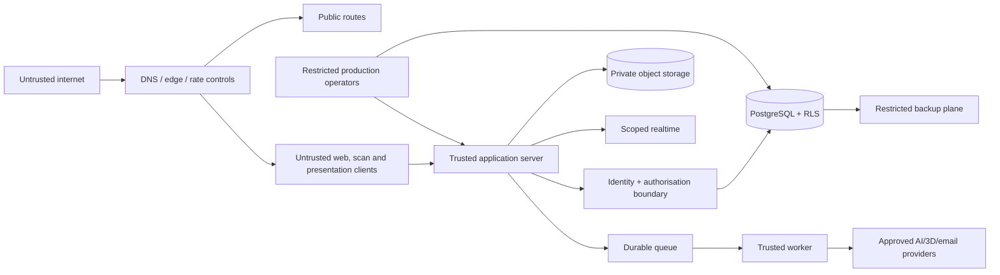

Boundaries exist between clinic tenants; internal and patient-safe data; browser and server; application and data/storage; application and worker/provider; platform staff and clinical content; environments; operators and production; and live systems and backups. Crossing requires explicit authenticated or purpose-limited authority and minimum data.

## 13. Attack Surface

The attack surface includes public/auth routes, recovery/invitation, cookies/tokens, protected server actions, file upload/download, signed access, realtime channels, QR codes, presentation displays, report links, support/admin tools, search/caches, job queues/workers, storage policies, database/RLS, third-party callbacks, observability, backups, CI/CD, dependencies, domains/DNS, and staff processes.

Each new surface requires threat review, owner, data classification, authentication/authorisation model, validation, rate limiting, logs/alerts, failure behaviour, and test evidence.

## 14. Multi-Tenant Security

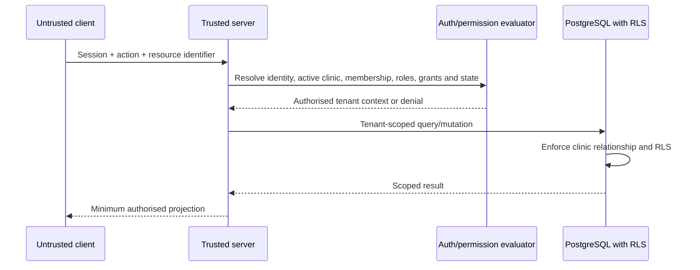

TENANT-SEC-001 applies to rows, relationships, object keys, realtime topics, caches, search, jobs, exports, audit, presentation, report shares, recovery, and deletion. Client-provided `clinic_id` is only a selector to verify, never authority.

## 15. Tenant-Isolation Controls

Required layers are trusted session context; active clinic membership; server permission and resource-state checks; RLS; tenant-scoped foreign keys/uniqueness; private object prefixes; authorised realtime channels; clinic-bound cache keys; tenant-first search; immutable job/export context; clinic-scoped audit; and explicit temporary grants.

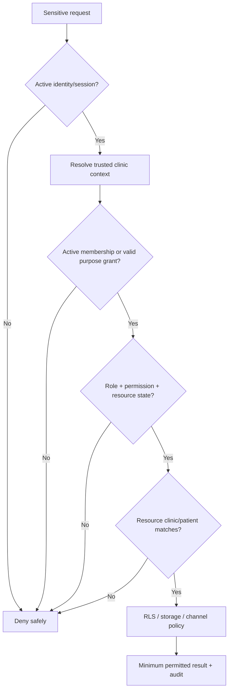

Cross-tenant failures are Critical until assessed. Tests must attempt foreign identifiers, guessed objects, stale caches, event subscriptions, worker payload changes, restore/export misuse, and multi-role combinations.

## 16. Authentication Security

AUTH-SEC-001 requires unique staff identities, provider-verified credentials, enumeration-resistant errors, throttling, recovery security, revocation, role-change propagation, and audit. Shared Doctor or staff accounts are prohibited. Authentication proves identity; it does not prove clinic membership, permission, patient scope, or Doctor approval authority.

## 17. Password Security

Passwords are handled and hashed by the approved authentication provider; GraftVision stores no plaintext or reversible password. Required policy favours sufficient length and compromised-password screening over arbitrary complexity. Login and recovery responses are generic. Password changes/recovery may revoke other sessions according to approved policy.

Provider hashing, breach checks, reset-token strength, and operational controls require verification before production. Passwords never enter application logs, analytics, support tickets, reports, exports, or client persistence.

The proposed pilot baseline is a minimum of 15 characters when a password is the only authentication factor and a minimum of 8 characters when MFA is enforced, while permitting at least 64 characters, spaces, and printable Unicode. The provider should reject common, expected, product-specific, and known-compromised passwords; avoid mandatory character-class composition rules; and avoid periodic password rotation unless compromise, recovery, or another risk event justifies it. These values are proposed implementation gates, not approved permanent policy. Security must verify the selected provider against the current [NIST SP 800-63B](https://pages.nist.gov/800-63-4/sp800-63b.html) baseline before launch, and Product and Security must approve any stricter clinic-facing rule.

Password entry permits paste and password managers. Interfaces should expose the reason for a new-password rejection without disclosing whether an existing account is registered. Password fields are never pre-populated, copied into telemetry, or retained after a failed request. Authentication throttling must account for source, account, tenant, device signals, and distributed attempts without creating an easy permanent account-lockout denial of service.

If provider-managed credentials are exported, synchronised, or migrated, the migration requires a separate security review; password hashes are not treated as ordinary application data. Provider administrators use least privilege, MFA, and audited access. Any evidence that password verification, reset delivery, provider keys, or password hashes were exposed triggers credential-risk assessment, session revocation decisions, user communication assessment, and incident handling.

## 18. MFA Strategy

Proposed MVP policy:

- Mandatory: Platform Owner, Platform Administrator, and production infrastructure/database administrators.
- Strongly recommended or clinic-configurable: Clinic Owner, Clinic Administrator, Doctor.
- Optional for lower-risk pilot roles until approved.

Post-MVP may require MFA for all privileged clinic roles, risk-based challenges, recovery-code management, device trust, and step-up. Proposed step-up actions include clinic export, permanent deletion approval, ownership transfer, support grant, MFA/security change, high-scope export, and production administration.

Final scope, acceptable factors, recovery, grace period, enforcement, and exception handling remain unresolved. SMS should not be presumed sufficient without risk review.

## 19. Invitation Security

Invitations are created only by an authorised platform or clinic actor, bind intended identity, clinic, proposed role, inviter, and expiry, and use a high-entropy single-use token stored as a verifier/hash where practical. Acceptance revalidates clinic status, inviter authority, role policy, and Doctor verification.

Expired/revoked/accepted tokens fail generically. Resend creates a new token and invalidates the old. Invitations contain no patient data. Privileged/Doctor invitations require elevated verification defined before production.

## 20. Account Recovery Security

Recovery is provider-backed, time-limited, single-use, throttled, and enumeration resistant. Recovery cannot change clinic membership or role. High-risk accounts may require stronger verification or administrator/security assistance under a documented process.

Successful recovery records an authentication event, may notify the user, rotates/revokes affected sessions, and prompts MFA recovery where applicable. Support staff never request passwords, MFA secrets, or recovery codes.

## 21. Session Security

SESSION-SEC-001 requires secure, HttpOnly cookies where suitable; `Secure` transport; deliberate `SameSite`; CSRF protection; rotation after authentication/privilege change; inactivity and absolute expiry; device-session visibility; revoke-one/revoke-all; suspicious-session handling; and immediate deactivation/role-change effect.

Exact durations are proposed policy, not final. Pilot defaults should be shorter for platform administration and shared devices, moderate for clinic workstations, and very short for scan, presentation, support, share, and export grants. Tokens are not placed in URLs when avoidable, are hashed at rest where they act as bearer verifiers, and never logged.

The following are proposed pilot defaults for validation, not permanent policy:

| Context | Proposed idle or redemption limit | Proposed absolute limit | Required behaviour |
|---|---:|---:|---|
| Platform Owner or Platform Administrator interactive session | 15 minutes idle | 8 hours | MFA, reauthentication for sensitive administration, no indefinite trusted device |
| Clinic Owner, Clinic Administrator, or Doctor interactive session | 30 minutes idle | 12 hours | Reauthentication or step-up for security settings, export, deletion, support grants, and ownership changes |
| Other clinic staff interactive session | 30 minutes idle | 12 hours | Shared-device controls and immediate permission-change propagation |
| Scan pairing code | 5 minutes to redeem | One redemption | Bind both devices, clinic, patient, consultation, operator, and nonce |
| Active scan session | 15 minutes idle | 60 minutes | Explicit end, patient-context confirmation, and revocation from the laptop |
| Presentation session | No activity-based extension | 15 minutes | Doctor may deliberately issue a new session; closing or expiry clears patient content |
| Support grant | 30 minutes idle | 2 hours | Named approver, reason, scope, visible indicator, audit, and explicit reapproval after expiry |
| Password reset or invitation link | 15 minutes after issue where provider capability permits | One redemption | New issue revokes prior outstanding token |
| Report share link | Not activity extended | 7 days by default; 30 days maximum | Issuer-selected shorter expiry, version scope, revocation, and access audit |
| Export download grant | Not activity extended | 24 hours maximum | One export, current authorisation check, and revocation on clinic/security state change |

Product and Security must approve final values after the Lahore pilot validates clinic shift length, shared-device practice, connectivity, and interruption risk. Privacy or Clinical approval is additionally required for presentation, report-sharing, and patient-facing access durations. The final implementation must enforce idle and absolute expiry on the trusted server, not only through client timers, and must define whether background requests, realtime traffic, media rendering, or unsaved form activity count as genuine user activity. Passive polling must not keep a session alive.

Privilege elevation, password recovery, MFA reset, membership suspension, Doctor approval removal, clinic suspension, support-grant expiry, suspected theft, and user-initiated sign-out require session rotation or revocation appropriate to the event. A session carrying several clinic memberships must re-resolve its active clinic and permissions on sensitive actions; switching clinic rotates or rebinds the security context and clears tenant-specific caches. The client must handle expiry safely by hiding protected content, preserving only approved non-sensitive recovery state, and requiring fresh authentication without leaking the previous patient context.

## 22. Device and Browser Session Security

Approved browsers/devices must support TLS, secure cookies, modern security headers, camera permissions, and safe storage. Shared devices require inactivity lock, visible current clinic/patient, sign-out, and no durable clinical cache. Stolen devices are handled by remote session revocation and credential review.

Device metadata may aid visibility and anomaly detection but is not an identity factor by itself. Unsupported or rooted/jailbroken device policy remains an open risk decision; the MVP must at least warn/block missing critical capabilities.

## 23. User Deactivation and Revocation

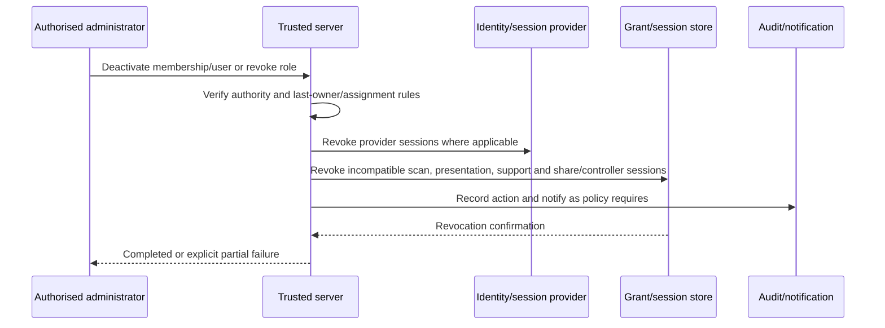

Subsequent protected actions fail immediately. Pending tasks are reassigned; authorship and prior approvals remain attributed. Offboarding reviews devices, recent activity, exports, shares, grants, follow-ups, and ownership transfer.

## 24. Authorisation Security

Authorisation evaluates identity, selected clinic, active membership, all current roles, explicit permission, clinic policy reductions, patient/resource scope, record state/version, Doctor-only approval rule, temporary grant, clinic/subscription state, and requested disclosure context.

No role name, URL, client claim, UI state, or database identifier is sufficient. High-risk actions are rechecked against durable state at execution time. RLS contains data access but does not replace business authorisation.

## 25. Role and Permission Enforcement

RBAC-SEC-001 implements all thirteen roles. Multi-role union is limited by immutable denials and separation of duties. Platform/clinic seniority never implies Doctor authority; Presentation and Patient never receive internal dashboard authority; Support has metadata only by default.

Permissions are centrally defined, versioned, reviewed, and tested. Clinic policy may reduce access but cannot grant platform powers, cross-tenant access, private-note exposure, or non-Doctor final approval.

## 26. Doctor-Approval Integrity

APPROVAL-SEC-001 requires an active verified Doctor membership, same clinic/patient, exact current resource version, satisfied prerequisites, and a transaction that creates immutable approval and current status together. Concurrent or material edits invalidate eligibility and require reapproval.

Approval records preserve approver, effective role, clinic, patient, resource/version, decision, time, reason, and supersession/revocation. AI, Clinic Owner, Platform Owner, Assistant, Technician, Coordinator, or hidden UI state cannot produce a valid Doctor approval.

## 27. Temporary Access Security

Temporary access includes scan, presentation, report share, export download, support, and case-review grants. Each has an unguessable identity/token hash, single purpose, fixed clinic, optional patient/resource, allowed actions, issuer/approver, start, hard expiry, revocation, and audit.

Temporary authority never inherits a general dashboard or changes patient binding. Renewal creates a new approval/grant where policy requires. Expired and revoked grants fail closed and are excluded from caches.

## 28. Support Access Security

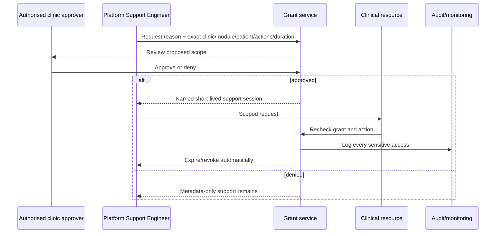

SUPPORT-SEC-001 requires request, approval, activation banner, visible clinic leadership status, action logging, automatic expiry, immediate revoke, and post-access review for sensitive cases. Support cannot self-approve/extend, cross tenants, approve clinical work, change roles, or silently export/share/delete. MVP has no break-glass access.

## 29. Presentation Session Security

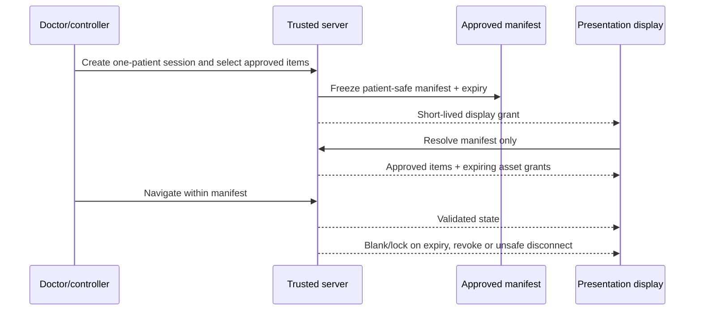

PRESENT-SEC-001 prohibits search, lists, contacts unless explicitly approved, private notes, internal reports, downloads, exports, editing, dashboard navigation, or arbitrary source access. Use no-store/private caching controls, minimal in-memory data, clear on end, and immediate Doctor revocation. Recording/screenshot risk is reduced by minimal identity and room practice but cannot be eliminated technically.

## 30. Scan Session Security

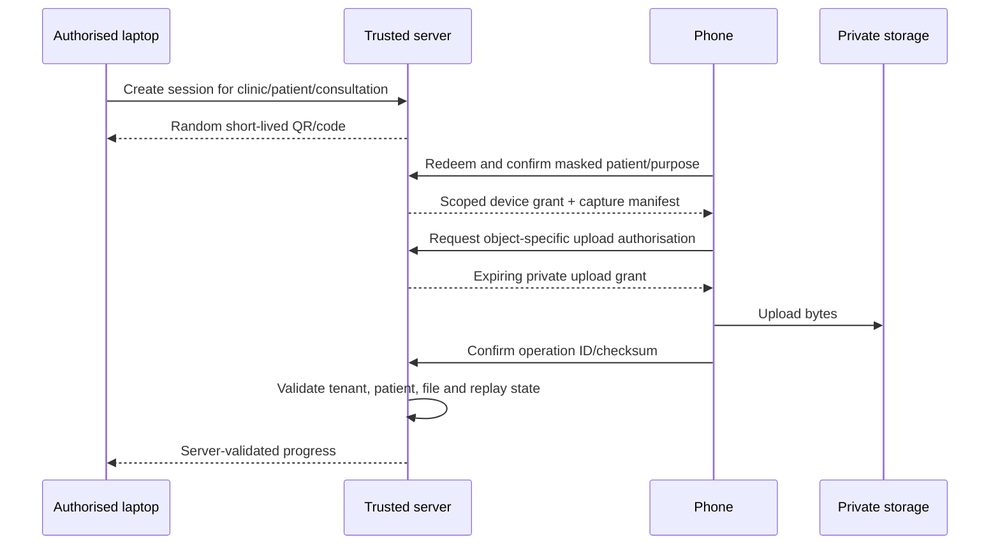

SCAN-SEC-001 binds one clinic, patient, consultation/follow-up context, initiating user, allowed views, device count, and expiry. It exposes no patient list, clinic search, private notes, reports, or unrestricted media. Every event is validated server-side and deduplicated.

## 31. Phone-to-Laptop Pairing Security

Pairing codes have high entropy or securely generated short-code protections, short expiry, rate limits, single-use redemption where practical, and token hashing. The phone shows minimum masked patient/purpose confirmation before camera/upload. The laptop cannot change the patient after pairing.

Reconnect reconciles authoritative server state and event IDs; replayed or out-of-order events cannot attach duplicate files or complete a session. Device loss triggers revoke and a new explicitly authorised session. QR contents contain no patient details or durable storage credentials.

## 32. Report Security

REPORT-SEC-001 distinguishes internal report, patient-safe report, approved report version, immutable PDF artefact, download permission, share permission, external share grant, and verification reference. Internal reports may contain sensitive/internal content and are never eligible for patient links.

Patient-safe generation freezes an approved content snapshot, exact source versions, branding, Doctor identity, disclaimer, watermark, template/renderer version, artefact checksum, and supersession. PDFs must not contain hidden internal fields, comments, source paths, tokens, or unnecessary metadata. Corrections create a new approved version and preserve the old history.

## 33. Report Sharing Security

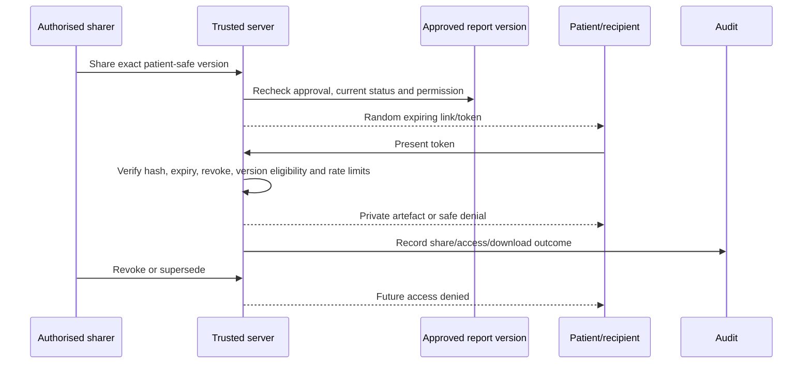

Tokens are random, stored hashed where practical, scoped to one artefact/version, expiring, revocable, and excluded from logs/referrers. Forwarding risk remains; minimise identity, use approved expiry, and permit revoke/reissue. Verification pages reveal only minimum validity/status and never patient data or file access without a separate active grant.

## 34. Signed URL Security

Signed URLs are delivery credentials, not permanent authorisation. Issue them only after current permission/grant validation, for one private object/action, with the shortest practical lifetime. Never store them in clinical rows, notifications beyond immediate delivery need, logs, analytics, audit payloads, browser history where avoidable, or client persistent caches.

If immediate revocation is required, use a revocation-aware token exchange/proxy or very short provider URL. Content disposition, cache control, referrer policy, and MIME headers must match the context. Copying one URL cannot list or derive adjacent objects.

## 35. Private Media Storage Security

MEDIA-SEC-001 requires private buckets/containers, opaque server-generated keys without patient names, tenant-scoped metadata and policies, environment separation, no anonymous listing, current permission checks, and auditable administration.

Originals and derivatives remain linked but independently authorised. Storage lifecycle and deletion respect holds, report snapshots, exports, and backups. Public-bucket/configuration scans run before release and periodically. Provider service credentials never enter browsers.

## 36. File Upload Security

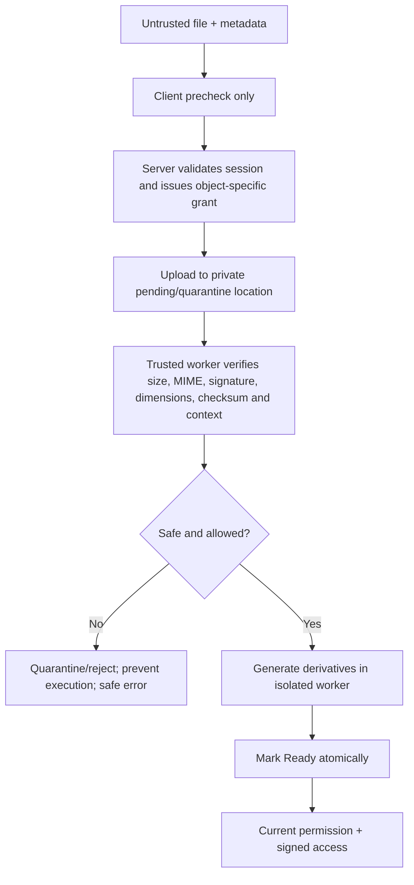

FILE-SEC-001 uses allowlisted types, extension and detected MIME comparison, content signatures where practical, size/dimension/duration limits, checksums, filename sanitisation, server-generated keys, duplicate handling, malware strategy, quarantine, isolated parsers, safe derivatives, rejection/recovery states, and private storage. Direct public upload is prohibited.

## 37. Image and Video Security

Images are decoded with maintained libraries under resource limits to resist decompression bombs, malformed metadata, and parser exploits. Remove or normalise unnecessary embedded metadata in derivatives while preserving clinically required provenance separately. Never trust client dimensions, orientation, format, or capture time.

Video is optional and bounded by approved format, duration, dimensions, bitrate/size, and storage policy. Media is served with correct non-executable types and disposition. Browser rendering must not allow uploaded SVG/HTML/script-active content as clinical imagery unless a separately hardened transformation converts it to a safe format.

## 38. 3D Asset Security

MVP accepts only approved GLB/GLTF profiles and limits bytes, object/mesh/material/texture counts, external references, decompressed memory, and rendering complexity. Reject network-loaded external resources, scripts, unsafe URIs, traversal paths, and incompatible extensions.

Validation and simplification run in constrained workers. Model assets remain private and tenant/patient/version bound. Viewer code treats model metadata as untrusted and has resource/time limits and 2D fallback. A compatible model does not imply trustworthy scale or clinical approval.

## 39. AI Service Security

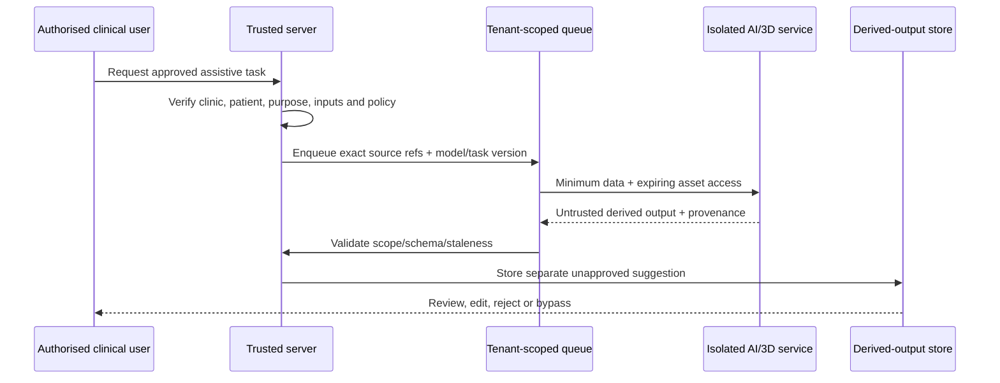

AI-SEC-001 prohibits unrestricted database access, cross-tenant batch mixing, direct final state, direct patient publication, and data reuse/training without explicit agreement and policy. External providers require privacy, residency, security, retention, deletion, and contract approval. Job logs exclude raw clinical content. Failed or late jobs preserve manual continuation and cannot overwrite newer sources.

## 40. Background Job Security

JOB-SEC-001 fixes tenant, patient/source/version, job type, requester, idempotency key, allowed output, and attempt status. Workers revalidate context and source eligibility, use least-privileged credentials, and never accept a client-modified tenant from the queue.

Queues and job dashboards are restricted. Payloads contain identifiers and minimum parameters, not tokens, signed URLs, reports, or full histories. Retries are bounded/idempotent; dead-letter items retain safe diagnostics. Cancellation and deletion/retention state are checked before irreversible output.

## 41. API Security Principles

API-SEC-001 applies to server actions, route handlers, realtime commands, signed-access exchanges, worker callbacks, and administrative operations. Every protected action authenticates or validates a purpose token, resolves tenant, authorises action/resource/state, validates input, applies idempotency/rate limits where needed, executes atomically, returns a minimum projection, and records required audit.

Use versioned contracts, safe error codes, request/correlation IDs, bounded pagination, and explicit fields. Never expose persistence rows, service credentials, internal stack traces, provider errors, or existence of another tenant’s resource.

## 42. Server-Side Validation

VALIDATE-SEC-001 treats browser checks as usability only. The trusted server validates identity, membership/grant, tenant/patient relationship, role/permission, record status/version, type/range/format, business invariants, and approval eligibility.

The server revalidates after queue delay and before signed access, report share, support action, export, deletion, or approval. Derived client claims—price/entitlement, role, approval, checksum, file type, or completed status—are never authoritative.

## 43. Input Validation

Inputs use allowlisted schemas, explicit maximum lengths/counts/depths, controlled enumerations, canonicalisation, numeric/date bounds, and rejection of unknown security-sensitive fields. Unicode/phone/email normalisation is defined per use without changing displayed evidence silently.

Complex geometry, report manifests, filters, file metadata, job payloads, and provider callbacks receive versioned schemas. Validation failure performs no partial sensitive action and returns a non-revealing, actionable message.

## 44. Output Encoding

Encode output for its destination: HTML text/attribute, URL component, JavaScript-free data, CSS-safe token, PDF/report template, CSV/spreadsheet, logs, and notifications. Prefer framework auto-escaping and safe component APIs.

Patient/clinic names, notes, filenames, model metadata, provider errors, and report fields are untrusted display data. Never concatenate them into HTML, script, query, command, or path contexts.

## 45. CSRF Protection

State-changing cookie-authenticated requests require `SameSite` policy plus an approved CSRF token/origin strategy. Validate `Origin`/`Referer` where reliable, reject unsafe cross-site requests, and avoid state changes through GET/navigation.

Sensitive actions may require reauthentication/step-up and explicit confirmation but still need CSRF controls. Purpose-limited bearer tokens must be scoped and protected from cross-origin leakage.

## 46. XSS Protection

Use output encoding, sanitisation only when rich content is genuinely required, a restrictive Content Security Policy, no unsafe dynamic script execution, and no rendering of uploaded active content. Avoid inline secrets/tokens and dangerous HTML APIs.

Test patient/staff names, notes, clinic branding, filenames, 3D metadata, report templates, errors, and notifications. Stored XSS is especially critical because it could execute in Doctor, Clinic Owner, or platform contexts.

## 47. Injection Protection

Use parameterised database operations, allowlisted sort/filter fields, bounded search expressions, safe query builders, and no string-built SQL. The same principle applies to NoSQL/filter expressions, shell commands, templates, image tools, PDF renderers, and job arguments.

Privileged database functions accept validated tenant context and expose the minimum operation. Injection tests cover authenticated low-privilege actors and uploaded metadata, not only public inputs.

## 48. SSRF Protection

Servers/workers do not fetch arbitrary user URLs. External fetches use approved schemes, domains, ports, DNS/IP validation, redirect limits, size/time limits, egress controls, and blocking of loopback, link-local, metadata, private, and internal service ranges.

3D external resources and report/media imports are disabled or proxied through validated ingestion. Revalidate redirects and resolved addresses to reduce DNS rebinding.

## 49. Path Traversal Protection

Object keys and local temporary paths are server generated from opaque identifiers. User filenames are metadata only and cannot determine filesystem or bucket paths. Reject traversal segments, encoded separators, absolute paths, null bytes, and unsafe archive entries.

Archive extraction, if ever supported, uses a sandbox, entry/size/count limits, and verifies every resolved output remains inside an isolated destination. Symlinks and executable files are rejected unless explicitly required and hardened.

## 50. File-Type Validation

Validation combines allowlisted purpose, extension, declared MIME, detected MIME/content signature, successful safe decoding, and domain limits. A valid extension alone is insufficient. Ambiguous or mismatched files are quarantined/rejected.

Approved types/limits are configuration with security ownership and versioning. GLB/GLTF, raster images, optional video, PDF outputs, and export archives each have separate profiles.

## 51. Malware and Malicious File Handling

Use provider or dedicated malware scanning where suitable, plus format parsing and isolation because signature scanning alone is insufficient. Pending/quarantine assets are unavailable to clinical workflows and patient-safe output.

Workers run with minimal network/filesystem access, memory/CPU/time limits, patched parsers, and disposable workspaces. A detected threat creates a safe user result, security event, retained minimum evidence, cleanup, and incident review according to severity.

## 52. Rate Limiting

RATE-SEC-001 applies layered limits by IP/network, identity, device/session, clinic, token, action, and provider cost. Protect login, recovery, invitation, pairing redemption, signed-link access, file reservation, search, report generation/share, support requests, exports, AI/3D jobs, and verification pages.

Limits use progressive delay/challenge/block and safe retry headers where appropriate. Tenant fairness prevents a clinic from exhausting shared workers/storage. Clinical save retries must not be silently dropped; idempotency and explicit state preserve legitimate work.

## 53. Abuse Prevention

Detect account enumeration, scraping, credential stuffing, repeated foreign identifiers, bulk downloads, suspicious exports, excessive file/job use, share-token probing, invitation spam, and support-grant misuse. Controls combine rate limits, anomaly rules, quotas, step-up, review queues, and revocation.

Abuse detection avoids clinical profiling and uses minimum operational signals. False positives provide an authorised recovery/escalation path.

## 54. Bot and Automated Attack Controls

Public/authentication surfaces may use managed bot detection, challenge, reputation, or WAF controls after privacy/accessibility review. Do not require invasive tracking or inaccessible challenges where lower-impact controls work.

Authenticated automation is permitted only through approved service identities/contracts. Browser automation cannot bypass role, tenant, or rate policy. Automated security scanners use controlled staging or authorised production windows.

## 55. Secrets Management

SECRET-SEC-001 stores secrets in an approved environment-specific secret manager. Scope by service/environment, minimise privileges, rotate on schedule/event, record access where supported, and maintain emergency rotation runbooks.

Never commit `.env` secrets, expose them in client bundles/build logs, copy them into tickets/chat, or share production credentials with local/staging. Secret scanning covers repository/history, artefacts, logs, and CI. Detected exposure triggers immediate revoke/rotation before cleanup.

## 56. Environment Separation

Local, staging, and production have separate identity tenants, databases, storage, queues, providers, DNS, secrets, monitoring, and access. Production patient data is prohibited in local and general staging.

Synthetic data is default. Any exceptional controlled test with real data requires purpose, approval, minimum subset, isolated environment, access list, expiry, audit, and deletion evidence. Production secrets cannot be used to “simplify” staging.

## 57. Production Access Control

Production access is named, least-privileged, MFA-protected, time-bounded where possible, reviewed periodically, and logged. Use separate admin identities, no shared credentials, no routine direct database browsing, and no support access through infrastructure privilege.

Access requests state purpose, system, permission, duration, approver, and ticket/reference. Departures and role changes revoke promptly. Emergency access is separately designed; MVP clinical break-glass is not available.

## 58. Administrative Access Security

Platform administration exposes clinic/service/commercial metadata by default, not patient clinical content. High-risk actions—clinic suspension/closure, ownership transfer, role changes, export/deletion support, secret rotation—require step-up or dual approval according to final policy.

Administrative interfaces use stronger session policy, anti-CSRF, rate limits, explicit confirmations, audit, and anomaly alerts. Bulk cross-tenant clinical operations are prohibited in MVP.

## 59. Database Security

DB-SEC-001 requires restricted network/provider access, service-specific credentials, separate migration/worker/application roles, least privilege, RLS, tenant-safe constraints, parameterised queries, protected backups, query/audit monitoring, and reviewed migrations.

No browser receives service-role or direct database credentials. Production consoles are restricted and audited. Manual changes are exceptional, ticketed, scoped, peer-reviewed where possible, backed up, verified, and recorded.

## 60. Row-Level Security

RLS-SEC-001 uses deny-by-default policies for platform references, platform administration, clinic-owned records, patient clinical records, Doctor-private data, temporary scan/presentation/share/support grants, audit, jobs, and storage metadata.

Policies derive trusted identity/membership/grant context, validate active status and matching `clinic_id`, and restrict read/write separately. Service-role operations remain narrow and repeat tenant checks. Tests cover every role, two clinics, multi-role users, archived/deleted state, direct identifiers, joins/views/functions, jobs, exports, and policy migrations.

## 61. Storage Policy Security

Storage policies enforce private access, tenant/object ownership, allowed operation, current record permission or temporary grant, verified Ready state, and expiry/revocation. Upload permission does not imply read/list/delete; report/presentation grants do not expose raw sources.

Object metadata and database authority must agree. Orphan, public-policy, foreign-prefix, and unverified-object scans run routinely. Deletion is coordinated with retention, holds, snapshots, exports, and backup policy.

## 62. Encryption in Transit

ENCRYPT-SEC-001 requires current TLS for browsers, APIs, database, storage, realtime, queues, workers, vendors, notifications, backups, and administration. Redirect/deny plaintext, use secure cookies, validate certificates, and review internal service transport.

HSTS and related headers are recommended after domain/subdomain readiness. Do not claim a protocol/cipher level until hosting/provider configuration is verified.

## 63. Encryption at Rest

Production databases, object storage, backups, queues where sensitive, and secret stores must use verified managed encryption at rest. Vendor evidence identifies scope, key responsibility, backup coverage, and exceptions.

Device/browser temporary storage is minimised and protected by platform capabilities; it is not equivalent to managed encryption. Long-term clinical storage on shared devices is prohibited.

## 64. Field-Level Protection

Application-level encryption may protect selected identity/contact/private fields when the threat model, law, contract, or operator model justifies it. Adoption must address search, blind indexes, access control, key rotation, backup/restore, export, deletion, and lost-key recovery.

Do not add field encryption performatively if it creates unsafe custom cryptography or blocks required recovery. Passwords, MFA secrets, and provider credentials remain in specialised identity/secret systems.

## 65. Key Management

Keys are separated from application data, scoped by purpose/environment, protected by an approved provider, accessible only to named services/admins, rotated with version support, and backed by revoke/compromise runbooks. Key access and administrative changes are logged where supported.

Signing, encryption, token, report-verification, and provider keys are distinct where risk requires. Rotation must not silently invalidate historical report verification or make backups unrestorable; test dual-key transition and recovery.

## 66. Audit Logging Security

AUDIT-SEC-001 records actor/system, effective role, clinic, patient/resource where relevant, action, target version, timestamp, outcome, session/grant, approval, export/share/deletion/role/auth/revocation context, and required reason. Use server-trusted time and correlation IDs.

Application actors append but cannot update/delete audit events. Corrections are new events. Restrict audit readers, log audit access, protect retention, and optionally stream high-risk events to an independent security sink. Avoid raw notes, reports, files, passwords, tokens, keys, signed URLs, and full request bodies.

## 67. Security Event Logging

Security events include login/recovery/MFA outcomes; credential/session changes; repeated denials; role/membership changes; support grant lifecycle; presentation/scan/share misuse; public-storage findings; cross-tenant attempts; unusual downloads/exports; deletion; secret/admin activity; malware; RLS/policy failures; backup/restore; and alert response.

Events have severity/category and safe context, not clinical payload. Provider logs are assessed for retention, access, residency, and correlation coverage.

## 68. Monitoring and Alerting

MONITOR-SEC-001 monitors:

- authentication spikes, stuffing, recovery abuse, and privileged MFA gaps;
- foreign-tenant identifiers, RLS denials, and policy/config drift;
- active/expired support grants and unusual sensitive access;
- share/presentation/scan token probing or access after expiry;
- bucket publicity, signed-access anomalies, malware, and upload rejection spikes;
- job tenant mismatch, dead-letter growth, export/deletion activity;
- secrets, dependency vulnerabilities, CI/CD and production admin changes; and
- backup failures, restore failures, service outage, and data-integrity alarms.

Alerts have owner, severity, deduplication, escalation, response playbook, and test schedule. Clinical content is not inserted into alert messages.

## 69. Log Privacy

Logs are classified and minimised. Redact credentials, cookies, authorisation headers, token query values, signed URLs, contact fields, names where unnecessary, file paths containing identity, notes, prompts, reports, and provider payloads.

Use opaque resource/correlation IDs. Restrict log access and export, define retention, and prevent lower environments from receiving production logs. Debug logging in production requires controlled time, scope, approval, and cleanup.

## 70. Backup Security

BACKUP-SEC-001 requires encrypted automated database backups, protected object durability/versioning as approved, configuration/infrastructure recovery material, restricted backup identities, separate access policy, integrity monitoring, and retention aligned with deletion/legal requirements.

Backups are not developer datasets. Access and restores are approved/audited. Provider backup region, encryption, immutability, deletion handling, and recovery capability require evidence before launch.

## 71. Restore Security

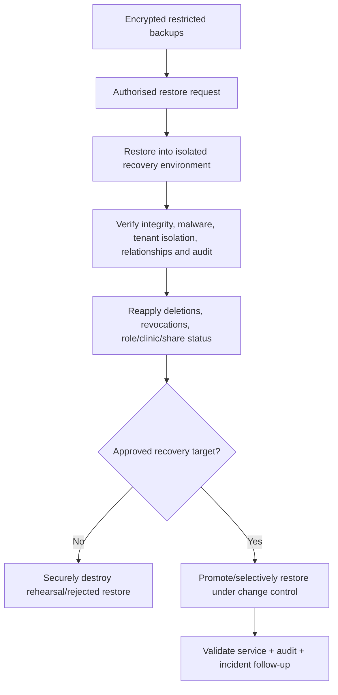

Restore uses least privilege and never exposes patient data for convenience. Tenant-selective restore is reconciled into live state rather than blind overwrite. Restored data cannot reactivate deleted records, revoked users, expired grants, old shares, or superseded approvals.

## 72. Business Continuity

Continuity identifies critical dependencies: identity, application, database, private storage, DNS/edge, queue/workers, communication, and accountable clinic/platform staff. Manual clinical documentation and later authorised reconciliation remain available when nonessential AI, 3D, realtime, notifications, or report generation fails.

Plans define degraded capabilities, data-integrity safeguards, communication, decision authority, and return-to-service checks. Continuity never permits unscoped spreadsheets/messages or bypassed Doctor approval as a silent substitute.

## 73. Disaster Recovery

Disaster recovery defines approved RPO/RTO, backup tiers, provider outage strategy, rebuild order, credentials/keys, DNS, application/database/storage/job restoration, validation, communication, and post-recovery monitoring. Exact objectives are unresolved pending pilot volumes and cost.

Exercise database restore, object reconciliation, lost-region/provider scenario where applicable, secret rotation, and destructive-incident recovery. Record evidence, failures, and corrective work.

## 74. Data Retention Security

Retention policy is effective-dated by resource class, jurisdiction/contract, hold, and deletion state. Exact Pakistan clinical/legal periods require counsel. Security requires that temporary tokens, abandoned uploads, local drafts, exports, debug logs, and derived artefacts do not persist indefinitely.

Retention jobs are tenant scoped, idempotent, monitored, and auditable. Holds override deletion eligibility. Backups expire under their own approved schedule and retain tombstones/revocation reconciliation.

## 75. Data Export Security

EXPORT-SEC-001 requires verified requester, tenant/patient scope, purpose, format, holds, elevated approval, step-up for high scope, immutable manifest, private encrypted artefact, checksum, expiry, audited retrieval, and cleanup.

Exports include authorised clinic data, not other tenants, source code, platform secrets, unrestricted operational tooling, or proprietary algorithms. Partial failures are explicit. Platform support assists only under an approved request/scope.

## 76. Data Deletion Security

DELETE-SEC-001 uses archive first; deletion request; impact/relationship preview; hold/retention check; export offer; separation-of-duties approval; recoverable pending period; frozen manifest; idempotent deletion job; object/index/cache/derivative cleanup; audit; and backup tombstone reconciliation.

No ordinary role performs immediate recursive deletion. Malicious/accidental bulk deletion detection can pause execution. Failed/partial jobs remain reviewable and do not report completion.

## 77. Clinic Closure Security

Closure verifies authorised clinic/platform decisions, exports/holds/retention, subscription/security status, transfer of accountable ownership, staff deactivation, session/grant/share revocation, job cancellation, DNS/integration secrets, data path, and final audit.

Closed clinics cannot retain active users, scan/presentation/support sessions, report links contrary to policy, or provider credentials. Closure does not silently delete records.

## 78. Inactive Subscription Security

Commercial state is not a security override. Suspended/Inactive preserves data and blocks normal activity according to approved policy while permitting only controlled support, reactivation, export, closure, and legally required access.

Entitlements cannot disable isolation, audit, encryption, backup, Doctor approval, manual fallback, or safe data portability. Exact inactive access is unresolved and must use minimum privilege.

## 79. Privacy by Design

PRIVACY-SEC-001 requires purpose limitation, minimum collection, role/purpose projections, private defaults, patient-safe allowlists, controlled support/vendors, retention/deletion, exportability, and data-flow review from discovery through disposal.

Privacy review is required for new patient fields, analytics, AI/3D providers, sharing channels, local storage, biometrics/facial processing, cross-border hosting, and multi-clinic features. Security controls do not establish lawful basis.

## 80. Data Minimisation

Collect only approved launch fields. Separate contact/identity from clinical detail. Scan sees masked identity and capture manifest; presentation sees approved items; report share sees one artefact; support sees metadata before clinical scope; jobs/providers receive exact assets and minimum parameters.

Do not copy clinical content into logs, audit, notifications, usage, error tracking, tickets, analytics, model prompts, or export metadata. Periodically review unused fields and provider payloads.

## 81. Consent and Acknowledgement Security

Consent/acknowledgement evidence records purpose, wording/version, patient or authorised actor, method, time, witness/evidence where approved, and withdrawal/supersession. It is protected as clinical/personal data and cannot be silently edited.

Consent does not replace authorisation, and access does not prove consent. Doctor approval, patient acknowledgement, privacy acknowledgement, support approval, export approval, and deletion approval remain distinct. Legal/clinical review determines which are required.

## 82. Patient-Safe Disclosure

Patient-safe content is an explicit approved subset with source/version, disclosure label, identity minimum, disclaimer, and purpose. Presentation and reports resolve manifests/snapshots, not live internal records.

Private Doctor notes, staff comments, internal warnings, contact details unless approved, rejected/unapproved suggestions, raw technical metadata, other patients, administration, and internal reports are excluded by construction. Automated privacy tests use canary fields to detect contamination.

## 83. Cross-Patient Disclosure Prevention

Every sensitive workflow prominently and server-side binds patient, clinic, and context. Creation, upload, retry, report, presentation, comparison, job, and export operations revalidate this binding. Patient switching ends/recreates temporary sessions.

Caches include patient/clinic/disclosure context and clear on switch/revoke. Wrong-patient mismatch fails closed, quarantines uncertain uploads/output, records an event, and requires authorised reconciliation rather than automatic reattachment.

## 84. Cross-Clinic Disclosure Prevention

TENANT-SEC-001 and RLS-SEC-001 apply even where users belong to multiple clinics. Switching clinic clears caches/channels/drafts, establishes a new trusted context, and reevaluates roles.

Search, storage, realtime, jobs, exports, support, reports, presentation, analytics, restore, and deletion never run globally then filter in the client. Confirmed cross-clinic disclosure is a Critical incident.

## 85. Concurrent-Editing Security

Sensitive writes include expected revision. Stale writes fail and present safe reconciliation; no silent last-write-wins for identity, geometry, measurement, plan, counts, reports, grants, or approvals.

Conflicts preserve both contributions where possible without exposing unauthorised content. Permission and tenant context are rechecked during retry/merge. Approval uses transactional locks/constraints and cannot survive a material concurrent edit.

## 86. Version and Approval Integrity

Approved clinical versions and report snapshots are immutable. Corrections create new versions with author, reason, source lineage, supersession, and reapproval. Derived data records source/method/model/template version and staleness.

Integrity checks protect root/version uniqueness, current-approved pointer, Doctor role at approval time, report checksum, procedure reconciliation, and dependency invalidation. Audit/history cannot substitute for preventing impossible states.

## 87. Secure Development Lifecycle

SDLC-SEC-001 gates:

1. requirements: classification, misuse cases, acceptance;
2. architecture: boundaries, data flows, provider/exit review;
3. schema/API: tenant keys, RLS, contracts, errors;
4. implementation: safe libraries, review, tests;
5. CI: lint/type/test/SAST/dependency/secret scans;
6. staging: role, isolation, file, session, recovery, performance/security validation;
7. release: evidence, migration/rollback, approvals;
8. operations: monitoring, vulnerability, incident and retrospective review.

High-risk changes to auth, RLS, sharing, support, uploads, presentation, export, deletion, AI, or vendors require explicit security review.

## 88. Dependency Security

Maintain lockfiles, dependency inventory/SBOM where practical, automated vulnerability and licence signals, update ownership, trusted registries, integrity verification, and minimal dependencies. Review install/build scripts and transitive packages for server, image/PDF/3D parsers, authentication, and CI.

Critical exposed vulnerabilities trigger immediate assessment, mitigation/patch, and release decision. A scanner result is evidence, not proof of exploitability or safety.

## 89. Source-Control Security

Repository access is named and least-privileged, protected by MFA, reviewed, and removed on exit. Protect main/release branches, require review/status checks, prevent force/destructive changes by default, and sign/verify releases or commits where policy supports it.

Secrets and production data are prohibited. Security-sensitive CODEOWNERS/review ownership is recommended for auth, RLS, storage, reports, support, deployment, and migrations. Avoid exposing vulnerability details publicly before mitigation.

## 90. CI/CD Security

CI uses least-privileged short-lived credentials/OIDC where available, isolated runners, protected environments, pinned/reviewed actions, secret masking, restricted artefacts/caches, and no untrusted code with production secrets.

Build once/promote immutable artefacts where practical. Production deployment and migration require authorised environment approval. CI logs, test fixtures, browser recordings, screenshots, and reports contain no production patient data.

## 91. Deployment Security

Deploy reviewed source with passing security gates, environment validation, dependency lock, immutable build ID, migration/rollback plan, health/smoke checks, and release audit. Separate applications may have distinct headers/cache/service-worker policies.

Rollback must remain schema compatible and cannot restore vulnerable code without risk approval. Emergency deployment records approver, reason, evidence, and post-change review.

## 92. Infrastructure Hardening

Use managed security baselines, least public exposure, TLS, edge/DDoS controls, WAF/rate limits where justified, private data services, restricted admin interfaces, patched runtimes, minimal containers/functions, non-root execution where applicable, egress controls for processors, and secure headers.

Hardening settings are verified in deployment-specific documents; this specification does not assert provider defaults. Configuration drift and accidental public resources are monitored.

## 93. Vulnerability Management

VULN-SEC-001 covers inventory, intake, triage, severity/exposure assessment, ownership, remediation/mitigation, retest, disclosure coordination, and exception expiry. Sources include scanners, vendors, researchers, incidents, penetration tests, advisories, and staff.

Proposed priorities distinguish exploitable production/tenant/credential issues from unreachable or low-impact findings. No release proceeds with an unaccepted Critical/High release-blocker. Exceptions require reason, compensating controls, approver, deadline, and monitoring.

## 94. Patch Management

Track supported versions of runtime, framework, database extensions, auth/storage clients, browsers, operating systems under platform control, worker images, and file/PDF/3D parsers. Security patches follow risk-based expedited testing and rollout.

Clinic-owned devices require communicated support requirements and update responsibility. Emergency patches preserve rollback, data integrity, and tenant tests; delay requires documented mitigation and acceptance.

## 95. Security Testing

Required tests cover cross-tenant/patient, every role, privilege escalation, Doctor approval, support, internal report/share, expired/replayed scan/presentation/share tokens, signed URLs, file types/size/malware, session revoke/deactivation, RLS regression, caches/realtime/search/jobs/storage, exports/deletion, rate limits, recovery, audit completeness, secrets, headers, and backup restore.

Tests use synthetic multi-clinic fixtures and both direct/normal paths. Negative tests are release evidence. Production testing is authorised, scoped, rate-aware, and avoids patient data.

## 96. Penetration Testing

Independent or suitably separated penetration testing is recommended before paid production pilot if feasible and required before material scale/enterprise commitments. Scope includes authenticated multi-role access, RLS/IDOR, temporary tokens, file processing, storage, report/presentation, support/admin, API, and cloud configuration.

Rules of engagement protect availability/data. Findings are validated, prioritised, remediated/retested, and retained confidentially. A test does not certify future security.

## 97. Security Review Gates

| Gate | Required evidence |
|---|---|
| Product/requirements | Classification, privacy purpose, roles, misuse/acceptance |
| Architecture/schema | Trust boundaries, tenant keys, RLS, grants, versions, retention |
| API/implementation | Auth/authz, validation, errors, rate/idempotency, audit |
| Staging | End-to-end negative tests, file/session/share/support, restore |
| Production release | Secrets, headers, provider reviews, monitoring, incident contacts, rollback |
| Post-release | Alert review, vulnerability status, access review, incidents, metrics |

Security can block release for unresolved tenant isolation, patient disclosure, privileged access, secret, backup, or high-risk vulnerability failure. Product and clinical acceptance cannot waive technical cross-tenant isolation.

## 98. Incident Classification

Proposed severity:

| Severity | Examples | Response |
|---|---|---|
| Critical | Confirmed cross-clinic patient exposure; public clinical storage; production credential/signing-key compromise; unauthorised bulk export; unrecoverable destructive loss | Immediate incident command, containment, evidence, executive/security/privacy/legal assessment |
| High | Confirmed single-patient unauthorised disclosure; privileged account compromise; active approval/report tampering; serious malware or vulnerable production path | Urgent containment and scoped impact assessment |
| Medium | Limited attempted abuse, control degradation, non-sensitive exposure, recoverable misconfiguration with no confirmed sensitive access | Prompt remediation, monitoring, review |
| Low | Low-impact policy deviation, unsuccessful isolated probe, hygiene issue | Normal remediation and trend tracking |

Severity can rise as evidence changes. Legal/clinical impact, affected clinics/patients, data class, duration, exploitability, integrity, and recoverability inform classification.

## 99. Incident Detection

INCIDENT-SEC-001 detection sources include user/clinic reports, security alerts, provider notifications, audit/log anomalies, RLS/storage tests, secrets/dependency scanning, backup failures, suspicious exports/shares, malware, and staff observations.

All staff know the reporting channel and preserve evidence. Detection records time, reporter/source, systems, suspected data/tenants, initial containment already taken, and a safe incident reference—not raw patient content in general chat.

## 100. Incident Response

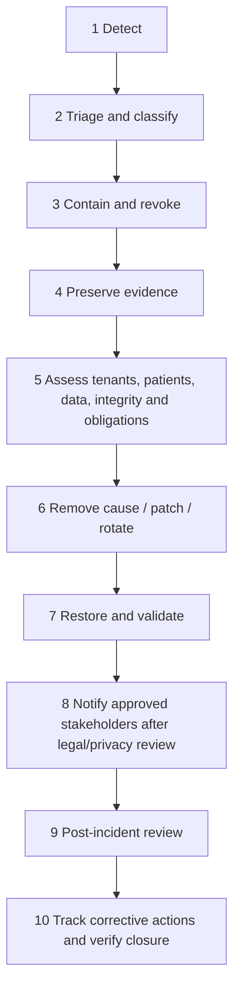

The incident commander coordinates security, engineering/operations, product owner, privacy/legal, clinical reviewer, and clinic liaison. Actions are time-stamped. Containment may revoke sessions/grants/links, rotate secrets, disable jobs/routes, make storage private, suspend a tenant safely, or isolate a deployment without destroying evidence.

## 101. Breach-Response Principles

Do not assume every security event is a legally reportable breach, and do not delay containment while debating terminology. Determine confirmed/suspected access, data classes, clinic/patient scope, duration, recipients, integrity, recoverability, provider involvement, and jurisdiction with qualified counsel.

Communications are accurate, minimum necessary, coordinated, and updated as facts change. Never promise secrecy, guaranteed recovery, or legal deadlines not confirmed for Pakistan/affected contracts.

## 102. Clinic Notification

Clinics are notified through verified contacts when required by law/contract or when timely action is needed. Notification content should state known facts, affected service/data/scope, containment, clinic actions, support contact, uncertainty, and next update without exposing another clinic.

Contact lists, authority, alternates, secure channels, and after-hours escalation are maintained during onboarding. Product owner, privacy/legal, security, and clinical input approve high-impact messages.

## 103. Patient Notification Considerations

Patient notification decisions belong to the responsible clinic and applicable law/contract, with GraftVision support as defined. Consider harm, data type, recipient, containment, integrity, patient action, and clinical context.

Do not contact patients independently without authority except where legally required and reviewed. Messages avoid unsupported legal/medical statements and expose only the recipient’s relevant facts.

## 104. Evidence Preservation

Preserve relevant audit/logs, access/session/grant histories, deployment/config versions, database/storage events, file checksums, provider notices, affected artefacts, timelines, and response actions under restricted chain-of-custody practices.

Evidence collection minimises unrelated patient data, is read-only/hashed where practical, and records collector, source, time, method, access, transfer, and retention. Do not destroy evidence through premature cleanup, rotation without capture, or destructive testing.

## 105. Post-Incident Review

Conduct a blameless but accountable review after material incidents and near misses. Cover detection, timeline, decisions, controls that failed/worked, clinical/privacy impact, communication, recovery, root/systemic causes, and measurable corrective actions.

Actions have owner, priority, due date, verification, and linkage to requirements/tests/runbooks. Update threat model, training, monitoring, architecture/security docs, and clinic guidance. Share a suitable summary without sensitive exploit or patient detail.

## 106. Staff Security Responsibilities

All staff use unique accounts, MFA where required, approved devices/channels, least data, screen locking, patient/clinic confirmation, safe report/presentation practices, and immediate incident reporting. They never share credentials, copy patient data to personal storage/messages, bypass warnings, or approve beyond role.

Doctors protect approval credentials and review exact versions. Clinic administrators manage invitations/roles/offboarding. Assistants/Technicians verify patient/session before capture/procedure entry. Reception/Coordinators respect restricted clinical visibility and share only approved reports. Presentation Users remain within one session.

## 107. Clinic Security Responsibilities

Clinics designate owners/Doctors, verify staff identities and roles, configure approved policies, train users, secure local networks/devices/displays, remove departed staff, approve support/export/deletion, manage patient consent/communication, report incidents, and comply with applicable obligations.

Contracts/onboarding must clarify shared responsibilities, device/browser support, notification contacts, retention choices, and prohibited data-handling practices. Clinic ownership does not permit cross-tenant access or non-Doctor clinical approval.

## 108. Platform Security Responsibilities

GraftVision operates secure software, tenant controls, managed providers, secrets, monitoring, backups, vulnerabilities, releases, incident coordination, platform roles, metadata-first support, exports/closure assistance, and transparent security communication.

Platform staff do not routinely browse clinical records. Haris Liaqat owns product risk decisions but security/privacy/legal/clinical approval remains required for their domains. GraftVision must not claim that clinic responsibility excuses platform control failure.

## 109. Third-Party Vendor Security

VENDOR-SEC-001 reviews vendors that host, transmit, process, monitor, email, back up, render, or administer sensitive/production data. Assess service scope, data classes, regions/subprocessors, access, encryption, authentication, logging, retention/deletion, incident notification, availability/recovery, vulnerability practices, contractual terms, portability, and exit.

Approve minimum data and credentials; disable provider training/reuse unless explicitly agreed; monitor material changes. Vendor compromise follows incident response. Free tiers are not assumed production appropriate.

## 110. Data Residency and Hosting Considerations

Document database, storage, backup, log, identity, email, AI/3D, CDN/edge, and support locations plus cross-border flows and subprocessors. Hosting location alone does not establish compliance; access, contracts, retention, security, and legal basis also matter.

Choose production regions/providers only after Pakistan privacy/legal review, latency/availability/cost assessment, and clinic contractual needs. Future enterprise physical isolation is a separate architecture decision.

## 111. Pakistan Legal and Privacy Review

Qualified Pakistani legal and clinical counsel must confirm obligations before production launch. Review:

- patient consent/acknowledgement and health-information processing;
- clinic/controller and platform processor/service-provider responsibilities;
- patient photography and potential facial/biometric implications;
- medical/electronic record validity and retention;
- data access, correction, export, deletion, and clinic closure;
- cross-border hosting, subprocessors, and contractual data-processing terms;
- report sharing and permitted communication channels;
- breach assessment/notification duties and contacts; and
- AI-assisted clinical software classification, claims, and oversight.

This document makes no conclusion on applicable statute, residency mandate, notification deadline, or certification.

## 112. Future Regulatory Readiness

Maintain data inventory/flows, processing purpose, vendor register, security risk register, access/audit evidence, retention/deletion records, incident history, validation evidence, change control, and clinic agreements. These support future assessment but do not equal compliance.

Expansion to other markets, patient portal, biometrics, AI diagnostics, multi-branch, or enterprise hosting requires new legal/privacy/security/clinical review and possibly stronger isolation, consent, access, and evidence.

## 113. Security Metrics

Proposed metrics:

| Metric | Interpretation / target |
|---|---|
| Confirmed tenant-isolation incidents | Target zero |
| Confirmed patient-disclosure incidents | Target zero |
| Failed cross-tenant/role/RLS release tests | Target zero unresolved |
| Privileged accounts without required MFA | Target zero after policy enforcement |
| Active/expired support grants | Expired grants usable target zero |
| Unpatched release-blocking vulnerabilities | Target zero without approved risk acceptance |
| Failed backup/restore checks | Target zero unresolved |
| Access revocation time | Measure deactivation-to-denial |
| Mean detection/containment time | Trend by severity |
| Suspicious login/recovery events | Monitor trend and response |
| Share revocations/expired-link attempts | Monitor misuse/education |
| Production/admin access events | Review completeness and anomalies |
| Secret age/rotation status | Within approved policy |
| Dependency risk status | No unaccepted Critical/High blocker |
| Sensitive actions audited | Target 100% for approved catalogue |

Metrics use minimum operational data and do not become staff/patient surveillance. Targets beyond zero incident/bypass expectations require approved baselines.

## 114. MVP Security Baseline

MVP requires separate environments; strong unique authentication; proposed privileged MFA; thirteen-role server authorisation; clinic membership validation; RLS; tenant-safe relationships/search/cache/realtime/jobs; private storage and expiring signed access; secure scan/presentation/report/support sessions; immutable Doctor approvals; validation/rate limits/security headers; secret management; audit/monitoring; backups and tested restore; revocation/deactivation; file controls; dependency/secret scanning; cross-tenant tests; vendor reviews; incident process; and staff onboarding/offboarding.

MVP must not rely on hidden buttons, public/permanent URLs, shared accounts, client `clinic_id`, manual tenant memory, AI authorisation, secrets in code, production data in lower environments, unrestricted support, or untested backups.

### MVP security checklist

- [ ] Every MVP requirement ID has evidence and owner.
- [ ] Tenant/RLS/role/approval negative tests pass.
- [ ] Scan, presentation, report, support, file, export, deletion and restore tests pass.
- [ ] Privileged MFA/session policy is approved and enforced.
- [ ] Production providers, regions, secrets, monitoring and incident contacts are approved.
- [ ] No unaccepted Critical/High release blocker remains.

## 115. Post-MVP Security Roadmap

Candidates include mandatory/risk-based MFA for more roles; device trust; step-up engine; independent security telemetry; enterprise SSO; stronger per-tenant keys/physical isolation; advanced DLP/anomaly detection; patient portal security; multi-branch access; validated break-glass; formal security programme/certification assessment; expanded penetration/red-team testing; and AI supply-chain/model security.

Roadmap controls require evidence and do not delay mandatory MVP isolation, privacy, backup, and incident readiness.

## 116. Risks and Mitigations

| Risk | Mitigation | Residual decision/owner |
|---|---|---|
| Shared-schema isolation defect | RLS + server checks + scoped relationships + negative tests | Security/engineering acceptance |
| Compromised privileged account | MFA, short sessions, step-up, audit, revoke | Final MFA policy |
| Shared display/device disclosure | Minimal manifest, lock/clear/expiry, clinic training | Physical screenshots/observation |
| Support insider misuse | Metadata first, named scope, expiry, monitoring | Approver/duration policy |
| Report/share forwarding | Minimal data, short expiry, revoke, access audit | Channel/expiry decision |
| Malicious media/parser zero-day | Allowlist, isolation, limits, patching, quarantine | Parser/vendor risk |
| AI/provider data misuse | Minimum data, contract, no training, delete, exit | Provider/use-case approval |
| Secret/provider misconfiguration | Manager/scanning, least privilege, config checks | Operational human error |
| Backup/deletion conflict | Restricted backups, restore/tombstone rehearsal | Retention/legal policy |
| Clinic device/network weakness | Requirements, MFA, training, revoke, supported matrix | Shared responsibility |
| Cost pressure weakens controls | Security baseline independent of plan; budget review | Product owner |
| Pakistan obligations unresolved | Qualified counsel before production | Product/legal/privacy |

## 117. Open Security Decisions

| Decision | Safe interim position | Approval |
|---|---|---|
| Final MFA roles/factors/recovery/grace | Mandatory proposed privileged set; no silent exception | Product + security |
| Session inactivity/absolute durations | Shorter privileged/shared-device and temporary sessions | Security + product + clinic |
| Doctor role verification | No valid Doctor approval until elevated verification | Clinical + product + security |
| Clinic-role visibility and combined-role separation | Minimum privilege and immutable Doctor-only controls | Product + clinical + security |
| Support approvers, scope, duration, post-review | Clinic approval; Doctor for clinical patient scope; no break-glass | Security + clinical + product |
| Presentation duration/identity/disconnect grace | Minimum identity, short expiry, blank on uncertainty | Clinical + privacy/security |
| Report channels/link expiry/recipient verification | Private, short-lived, revocable; no unapproved channel | Product + privacy/legal + security |
| File types/limits/malware provider | Conservative allowlists/quarantine | Engineering + security |
| Production regions/provider tiers/subprocessors | No production data until reviewed | Product + privacy/legal + security |
| Field-level encryption/per-clinic keys | Managed encryption baseline; add only after design | Security + engineering |
| Retention, holds, deletion, backup expiry | No permanent deletion before approved policy | Privacy/legal + security + product |
| Inactive clinic access | Deny normal use; controlled support/export/closure | Product + security + legal |
| RPO/RTO/availability targets | Tested managed backups and restore; no unsupported SLA | Product + operations + engineering |
| Penetration-test timing/scope | Before paid pilot if feasible; required before material scale | Security + product |
| AI/3D vendors, training, retention, residency | Disabled externally until approved per use case | Clinical + privacy/security + product |
| Incident/breach notification obligations | Counsel-led assessment; no assumed deadline | Legal/privacy + product |

## 118. Security Approval Checklist

### Security summary

GraftVision uses defence in depth: trusted identity and membership, server-side thirteen-role authorisation, RLS, scoped relationships/storage/events/jobs, private files, expiring purpose grants, immutable Doctor approval, patient-safe manifests, audit/monitoring, environment isolation, secure delivery, backup/restore, and incident response. AI and 3D are derived, optional, and non-authoritative.

### MVP security checklist

- [ ] Separate local, staging, and production environments are enforced; production patient data is absent from lower environments.
- [ ] Unique authentication, approved privileged MFA, server-side thirteen-role authorisation, clinic membership validation, and RLS are verified.
- [ ] Private storage, expiring signed access, scan, presentation, report-sharing, and support-session controls pass negative tests.
- [ ] Revocation, deactivation, rate limiting, validation, secure file handling, secrets, dependencies, headers, audit, and monitoring meet the MVP baseline.
- [ ] Cross-tenant, cross-patient, role, approval, cache, realtime, job, search, export, deletion, backup, and restore tests pass.
- [ ] The incident process, responsible contacts, provider evidence, unresolved production decisions, and residual risks have required approval.

### Tenant-isolation checklist

- [ ] Trusted tenant context and membership/grant precede every sensitive action.
- [ ] RLS, relationships, storage, realtime, cache, search, jobs, exports and restores remain tenant scoped.
- [ ] Two-clinic/multi-role negative tests pass.
- [ ] Platform roles have no default clinical access.

### Privileged-access checklist

- [ ] Privileged MFA, session, step-up and recovery policy is approved.
- [ ] Production/admin/database/vendor access is named, least-privileged, reviewed and audited.
- [ ] Support is metadata-first, approved, scoped, expiring and revocable.
- [ ] Deactivation/offboarding revokes sessions and grants promptly.

### Patient-disclosure checklist

- [ ] Reports/presentations use approved snapshots/manifests only.
- [ ] Internal reports, private notes, contacts and unapproved content fail negative tests.
- [ ] Shares/signed URLs are private, expiring, revocable and logged.
- [ ] Wrong-patient/cache/session tests pass.

### Incident-readiness checklist

- [ ] Severity, contacts, incident commander, clinic/legal/clinical escalation and secure channel are current.
- [ ] Alerts and critical runbooks are exercised.
- [ ] Evidence preservation and notification assessment are documented.
- [ ] Backups/restores, secret rotation, access revocation and recovery are rehearsed.

### Security risks

Highest risks are tenant/RLS defects, privileged compromise, patient-safe contamination, shared-device exposure, support overreach, malicious files, provider/AI processing, secret/config drift, export/deletion abuse, backup reconciliation, clinic endpoint weakness, and unresolved Pakistan obligations.

### Unresolved security decisions

Section 117 remains open. Production blockers include legal/privacy posture, provider regions/tiers, MFA/session policy, Doctor verification, support/share/presentation rules, file-processing controls, retention/deletion, RPO/RTO, and incident notification responsibilities.

### Approval checklist

- [ ] Haris Liaqat approves product risk, budget, MVP baseline, providers, inactive/closure/export policy, and residual risks.
- [ ] Dr Sheraz approves Doctor integrity, patient-safe disclosure, clinical access, capture/media, reports, and manual fallback.
- [ ] FACE Aesthetic Clinic Lahore validates shared-device, scan, presentation, staff/offboarding, support, and incident practices.
- [ ] Privacy/legal counsel approves Pakistan processing, consent, hosting, sharing, retention, deletion, breach, and contracts.
- [ ] Security approves threat model, IAM, RLS, storage/files, temporary grants, monitoring, backups, vendors, testing, and response.
- [ ] Engineering/operations approves implementability, provider evidence, deployment, alerts, patching, recovery, and ownership.
- [ ] All requirement IDs map to tests/evidence and every open decision has owner/date/blocking status.
- [ ] Production patient data is prohibited until the release gate is approved.

## 119. Recommended Next Document

The recommended next document is `docs/API_SPEC.md`.

It should translate these identity, tenant, permission, validation, rate-limit, error, idempotency, file, session, audit, and temporary-grant requirements into explicit API contracts without weakening the product, architecture, schema, or security model.
