# GraftVision System Architecture

## 1. Document Information

| Field | Value |
|---|---|
| Product | GraftVision |
| Document | System Architecture |
| Version | 1.0 Draft |
| Status | Proposed for product-owner, clinical, security, privacy, and engineering review |
| Date | 25 July 2026 |
| Product owner | Haris Liaqat |
| Initial clinical approver | Dr Sheraz |
| Initial validation clinic | FACE Aesthetic Clinic Lahore |
| Initial launch market | Pakistan |
| Commercial context | Manually sold multi-tenant SaaS; founding pilot offer of PKR 30,000 onboarding and PKR 30,000 monthly |
| Architecture scope | Logical and initial implementation architecture for MVP, with post-MVP evolution boundaries |
| Next document | `docs/DATABASE_SCHEMA.md` |

The founding offer is a pilot-stage commercial decision, not permanent global pricing. This document does not approve production launch, make medical claims, define database tables or API endpoints, or authorise unresolved product, clinical, legal, privacy, security, or operational decisions.

## 2. Purpose

This document translates approved product direction into technical boundaries for applications, packages, trusted services, data stores, workers, and operational controls.

It guides downstream schema, API, security, deployment, operations, testing, and backlog design. It defines constraints and ownership rather than source code.

The architecture promises:

1. A clinic request can never become a cross-clinic request merely because a client supplied another identifier.
2. A derived calculation, AI suggestion, draft, or display state can never silently become a final clinical decision.
3. A failure can never be represented as a successful save, upload, approval, or report.
4. Patient-safe output comes from an approved content set, never last-moment filtering of an internal record.

## 3. Relationship to Other Documents

| Document | Authority in this architecture | Boundary |
|---|---|---|
| `docs/VISION.md` | Enduring product, clinical-safety, privacy, and technology philosophy | Architecture must not weaken it for convenience |
| `docs/PRD.md` | Product scope, priorities, requirements, acceptance criteria, performance targets, and non-goals | Architecture does not add features or reprioritise requirements |
| `docs/ROLE_PERMISSIONS.md` | Thirteen roles, default permissions, separation of duties, and temporary-access rules | Schema and API work must implement, not reinterpret, these rules |
| `docs/PRODUCT_PRINCIPLES.md` | Decision gates, failure behaviours, manual fallback, honest precision, and shared-product rules | Safer default applies where a product decision remains open |
| `docs/USER_FLOWS.md` | Actors, statuses, transitions, handoffs, failure paths, and recovery expectations | Architecture supplies mechanisms; flows remain product truth |
| `docs/DATABASE_SCHEMA.md` | Future logical and physical data design | Must derive from the boundaries and invariants here |
| `docs/API_SPEC.md` | Future request, response, event, and error contracts | Must enforce the server-side decisions here |
| `docs/SECURITY.md` | Future threat model, controls, incident response, and compliance implementation | Must deepen, not replace, the trust boundaries here |

If documents disagree, implementation stops at the disputed boundary. Product behaviour is resolved by the product owner; clinical safety by the clinical approver; access or disclosure by privacy/security reviewers; and implementation feasibility by engineering. The thirteen-role model is aligned across the current product, permission, workflow, architecture, and schema documents. Remaining role decisions concern verification, visibility, combined-role boundaries, support access, separation of duties, and approval authority—not the number of roles.

## 4. Architecture Principles

1. **Default deny and tenant first.** Resolve an authenticated principal, active membership, active clinic, permission, record state, and resource scope before accessing clinic data.
2. **Defence in depth.** PostgreSQL Row-Level Security (RLS), trusted server authorisation, tenant-scoped storage, scoped realtime channels, and negative tests reinforce one another.
3. **Untrusted clients.** Browsers, URLs, QR codes, local storage, event payloads, and client-provided identifiers are untrusted. Only trusted server execution may convert them into authority.
4. **Explicit data classes.** Clinical source data, derived deterministic results, AI suggestions, approved clinical decisions, operational metadata, audit evidence, and patient-safe artefacts remain distinguishable.
5. **Version, do not overwrite.** Material clinical changes create revisions and may invalidate approval. Generated reports and prior approved states remain traceable.
6. **Doctor authority is independent.** Platform seniority, clinic ownership, preparation permission, or AI output never implies Doctor approval.
7. **Minimum disclosure.** Each application and temporary session receives only the fields and assets necessary for its purpose.
8. **Asynchronous by design for slow work.** PDF, image, 3D, AI, export, cleanup, and notification work uses observable, idempotent jobs.
9. **Manual completion path.** AI and automatic 3D may be unavailable without blocking the core clinical journey.
10. **Recover confirmed work.** Reconnection and retry reconcile durable state; they do not guess success or change patient binding.
11. **One shared product.** Clinic configuration, entitlements, branding, and policy values do not create clinic-specific code forks.
12. **Managed first, portable always.** Managed services reduce MVP operational load, while standard formats, migration ownership, and narrow adapters preserve an exit path.
13. **No production data in lower environments.** Local and staging use synthetic or explicitly authorised test data and separate credentials, stores, and databases.
14. **Observable without clinical exposure.** Metrics and logs identify tenant-safe operational context but exclude raw patient content by default.
15. **Cost is a design input.** Storage, jobs, AI, egress, and concurrency are metered and bounded without weakening essential safety controls.

## 5. Architecture Goals

| Goal | Architectural response | Verification direction |
|---|---|---|
| Strong tenant isolation | Shared schema with mandatory clinic scope, RLS, server checks, scoped object keys and events | Cross-tenant negative test suite |
| Secure patient data | Private storage, minimum disclosure, encryption, short-lived grants, audit | Threat model and access tests |
| Clear authorisation | Central permission service using thirteen roles, record state, and temporary grants | Role/permission contract tests |
| Reliable longitudinal record | Append-oriented versions, stable patient identity, linked episodes, approval history | Timeline and restoration tests |
| Real-time phone workflow | Server-created short-lived patient-bound sessions and validated events | Pair, reconnect, revoke, duplicate tests |
| Patient-safe presentation | Separate application and allowlisted manifest | Disclosure and expiry tests |
| Traceable reports | Approved immutable snapshot, versioned artefact, watermark and verification reference | Reproduction and supersession tests |
| Manual fallback | Synchronous manual paths independent of AI/GPU services | End-to-end test with AI/3D disabled |
| Low-cost MVP | Managed serverless platform with bounded workers and storage policies | Monthly cost and quota review |
| Multi-clinic scale | Stateless application tier and tenant-aware capacity metrics | Load tests with skewed tenant sizes |
| Vendor portability | Standards-based data, storage adapter, portable worker contracts, owned migrations | Exit rehearsal and export inspection |
| Auditability and recovery | Append-only audit stream, backups, point-in-time recovery, restore rehearsals | Evidence review and restore exercises |

The PRD performance targets remain binding. Capacity, recovery point, recovery time, and availability targets require approval.

## 6. Scope and Non-Scope

### Architecture scope

- Three deployable web applications: `apps/web`, `apps/scan`, and `apps/present`.
- Shared packages for UI, database access boundaries, authentication/authorisation, configuration, and types.
- Trusted application backend, managed PostgreSQL, authentication, private object storage, realtime transport, job queue, workers, monitoring, backup, and deployment environments.
- Manual onboarding, entitlements, patient lifecycle records, capture, uploaded 3D viewing, transparent measurements, graft/hairline planning, procedure/follow-up history, reports, presentation, audit, export, archive, and deletion mechanisms.
- Extension boundaries for later AI, image processing, photogrammetry, depth, and GPU workloads.

### Non-scope

- Source code, database table definitions, indexes, API endpoints, UI wireframes, and implementation backlog items.
- Public self-service clinic signup, native mobile apps, patient portal, patient payments, clinic accounting, automatic recurring billing, and multi-branch hierarchy.
- Automatic 3D reconstruction or AI as an MVP release dependency.
- Autonomous diagnosis, autonomous treatment planning, guaranteed predictions, or unvalidated accuracy claims.
- Per-clinic application forks, default platform access to clinical data, long-term storage on shared capture devices, or public media buckets.

## 7. System Context

GraftVision is one platform serving isolated clinics. Clinic staff use the authenticated workspace; a mobile device joins one temporary capture session; a shared display joins one patient-safe presentation session; patients receive approved reports or links. Platform staff operate metadata-first administration and support. External providers are replaceable delivery mechanisms, not sources of clinical authority.

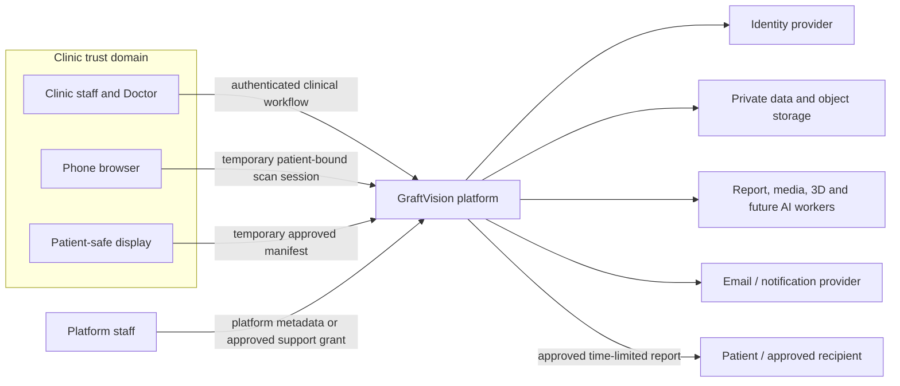

Trust does not flow from a user-facing application to a data store. Each interaction is mediated by an authenticated or purpose-limited server decision. Direct browser-to-storage uploads are permitted only through a server-issued, short-lived, object-specific grant, followed by server verification.

## 8. Container-Level Architecture

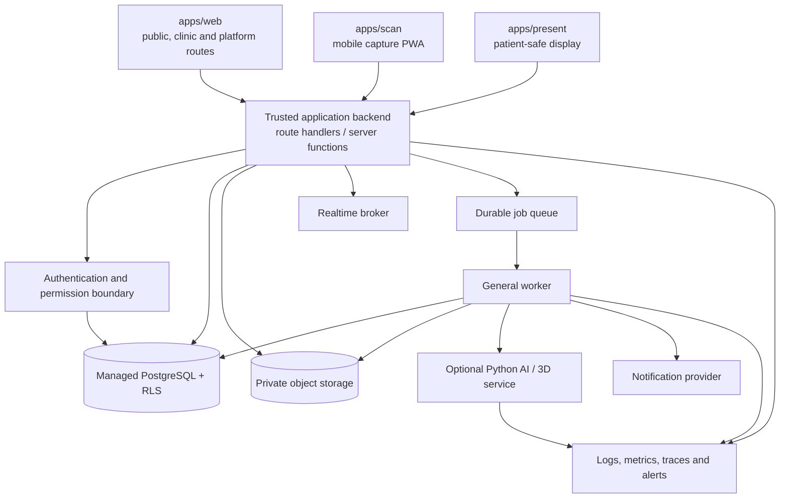

The initial physical implementation may use Next.js server execution for the trusted backend and Supabase-managed PostgreSQL, Authentication, Storage, and Realtime. “May use” is deliberate: the logical boundaries are vendor-neutral. Browser code never receives a service credential. Privileged database access is restricted to narrowly defined server and worker operations and must still apply explicit tenant and permission checks.

Synchronous operations are small user-driven validations and durable changes. Long-running or retryable work is asynchronous. The database is authoritative; realtime and queues are delivery mechanisms.

## 9. Application Architecture

### `apps/web`

`apps/web` contains three route families with separate layouts, policies, and telemetry:

- **Public routes:** marketing, product information, privacy/contact material, and manually directed onboarding information. They use no clinic context and expose no patient data.
- **Authenticated clinic routes:** patient search and records, consultation, clinical review, region/measurement/graft/hairline planning, procedure, follow-up, report management, clinic settings, support grants, and clinic usage/entitlement display.
- **Authenticated platform routes:** clinic onboarding, lifecycle state, plan and entitlement administration, operational usage, service health, and support workflow. They expose operational metadata by default.

Server-rendered and server-action patterns may improve security and perceived performance, but all protected mutations use the same authorisation boundary. Route grouping is not an authorisation mechanism. Public and protected caches, layouts, error reporting, and analytics must remain separate.

### `apps/scan`

`apps/scan` is a mobile-first PWA for one temporary scan session. It performs compatibility checks, QR or code pairing, patient identity confirmation using a minimal masked identity, camera permission, guided views, retake, upload state, retry, quality warnings, completion, expiry, and device revocation.

It has no clinic-wide patient search, list, dashboard, reports, private notes, or general clinical API. A session contains one clinic, one patient, one consultation/capture purpose, an allowed capture manifest, an expiry, and permitted device actions. Local browser state is temporary, explicitly unsynchronised until acknowledged, and cleared after upload confirmation, expiry, sign-out, revocation, or policy duration.

### `apps/present`

`apps/present` is a separate restricted runtime for a temporary patient-safe presentation. It receives an approved manifest for one patient and one consultation, renders approved images, compatible 3D view, region maps, hairline options, and explicitly approved preliminary or final graft information, and follows a Doctor-controlled slide state.

It provides no patient search, navigation into clinic routes, internal notes, staff comments, contact details unless separately approved, downloads, report export, or general API. Expiry, revocation, disconnect, or patient mismatch clears or locks the display. The display does not become trusted because it is physically inside a clinic.

### Application decision table

| Technology decision | Rationale and benefits | Alternatives considered | Risks and controls | MVP suitability | Upgrade trigger and exit |
|---|---|---|---|---|---|
| Next.js + React + TypeScript for all three apps | Shared expertise, server/client composition, route isolation, typed contracts, broad hosting options | Separate SPA and API; native apps; other React meta-frameworks | Framework coupling and accidental server/client mixing; enforce package boundaries and server-only imports | High | Reconsider if runtime constraints, team capability, or independent release needs outweigh shared stack; standards-based HTTP and portable domain packages support migration |
| Tailwind CSS plus `packages/ui` | Consistent, accessible, fast-to-evolve design tokens across clinic and presentation surfaces | CSS modules, CSS-in-JS, separate design systems | Utility sprawl and unsafe reuse in patient mode; use semantic components and presentation-safe variants | High | Exit by retaining semantic component contracts and migrating styles incrementally |
| Progressive Web App for scan | Browser deployment, camera access, installability, no app-store dependency | Native iOS/Android; responsive page only | iOS background/upload limits, permissions, browser variability; approved device matrix and resumable recovery | High | Native shell considered only if validated capture, offline, hardware, or reliability needs cannot be met |
| React Query or equivalent for client server-state | Explicit loading, retry, invalidation, and mutation lifecycle | Framework-only fetch; Redux; custom cache | Sensitive cache persistence and stale permissions; no persistent clinical cache by default, clinic-bound keys, clear on context change | High | Replace through repository abstraction if framework data primitives meet all recovery requirements |
| Three.js / React Three Fiber for viewing | Mature GLB/GLTF browser rendering and React integration | Babylon.js; hosted viewer; custom WebGL | Device memory, GPU variability, unsafe model metadata; capability checks and 2D fallback | High for uploaded-model viewing | Change if profiling, format requirements, or advanced measurement demands another engine; GLB/GLTF preserves asset portability |

## 10. Shared Package Architecture

Packages expose deliberate contracts, not miscellaneous shared code.

| Package | Responsibilities | Prohibited contents |
|---|---|---|
| `packages/ui` | Design tokens, accessibility primitives, clinical statuses, loading/error/empty states, presentation-safe components, report tokens | Database clients, secrets, permission decisions, clinical claims |
| `packages/database` | Server-only database clients, tenant-scoped query patterns, transaction utilities, migration ownership, privileged-operation boundaries | Browser service credentials, bypass-by-default helpers, actual schema in this document |
| `packages/auth` | Session helpers, clinic membership, role and permission evaluation, record-state checks, temporary scan/presentation/report/support grants | Frontend-only authority or unconditional platform bypass |
| `packages/config` | Environment validation, feature flags, entitlements, app configuration, safe shared constants | Secrets in browser bundles, clinic-specific forks, safety controls that a plan may disable |
| `packages/types` | Domain/status/role/permission types, data-transfer boundaries, event envelopes | Privileged internal row shapes exported to clients, secrets, raw provider payloads |

Dependency direction should run from applications to packages and from packages to small stable abstractions. `ui` may depend on safe types/config but not database/auth implementations. `database` and `auth` are server-only where privileged. Circular package dependencies fail CI.

Server-only modules use explicit export paths and build-time guards so a browser cannot import a service client accidentally. Data-transfer types are narrower than persistence types. Events are versioned and carry identifiers and status, not raw sensitive records unless the consumer is explicitly authorised.

## 11. Multi-Tenant Architecture

### Isolation choice

| Approach | Strengths | Weaknesses | MVP decision |
|---|---|---|---|
| Shared database, shared schema, mandatory `clinic_id` | Lowest operational cost, simple migrations, pooled capacity, easiest analytics over non-clinical metadata | Requires flawless scope enforcement and protection from noisy tenants | **Adopt for MVP with layered controls** |
| Shared database, schema per clinic | More namespace separation | Migration fan-out, connection/search-path complexity, schema drift risk | Do not adopt initially |
| Database per clinic | Strong physical isolation and custom residency potential | Highest cost and operations burden; difficult onboarding, migration, reporting, and fleet management | Reserve for future enterprise/regulatory need |

The MVP uses shared PostgreSQL and a shared schema. Every clinic-owned record has a non-null clinic association; child records inherit and verify the same clinic context. Tenant context is derived from the authenticated session and active membership or from a narrowly scoped temporary grant. A client-supplied `clinic_id` is a selector to validate, never proof of authority.

RLS constrains reads and writes to eligible clinic memberships and controlled platform operations. Trusted application code also verifies role, explicit permission, record state, patient binding, temporary grant, and approval conditions. Background jobs carry immutable clinic and source identifiers. Object keys, search filters, realtime topics, analytics dimensions, cache keys, exports, audit queries, and recovery operations all include clinic scope.

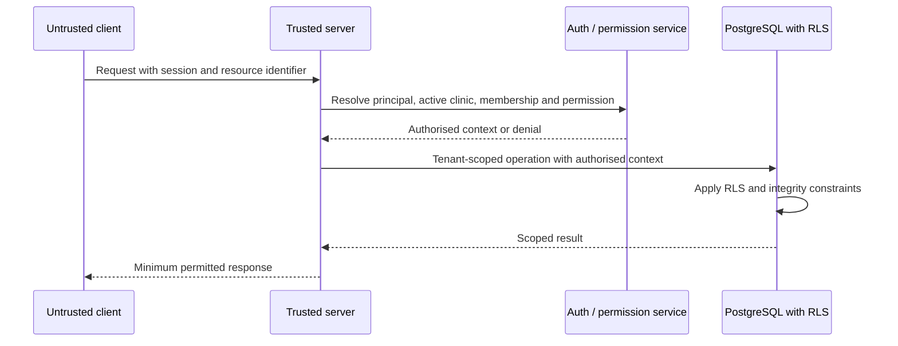

Platform staff do not receive a global clinical bypass. Operational metadata is exposed through separately designed views or services. A support grant fixes one clinic and optionally one patient/module, named support user, allowed actions, reason, start, expiry, and revocation. Enterprise physical isolation becomes a candidate only if required by regulation, contractual data residency, very large tenant workload, customer-controlled keys, or a risk assessment that shared logical isolation cannot satisfy. Such a tier must retain the same application contracts and migration tooling.

## 12. Authentication Architecture

Supabase Authentication is suitable for the initial implementation because it integrates with the proposed managed platform and supports common session and recovery flows. Authentication remains behind `packages/auth` so the product domain does not depend on provider-specific user objects.

| Decision dimension | Architecture |
|---|---|
| Identity | One unique staff identity; no shared staff accounts |
| Session creation | Provider authenticates; trusted server resolves active user, platform role, clinic memberships, and selected clinic |
| Renewal | Short-lived access credential renewed under provider policy; every protected request rechecks current authority |
| Expiry | Inactivity and absolute limits are configurable after approval; scan, presentation, report, and support sessions have separate shorter limits |
| Deactivation | Product user/membership status is checked in addition to identity-provider status; sessions are revoked and subsequent actions fail immediately |
| Role changes | Effective on the next protected action; sensitive clients receive a revocation/context-change signal and clear cached data |
| Recovery | Enumeration-resistant messaging, verified channel, rate limits, session revocation as policy requires, audit event |
| Invitation | Manually onboarded clinic initiates an expiring invitation; role and clinic are server-assigned and verified before activation |
| MFA readiness | Architecture permits provider MFA and policy by role; final scope remains an open security decision |
| Device trust | Device metadata supports risk and revocation but never replaces authentication or role evaluation |

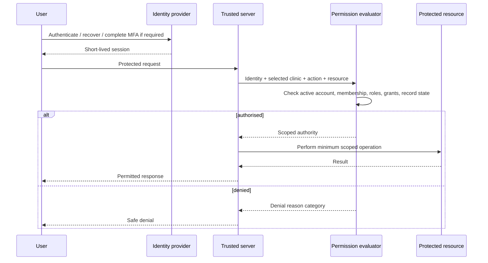

**Technology assessment:** Supabase Auth offers low MVP cost and integrated operations. Alternatives include Clerk/Auth0, an independent OIDC provider, or self-hosted identity. Risks are provider coupling, misconfigured token validation, and incomplete healthcare/security review. The exit strategy is a product-owned identity mapping, standards-based OIDC concepts, and no provider identifier as the sole domain identity. Upgrade is triggered by enterprise federation, advanced risk controls, regional constraints, or unsupported MFA/session requirements.

## 13. Authorisation Architecture

Authorisation answers more than “which role?” The evaluator takes:

- authenticated identity and session status;
- selected clinic and active membership;
- all active roles in that clinic or platform scope;
- explicit permission and any clinic-policy reduction;
- target resource clinic and patient;
- record state and revision;
- Doctor-only approval rule;
- temporary grant scope and expiry;
- subscription/clinic state;
- requested action and disclosure context.

The thirteen roles are Platform Owner, Platform Administrator, Platform Support Engineer, Clinic Owner, Clinic Administrator, Doctor / Hair-Transplant Surgeon, Clinical Assistant, Procedure Technician, Reception User, Report Coordinator, Presentation User, Read-Only Clinical Reviewer, and Patient. Multi-role users receive the union of permitted actions subject to immutable denials and separation-of-duties rules. No combination creates cross-tenant access or Doctor authority unless the active Doctor role is separately assigned.

Permission checks are centralised in `packages/auth` and called by every trusted mutation, query, file grant, subscription, job request, report share, and presentation action. RLS provides data-layer containment but does not express every approval or state rule. Frontend hiding improves usability only.

Material state changes may require two checks: permission to prepare and distinct authority to approve. Doctor approval records the active Doctor identity, clinic, patient, source revision, decision, and time. A material edit produces a new draft/revision and invalidates or supersedes the affected approval.

## 14. Clinic Workspace Isolation

A clinic workspace is a security context, not only a URL prefix. Selecting or switching clinics creates a fresh authorised context. The application clears clinic-specific client caches, closes realtime channels, discards incompatible drafts, and reloads permissions before showing the new workspace.

Workspace boundaries include:

- database rows and relationships;
- private object prefixes and access grants;
- search indexes and queries;
- realtime topics and presence;
- job payloads, results, and deduplication keys;
- report, presentation, scan, entitlement, quota, and branding context;
- audit, export, deletion, restore, log, and metric context.

Clinic lifecycle state is independent of clinical truth. Trial or Active allows policy-approved use. Suspended or Inactive restricts normal access according to an unresolved policy but never silently deletes or mutates clinical history. Closed initiates controlled export, staff removal, retention, and deletion review.

## 15. Patient Record Architecture

The patient record is the stable longitudinal root within one clinic. It links identity and contact data, histories and acknowledgements, consultations, capture sessions, source media, models, measurements, plans, approvals, procedures, follow-ups, comparisons, reports, shares, and audit evidence. A second procedure creates a new linked episode rather than overwriting the first.

Identity/contact information is separated logically from clinical detail so Reception, Report Coordinator, Presentation User, platform staff, and temporary sessions can receive masked or no data according to permission. Private Doctor notes have a stricter disclosure class and never enter a report, presentation, export, support session, or analytics stream without an explicit applicable rule.

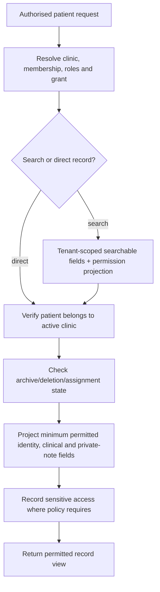

Patient creation performs tenant-scoped duplicate checks and uses an idempotency key so retries do not create duplicates. Archive is reversible and preferred to deletion. Restoration verifies clinic and linked-record integrity. Permanent deletion is a multi-stage policy workflow, not a direct CRUD action.

## 16. Consultation Session Architecture

A consultation is a versioned clinical episode with a clear type: initial hair-present assessment, surgery-day shaved assessment, or later authorised episode. Each session owns capture requirements, media links, working drafts, measurements, planning inputs, warnings, review status, approvals, and report snapshots.

Session state follows the product status model rather than being inferred from missing fields. The trusted backend validates transitions and records who initiated them. Capture completion may advance to preliminary assessment only when required views are confirmed or an authorised documented exception exists. Preliminary consultation values remain distinct from surgery-day final values and procedure actuals.

A consultation can be completed manually with photographs, regions, measurements, Doctor-selected density, transparent graft calculation, hairline work, and Doctor approval. Save, unsaved, conflict, and failure states remain explicit.

## 17. Mobile Scan Architecture

The scan PWA is intentionally capability-limited. The laptop creates a scan session after a clinic user opens the correct patient and consultation. The server stores the allowed capture type, required views, clinic/patient binding, creator, expiry, and state. A QR code or short code carries an unguessable pairing reference, not patient data or durable authority.

On the phone, the server validates the pairing reference and shows minimum confirmation such as a masked patient label and capture purpose. The user confirms before camera access. The phone receives an allowed-capture manifest and short-lived device credential. Each media item receives a client-generated operation identifier, view type, sequence, and capture metadata for idempotent processing.

Device permission denial, unsupported capabilities, low storage, network interruption, expiry, revocation, and wrong-patient confirmation all create explicit safe states. Capture may continue locally for a short approved period where the browser can protect temporary data, but nothing is described as uploaded until the server confirms it.

## 18. Phone-to-Laptop Pairing Architecture

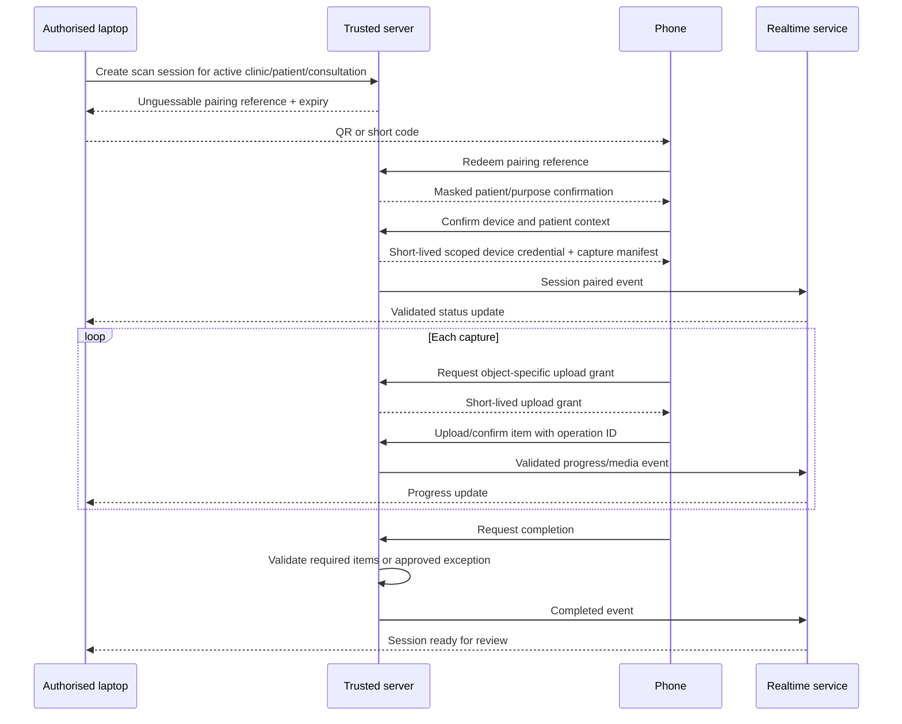

Pairing identifiers have high entropy, one-time redemption semantics where practical, rate limiting, short expiry, and no authority after revocation. A session permits a bounded device count, normally one phone. Device replacement revokes or explicitly supersedes the previous credential. The laptop cannot change the patient binding after pairing; it must end the session and create another.

## 19. Real-Time Synchronisation Architecture

Supabase Realtime is suitable for the MVP as a managed event transport, but PostgreSQL remains authoritative. The server publishes or authorises only tenant- and session-scoped events. The phone never publishes an event that directly changes clinical state; it submits a validated command or upload confirmation, and the server emits the resulting event.

Event envelopes include version, event ID, clinic/session context, resource reference, status, sequence or revision, occurrence time, and minimal payload. Consumers deduplicate by event ID and reconcile against server state after reconnect. Ordering is guaranteed only where a per-session sequence is enforced; clients must tolerate delayed or repeated events.

Realtime alternatives include WebSockets through a dedicated gateway, Server-Sent Events, or polling. Managed realtime reduces MVP infrastructure and supports responsive progress. Risks include provider coupling, channel misconfiguration, transient loss, and cost at high concurrency. The exit strategy is a product-owned event envelope and reconciliation endpoint contract. Upgrade occurs when volume, ordering, presence, regional latency, or reliability requires a dedicated broker.

## 20. Standardised Photography Architecture

Capture protocols are configuration data governed by product and clinical approval, not hard-coded per clinic. A protocol defines capture purpose, required and optional views, guidance assets, allowed exceptions, metadata expectations, and version. The architecture links each photograph to the protocol version used.

Accepted originals are preserved under the approved policy; previews and thumbnails are separate derivatives. Capture metadata must not claim physical scale unless calibration is verified.

Comparison logic checks compatible view and capture conditions. A mismatch produces a visible limitation; it does not alter either source or fabricate comparability. An AI quality check, if introduced, adds a suggestion and confidence but cannot delete, accept, or reject a photograph autonomously.

## 21. Media Upload Architecture

Uploads use a state machine such as `Local draft → Preparing → Upload authorised → Uploading → Uploaded bytes → Server verification → Processing → Ready`, with separate `Paused`, `Retryable failure`, `Rejected`, `Expired`, and `Cancelled` states. Exact names belong in the schema specification.

The client may compress previews where safe but must not silently replace an original required for clinical evidence. Large assets use resumable or multipart upload when supported. Before a media record becomes Ready, trusted processing verifies the expected tenant/object path, size, checksum, claimed and detected MIME type, allowed extension, image dimensions, decodability, and session binding. Orientation is normalised in derivatives. Malware or file-safety scanning is applied according to file type and provider capability.

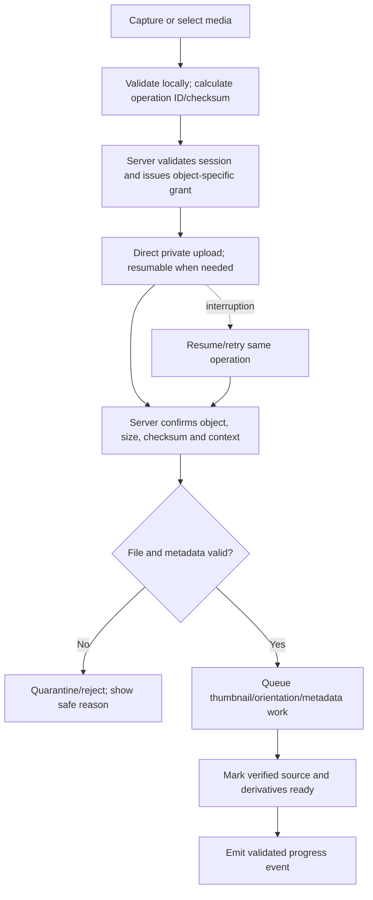

Duplicate prevention combines operation ID, scoped checksum, patient/session context, and explicit reconciliation. A checksum match is not automatically a duplicate across clinics. Failed partial uploads are expired and cleaned by a scheduled job. Accepted originals are not deleted merely because derivative processing fails.

## 22. Private Storage Architecture

All patient media, models, report artefacts, and exports use private object storage. Buckets or logical namespaces separate environment and asset class. Object keys contain opaque identifiers and tenant scope but no patient names, phone numbers, diagnoses, or other readable sensitive data.

Storage access occurs through:

- object-specific upload grants after server authorisation;
- short-lived read grants after current permission evaluation;
- server/worker service credentials held outside client bundles;
- purpose-limited patient report and presentation grants;
- controlled operational tooling with audit.

Supabase Storage is an appropriate MVP option because it integrates with authentication and the proposed platform. Alternatives are Amazon S3, Cloudflare R2, Google Cloud Storage, or another S3-compatible service. Benefits are low operational complexity and private-policy integration. Risks are provider coupling, egress cost, policy misconfiguration, and regional availability. `packages/database` or a dedicated storage adapter owns logical asset operations, while the database owns metadata and authority. Migration copies verified objects, preserves immutable asset identifiers and checksums, and switches adapters after reconciliation.

Retention and deletion operate on metadata and objects together. An asset enters pending deletion only after relationship, hold, report-snapshot, export, and retention checks. Orphan detection is tenant scoped. Backups and object-versioning decisions must account for the approved deletion policy.

## 23. Signed URL Architecture

A signed URL is a temporary delivery credential, not permanent authorisation. The trusted server first verifies the current actor, clinic, purpose, source permission, asset state, and any session/share grant. It then issues a short-lived URL limited to one object and action.

URL duration is shortest for internal raw media and shared displays, and policy-controlled for approved report sharing. URLs are never written to long-lived logs, analytics, audit payloads, notifications, or referrers. Responses set defensive cache and content-disposition headers appropriate to the context. A copied URL expires and cannot list adjacent objects.

Where immediate revocation is required, access is proxied or uses a revocation-aware token exchange rather than relying solely on an already issued provider URL. Report shares and presentation sessions recheck active status before resolving assets. Abnormal download or denial patterns feed security monitoring without logging patient content.

## 24. 3D Model Architecture

MVP accepts approved GLB or GLTF models generated externally or uploaded manually. The model is private, tenant/patient/session scoped, versioned, validated for type and size, and associated with source references and metadata. Metadata includes coordinate convention, units or unknown-scale state, calibration method/status, generator, import time, compatibility, processing state, reviewer, and supersession.

The browser viewer loads a short-lived model URL, applies safe rendering limits, and supports navigation and Doctor review. Measurements are enabled only when scale and geometry meet the approved method. Report screenshots are derived artefacts tied to a specific model version, camera state, overlays, and approval snapshot.

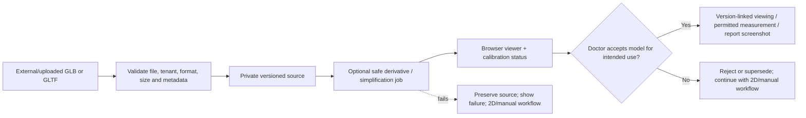

Post-MVP reconstruction is isolated behind a job/service contract: authorised source references enter a worker; photogrammetry, ARKit/depth, or LiDAR processors create versioned outputs; mesh simplification and texture processing produce browser-safe derivatives; region projection and surface-area calculation retain method and calibration. GPU infrastructure is provisioned only when measured workload and validated value justify it.

Three.js/React Three Fiber is the initial viewer decision. A separate Python FastAPI service is not required for basic viewing and is added only for processing that is impractical in trusted TypeScript workers. Upgrade triggers include validated automated reconstruction, large meshes, advanced geometry, depth pipelines, or incompatible compute requirements. Open standards and original preservation support exit.

## 25. Measurement Architecture

Measurement is a versioned domain result, not a bare number. Every value retains the clinic, patient, consultation/plan, region and source version; value and unit; source category; method and method version; calibration status; confidence when meaningful; creator; reviewer; approval state; revision; timestamps; and supersession relationship.

Source categories are:

- **Manually entered:** entered by an authorised user with method/context.
- **Calculated from geometry:** deterministic output from a named geometry and calibration version.
- **AI suggested:** provisional output from a recorded model version and input set.
- **Doctor corrected:** a Doctor-authored revision of a prior value.
- **Doctor approved:** an explicit decision over a fixed revision.
- **Preliminary:** usable for discussion but not represented as final.
- **Final:** part of an approved final clinical plan.
- **Superseded:** retained for history but no longer current.

Physical units are dimensional truth. When scale is absent, unreliable, or incompatible, the platform may retain pixel/relative geometry, a qualitative status, or Doctor-entered value with disclosed method; it must not produce an apparently exact cm² result. Calibration evidence and uncertainty travel with the value into planning, presentation, and report snapshots.

Deterministic calculations should be repeatable from preserved inputs and a versioned formula. Rounding occurs for display after calculation, not through repeated mutation of stored source values. A material change to region geometry, scale, unit, or method makes dependent results stale and requires recalculation and, where applicable, Doctor reapproval.

## 26. Graft Planning Architecture

Graft planning connects versioned recipient regions, area, Doctor-selected density, calculation method, preliminary range, manual adjustment, and final allocation. The architecture keeps these concepts distinct:

- region-specific area and its measurement quality;
- target density by region and unit;
- transparent calculated estimate or range;
- Doctor adjustment and reason;
- final approved allocation by zone;
- planned grafts from the approved surgical plan;
- extracted grafts and follicular-unit breakdown;
- damaged/discarded and usable grafts;
- implanted grafts by zone; and
- any remaining/disposition value and reconciliation status.

Formulas are centrally configured, versioned, and reviewable. Inputs, intermediate values, units, precision, rounding, and output are preserved. An adjustment never rewrites the calculated source; it creates a traceable clinical decision. When measurement precision is insufficient, the output remains a preliminary range.

Procedure actuals do not mutate the plan to make totals agree. Reconciliation compares planned, extracted, usable, and implanted values and either balances them under the approved formula or records an authorised variance for Doctor review. Exact clinical formulas, units, rounding, and allowed exceptions remain clinical/product decisions for the schema and requirements process.

## 27. Hairline Design Architecture

A hairline design is a versioned overlay or geometry associated with a specific source image/model, coordinate frame, consultation, creator, status, and clinical context. Drafts from staff or AI remain distinguishable from Doctor-adjusted and Doctor-approved versions.

The architecture supports multiple options for comparison without treating any option as a guaranteed result. Each option records its source, labels, anchors/control points, scale status where relevant, edit history, illustrative limitation, and relationship to the chosen final surgical plan. Approval fixes one version; later material edits create a new version and require reapproval.

Patient presentation and reports receive only explicitly selected hairline renderings and approved labels. Raw editing controls, alternative drafts, AI confidence, private comments, and internal annotations do not cross into a patient-safe manifest unless each content type is explicitly approved for that purpose.

## 28. AI Service Architecture

AI is an optional isolated assistive service. It has no database service credential capable of arbitrary patient access and no permission to write an approved or final clinical state. The trusted application/worker creates a tenant-scoped job with minimum necessary asset references, intended task, approved processing parameters, model/version requirement, and purpose.

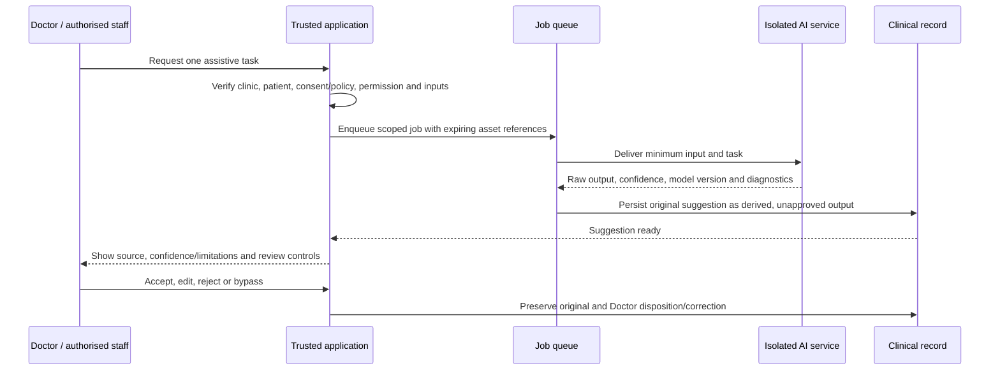

The AI boundary preserves input asset references and versions, tenant/patient context, task/model version, original output, confidence where valid, timing, failure category, Doctor correction, disposition, and approval relationship. Timeouts and failed jobs remain retryable or bypassable. A late result cannot overwrite a newer source revision. Model outputs are treated as untrusted structured input and validated before persistence or rendering.

Potential capabilities are independently governed: image-quality assessment, hair-loss classification, region segmentation, hairline suggestion, and follow-up comparison. Validation of one does not approve another. Training or vendor reuse of clinic data is prohibited unless separately approved through consent, contractual, privacy, security, retention, and clinical governance.

**Technology decision:** No AI runtime is required for MVP. When justified, add a Python FastAPI boundary because Python has stronger image/ML tooling and can scale separately. Alternatives are TypeScript workers, managed inference APIs, or batch vendor services. Benefits are isolation and specialist tooling. Risks are sensitive-data transfer, model drift, cost, latency, hallucination/invalid output, and operational burden. Upgrade triggers are an approved use case with evidence, volume, latency, and compute needs. Exit requires versioned task contracts, portable input/output artefacts, original-output retention, and replaceable model adapters.

## 29. Manual Fallback Architecture

Every critical workflow declares both an automated path and a completion path that does not depend on AI, GPU, automatic reconstruction, or nonessential external delivery:

| Unavailable capability | Manual or basic fallback | Preserved evidence |
|---|---|---|
| AI quality/classification | Staff/Doctor review and documented warning | Source images and failed/skipped job |
| Region segmentation | Manual region drawing | Source, drawn geometry, author, revisions |
| Automatic measurement | Doctor-entered value or approved basic geometry | Method, unit, scale status, author |
| Graft suggestion | Doctor-selected density and transparent calculation | Inputs, formula version, adjustment |
| Hairline suggestion | Manual Doctor design | Source, control points, revisions |
| Automatic 3D reconstruction | Uploaded external model or 2D planning | Source images/model and failure state |
| Realtime connection | Reconcile by session status and review later | Confirmed uploads and event history |
| PDF generation | Retry same snapshot; policy-approved controlled communication | Approved snapshot and failed jobs |
| Notification delivery | Manual clinic contact using approved output | Delivery attempt and operator action |

Fallback is visible rather than silent. Users see what failed, what is durably saved, whether retry is safe, and what limitation applies. A fallback does not fabricate data, downgrade tenant checks, reuse an expired grant, or change the required Doctor approval.

## 30. Procedure Record Architecture

The procedure record links to one approved final surgical-plan version but stores actual events separately. It can contain procedure date, surgeon/team, technique, extraction times, follicular-unit categories, damaged/discarded and usable counts, implanted allocation, deviations, notes, and immediate postoperative media, subject to the approved schema.

Procedure Technician and Clinical Assistant may draft authorised information; only the Doctor reviews unresolved clinical warnings, reconciliations, and deviations and approves the procedure version. An approved plan cannot be rewritten by a Technician. A changed plan or material procedure correction follows a new version/amendment path.

Counts use invariant checks and clear status. A mismatch is not rounded away or copied between fields. The record moves to a reconciliation-required state until corrected or an allowed Doctor-reviewed explanation is recorded. Audit evidence identifies entry, correction, review, and approval without duplicating sensitive narrative unnecessarily.

## 31. Follow-Up Architecture

Follow-up records attach to the stable patient and relevant procedure episode. Checkpoints are configurable and versioned so a schedule change does not rewrite what was originally due. A follow-up can be Scheduled, Due, Completed, Missed, Rescheduled, or Cancelled under controlled transitions.

Records may link standardised images, capture conditions, observations, Doctor assessment, patient satisfaction, and next recommendation. Missing years remain gaps; returning patients receive linked records rather than invented history.

Notifications, if enabled, are asynchronous operational aids. A failed reminder does not change clinical status. Contact details are resolved only at delivery time by an authorised service, kept out of job logs where possible, and not exposed to presentation or report sessions.

## 32. Longitudinal Comparison Architecture

Comparison is a view over immutable source versions, not a new source of truth. The user selects authorised timepoints and compatible views. The system preserves the selected sources, alignment method, capture-condition differences, transformation parameters, warnings, creator, and time.

MVP supports side-by-side and conditional overlays. Capture mismatch produces a limitation and may disable overlay; source images remain unchanged. Compatible 3D comparison is post-MVP.

Any comparison included in a report or presentation is rendered into or referenced by the approved content snapshot. Later source changes do not silently change an already generated report. Patient-facing language remains factual and avoids guaranteed or unsupported outcome claims.

## 33. Reporting Architecture

Reports have two disclosure classes:

- **Internal report:** may contain authorised clinical and operational context and is never patient-shareable by default.
- **Patient-safe report:** built only from an explicit allowlist and approved content snapshot.

A report workflow fixes report type, clinic branding version, template version, patient/consultation/procedure/follow-up references, approved source revisions, patient-safe selections, required labels/disclaimers, Doctor approval, and generation status. Preparation, clinical approval, generation, download, and sharing remain separable permissions.

The approved snapshot is immutable. It may contain copied scalar values and immutable references to exact media/render revisions required for reproduction. The generator does not read uncontrolled “current” patient fields after approval. A source correction creates a new draft/snapshot, requires Doctor reapproval, generates a new artefact, and marks the old version Superseded without silently replacing it.

## 34. PDF Generation Architecture

PDF generation is an idempotent background job. The trusted server verifies permission and snapshot readiness, creates or reuses a job keyed by report version and template/render-engine version, and queues it. The worker reads only the approved snapshot and required private assets, renders the PDF, applies watermark/identifier, validates the output, writes it privately, and atomically records success.

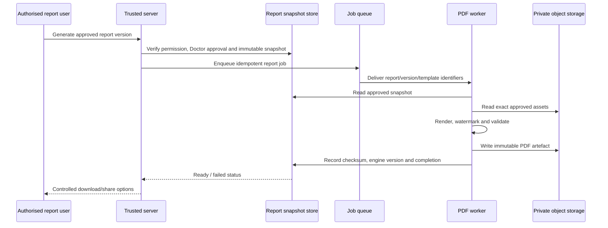

Generation retries use the same snapshot. A render-engine change may intentionally create a new artefact revision with traceability. Browser printing is not the canonical generator because it is difficult to make deterministic and auditable. Candidate implementations include a dedicated headless-browser worker or document-rendering service. The choice requires performance, font, layout, security, and portability evaluation.

## 35. Watermarking and Verification Architecture

Every patient-safe PDF carries a visible approved watermark/disclosure, generated timestamp, opaque report identifier, version, and verification reference. It does not expose internal database identifiers or a predictable patient identifier. The watermark language and required disclaimers require product and clinical approval.

Verification resolves the report identifier to a minimum public status such as valid/current, superseded, revoked, expired, or unknown. It must not expose patient identity, clinical content, clinic-private metadata, or a downloadable file without a separate active share grant. The verifier is rate-limited and monitored.

Artefact metadata includes checksum, byte size, generation engine/template versions, source snapshot, generated time, and supersession state. “Immutable artefact” means the bytes of a generated version are not mutated; revocation or supersession changes status and access, not history. Reproducibility is tested from the snapshot, while exact byte identity is required only if the chosen renderer can guarantee it.

## 36. Presentation Mode Architecture

The Doctor or authorised preparer creates a temporary presentation record for one clinic, patient, and consultation. A Doctor controls or approves the content manifest. The manifest is an allowlist of exact content revisions and display-safe labels. It includes no general query capability.

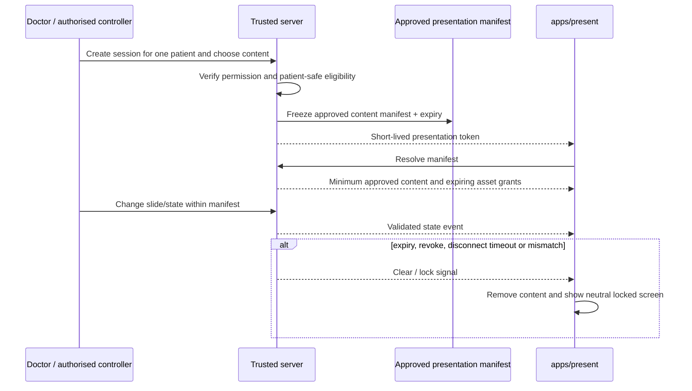

The display token grants only resolve/read/navigation capabilities for that session. The controller may move among approved slides but cannot introduce a new source without a server-side manifest revision and required approval. Browser history, application switch, deep links, service-worker cache, and error pages must not reveal prior patient data. Responses discourage caching; in-memory content is cleared at end.

If connectivity is briefly lost, the display may show the last approved slide only for an approved grace interval with a clear disconnected state; otherwise it blanks/locks. The exact grace and session duration are open security/product decisions. Automatic expiry is mandatory.

## 37. Notification Architecture

Notifications communicate workflow state; they do not carry clinical authority. Candidate events include invitation, review request, rejected handoff, report ready, approved report share, follow-up reminder, support grant, access revocation, export ready, and operational failure.

A trusted notification dispatcher receives a minimal event reference, rechecks current eligibility where needed, applies clinic/user preferences and channel policy, renders an approved template, sends through a provider, and records delivery status. Sensitive clinical content and private URLs are minimised; shared links are separately expiring and revocable.

Email is the likely MVP delivery channel, but provider selection is deferred. In-app status is preferred for sensitive workflow detail. Fully automated WhatsApp delivery is excluded from MVP. Provider retries use idempotency and backoff; permanent failure surfaces a manual action without marking the clinical workflow incomplete unless the product requirement explicitly makes notification a gate.

## 38. Audit Logging Architecture

Audit events are append-only from application actors. Ordinary application roles cannot update or delete them. Corrections are represented by a new event. Database and infrastructure controls protect retention and integrity; high-risk events may also be streamed to a separate security sink.

An audit event records, where relevant:

- event type and version;
- actor identity, effective role(s), clinic, and session/device;
- patient/resource identifiers without raw clinical content;
- action and success/failure;
- safe before/after summary or changed-field names;
- reason, approval, or denial category;
- source revision and resulting revision;
- support grant, export/share/deletion/restore context;
- timestamp, correlation ID, and trusted origin.

The system records authentication changes, role/membership changes, approvals and invalidations, sensitive reads according to policy, file grants/downloads where appropriate, presentation/scan lifecycle, report generation/share/revoke, support grant/use/expiry, export, archive/deletion/restoration, clinic lifecycle, and administrative operations.

Audit payloads avoid patient names, notes, images, model content, full request bodies, access tokens, signed URLs, and unnecessary contact data. Tenant-relevant events are queryable only in their authorised clinic context. Platform security events may aggregate operational facts without granting clinical browsing.

## 39. Background Job Architecture

The MVP needs a durable queue or managed worker abstraction for PDFs, thumbnails, image processing, uploaded-model derivatives, future 3D/AI, exports, cleanup, verification, notifications, retention enforcement, and approved reminders. Vercel request execution is not used for work that can exceed request limits or requires durable retry.

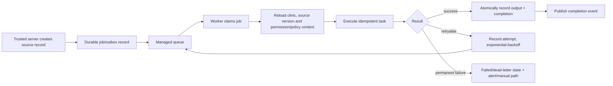

Each job has an opaque ID, type/version, tenant and source context, deduplication key, requested-by identity, source revision, status, attempt count, timing, bounded parameters, cancellation state, and result/error reference. Payloads use identifiers and expiring object grants, not copied patient records or long-lived signed URLs.

Workers revalidate the current source and tenant before processing. Idempotency prevents duplicate artefacts or state transitions. Retries classify transient and permanent errors, use bounded exponential backoff with jitter, and move exhausted jobs to a reviewable failed state. Cancellation is honoured before irreversible stages. A dead-letter path never becomes “completed.”

**Technology choice:** adopt a managed durable queue/worker appropriate to the chosen hosting region and workload, not a specific vendor in this document. Alternatives include database-backed jobs, managed queues, workflow platforms, and container workers. A database queue can minimise MVP services but risks contention; a managed queue improves durability but adds vendor and operational concepts. Upgrade occurs with sustained volume, complex orchestration, long GPU work, or strict scheduling. Job envelopes and idempotent handlers provide portability.

## 40. Error Handling Architecture

Errors use stable categories: authentication, authorisation, validation, conflict, expired/revoked context, unsupported capability, transient dependency, permanent processing, quota/policy, and internal failure. User messages say what failed, whether data was saved, and the safe next action without revealing secrets, provider internals, other clinics, or patient existence.

Every request receives a correlation identifier. Trusted logs record the technical cause and safe identifiers; clients receive a stable code and localised message later. An authorisation denial is not retried automatically. A transient network or provider error may be retried if the operation is idempotent. Validation errors preserve the draft and point to fields. Conflicts require explicit reconciliation.

High-risk failures fail closed: tenant mismatch, wrong patient, invalid report snapshot, expired support grant, unapproved presentation content, uncertain physical scale, or stale approval never continue under a permissive default.

## 41. Offline and Interrupted-Flow Architecture

Full offline clinical operation is not an MVP requirement. The scan application may support short-lived local capture drafts to prevent loss during transient connectivity, subject to browser capability and approved privacy policy.

Local items are scoped to the opaque scan session and patient confirmation, encrypted where the platform/browser can provide meaningful protection, excluded from general caches, marked Unsynchronised, and assigned operation IDs. The application never displays “saved” or “complete” until the server confirms durable receipt and validation.

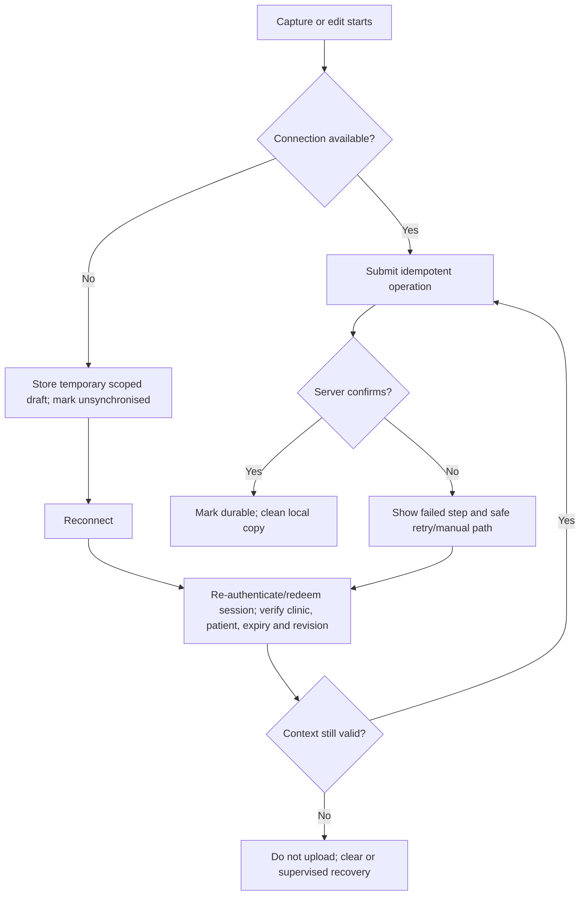

Session expiry does not silently rebind local media to a new session. Supervised recovery must confirm the original clinic/patient and create an authorised continuation. Automatic cleanup runs after confirmation or a short approved maximum duration. Shared devices should not retain long-term clinical media, credentials, thumbnails, service-worker responses, or patient names.

## 42. Concurrency Architecture

Clinical records use optimistic concurrency through a revision number, immutable version identifier, or equivalent token. Every mutation states the version it read. If a newer version exists, the trusted server rejects the silent overwrite and returns a safe conflict summary.

Users can compare changed fields, discard their draft, or deliberately apply compatible changes to a new revision. High-risk clinical geometry, measurements, graft allocations, hairline, procedure counts, report snapshots, and approvals do not use automatic last-write-wins. Realtime update notices reduce conflicts but are not the enforcement mechanism.

Material edits after approval create a new draft and require Doctor reapproval. Simultaneous approval attempts use a transaction/constraint so exactly one valid approval targets the intended revision. Idempotency keys protect patient creation, finalisation, job requests, and report generation from browser retry.

## 43. Caching Strategy

Caching is conservative because stale permission or patient data creates more risk than a small latency gain.

| Layer | Permitted use | Required controls |
|---|---|---|
| CDN/public | Versioned public marketing assets and pages | No clinic/patient variation in shared cache |
| Browser/app | Static assets, safe configuration, short-lived in-memory server state | Clinic in every key; clear on logout/switch/revoke; no persistent clinical cache by default |
| Server data cache | Stable non-sensitive configuration and carefully scoped reads | Tenant, permission-relevant variation, short TTL, tag invalidation |
| Object derivative cache | Immutable content-addressed thumbnails/model/report assets | Private signed access and revision-specific keys |
| Presentation | Current approved manifest in memory only | No-store/private headers, expiry/revoke, clear on end |

Cache keys include environment, clinic, resource, revision, locale/config version, and disclosure context where applicable. Patient-safe and internal variants never share keys. Authorisation results are short-lived or evaluated per action; high-risk actions always recheck durable authority. No cache can grant access after a role, membership, support, presentation, report, or clinic-state revocation.

## 44. Search Architecture

MVP patient search remains inside PostgreSQL using tenant-scoped indexes and approved searchable fields. It supports duplicate checking and first-page lookup within the PRD target volume without introducing an external search service.

Search begins with active clinic context and permission projection. Query plans cannot execute an unscoped global patient search and filter afterward. Results return minimum identity/status fields by role, exclude private notes and clinical text for unauthorised users, and respect archive/deletion state. Platform staff have no patient search by default; the scan and presentation apps have none.

An external search service becomes justified only when approved per-clinic data volume, fuzzy matching, multilingual needs, or performance exceed PostgreSQL. Any index must be private, tenant scoped, deletion/retention aware, encrypted, rebuildable from authorised source, and covered by residency/vendor review. The exit strategy is to treat it as a derived index, never the source of truth.

## 45. Data Export Architecture

Export is a high-risk asynchronous workflow. An authorised clinic user defines clinic or patient scope, purpose, recipient, time range, and format. The system verifies identity, permissions, holds, policy, and elevated approval before creating a tenant-scoped snapshot/manifest and job.

The export contains authorised clinic data and linked assets in documented portable formats, excluding software, secrets, proprietary algorithms, other tenants, and unrestricted platform configuration. Its manifest records scope, formats, checksums, and errors.

Artefacts are encrypted at rest, private, short-lived for retrieval, and protected by a separate expiring grant. Creation, approval, processing, access, expiry, and cleanup are audited. Platform staff can assist only under an approved request and grant. A partial or failed export is never represented as complete.

## 46. Archive and Deletion Architecture

Archive removes a record from ordinary active workflows while preserving its longitudinal history and relationships. Restore is authorised, audited, tenant-scoped, and checks conflicts.

Permanent deletion follows: request; impact preview; identity and authority verification; legal/retention/hold check; elevated approval and separation of duties; export offer/requirement; recoverable pending state; policy wait; object and derived-data deletion; relationship reconciliation; audit result. The exact retention and recovery durations remain open.

Deletion is a domain workflow spanning database rows, private objects, derivatives, search indexes, caches, queued jobs, report links, presentations, exports, and backups. New jobs refuse pending-deletion sources. Backup expiry follows the approved schedule; a restore procedure reapplies deletion tombstones so deleted content does not reappear into active service. Audit evidence minimises content while retaining proof of lawful action.

## 47. Support Access Architecture

Routine support uses platform operational metadata: clinic status, user counts, plan/entitlement state, storage usage, job IDs/status, error codes, deployment version, browser/device category, and service health. It excludes patient names, images, histories, notes, plans, and reports.

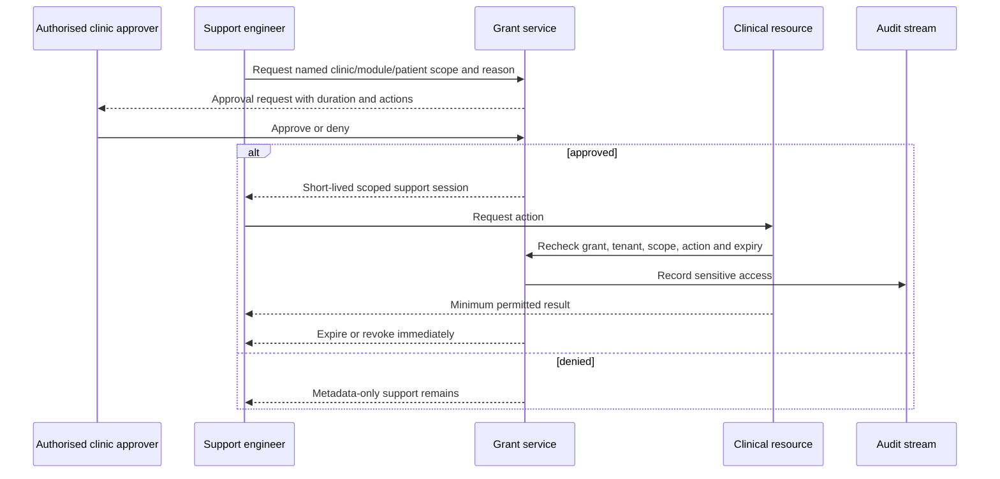

The grant names one Platform Support Engineer and fixes reason, clinic, optional patient/module, allowed read/actions, approver(s), start, expiry, and revocation. It cannot approve clinical work, change roles, export, delete, share, or cross tenant unless a separate authorised workflow explicitly permits the action. Renewal is a new grant. MVP has no break-glass access.

## 48. Platform Administration Architecture

Platform administration is separated from clinic clinical access. Platform Owner governs product/commercial and high-risk platform decisions. Platform Administrator manages clinic onboarding, activation/suspension/closure workflow, plan and entitlement configuration, usage limits, and platform settings. Platform Support Engineer diagnoses operations through metadata and approved temporary grants.

Manual onboarding creates an organisation shell, commercial/entitlement state, initial Clinic Owner invitation, policy/configuration version, storage quota, and audit trail. Activation occurs only after required onboarding and security checks. Platform screens use operational projections designed not to join patient clinical content.

Administrative service credentials are limited to server/worker runtimes, rotated, monitored, and never used from a browser. Dangerous operations require step-up authentication or dual approval when the security design determines it. Bulk cross-tenant clinical operations are absent from MVP.

## 49. Subscription Entitlement Architecture

Commercial state and clinical truth are separate. A plan/entitlement service answers whether a clinic may begin a feature or exceed a limit; it never changes patient data, Doctor authority, tenant isolation, privacy, audit, manual fallback, or safe export/closure obligations.

Initial plans and usage limits are administered manually. Entitlements are declarative, versioned, and evaluated by trusted server code. Client displays are informative, not enforcement. Usage counters identify clinic, metric, period, source event, and correction history so retries do not double count.

Essential safety controls cannot be switched off by a lower tier. When a limit is reached, the system blocks only the new bounded activity or routes it for platform review; it preserves existing records and clearly explains the next action. The exact access available during Suspended or Inactive state is an open product/security decision. Automatic billing may later consume entitlement events but remains outside clinical records and outside MVP.

## 50. Observability Architecture

Observability must answer whether the service is healthy without making patient data visible to operators. It combines structured logs, metrics, traces, audit events, uptime checks, job dashboards, and alerts with distinct retention and access policies.

### Telemetry rules

- Use correlation, request, deployment, environment, service, job, and safe clinic identifiers.
- Never log session tokens, passwords, signed URLs, raw request/response bodies, patient names, contact data, notes, image bytes, report contents, or AI prompts containing unnecessary clinical text.
- Hash or tokenise identifiers where aggregated monitoring does not need direct clinic resolution.
- Separate security audit from developer diagnostics; audit is durable evidence, logs are operational.
- Sample normal traces conservatively; retain complete high-risk security events under policy.
- Restrict platform dashboards by role and environment.

### Service indicators

Monitor access outcomes, request/database health, upload verification, realtime recovery, queue/job health, reports, notifications, storage/egress, session expiry, backups, and restore rehearsals.

Alerting distinguishes urgent safety/security conditions from capacity and product-quality signals. Cross-tenant anomaly, credential misuse, backup failure, unexpected public object access, or sustained authentication compromise receives immediate incident handling. A delayed low-priority thumbnail job does not page an operator unless it threatens the workflow.

**Technology decision:** use managed hosting/database telemetry plus a vendor-neutral structured logging and error-tracking interface for MVP. Alternatives include a single full-stack observability vendor or self-hosted OpenTelemetry stack. Managed tools minimise operations but risk fragmented views and retention cost. OpenTelemetry-compatible instrumentation and exportable logs provide an exit. Upgrade is triggered by incident response needs, trace volume, regulatory retention, or cross-service complexity.

## 51. Security Boundaries

The principal trust boundaries are:

1. **Internet to public applications:** hostile input, bots, abuse, and dependency attacks.
2. **Browser to trusted server:** all identifiers, roles, status, event payloads, and local state are untrusted.
3. **Trusted server to database/storage:** privileged credentials require explicit scoping; service access is not blanket product authority.
4. **Clinic to clinic:** no shared record, search, channel, cache, object, job, export, or restore may cross this boundary.
5. **Platform to clinic clinical data:** metadata by default; named temporary grant for exceptional support.
6. **Internal clinical to patient-safe:** only approved content manifests and report snapshots cross.
7. **Application to external provider:** minimum necessary data, contractual review, expiring credentials, and result validation.
8. **Environment to environment:** no shared credentials, database, storage, queues, or production patient data.
9. **Synchronous platform to worker/GPU service:** job identity, scope, provenance, and output validation.
10. **Human operator to production administration:** least privilege, strong authentication, audit, and controlled change.

Threat modelling must cover broken object-level authorisation, RLS or service-key bypass, cross-tenant search/realtime/cache leakage, malicious uploads, signed-link theft, QR guessing, session fixation, stale role caches, support grant abuse, presentation data remanence, report snapshot contamination, queue payload tampering, dependency/supply-chain risk, backup exposure, logging leakage, and destructive administration.

Security controls do not imply legal compliance. Pakistan launch requires a separate legal/privacy analysis of health and personal data, consent/acknowledgement, retention, breach obligations, processor contracts, cross-border processing, and residency.

## 52. Data Encryption

Data is encrypted in transit with current TLS for all browser, server, database, object, realtime, queue, worker, notification, and administrative connections. Plain HTTP redirects to HTTPS; secure cookie and transport headers are applied by environment.

Managed database, storage, backups, and queue providers must provide encryption at rest with documented key management. Production secrets are stored in the deployment platform’s secret manager, scoped by environment and service, rotated, and excluded from repository, browser bundles, logs, reports, and support tools.

Application-level field encryption may be added for especially sensitive fields if the threat model, law, contractual commitment, or operator-access model justifies it. That decision must consider search, recovery, rotation, backup, and key loss. Per-clinic encryption keys are not an MVP assumption; they become an enterprise-isolation trigger.

Passwords are handled only by the identity provider using approved hashing. Tokens are stored in secure, HttpOnly cookies where the chosen flow permits, protected against cross-site request forgery, and never placed in analytics. Temporary scan/presentation/share/support tokens are random, purpose-bound, short-lived, revocable where required, and stored as verifiers/hashes where practical.

## 53. Environment Architecture

Local, staging, and production are separate security and data planes. They may share source code and infrastructure templates but never credentials, databases, storage namespaces, authentication tenants, queue topics, email destinations, or monitoring access.

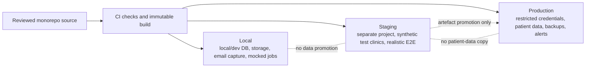

Configuration is validated on process start. Public configuration is explicitly allowlisted; all other values are server-only. Feature flags have owner, scope, environment, default, expiry/review date, and audit for high-risk changes. A flag cannot bypass tenant isolation or Doctor approval.

The same immutable build artefact should be promotable from staging to production where the hosting platform permits. Database migrations are separately reviewed, forward-compatible where practical, rehearsed on representative synthetic data, and applied through controlled production credentials.

## 54. Deployment Architecture

The initial deployment uses Vercel or an equivalent managed platform for the three Next.js applications and trusted application routes; Supabase or an equivalent managed platform for PostgreSQL, Authentication, private Storage, and Realtime; Cloudflare or equivalent for DNS, DDoS/edge protection, and carefully scoped public caching; and a separate managed worker/container only for durable jobs that do not fit request execution.

Applications may deploy as separate projects so `scan` and `present` have independent security headers, service-worker/caching policies, domains, scaling, and rollback. They still consume the same approved package versions and backend contracts. `web` public, clinic, and platform route groups can initially share a deployment but keep logical policies and layouts separate.

### Major platform decisions

| Decision | Rationale | Alternatives considered | Benefits | Risks | MVP suitability | Upgrade trigger | Exit or migration strategy |
|---|---|---|---|---|---|---|---|
| Turborepo monorepo | Coordinates three apps and five shared packages with one quality gate | Separate repositories; plain workspaces | Atomic changes, shared types/UI/config, task caching | Coupling and accidental privileged imports | High | Team/release boundaries demand independent repos | Packages already have explicit contracts; split with versioned registry if needed |
| Managed PostgreSQL | Relational integrity, transactions, RLS, mature backup/export | Document DB; serverless proprietary DB | Fits longitudinal/versioned clinical data and transparent calculations | Connection limits, RLS complexity, provider operations | High | Regional, scale, isolation, or HA needs exceed plan | Standard SQL, owned migrations, logical exports, minimal proprietary extensions |
| Supabase integrated services | Low operational burden and cohesive MVP stack | Separate Auth/S3/WebSocket vendors; self-hosted | Fast setup and unified management | Shared provider blast radius and lock-in | High after security/privacy review | Enterprise federation, regional limits, reliability or cost | Adapters, standards, original files, portable schema and event envelopes |
| Vercel for Next.js | Strong framework support, previews, CDN, serverless operations | Containers/Kubernetes; Cloudflare; other PaaS | Low operations and rapid rollback | Function limits, regional/data concerns, cost at scale | High after review | Long-running compute, private network, region, cost, or service topology needs | Container-compatible applications, standard build/runtime and external workers |
| Cloudflare or equivalent edge | DNS, DDoS protection, TLS and public caching | Registrar DNS; hosting-provider edge | Security and performance | Mis-caching private content, configuration complexity | Medium/High | Threat/traffic or region needs change | Standard DNS/TLS; infrastructure-as-code and no provider-only clinical logic |
| Separate durable worker | Reliable long processing outside HTTP lifetime | Serverless-only; database cron; workflow provider | Retry, isolation, resource sizing | Added service, queue consistency | High for reports/media/export | GPU, complex workflow, sustained throughput | Versioned job contracts and containerised handlers |
| Python FastAPI only when needed | Isolates ML/image/3D ecosystem | TypeScript worker; managed inference API | Specialist libraries and independent scaling | Additional language/runtime/security surface | Post-MVP/conditional | Approved processing cannot be met safely elsewhere | HTTP/job contract, portable containers, model/artefact registry |

Deployments use protected branches/environments, reviewed changes, dependency lockfiles, automated checks, immutable build identification, staged migrations, health verification, and rollback procedures. Rollback must be compatible with any applied schema change; destructive migrations require expand/migrate/contract sequencing and separate approval.

## 55. Backup and Recovery Architecture

Production requires automated encrypted database backups, point-in-time recovery if supported by the approved service tier, protected object durability/versioning appropriate to retention policy, configuration/infrastructure backups, and documented restoration of job/audit relationships. A backup is not considered valid until restoration is rehearsed.

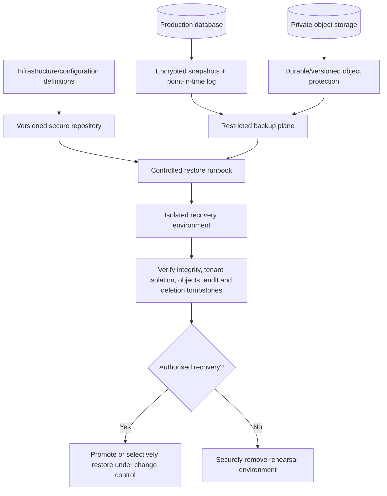

Recovery objectives remain open until clinic volume, acceptable data loss, service tier, cost, and clinical operations are approved. The architecture should support separately measured database recovery, object recovery, and full-service recovery. Restoration is environment- and tenant-aware and does not permit convenience access to clinical content.

A selective restore should rebuild relationships into a controlled recovery path rather than overwriting live records blindly. After any restore, deletion tombstones, revocations, role changes, clinic state, and report/share status are reapplied or reconciled. Restore actions are audited. Backup access requires stronger privilege than routine application operations.

## 56. Scaling Strategy

Scale in measured stages: optimise queries, connections, derivatives and worker concurrency; then scale applications/workers independently; then separate heavy queues, safe read workloads, or analytics. Stronger database/region isolation follows only regulatory, enterprise, workload, or risk triggers.

Tenant skew matters more than average clinic count. Capacity models track active clinics, users, patients, consultations, media objects/bytes, report jobs, concurrent scan/presentation sessions, database load, realtime connections, egress, and worker minutes. Rate limits and fair scheduling prevent one clinic’s bulk upload or export from starving other clinics.

The shared logical contract remains consistent if a tenant later moves to a dedicated database or storage region. Tenant routing must be server-owned and cannot be selected by the client.

## 57. Performance Strategy

Performance work protects clinical clarity, not just benchmark scores.

- Keep non-media request paths small and index tenant-scoped access patterns.
- Avoid N+1 access and loading whole patient timelines when a current episode is needed.
- Generate thumbnails and display derivatives asynchronously; retain originals privately.
- Stream or paginate timelines, audit, search, and large reports.
- Use direct private uploads to avoid routing large bytes through application functions.
- Load 3D progressively with device limits and 2D fallback.
- Prefetch only within current authorised patient/context.
- Keep presentation manifests small and immutable for fast navigation.
- Bound PDF assets and surface queue progress when generation exceeds target.
- Measure p50/p95/p99 by application, operation, clinic-size band, and device/network class without patient content.

Load tests include normal clinics, a storage-heavy clinic, simultaneous capture sessions, concurrent report generation, a slow provider, and malicious cross-tenant identifiers. Performance optimisation cannot introduce shared unscoped caches, public assets, skipped authorisation, or silent image quality reduction.

## 58. Availability Strategy

The MVP favours graceful degradation over premature multi-region complexity. Core authenticated record access depends on the application platform, identity, PostgreSQL, and private storage; realtime, notifications, AI, automatic 3D, and some derivatives may degrade independently.

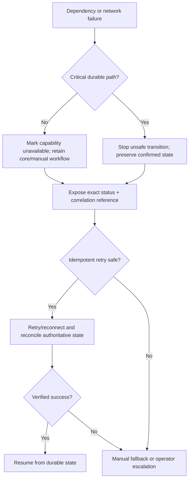

Provider health, queue age, backup status, and critical user journeys are monitored. Incident response identifies affected environments/clinics and disclosure risk without exposing unrelated patients. Planned maintenance and migration windows require communication and rollback criteria. Multi-region write operation is deferred until approved recovery/availability targets and actual risk justify its complexity.

## 59. Cost-Control Strategy

The initial manually sold pilot should run on managed, low-operations services, but free tiers are not assumed suitable for production patient data, backups, support, service commitments, or security controls.

Cost controls include:

- per-clinic storage, patient, consultation, report, and processing usage measurement;
- original-preservation policy plus appropriately sized thumbnails/previews;
- no default long-video storage and explicit short-clip limits;
- resumable uploads to reduce failed transfer waste;
- lifecycle cleanup for abandoned multipart uploads, expired drafts, temporary renders, shares, exports, and presentations;
- bounded job concurrency, retry count, timeout, and payload size;
- AI/3D disabled by default until an approved entitlement/use case;
- per-clinic AI/job usage caps and cost attribution;
- fair scheduling and rate limits for bulk exports or processing;
- archival policy based on approved clinical/legal retention, never arbitrary deletion;
- monthly provider cost review against active clinics and founding revenue.

Cost limits cannot weaken encryption, tenant isolation, backups, audit, Doctor approval, or clinic ownership/export. Upgrade triggers are sustained utilisation near service limits, per-clinic gross-margin pressure, unpredictable egress, queue delay, or an enterprise requirement. Decisions use total operations and migration cost, not headline free-tier pricing.

## 60. Vendor Lock-In Strategy

Vendor portability is achieved through boundaries, not by avoiding every managed feature.

| Concern | Portability control |
|---|---|
| Database | Standard PostgreSQL types/functions where practical, owned migrations, periodic logical export tests |
| Identity | Product-owned user/membership IDs and provider adapter; standards-based session concepts |
| Storage | Original files plus checksums and metadata; opaque logical asset IDs; storage adapter |
| Realtime | Versioned event envelope and authoritative-state reconciliation |
| Queue/workers | Versioned job envelope, idempotent handlers, container-capable runtime |
| Hosting | Standard Node/Next build, environment contract, no clinical truth in edge-only proprietary state |
| 3D | GLB/GLTF source preservation and documented coordinate/calibration metadata |
| AI | Task/model registry, preserved inputs/references and outputs, replaceable inference adapter |
| PDF | Immutable approved snapshot, template version, renderer metadata, portable output PDF |
| Observability | Structured export and OpenTelemetry-compatible instrumentation where viable |

An exit plan includes data volume inventory, export checksums, dual-read/write or maintenance strategy where appropriate, security review, reconciliation, rollback, and deletion confirmation from the prior vendor. Migration never weakens tenant scope or turns a support operator into a default clinical reader.

## 61. Testing Architecture

Testing is organised around invariants and stories rather than only components.

### Required test layers

- **Static and package boundary:** TypeScript strictness, linting, server-only import enforcement, dependency cycles, secret scanning, migration checks.
- **Unit:** permission rules, status transitions, formula version selection, measurement precision, event/job idempotency, snapshot construction.
- **Database policy/integration:** RLS positive and negative tests for every clinic-owned resource; integrity, transaction, concurrency, archive/deletion behaviours.
- **Application integration:** server action/route authorisation, signed URL issue, storage confirmation, realtime subscription scope, queue handoff.
- **Contract:** provider adapters, event versions, job envelopes, renderer input, AI/3D boundary.
- **End to end:** all critical flows across `web`, `scan`, and `present`, including disconnection and recovery.
- **Security:** broken object-level authorisation, role escalation, cross-tenant identifiers, session/token misuse, upload abuse, cache leakage, support/presentation/report boundaries.
- **Clinical/product acceptance:** manual lifecycle, preliminary/final distinction, source/method/approval traceability, graft reconciliation, report wording.
- **Accessibility/device:** WCAG 2.2 AA target, keyboard paths, approved iOS Safari/Android Chrome, desktop browsers, 1080p/4K displays.
- **Performance/resilience:** approved volume, tenant skew, provider latency/outage, queue retry, backup/restore, rollback rehearsal.

Every thirteen-role test fixture identifies clinic membership and any multi-role combination. Negative tests are first-class: the wrong clinic, wrong patient, stale revision, revoked session, expired grant, unapproved source, internal report, missing scale, or inactive user must fail safely.

The release end-to-end suite must pass with AI and automatic 3D reconstruction disabled. Production smoke tests use synthetic records in a dedicated test clinic and never another clinic’s patient data.

## 62. Local Development Architecture

Local development runs the three applications, a trusted backend boundary, development database/auth/storage, and mock or local workers. Developers use synthetic seeded clinics, users, patients, media, and status histories. No production data or credentials enter a laptop.

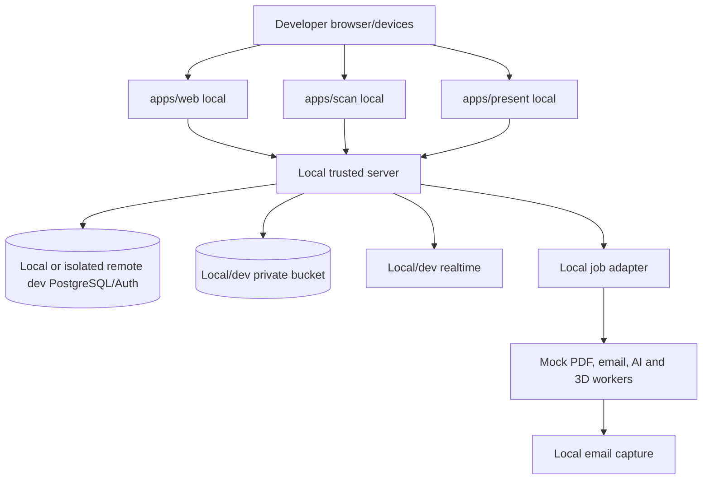

An isolated remote development project is acceptable when local provider parity is impractical, but it remains non-production with restricted credentials and synthetic data. Environment validation fails closed if a production project identifier appears in local configuration. Seed data includes at least two clinics to make cross-tenant tests meaningful.

Turborepo coordinates lint, type, test, build, and application tasks. Remote cache, if used, must not contain secrets, patient data, environment files, or generated clinical artefacts. Local HTTPS/device testing is supported for camera and secure-cookie behaviour.

## 63. Staging Architecture

Staging is a complete separate environment with its own database, authentication tenant, private storage, realtime, queue, worker, notification sandbox, DNS, credentials, monitoring, and backups proportionate to test needs. It contains synthetic or specifically authorised de-identified data only.

Staging supports multi-clinic/thirteen-role journeys, real device tests, migration and rollback rehearsals, disclosure and support-grant review, interruption/concurrency tests, and approved load/security testing.

External notification destinations are allowlisted to the project team. Share links and verification references are visibly non-production. Feature flags may enable experimental AI/3D only in isolated test clinics after review.

## 64. Production Architecture

Production uses production-only credentials and the approved service tiers, regions, retention, backup, monitoring, and support controls. Access is role-based, strongly authenticated according to the final MFA policy, auditable, and reviewed periodically.

Production changes require reviewed source, passing CI, security/dependency checks, migration plan, release owner, deployment record, smoke test, and rollback/forward-fix criteria. Direct database edits are exceptional, ticketed, scoped, rehearsed where possible, performed through controlled tooling, and audited.

Production requires private data services, restricted credentials, edge/rate protections, worker monitoring, backup/restore evidence, incident runbooks, controlled clinic lifecycle procedures, and capacity/cost review.

Production launch remains gated on the PRD, role, workflow, architecture, database, API, security, privacy/legal, accessibility, device, backup, and operational approvals.

## 65. Architecture Decision Records

Create `docs/decisions/` after this architecture is approved. Do not create ADR files as part of this task. Initial candidates are:

- `ADR-001-multi-tenant-isolation.md`
- `ADR-002-authentication-provider.md`
- `ADR-003-private-media-storage.md`
- `ADR-004-realtime-scan-sessions.md`
- `ADR-005-report-generation.md`
- `ADR-006-ai-service-boundary.md`
- `ADR-007-3d-model-strategy.md`

### ADR template

1. Title and stable identifier
2. Status: Proposed, Accepted, Superseded, or Rejected
3. Date, owner, reviewers, and approval class
4. Product requirements and constraints
5. Context and problem
6. Options considered
7. Decision
8. Rationale
9. Security, privacy, clinical, tenant, operational, and cost consequences
10. Manual fallback and failure behaviour
11. Migration/rollback/exit strategy
12. Validation evidence and monitoring
13. Follow-up decisions

Engineering drafts ADRs; the product owner approves scope and commercial consequences; the clinical approver approves effects on clinical interpretation or workflow; privacy/security approves data, access, vendors, and threat controls; operations approves recoverability and service ownership. A superseding ADR links both decisions. High-risk changes require approval before implementation, not retrospective documentation.

## 66. MVP Architecture

The MVP is a modular managed architecture, not microservices by default. Three Next.js applications share trusted server capabilities and packages; managed PostgreSQL/RLS is the clinical source of truth; private object storage holds media/models/reports/exports; managed realtime connects temporary sessions; a durable worker handles slow jobs. An independent Python service is absent unless an approved processing need requires it.

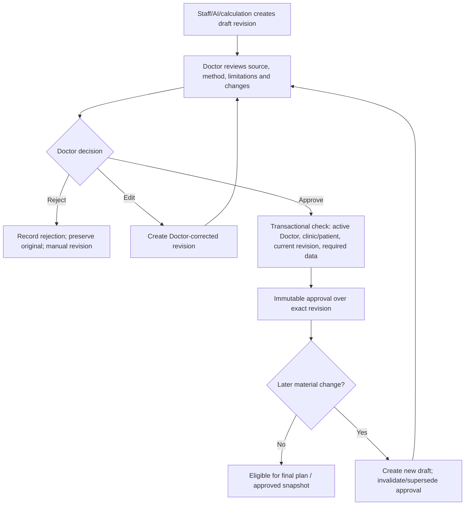

### MVP component checklist

- [ ] `apps/web` has separate public, clinic, and platform route boundaries.
- [ ] `apps/scan` is patient/session bound and has no patient search.
- [ ] `apps/present` resolves only an approved expiring manifest.
- [ ] Shared packages enforce safe dependency and server/client boundaries.
- [ ] Managed PostgreSQL uses mandatory clinic scope and RLS.
- [ ] Trusted server permission checks implement all thirteen roles.
- [ ] Private storage uses scoped short-lived grants and verified uploads.
- [ ] Realtime events are server-validated and reconcilable.
- [ ] Durable jobs are tenant-scoped, idempotent, retryable, and observable.
- [ ] Uploaded GLB/GLTF viewing works without reconstruction.
- [ ] Manual measurements/planning work without AI.
- [ ] Doctor approvals target immutable revisions.
- [ ] Procedure actuals remain separate and reconcilable.
- [ ] Follow-up and comparison preserve source conditions.
- [ ] Reports use approved immutable snapshots.
- [ ] Audit, export, archive, deletion, backup, and restore paths exist.

The MVP does not depend on native apps, GPU infrastructure, automatic reconstruction, AI availability, public onboarding, automatic billing, patient finance, multi-branch hierarchy, patient portal, automated WhatsApp, autonomous diagnosis, or autonomous treatment planning.

## 67. Post-MVP Evolution

Evolution follows evidence and maintains the logical boundaries:

1. Validate image quality assistance before clinical classification or segmentation.
2. Add a Python processing service only for an approved task.
3. Introduce reconstruction workers and optional GPU pools behind the job boundary.
4. Add depth/LiDAR inputs and calibrated model metadata without removing ordinary-device paths.
5. Add advanced region projection, surface measurement, and compatible 3D comparison with method/version traceability.
6. Add patient portal or richer sharing only through a new patient identity, consent, and disclosure architecture.
7. Add multi-branch hierarchy only after tenant and role semantics are separately designed.
8. Automate subscription billing through a commercial boundary that cannot mutate clinical history.
9. Add dedicated database/region/key options for approved enterprise isolation needs.
10. Expand analytics from minimised events, not unrestricted clinical replicas.

Each capability has its own ADR, threat/privacy review, clinical validation where relevant, failure/manual path, cost limit, observability, and rollout/reversal plan. No post-MVP service may write final clinical state directly.

## 68. Risks and Mitigations

| Risk | Impact | Mitigation | Approval/owner |
|---|---|---|---|
| RLS or server-scope defect | Cross-tenant disclosure | Layered checks, no client-trusted clinic ID, negative tests, review | Security + engineering |
| Privileged service credential misuse | Broad patient access | Server-only secrets, narrow operations, monitoring, rotation | Security |
| Stale role or grant cache | Continued access after revocation | Recheck sensitive actions, short cache, revoke signal, cache clear | Security + engineering |
| QR/session token theft | Wrong-device capture/access | High entropy, short expiry, confirmation, scope, rate limit, revoke | Security + product |
| Presentation data remains on display | Patient privacy incident | Separate app, no-store, in-memory only, clear/lock on end/disconnect | Product + security |
| Failed upload shown as saved | Missing clinical evidence | Explicit state machine, server verification, checksums, retry | Engineering + clinical |
| Unscaled measurement appears exact | Misleading plan | Calibration status gate, preliminary range/manual method | Clinical |
| AI output treated as authority | Unsafe clinical decision | Isolated derived state, Doctor disposition, no final writes | Clinical + product |
| Report reads live mutable data | Shared content differs from approval | Immutable approved snapshot and versioned artefact | Clinical + engineering |
| Worker duplicates side effects | Duplicate reports/notifications/data | Idempotency, deduplication, transactional completion | Engineering |
| Support access becomes standing access | Privacy and trust breach | Metadata-first, named scoped grant, expiry/revoke/audit | Security + clinic |
| Provider outage or lock-in | Interrupted service/migration cost | Manual degradation, adapters, standards, backups, exit plans | Engineering + operations |
| Free/low tier lacks production controls | Data loss or poor service | Production service-tier review and cost model | Product + operations |
| Shared device retains patient data | Local privacy exposure | Short-lived scoped storage, cleanup, no persistent cache | Security |
| Backup restores deleted/revoked state | Policy breach | Tombstone/revocation reconciliation and restore tests | Security + operations |
| One large clinic causes noisy-neighbour load | Degraded all-clinic service | Per-tenant metrics, quotas, fair queues, scale triggers | Engineering + product |
| Open Pakistan compliance questions | Unlawful processing | Legal/privacy assessment before production | Product owner + legal/privacy |

## 69. Open Decisions

The architecture deliberately does not invent unresolved policy or clinical values.

| Decision | Safer interim architecture | Required approval |
|---|---|---|
| Pakistan privacy, medical-record, residency and cross-border rules | Minimise data, private regional services, no production launch until reviewed | Product owner + legal/privacy + security |
| Production region/provider service tiers | Keep logical vendor-neutral boundary; no production data on unapproved/free tier | Security + engineering + product |
| MFA roles, inactivity and absolute session limits | MFA-ready; shortest practical privileged/temporary sessions | Security + product |
| Doctor invitation/role verification | Manual elevated verification; no self-assignment | Product + clinical + security |
| Patient fields, consent and acknowledgements | Store only approved minimum; no inferred consent | Product + clinical + legal/privacy |
| Capture views, conditions and exceptions | Versioned protocol; no silent completion exception | Clinical |
| Accepted scale methods and exact cm² eligibility | Unknown/unreliable scale blocks exact final physical output | Clinical + engineering |
| Measurement/graft formula, units, precision and rounding | Versioned transparent method; preliminary range where uncertain | Clinical + product |
| Material changes requiring reapproval | Treat geometry, area, density, graft allocation, hairline and relevant report source changes as material | Clinical + product |
| Graft reconciliation exceptions | Block finalisation pending Doctor review | Clinical |
| Supported 3D formats/limits | GLB/GLTF, conservative limits to be benchmarked | Engineering + clinical |
| Report templates, disclaimers, watermark and verification response | No patient share until approved template/snapshot | Product + clinical + legal/privacy |
| Presentation identity fields, duration and disconnect grace | Minimum masked identity, short expiry, blank on uncertainty | Product + clinical + security |
| Report-link channels and expiry in Pakistan | Private, revocable, short-lived; no unapproved channel | Product + legal/privacy + security |
| Support approvers, maximum duration and urgent handling | Clinic approval plus Doctor approval for clinical scope; no MVP break-glass | Product + security + clinical |
| Inactive/suspended clinic access | Deny normal use, preserve data, controlled support/export only | Product + security + legal |
| Retention, archive recovery, deletion and backup expiry | No permanent deletion until policy approves full lifecycle | Legal/privacy + security + product |
| Export formats and closure timeline | Portable documented manifest; manual controlled process | Product + legal/privacy + engineering |
| Concurrency conflict granularity | Reject stale high-risk writes; explicit compare/retry | Clinical + engineering |
| Capacity, availability, RPO and RTO | Managed baseline, monitoring and restore capability; no unsupported SLA | Product + engineering + operations |
| AI vendors/models and data use | Disabled in production until use-case approval | Clinical + privacy/security + product |
| PDF renderer and notification provider | Adapter boundary and staging evaluation | Engineering + security + product |

No open decision authorises weaker tenant isolation, non-Doctor final approval, default patient access for platform staff, autonomous clinical decisions, false precision, or removal of manual fallback.

## 70. Architecture Approval Checklist

### Architecture summary

GraftVision will begin as one shared, managed, multi-tenant platform in a Turborepo monorepo. Three purpose-specific Next.js applications use a trusted backend boundary. PostgreSQL is the durable clinical source of truth; RLS and application authorisation enforce tenant access. Private object storage protects media and artefacts. Realtime supports temporary patient-bound scan and presentation sessions but never replaces durable state. A queue/worker boundary handles slow, retryable work. Reports use approved immutable snapshots. AI and automatic 3D remain optional derived services with Doctor review and complete manual fallback.

### Trust-boundary checklist

- [ ] Browser/client input is treated as untrusted.
- [ ] Active clinic comes from trusted session/membership context.
- [ ] RLS and trusted server checks both enforce tenant scope.
- [ ] Storage keys, signed grants, realtime channels, search, caches, jobs, exports, and restores are clinic scoped.
- [ ] Platform roles receive operational metadata, not routine clinical content.
- [ ] Support access is named, approved, scoped, expiring, revocable, and audited.
- [ ] Scan receives one patient/capture manifest and no patient search.
- [ ] Presentation receives one approved content manifest and no dashboard access.
- [ ] Internal clinical data cannot enter patient-safe output by omission-based filtering.
- [ ] Doctor approval is server-enforced over an exact revision.
- [ ] AI/3D outputs remain derived and cannot finalise clinical state.
- [ ] Environment credentials and data are isolated.
- [ ] Private URLs/tokens are short-lived and excluded from logs.
- [ ] Backup and restore preserve tenant scope, deletions, and revocations.

### Architecture risks

The highest risks requiring explicit review are shared-schema isolation, service-credential scope, temporary token design, support access, presentation data remanence, report snapshot completeness, local scan drafts, backup/deletion interaction, Pakistan privacy obligations, production provider tiers/regions, and unresolved clinical measurement rules.

### Unresolved architecture decisions

All items in Section 69 remain unresolved. The most release-critical are Pakistan legal/privacy posture, production regions and tiers, MFA/session policy, scale and graft-calculation rules, presentation/report disclosure, support grants, retention/deletion, capacity/RPO/RTO, and provider selection for durable jobs and PDF generation.

### Approval checklist

- [ ] Haris Liaqat approves architecture scope, managed-service posture, cost controls, entitlement boundary, and open product decisions.
- [ ] Dr Sheraz approves clinical source/derived/final distinctions, measurement safeguards, planning traceability, Doctor approval, procedure reconciliation, reports, and manual fallbacks.
- [ ] FACE Aesthetic Clinic Lahore validates device/network assumptions, scan pairing, presentation behaviour, failure recovery, and operational handoffs.
- [ ] Privacy/legal review approves Pakistan processing, consent, residency, providers, retention, sharing, export, deletion, and support access.
- [ ] Security approves threat boundaries, RLS strategy, tokens, storage, logs, support, encryption, secrets, backups, and production administration.
- [ ] Engineering approves the monorepo boundaries, managed stack, worker model, performance/capacity assumptions, portability, deployment, and recovery feasibility.
- [ ] Quality assurance approves the testing layers and negative-test coverage.
- [ ] Operations approves monitoring, alerts, incident response, backup/restore, release, and cost review.
- [ ] Every open decision has an owner, due date, and blocking/non-blocking classification.
- [ ] Architecture is authorised before database schema and API design begin.

## 71. Recommended Next Document

The recommended next document is `docs/DATABASE_SCHEMA.md`.

It should translate this architecture into logical entities, relationships, tenant ownership, versioning, approval, status, audit, job, storage-metadata, temporary-grant, retention, and integrity rules without changing the approved product requirements. It should not begin until this architecture and its release-critical decisions receive the required review.
