# GraftVision Development Backlog

## 1. Document Information

| Field | Value |
|---|---|
| Product | GraftVision |
| Document | Phased Development Backlog |
| Version | 1.0 Draft |
| Status | Proposed for product-owner, clinical, design, accessibility, security, privacy, engineering, QA, and operations review |
| Date | 25 July 2026 |
| Product owner | Haris Liaqat |
| Initial clinical approver | Dr Sheraz |
| Initial validation clinic | FACE Aesthetic Clinic Lahore |
| Initial launch market | Pakistan |
| Delivery model | One shared, manually sold multi-tenant SaaS |
| Role model | Thirteen approved roles |
| First development task | `FOUNDATION-001 — Select and configure the package manager and workspace tooling` |

This backlog is the controlled bridge from approved documentation to implementation. It does not authorise work merely because a task is listed: status, dependencies, phase gate, approvals, and source requirements determine readiness.

## 2. Purpose

This document converts the product, workflow, architecture, schema, security, API, and UI/UX specifications into focused, dependency-aware, testable work. It guides Codex and developers through foundations, tenant security, clinical modules, validation, pilot, production readiness, and optional post-MVP intelligence without uncontrolled expansion.

The backlog defines workstreams, tasks, acceptance evidence, dependencies, parallelisation, release gates, review responsibilities, risks, and deferred scope. It contains no application code, migrations, schemas, endpoints, UI components, infrastructure configuration, tests, or delivery-date estimates.

## 3. Relationship to Other Documents

| Source | Backlog use |
|---|---|
| `README.md` | Repository structure, setup intent, commands and contributor handoff |
| `docs/PRD.md` | MVP scope, requirements, acceptance criteria, ownership and pilot commercial context |
| `docs/VISION.md` | Enduring patient journey, Doctor control, manual-first value and safe expansion |
| `docs/ROLE_PERMISSIONS.md` | Thirteen roles, least privilege, temporary support and unresolved authority boundaries |
| `docs/PRODUCT_PRINCIPLES.md` | Safe failure, honest precision, versioning, patient-safe disclosure and data ownership |
| `docs/USER_FLOWS.md` | Positive, negative, handoff, recovery and approval flow requirements |
| `docs/SYSTEM_ARCHITECTURE.md` | Monorepo applications/packages, trust boundaries, jobs, realtime and environments |
| `docs/DATABASE_SCHEMA.md` | Logical entities, tenant constraints, RLS, versions, approvals, audit and lifecycle |
| `docs/SECURITY.md` | Stable security controls, threat model, testing, incident and operational gates |
| `docs/API_SPEC.md` | Stable API requirements, resource/action boundaries, errors, idempotency and concurrency |
| `docs/UI_UX_GUIDELINES.md` | Stable UX requirements, 60-screen catalogue, responsive/accessibility/privacy states |
| `docs/CHANGELOG.md` | Approved documentation and implementation change record |

Task source references use stable IDs where present and document sections otherwise. They never invent requirement IDs.

## 4. Backlog Principles

1. Foundations precede clinical modules.
2. Tenant isolation precedes patient data.
3. Authentication precedes protected routes; permissions precede sensitive screens.
4. Patient records precede consultations; capture precedes planning.
5. Manual workflows precede AI; uploaded 3D precedes reconstruction.
6. Doctor approval precedes patient-safe reports and presentation.
7. Private reports precede external shares.
8. Procedure records precede long-term comparison.
9. Audit and security tests ship with each sensitive action.
10. A phase cannot begin its blocking successors until its gate passes.
11. Every task names sources, dependencies, deliverables, tests and exclusions.
12. Tasks must fit one focused Codex prompt; split any task that becomes cross-module or ambiguous.
13. Synthetic data is the normal development input; production patient data is never required.
14. Manual fallback, patient-safe separation, thirteen-role enforcement and clinical versioning remain non-negotiable.
15. AI and automatic reconstruction remain optional post-foundation work.

## 5. Task Status Definitions

| Status | Meaning | Exit condition |
|---|---|---|
| Not Ready | Source decision, dependency or gate is missing | Preconditions resolved |
| Ready | Scoped, approved and unblocked | Work begins |
| In Progress | Active implementation | Deliverables complete or blocker found |
| Blocked | Cannot progress without named dependency/decision | Blocking item resolves |
| Review | Engineering/design review is active | Review changes addressed |
| Clinical Review | Clinical behaviour awaits authorised review | Clinical evidence approved/rejected |
| Security Review | Security/privacy evidence awaits review | Findings resolved or accepted |
| QA | Integrated verification is active | Required tests and regressions pass |
| Done | Definition of Done and phase evidence satisfied | Reopened only through change control |
| Deferred | Intentionally outside current release | Approved future re-triage |
| Cancelled | No longer required or superseded | Reason/change record exists |

Status is not a progress percentage. A task in Review is not Done; a task with code merged but missing clinical/security evidence is not Done.

## 6. Task Priority Definitions

| Priority | Meaning |
|---|---|
| P0 | Release blocker, tenant/privacy/clinical integrity control, or critical recovery requirement |
| P1 | Required for MVP and its phase gate |
| P2 | Important but deferrable without invalidating the current release |
| P3 | Post-MVP enhancement or investigation |

Priority does not bypass dependencies or approval.

## 7. Task Type Definitions

Product Decision, Architecture, Design, Frontend, Backend, Database, Security, Infrastructure, Testing, Clinical Validation, Documentation, Operations, Data, AI, and 3D Processing are valid types. A task has one primary type and may name supporting workstreams. Infrastructure tasks define desired work only; this document creates no configuration.

## 8. Definition of Ready

A task is Ready only when:

- objective, scope and exclusions are specific;
- sources and acceptance criteria are linked;
- required product/clinical/security/privacy/design decisions are approved or explicitly safe interim;
- dependencies and blocking successors are named;
- likely files/packages and data/API/UI boundaries are understood;
- synthetic fixtures and test approach are defined;
- complexity is `XS`, `S`, `M`, `L`, or `XL`; `XL` must be split before execution;
- no unrelated work is bundled;
- phase entry gate has passed;
- an owner/reviewer can evaluate completion.

## 9. Definition of Done

Done requires scoped deliverables; typecheck/lint/build/test evidence where applicable; unit, integration, role, tenant, state, failure and regression tests; security/privacy/clinical/accessibility reviews proportional to risk; synthetic fixtures; error/recovery/manual fallback; audit and observability for sensitive actions; documentation/changelog updates; no unresolved P0/P1 finding; clean scope; and acceptance by the named reviewers.

“Works on my machine,” hidden buttons, manual tenant filtering, screenshots without tests, or a happy-path demo do not satisfy Done.

## 10. Development Workflow

1. Select one Ready task ID.
2. Read its source documents and current affected files.
3. Confirm scope, exclusions, worktree state and dependencies.
4. Implement the smallest coherent change.
5. Add/adjust required tests and synthetic fixtures.
6. Run focused checks, then relevant package/repository build checks.
7. Review tenant, role, privacy, clinical state, accessibility and recovery implications.
8. Update documentation/changelog required by the task.
9. Produce a concise completion report with files, tests, assumptions and follow-ups.
10. Review the task before starting the next blocking task.

## 11. Branch and Commit Guidance

Use short-lived branches or isolated worktrees named around one task ID, for example `task/foundation-001-workspace-tooling`. Preserve user changes and avoid mixing refactors. Commits are intentional, reviewable and reference the task ID; separate mechanical formatting only when it improves review.

No task requires publication, push, or pull request unless explicitly authorised. Never commit secrets, patient data, local environment values, generated bulk artefacts, or unrelated changes. Changelog entries describe outcomes rather than implementation noise.

## 12. Code Review Requirements

Reviewers verify scope, sources, architecture boundaries, types/contracts, error handling, tests, performance, accessibility, privacy, security and maintainability. Protected modules require targeted review: auth/RBAC/RLS/storage/support/report sharing/export/deletion by security-capable reviewers; clinical status/approval/calculation by clinical reviewer; UX states by design/accessibility reviewer.

Review must challenge client-only enforcement, trusted `clinic_id`, missing tenant relationships, unsafe service credentials, mutable approved records, shared internal/patient-safe output, silent last-write-wins, unsupported clinical defaults, unbounded files/jobs and missing recovery.

## 13. Testing Requirements

Each implementation task defines positive, negative, boundary, permission, tenant, state, idempotency/concurrency, failure/recovery and accessibility tests as relevant. Protected modules use two-clinic fixtures and direct-call attempts. Critical workflows test interruption and manual fallback.

Repository checks eventually include formatting, lint, typecheck, unit, integration, contract, browser/accessibility, database/RLS, storage, realtime/job, security and build verification. Exact tools are selected in foundation tasks.

## 14. Security Review Requirements

Security review is mandatory for authentication, sessions, memberships/RBAC, RLS, private media, tokens, scan/presentation/report shares, support, files, provider callbacks, jobs, platform access, exports, deletion, backups and production release. Use `SECURITY.md` IDs including TENANT-SEC-001, AUTH-SEC-001, SESSION-SEC-001, RBAC-SEC-001, APPROVAL-SEC-001, SUPPORT-SEC-001, PRESENT-SEC-001, SCAN-SEC-001, REPORT-SEC-001, MEDIA-SEC-001 and RLS-SEC-001.

Review evidence includes threat cases, automated negative tests, safe logs/errors, revocation, secrets, rate limiting, audit, dependency status and accepted residual risk.

## 15. Clinical Review Requirements

Dr Sheraz or an approved clinical delegate reviews clinical terminology, medical history, capture protocol, calibration, regions, measurements, hairline, graft formula/range, surgery-day assessment, planned/extracted/discarded/usable/implanted reconciliation, procedure completion, follow-ups, comparisons, report/presentation wording and Doctor approval.

Clinical review uses synthetic cases before real patient use and records version, reviewer, evidence, limitations and decision. It cannot waive tenant isolation or fabricate precision.

## 16. Design Review Requirements

Design review verifies the approved information architecture, 60-screen catalogue, patient/stage/privacy context, preliminary/final and AI/Doctor hierarchy, empty/loading/error/offline/conflict states, responsive variants, clinic-brand bounds and patient-safe presentation.

Accessibility review covers keyboard, focus, semantics, screen readers, contrast, zoom, touch, reduced motion, tables/charts, canvas/3D alternatives, PDF and LED. Design approval does not replace implementation QA.

## 17. Documentation Requirements

Every task updates the closest README, contract, decision record, runbook, test guide or changelog only when behaviour changed. Architecture decisions record context, choice, alternatives and consequences. API/schema/role/workflow changes require source-document approval before implementation tasks change.

Documentation must distinguish proposed from approved, avoid secrets/real patient data, and state manual fallback and operational ownership.

## 18. Environment Strategy

Local, staging and production remain separate in identity, database, storage, secrets, queues, realtime, providers and domains. Local uses synthetic fixtures; general staging uses synthetic or specifically authorised data. Production data is never copied to lower environments for convenience.

Foundation tasks define environment validation and `.env.example`; later provider tasks define development/staging projects before production. Feature work must run without production credentials.

## 19. Release Strategy

Release progression is local verification → shared development integration → staging gate → limited FACE clinic pilot → stabilisation → production-readiness approval → broader manually onboarded launch. Feature flags may isolate incomplete optional capability but never weaken security.

Each release is reversible where practical, has migration/compatibility and monitoring evidence, and preserves older approved clinical versions. No public self-service launch occurs in MVP.

## 20. Dependency Map

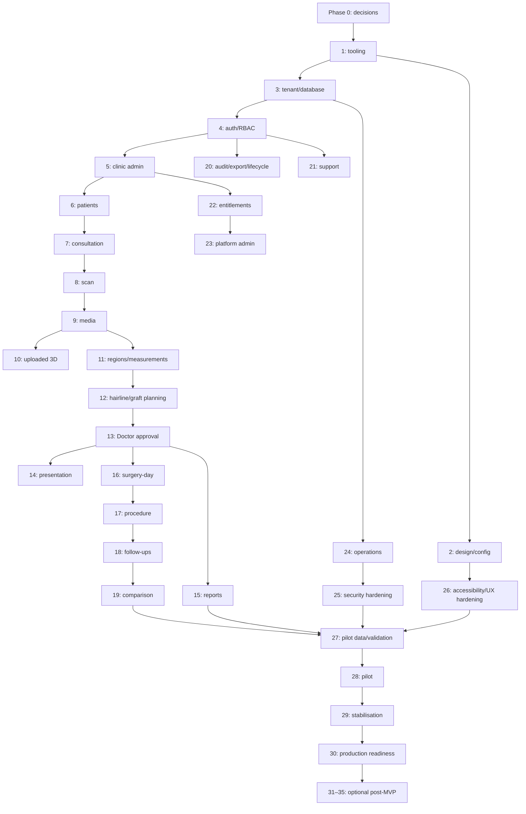

Dependencies are release constraints, not an instruction to serialize every task. Design, documentation, fixtures and test harness work can run in parallel when their inputs are stable.

## 21. Milestone Summary

| Milestone | Phases | Exit evidence |
|---|---|---|
| Documentation approved | 0 | Blocking decisions and source approvals recorded |
| Engineering foundation | 1–4 | Clean install/build/tests, isolated tenant model, auth/RBAC gates |
| Clinic and patient core | 5–7 | Manual onboarding, patient and consultation foundations |
| Capture and planning | 8–13 | Secure capture/media, manual planning, Doctor approval |
| Patient-safe consultation | 14–15 | Isolated presentation and approved report/share |
| Longitudinal clinical record | 16–19 | Surgery, procedure, follow-up and honest comparison |
| Governance/operations | 20–26 | Audit/lifecycle/support/entitlement/admin/ops/security/a11y |
| Pilot | 27–29 | Synthetic rehearsal, limited release, stabilised findings |
| Production readiness | 30 | Legal/security/operations/contracts/support gates |
| Optional intelligence/scale | 31–35 | Separately validated AI/3D/expansion |

## 22. Phase 0 — Documentation and Decisions

### Task-record format used in phases

Each task row is authoritative for these required fields:

- **Task** = Task ID and title.
- **Class** = phase; workstream; task type; priority; MVP/Post-MVP; complexity; parallelisable Yes/No; status.
- **Sources/preconditions** = source requirements and conditions needed before work.
- **Dependencies/blocking** = predecessor IDs and tasks this item blocks.
- **Scope/deliverables** = description, likely files/packages, and concrete outputs.
- **Acceptance/tests** = acceptance criteria and required verification.
- **Reviews** = security, privacy, clinical and UX considerations, including `N/A` when genuinely inapplicable.
- **Docs/exclusions** = documentation updates and explicit out-of-scope work.

No `XL` task is executable; split it first.

Unless a row overrides it, likely affected areas are inferred as follows: Foundation/Tooling → root manifests, configuration and README; UI/Design → `packages/ui`, `packages/config` and the named app; Database/Data → `packages/database` and `packages/types`; Identity/RBAC → `packages/auth`, `packages/types`, `apps/web`; clinic/patient/clinical/report/admin → `apps/web`, `packages/database`, `packages/types`, and shared UI; scan → `apps/scan` plus trusted web/domain packages; presentation → `apps/present` plus trusted web/domain packages; Operations/Security → shared configuration, provider adapters, runbooks and affected app/package tests. Actual files are confirmed at task start and unrelated areas remain excluded.

| Task | Class | Sources / preconditions | Dependencies / blocking | Scope / deliverables | Acceptance / tests | Reviews | Docs / exclusions |
|---|---|---|---|---|---|---|---|
| DOC-001 — Approve PRD and Vision | P0; Product Decision; P0; MVP; S; Yes; Not Ready | `PRD.md`, `VISION.md`; Haris review available | None; blocks all product implementation | Review scope, ownership, Pakistan launch, pilot pricing and outcomes; deliver signed decision record | No unresolved blocker is mislabelled; cross-document consistency check | Sec/Priv/Clin/UX: record relevant open items | Update changelog; no feature changes |
| DOC-002 — Approve thirteen-role model | P0; Product Decision; P0; MVP; S; Yes; Not Ready | `ROLE_PERMISSIONS.md`, PRD roles; approvers identified | DOC-001; blocks AUTH/RBAC and screens | Review roles, combined-role/separation, verification and visibility | Thirteen roles accepted; genuine ambiguities assigned | Sec critical; Privacy/Clinical role boundaries; UX capability wording | Decision record; no auth implementation |
| DOC-003 — Approve product principles and flows | P0; Product/Clinical Validation; P0; MVP; M; Yes; Not Ready | Principles and `USER_FLOWS.md` complete | DOC-001/002; blocks clinical phases | Review positive/negative/recovery/manual paths and approval | Required flows accepted by product/clinical; no role-count conflict | Full clinical/privacy/UX review | Changelog; no design/code |
| DOC-004 — Approve architecture and schema | P0; Architecture; P0; MVP; M; Yes; Not Ready | Architecture/schema drafts; engineering/security reviewers | DOC-002/003; blocks DB/tool/provider decisions | Review app/package boundaries, tenant model, versions, jobs, storage and lifecycle | No Critical contradiction; open provider/retention choices assigned | Security/RLS/privacy high; clinical semantics; UX state compatibility | ADR candidates; no migrations/provider creation |
| DOC-005 — Approve security specification | P0; Security; P0; MVP; M; Yes; Not Ready | `SECURITY.md`; risk owners | DOC-004; blocks protected implementation/production | Review 45 controls, threat model, proposed defaults and incident gates | P0 controls approved or explicitly blocking; residual risks owned | Security lead; privacy/legal; clinical disclosure; UX session effects | Security decision log; no configurations |
| DOC-006 — Approve API specification | P0; Architecture; P0; MVP; M; Yes; Not Ready | `API_SPEC.md`; prior docs accepted | DOC-004/005; blocks API implementation | Review resource/actions, token classes, errors, concurrency, idempotency and jobs | 98-section contract approved; open API choices owned | Sec/Privacy/Clinical/UX/Engineering | API decision record; no endpoint code |
| DOC-007 — Approve UI/UX guidelines | P0; Design; P0; MVP; M; Yes; Not Ready | UI/UX doc and 60-screen catalogue | DOC-003/005/006; blocks UI system | Review IA, clinical/patient-safe separation, responsive/a11y/shared device | Screen catalogue and open design decisions accepted/assigned | Design+a11y; privacy/security; Dr Sheraz/FACE | Design decision record; no assets/components |
| DOC-008 — Resolve open product/commercial decisions | P0; Product Decision; P0; MVP; M; No; Not Ready | Open-decision sections; Haris | DOC-001–007; blocks affected phases | Decide MVP providers/limits/entitlements/onboarding/export/closure boundaries | Decisions dated, owner/effective stage; pilot pricing remains non-global | Sec/Privacy/Clinical/UX as tagged | ADR/decision log; no public signup/billing automation |
| DOC-009 — Resolve clinical decisions | P0; Clinical Validation; P0; MVP; L; No; Not Ready | Clinical open items; Dr Sheraz | DOC-003/004/007; blocks phases 7–19 | Decide terminology, capture/calibration, formulas, count exceptions, reports/presentation | Approved protocols/limitations/version; synthetic cases reviewed | Security/privacy/design consulted | Clinical decision log; no medical claims |
| DOC-010 — Resolve security and privacy/legal decisions | P0; Security/Product Decision; P0; MVP; L; Yes; Not Ready | Security open decisions; qualified counsel required | DOC-005; blocks pilot/production and relevant tasks | Decide MFA/session/support/share/retention/deletion/hosting/notification duties | Written approvals or explicit production blockers | Security+privacy/legal; clinical consent; UX effects | Decision log; not legal policy/certification |
| DOC-011 — Create initial ADR set | P0; Architecture/Documentation; P1; MVP; M; Yes; Not Ready | Approved architecture/API decisions | DOC-004/006/008; blocks provider/tool specifics | ADRs for package manager, framework, DB/auth/storage, jobs/realtime, API style | Each records context/options/decision/consequences/status | Security/privacy implications included | Add ADR index later; no implementation |
| DOC-012 — Establish changelog process | P0; Documentation; P1; MVP; XS; Yes; Ready | Existing `CHANGELOG.md` | None; blocks consistent release records | Define entry categories, dates, task IDs and approval notes | Example entry reviewed; process referenced by workflow | No sensitive data in entries | Update changelog guidance only |

### Phase 0 gate

Pass when DOC-001–007 and DOC-012 are Done, all P0 decisions have owners, and implementation-blocking open items are either resolved or explicitly keep downstream tasks Not Ready.

## 23. Phase 1 — Monorepo and Tooling Foundation

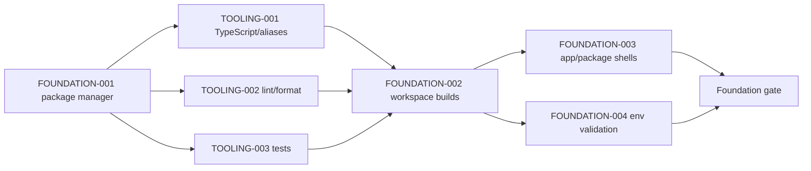

### FOUNDATION-001 — Select and configure the package manager and workspace tooling

| Field | Value |
|---|---|
| Task ID / title | FOUNDATION-001 — Select and configure the package manager and workspace tooling |
| Phase / workstream / type | Phase 1; Foundation; Architecture/Documentation |
| Priority / stage / status | P0; MVP; Ready after Phase 0 gate |
| Source requirements | README structure; `SYSTEM_ARCHITECTURE.md` monorepo; this backlog section |
| Description | Review current `package.json` and `turbo.json`; select npm or pnpm; document the choice; generate the one canonical lockfile; configure workspace commands; validate all app/package manifests; define typecheck, lint, test, build and development scripts without product features. |
| Preconditions | Phase 0 tooling decision may be recorded; clean understanding of existing placeholder manifests |
| Dependencies / blocking tasks | DOC-011 recommended; blocks all implementation and TOOLING/FOUNDATION successors |
| Likely affected | Root `package.json`, `turbo.json`, workspace manifests, lockfile, README; no feature source |
| Deliverables | Documented package-manager ADR/README choice, lockfile, foundational scripts, validated workspace graph |
| Acceptance criteria | Clean local installation succeeds; every workspace resolves; scripts exist and fail honestly when unconfigured; clean build pipeline runs for shells; assumptions/follow-ups recorded |
| Required tests | Fresh-install verification; workspace enumeration; typecheck/lint/test/build command smoke checks |
| Security / privacy / clinical / UX | No secrets or patient data; dependency provenance reviewed; no clinical/UX features |
| Documentation / out of scope | Update README setup commands and changelog; exclude auth, DB, screens, AI and product features |
| Complexity / parallel / blockers | M; No; first blocking development task |

| Task | Class | Sources / preconditions | Dependencies / blocking | Scope / deliverables | Acceptance / tests | Reviews | Docs / exclusions |
|---|---|---|---|---|---|---|---|
| TOOLING-001 — Configure TypeScript and path aliases | P1; Tooling; Architecture; P0; MVP; S; Yes; Not Ready | Architecture package boundaries; FOUNDATION-001 | FOUNDATION-001; blocks package code | Root/shared strict config, workspace extensions, aliases aligned to packages | Typecheck resolves shells and rejects fixture error | Sec: no unsafe path leakage; Privacy/Clin/UX N/A | README contributor note; no domain types |
| TOOLING-002 — Configure linting, formatting and pre-commit policy | P1; Tooling; Testing; P1; MVP; S; Yes; Not Ready | Development workflow; package manager chosen | FOUNDATION-001; blocks review gate | Shared lint/format scripts and proposed lightweight pre-commit checks | Clean repo check and intentional failing fixture | Security rule set reviewed; others N/A | Contributor guide; no mass unrelated formatting |
| TOOLING-003 — Configure test foundation | P1; Tooling; Testing; P0; MVP; M; Yes; Not Ready | Testing requirements; app runtimes known | FOUNDATION-001; blocks all feature tests | Unit/integration/browser test command boundaries and synthetic fixture policy | Empty/smoke suites execute deterministically in workspaces | No production data; a11y/security suite placeholders named | Test guide; no clinical tests yet |
| FOUNDATION-002 — Configure Turborepo task graph and shared builds | P1; Foundation; Architecture; P0; MVP; M; No; Not Ready | turbo structure and tooling configs | FOUNDATION-001, TOOLING-001–003; blocks shells/build gate | Inputs/outputs/dependencies for dev/build/typecheck/lint/test; package build contracts | Cold and repeat build pass; dependency order/caching verified | Secrets excluded from cache; no patient data | Architecture/readme; no remote cache provider |
| FOUNDATION-003 — Create minimal application and package shells | P1; Foundation; Frontend; P1; MVP; M; Yes; Not Ready | `apps/web/scan/present`, packages list | FOUNDATION-002; blocks UI/auth work | Non-feature bootable shells and package entrypoints only | Each app/package builds/imports; no product routes/features | A11y basic document; no patient/private content | README commands; exclude dashboards/auth |
| FOUNDATION-004 — Add environment validation and templates | P1; Config; Security; P0; MVP; S; Yes; Not Ready | Environment strategy, SECRET-SEC-001 | FOUNDATION-001/002; blocks providers | Typed/validated environment contract, `.env.example` update, local/staging/prod separation guidance | Missing/invalid variables fail safely; secrets absent from client/build/log | Security owner; privacy no prod data | Environment guide; no real credentials/config |
| FOUNDATION-005 — Add contributor and clean-build verification | P1; Documentation/Testing; P1; MVP; S; No; Not Ready | All Phase 1 work | FOUNDATION-002–004; blocks Phase 1 gate | Contributor setup, command reference and reproducible verification checklist | New checkout procedure passes; docs match commands | Security secret/data warnings; accessibility future checks | README/changelog; no CI deployment |

### Phase 1 gate

Clean install, formatting, lint, typecheck, tests and all shell builds pass; environments validate; no secrets are committed; contributor setup is reproducible; no product feature has entered the phase.

## 24. Phase 2 — Shared Design and Configuration Foundation

| Task | Class | Sources / preconditions | Dependencies / blocking | Scope / deliverables | Acceptance / tests | Reviews | Docs / exclusions |
|---|---|---|---|---|---|---|---|
| UI-FOUNDATION-001 — Define proposed design tokens and clinic-brand boundaries | P2; Design system; Design; P1; MVP; M; Yes; Not Ready | UX §§6–7, 77–80; UX-DESIGN-001/A11Y-001 | FOUNDATION-003, DOC-007; blocks UI primitives | Proposed typography, semantic colours, spacing, radii/shadows and brand override contract in `packages/ui/config` likely | Contrast/static token review; no semantic colour override by clinic | Design+a11y+security/privacy badges; clinical region palette consult | Design-system docs; no final hex without approval |
| UI-FOUNDATION-002 — Specify accessible interaction primitives | P2; UI; Design/Frontend; P0; MVP; M; Yes; Not Ready | UX §§52,58,67–69,76 | UI-FOUNDATION-001; blocks forms/workspaces | Behaviour contracts for button, link, field, dialog/drawer, focus, touch, reduced motion | Keyboard/focus/screen-reader prototype tests | A11y primary; security confirmation; clinical approval semantics | Component usage docs; implementation may be split |
| UI-FOUNDATION-003 — Build shared state-display primitives | P2; UI; Frontend; P0; MVP; M; Yes; Not Ready | UX §§51,59–66,69–73; UX-ERROR/OFFLINE/CONFLICT | UI-FOUNDATION-001/002; blocks all module UI | Status/privacy/approval badges, loading/empty/error/offline/conflict/success patterns | Visual/a11y state matrix passes; no colour-only status | Privacy/security/clinical approval review | Story/examples; no module logic |
| UI-FOUNDATION-004 — Build data-entry and information primitives | P2; UI; Frontend; P1; MVP; L; Yes; Not Ready | UX forms/tables/cards/tabs; API response/error conventions | UI-FOUNDATION-002/003; blocks patient/admin UI | Form groups, accessible table/list, card/panel, tabs/rail and validation summary | Responsive/keyboard/zoom/error tests | Privacy masking, clinical units, UX density | Usage docs; split implementation by primitive |
| UI-FOUNDATION-005 — Define application shells and responsive/presentation patterns | P2; UI architecture; Design/Frontend; P0; MVP; L; No; Not Ready | UX §§10–17; apps boundaries | UI-FOUNDATION-001–004; blocks feature screens | Clinic/platform shells, patient banner, scan frame, presentation-safe frame, responsive rules | Prototype at desktop/tablet/phone/LED; unauthorised nav absent | Security shared-device; privacy; a11y; clinical context | Shell docs; no feature dashboards |

### Phase 2 gate

Core primitives and shells pass design/accessibility/privacy review, can express all critical states, preserve brand boundaries, and contain no clinic-specific fork.

#### UX-DESIGN-001 technical decision

The approved technical baseline preserves the existing shared design foundation and limits clinic branding to logo, clinic identity text, and primary, secondary, link, and selected-control accents. Safety, privacy, clinical, focus, disabled, invalid, anatomical, report-integrity, and presentation lock/expiry meanings remain system-owned. WCAG 2.2 AA contrast targets and keyboard, focus, zoom/reflow, reduced-motion, forced-colour, colour-vision, grayscale, print, RTL, report, and LED/presentation fixtures are enforced by shared UI tests and `verify:ux-design-policy`.

This records technical implementation and automated evidence only. External human approval remains separate and incomplete.

## 25. Phase 3 — Database and Tenant Foundation

| Task | Class | Sources / preconditions | Dependencies / blocking | Scope / deliverables | Acceptance / tests | Reviews | Docs / exclusions |
|---|---|---|---|---|---|---|---|
| DB-001 — Select database/auth/storage development providers | P3; Data platform; Architecture; P0; MVP; M; No; Not Ready | Architecture provider criteria; DB/SECURITY open decisions | DOC-004/005/010/011, FOUNDATION gate; blocks DB projects | Provider decision and separate dev/staging project plan; likely `packages/database/config` later | Capabilities for PostgreSQL/RLS/private storage/backups verified on paper/sandbox | Security/privacy residency; cost/product; clinical N/A | ADR; no production project/data |
| DB-002 — Define migration and schema-change workflow | P3; Database; Database; P0; MVP; M; Yes; Not Ready | DATABASE_SCHEMA migration sections; SDLC | DB-001; blocks schema tasks | Migration naming/review/rollback/test workflow and environment promotion contract | Synthetic change rehearsal plan reviewed; destructive changes gated | Security/RLS/privacy retention; clinical schema review | DB contributor guide; no migrations in this task spec |
| TENANT-001 — Implement core clinic, user, membership and role foundations | P3; Tenant; Database; P0; MVP; L; No; Not Ready | Schema identity/tenant; thirteen roles; API-TENANT/RBAC | DB-001/002, Phase 1; blocks auth/patient | Core entities/constraints and seed-safe role catalogue in `packages/database` likely | Relationship/uniqueness/unit tests; two clinics and multi-membership fixtures | Security critical; privacy staff data; clinical Doctor role; UX capability needs | Schema docs/changelog; no clinical entities |
| TENANT-002 — Implement tenant-scoped constraints and RLS families | P3; Tenant security; Database/Security; P0; MVP; L; No; Not Ready | TENANT-SEC-001, RLS-SEC-001, schema RLS | TENANT-001; blocks protected modules | Deny-default policies, trusted context and composite tenant relationships | Direct DB cross-clinic read/write/update/delete tests all fail | Security approval mandatory; privacy critical | RLS catalogue; no service bypass for app |
| DB-003 — Define private storage key/path conventions | P3; Storage; Architecture/Security; P0; MVP; M; Yes; Not Ready | MEDIA-SEC-001, API-UPLOAD/DOWNLOAD, schema storage | DB-001/TENANT-001; blocks media/model/report | Opaque environment/tenant/resource object convention and metadata binding | Foreign key/path/list/access threat tests specified | Security/privacy critical; UX filenames separate | Storage design doc; no bucket provisioning |
| AUDIT-001 — Implement audit foundation and durable event contract | P3; Audit; Database/Backend; P0; MVP; L; Yes; Not Ready | AUDIT-SEC-001, API-AUDIT-001, schema audit | TENANT-001/002; blocks sensitive phases | Append-only audit/outbox base, safe payload catalogue and access boundaries | Creation/tamper/tenant/redaction tests | Security/privacy; clinical events minimal; UX timeline separate | Audit catalogue; no full feature events yet |
| TENANT-003 — Create synthetic two-clinic seed foundation | P3; Data; Data/Testing; P0; MVP; M; Yes; Not Ready | Schema seed guidance; no production data | TENANT-001/002; blocks tenant tests | Two clinics, thirteen roles, combined/multi-membership, duplicate-looking identities | Deterministic reset; no real patient/media metadata | Privacy/security review; clinical synthetic labels | Fixture guide; no real FACE patient data |
| TENANT-004 — Complete tenant isolation regression suite | P3; Testing; Security/Testing; P0; MVP; L; No; Not Ready | SECURITY threat 1/13–17/31–32; matrices | TENANT-002–003, DB-003, AUDIT-001; blocks Tenant Gate | Automated row/relationship/storage/search/cache/event/job placeholders as available | Zero cross-clinic discovery/read/write; failures produce safe evidence | Security sign-off; privacy critical | Test matrix; no feature tests beyond foundation |

### Phase 3 gate

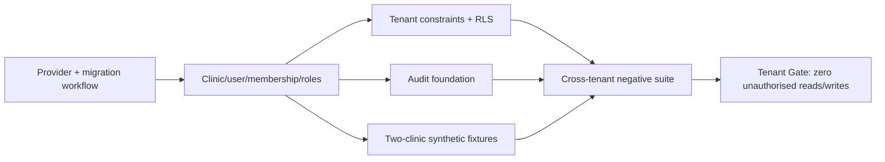

No patient or clinical entity work begins before the Tenant Gate passes.

## 26. Phase 4 — Authentication and Authorisation

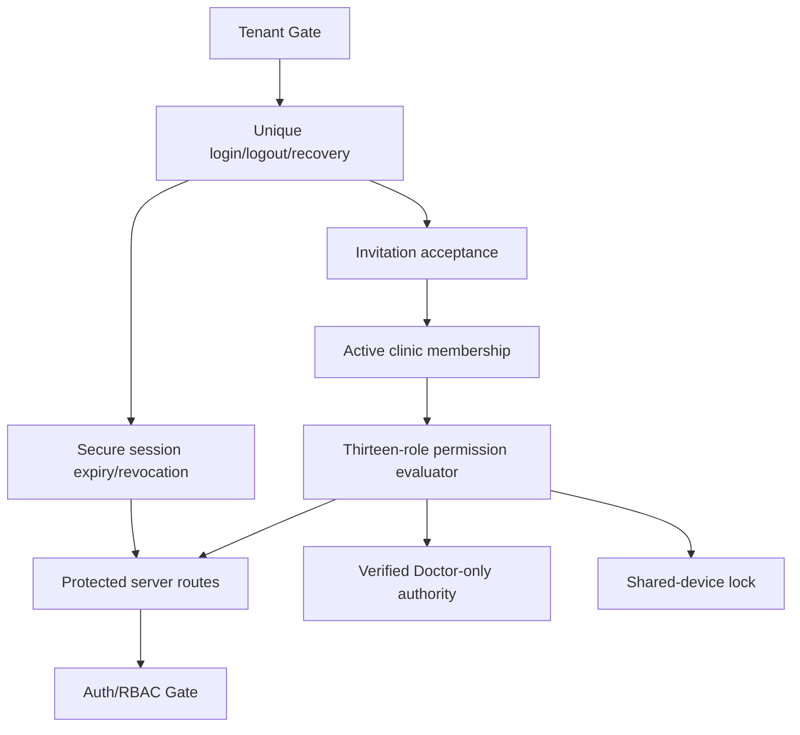

| Task | Class | Sources / preconditions | Dependencies / blocking | Scope / deliverables | Acceptance / tests | Reviews | Docs / exclusions |
|---|---|---|---|---|---|---|---|
| AUTH-001 — Implement provider-backed login and logout | P4; Identity; Backend/Frontend; P0; MVP; M; Yes; Not Ready | AUTH-SEC-001, API-AUTH-001, UX login | Tenant Gate, DB-001; blocks protected apps | Unique account login/logout, generic errors, auth events; likely `packages/auth`, web routes | Positive/invalid/enumeration/rate integration tests; logout denies reuse | Security critical; privacy logs; a11y form; clinical N/A | Auth runbook; no signup/social auth |
| AUTH-002 — Implement invitation and password recovery lifecycles | P4; Identity; Backend/Frontend; P0; MVP; L; Yes; Not Ready | Security §§19–20, API user/membership, UX screens 3–4 | AUTH-001, TENANT-001; blocks onboarding | Expiring/single-use invite/recovery, role proposal, accept/revoke/resend | Expiry/replay/enumeration/role-change tests | Security/privacy high; UX recovery; clinical Doctor verification separate | User admin docs; no public clinic signup |
| SESSION-001 — Implement secure session lifecycle | P4; Sessions; Backend/Security; P0; MVP; L; No; Not Ready | SESSION-SEC-001, proposed defaults, API auth | AUTH-001; blocks protected use | Secure cookie/session rotation, idle/absolute expiry, device list, revoke one/all | Theft/replay/expiry/rotation/revocation tests | Security primary; shared-device privacy/a11y | Session policy docs; no final durations without approval |
| AUTH-003 — Implement user deactivation and role-change propagation | P4; Identity; Backend; P0; MVP; M; Yes; Not Ready | SECURITY §23; API memberships; role doc | SESSION-001, RBAC-001; blocks clinic admin | Deactivation/reactivation, session/grant revoke, immediate permission refresh | Active requests, realtime and stale session denied | Security/privacy; clinical assignment impact; UX clear state | Offboarding runbook; no account deletion |
| RBAC-001 — Implement central permission evaluator | P4; Authorisation; Backend/Security; P0; MVP; L; No; Not Ready | ROLE_PERMISSIONS, RBAC-SEC-001, API-RBAC-001 | TENANT-002, AUTH-001; blocks all domain actions | Role/action/resource/state evaluator with membership and tenant context | Thirteen-role matrix/direct-call tests; frontend visibility not authority | Security+privacy+clinical role review; UX capabilities | Permission catalogue; no custom roles |
| RBAC-002 — Implement platform/clinic/support credential separation | P4; Authorisation; Backend/Security; P0; MVP; M; Yes; Not Ready | Roles platform boundaries; SECURITY/API token classes | RBAC-001; blocks platform/support | Separate platform metadata permission from clinical tenant access | Platform user cannot read clinical rows without future grant | Security/privacy critical; UX separate shell | Boundary docs; no support grant yet |
| APPROVAL-001 — Implement Doctor authority predicate foundation | P4; Clinical authority; Backend/Security; P0; MVP; M; Yes; Not Ready | APPROVAL-SEC-001, role Doctor rules, API approval | RBAC-001, DOC-009 verification decision; blocks Phase 13 | Reusable active same-clinic verified Doctor predicate, not approval resource yet | Non-Doctor/inactive/foreign/combined-role negative tests | Clinical+security mandatory; privacy patient relation | Authority docs; no clinical approval UI/data yet |
| AUTH-004 — Implement shared-device lock and MFA readiness | P4; Identity UX; Frontend/Security; P1; MVP; M; Yes; Not Ready | MFA-SEC-001, UX §§75/91 | SESSION-001, UI shells; blocks pilot | Lock/warning/reauth UX; provider MFA capability and privileged enrollment plan | Keyboard/timer/revocation tests; no stale patient context | Security+a11y+privacy; clinic validation | Policy/runbook; lower-role MFA final scope unresolved |
| AUTH-005 — Complete protected-route and audit suite | P4; Testing; Testing/Security; P0; MVP; L; No; Not Ready | API-AUTH/RBAC; security testing | AUTH-001–004, SESSION-001, RBAC-001/002, AUDIT-001 | Server/direct route, client visibility, membership, role, session, audit tests | All role/tenant/expiry/deactivation cases pass; events complete | Security sign-off; privacy/a11y error review | Test evidence; no domain modules |

### Phase 4 gate

Unique authentication, membership validation, thirteen-role server authorisation, Doctor predicate, session revocation/deactivation, protected routes and auth audit pass negative tests. Privileged MFA policy is approved or remains an explicit pilot blocker.

## 27. Phase 5 — Clinic Onboarding and Administration

| Task | Class | Sources / preconditions | Dependencies / blocking | Scope / deliverables | Acceptance / tests | Reviews | Docs / exclusions |
|---|---|---|---|---|---|---|---|
| CLINIC-001 — Implement manual platform clinic creation/status | P5; Clinic lifecycle; Backend/Database; P0; MVP; M; No; Not Ready | PRD onboarding; API platform admin; schema clinic | Auth/RBAC Gate; blocks clinic setup | Create clinic shell, trial/active/suspended/inactive state and audit | No public route; status transitions/tenant scope tested | Security/platform boundary; privacy contacts; UX admin | Onboarding docs; no billing |
| CLINIC-002 — Implement clinic profile/settings and validation | P5; Clinic config; Backend/Frontend; P1; MVP; L; Yes; Not Ready | UX clinic settings; schema config; API clinic admin | CLINIC-001, UI foundation | Timezone, profile, bounded settings/version/conflict | Field permission/validation/concurrency tests | Security safe config; privacy; clinical protocol fields separate; a11y | Settings guide; no arbitrary customisation |
| CLINIC-003 — Implement bounded branding | P5; Branding; Design/Frontend/Backend; P1; MVP; M; Yes; Not Ready | UX §§7/45/78/86; UX-DESIGN-001 | CLINIC-002, UI tokens | Logo/accent/report/present preview and accessibility validation | Unsafe contrast/file rejected; semantic states immutable | Security file validation; privacy contact; design/a11y | Branding guide; no custom layout/font upload |
| CLINIC-004 — Implement Clinic Owner and staff invitation management | P5; Team; Frontend/Backend; P0; MVP; L; No; Not Ready | API memberships; role doc; UX team | AUTH-002/003, CLINIC-001 | Owner invitation, staff invite/list/roles/deactivation UI/action integration | Role, expiry, separation, revocation and audit tests | Security/privacy; clinical Doctor verification; UX | Admin guide; no shared accounts |
| CLINIC-005 — Implement onboarding checklist and configuration gate | P5; Onboarding; Product/Frontend; P1; MVP; M; No; Not Ready | PRD pilot onboarding; UX screens | CLINIC-002–004; blocks patients/pilot | Checklist for identity, Owner, Doctor, timezone, protocol/template/security readiness | Cannot mark ready with blocking config; progress/audit tested | Product/clinical/security/design | Onboarding playbook; no self-service |

## 28. Phase 6 — Patient Records

| Task | Class | Sources / preconditions | Dependencies / blocking | Scope / deliverables | Acceptance / tests | Reviews | Docs / exclusions |
|---|---|---|---|---|---|---|---|
| PATIENT-001 — Implement patient entity and clinic-specific identifier | P6; Patient data; Database/Backend; P0; MVP; L; No; Not Ready | Schema patient; API-PATIENT-001; privacy decisions | Clinic Gate, Tenant Gate; blocks patient UI | Tenant-scoped patient identity/status/revision/audit | Same-clinic uniqueness and cross-clinic negative tests | Security/privacy critical; clinical approved fields; UX context | Schema/API docs as implemented; no speculative fields |
| PATIENT-002 — Implement registration and duplicate detection | P6; Registration; Backend/Frontend; P0; MVP; L; No; Not Ready | UX screens 7–8; API patient; USER_FLOWS | PATIENT-001, UI forms; blocks consultation | Register approved fields; same-clinic duplicate warning; idempotency | Duplicate-looking two-clinic fixtures; retry/idempotency tests | Privacy masking; clinical identity; a11y errors | Reception guide; no automatic merge |
| PATIENT-003 — Implement patient list, search and masking | P6; Patient navigation; Backend/Frontend; P0; MVP; L; Yes; Not Ready | UX patient list/search; API page/search; role doc | PATIENT-001, RBAC | Cursor list, tenant search, filters and role projections | Cross-clinic/search/cache/masked-field tests; responsive/a11y | Security/privacy high; UX | Search docs; no global search |
| PATIENT-004 — Implement profile and timeline shell | P6; Patient experience; Frontend/Backend; P1; MVP; L; Yes; Not Ready | UX §§22–23; flow timeline | PATIENT-001/003, AUDIT foundation | Identity summary, section placeholders and curated timeline contract | Correct role projections; no raw audit; empty/loading/error states | Privacy/clinical warnings; a11y/responsive | UI docs; no consultation content yet |
| PATIENT-005 — Implement consent/acknowledgement record foundation | P6; Privacy; Database/Backend/Frontend; P0/P1; MVP; M; Yes; Not Ready | API consent; schema; DOC-010 legal decision | PATIENT-001; blocks real pilot data as policy | Versioned notice/acknowledgement status/evidence UI and audit | Immutable event/withdrawal/permission tests | Privacy/legal mandatory; clinical/photo purposes; UX wording | Consent implementation docs; not legal conclusion |
| PATIENT-006 — Implement archive and restore | P6; Lifecycle; Backend/Frontend; P1; MVP; M; Yes; Not Ready | API archive; UX archive; DELETE-SEC | PATIENT-001/004; blocks lifecycle gate | Reversible archive/restore with status, reason and audit | Archived search/action/restore/tenant tests | Security/privacy/clinical visibility; UX confirmation | Lifecycle docs; no permanent deletion |
| PATIENT-007 — Complete patient tenant/privacy/audit tests | P6; Testing; Security/Testing; P0; MVP; M; No; Not Ready | Patient Gate requirements | PATIENT-001–006 | Direct cross-clinic CRUD/search, masking, idempotency, archive and audit suite | Zero foreign disclosure; events complete; accessibility smoke | Security/privacy sign-off; clinical field review | Gate evidence |

### Patient-to-consultation dependency

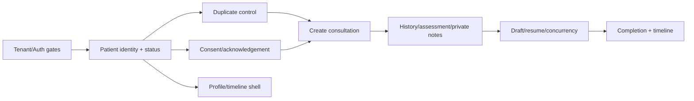

## 29. Phase 7 — Consultation Foundation

| Task | Class | Sources / preconditions | Dependencies / blocking | Scope / deliverables | Acceptance / tests | Reviews | Docs / exclusions |
|---|---|---|---|---|---|---|---|
| CONSULT-001 — Implement consultation entity/status/Doctor assignment | P7; Consultation; Database/Backend; P0; MVP; L; No; Not Ready | Schema consultation; API-CONSULT-001; flows | Patient Gate; blocks workspace | Patient-bound episode, assignment, draft/status/revision/audit | Tenant/patient/status/idempotency tests | Security; privacy; clinical status; UX stage | Domain docs; no capture/planning |
| CONSULT-002 — Implement consultation creation and workspace shell | P7; Clinical UI; Frontend/Backend; P1; MVP; L; Yes; Not Ready | UX workspace; 60 screens; API consult | CONSULT-001, UI shell | New consultation, sticky context, workflow rail, save indicators and placeholders | Responsive/a11y/permission/empty/error tests | Privacy/clinical/design | UI docs; modules remain placeholders |
| CONSULT-003 — Implement medical/hair-loss history and private Doctor notes | P7; Clinical record; Database/Backend/Frontend; P0; MVP; L; No; Not Ready | Schema/flows; role field boundaries; API history | CONSULT-001, DOC-009/010 fields; blocks assessment | Versioned approved structured/narrative fields and separate Doctor-private projection | Role/masking/version/tenant tests; no patient-safe leak | Clinical+privacy+security mandatory; UX labels | Field catalogue; no speculative diagnosis |
| CONSULT-004 — Implement preliminary assessment draft/resume | P7; Clinical workflow; Backend/Frontend; P1; MVP; M; Yes; Not Ready | Flow consultation; UX error/offline | CONSULT-002/003 | Draft saving, resume, preliminary labels, manual notes, failure recovery | Save/retry/conflict/session tests | Clinical wording; privacy; a11y | Workflow guide; no final approval |
| CONSULT-005 — Implement optimistic concurrency | P7; Integrity; Backend/Frontend; P0; MVP; M; Yes; Not Ready | API-CONCURRENCY-001; UX-CONFLICT-001 | CONSULT-001/002; reused downstream | Revision tokens, stale-write rejection, safe compare/reload/copy state | Two-editor tests; no silent overwrite | Security/integrity; clinical reapproval prep; UX/a11y | Concurrency pattern docs |
| CONSULT-006 — Implement consultation completion and timeline events | P7; Workflow; Backend/Frontend; P1; MVP; M; No; Not Ready | Flow completion/recovery; API status transitions | CONSULT-003–005 | Completeness checklist, authorised exception, complete/reopen and timeline | Missing required evidence blocks; audit/timeline/version tests | Clinical gate; privacy; UX | Workflow docs; no Doctor plan approval |
| CONSULT-007 — Complete consultation role/recovery tests | P7; Testing; Testing/Security; P0; MVP; M; No; Not Ready | Consultation Gate subset | CONSULT-001–006 | Role fields, private notes, tenant, draft, conflict, completion and interruption suite | All negative/recovery cases pass | Security/clinical/design approval | Gate evidence |

## 30. Phase 8 — Mobile Scan and Pairing

| Task | Class | Sources / preconditions | Dependencies / blocking | Scope / deliverables | Acceptance / tests | Reviews | Docs / exclusions |
|---|---|---|---|---|---|---|---|
| SCAN-001 — Implement scan-session lifecycle and short-lived token | P8; Scan security; Backend/Database; P0; MVP; L; No; Not Ready | SCAN-SEC-001; API-SCAN-001; schema session | Consultation Gate, auth/token foundations; blocks scan UI | One clinic/patient/consultation/session, code/QR verifier, expiry/revoke/status/audit | Guess/replay/foreign/expired/revoked token tests | Security/privacy critical; clinical context; UX expiry | Session docs; no media bytes yet |
| SCAN-002 — Implement pairing and patient confirmation | P8; Scan UX; Frontend/Backend; P0; MVP; L; No; Not Ready | UX-SCAN/PATIENT; screens 13–14; flows | SCAN-001, UI scan frame | Laptop pairing, phone redemption, abbreviated identity confirmation and session marker | Wrong-patient/session-change/one-time redemption/a11y tests | Security/privacy/clinical/UX/FACE | Pairing guide; no patient list/search |
| SCAN-003 — Implement capture checklist and camera permission flow | P8; Mobile capture; Frontend; P1; MVP; L; Yes; Not Ready | UX §§25–27; DOC-009 capture protocol | SCAN-002, clinical protocol decision | Required/optional view checklist, guide, permission, capture/local review/retake | Target phone/browser/touch/orientation/permission tests | Clinical protocol+design+a11y+privacy | Capture guide; no final quality AI |
| SCAN-004 — Implement realtime session/capture event contract | P8; Realtime; Backend; P0; MVP; L; Yes; Not Ready | API-REALTIME-001; architecture realtime | SCAN-001/002; blocks live laptop progress | Scoped channels, event IDs/sequence/dedupe, connection acknowledgement | Cross-tenant/channel/replay/gap/reconnect tests | Security critical; privacy minimal payload; UX | Event docs; no global broadcasts |
| SCAN-005 — Implement reconnect, expiry, revoke and local cleanup UX | P8; Recovery; Frontend/Backend; P0; MVP; L; No; Not Ready | UX-OFFLINE-001; Security session defaults | SCAN-003/004 | Local/pending/confirmed state, revalidation, reissue, revoke, cleanup | Background/offline/expiry/device revoke tests; no false Saved | Security/privacy/shared device; clinical no lost confirmed work | Recovery runbook; no indefinite offline |
| SCAN-006 — Complete scan security/device suite | P8; Testing; Security/Testing; P0; MVP; L; No; Not Ready | Threats 9–12; test matrix | SCAN-001–005 | Pair replay, brute limits, wrong patient, token classes, event duplicates, device matrix | Zero cross-patient/clinic; expiry/revoke immediate; a11y pass | Security/clinical/design/FACE sign-off | Gate evidence |

### Scan-to-planning dependency

```mermaid
flowchart LR
  Session["Secure scan session"] --> Pair["Pair + patient confirm"]
  Pair --> Capture["Guided capture"]
  Capture --> Upload["Private pending upload"]
  Upload --> Verify["Validate/process media"]
  Verify --> Review["Clinical media review"]
  Review --> Model["Optional uploaded 3D"]
  Review --> Region["Manual regions"]
  Model --> Region
  Region --> Measure["Measurements"]
  Measure --> Plan["Hairline + graft plan"]
```

## 31. Phase 9 — Clinical Media Management

| Task | Class | Sources / preconditions | Dependencies / blocking | Scope / deliverables | Acceptance / tests | Reviews | Docs / exclusions |
|---|---|---|---|---|---|---|---|
| MEDIA-001 — Implement pending media and signed upload authorisation | P9; Media; Database/Backend/Security; P0; MVP; L; No; Not Ready | MEDIA/FILE-SEC-001, API-UPLOAD-001, schema media | Scan Gate, DB-003; blocks all media | Pending record, category/context, private object grant, opaque key, expiry | Wrong tenant/patient/type/size/grant/list tests | Security/privacy critical; clinical categories; UX progress | Upload contract; no public URL |
| MEDIA-002 — Implement finalisation, checksum and validation pipeline | P9; Media processing; Backend/Operations; P0; MVP; L; No; Not Ready | API file flow; SECURITY §§36–37 | MEDIA-001, job foundation; blocks Ready media | Receipt/checksum/MIME/signature/dimension/orientation/metadata/duplicate/quarantine states | Malformed/oversized/duplicate/replay/orphan tests | Security file review; privacy metadata; clinical source preservation | Processor docs; malware provider separately approved |
| MEDIA-003 — Implement thumbnails, categories and capture completion | P9; Media UX; Backend/Frontend; P1; MVP; L; Yes; Not Ready | UX media review; flow capture | MEDIA-002, SCAN checklist | Trusted derivatives, clinical view/category linkage and required-view completion | Original immutable; derivative/protocol/status tests | Clinical protocol; privacy patient-safe candidate; a11y images | Media guide; no AI quality |
| MEDIA-004 — Implement resumable failure recovery and review | P9; Recovery; Frontend/Backend; P0; MVP; L; No; Not Ready | UX offline/media; API retry | MEDIA-001–003 | Retry/finalise reconciliation, failed/rejected/retake, review and draft deletion workflow | Timeout-after-upload, offline, stale session, wrong attachment tests | Security/privacy; clinical review; UX truthful sync | Recovery docs; no permanent clinical deletion |
| MEDIA-005 — Complete storage isolation suite | P9; Testing; Security/Testing; P0; MVP; M; No; Not Ready | MEDIA-SEC, storage threats | MEDIA-001–004 | Direct object, signed URL, prefix, listing, cache and Ready-state negative tests | Copied reference grants no unauthorised access | Security sign-off | Gate evidence |

## 32. Phase 10 — Uploaded 3D Model Support

| Task | Class | Sources / preconditions | Dependencies / blocking | Scope / deliverables | Acceptance / tests | Reviews | Docs / exclusions |
|---|---|---|---|---|---|---|---|
| MODEL-001 — Implement private GLB/GLTF model records and validation | P10; 3D; Database/Backend; P1; MVP; L; No; Not Ready | MODEL-SEC/API-MODEL-001; schema model | Media Gate; blocks viewer | Uploaded model/version/provenance/compatibility/metadata and safe format limits | Malformed/external-resource/oversized/foreign tests | Security processor; privacy; clinical scale; UX | Model support matrix; no reconstruction |
| MODEL-002 — Implement accessible 3D viewer states | P10; 3D UX; Frontend; P1; MVP; L; Yes; Not Ready | UX-MODEL-001, UX §§29/84 | MODEL-001, UI primitives | Rotate/zoom/pan/reset/views, loading/failure/version/calibration and static fallback | Device/WebGL/keyboard/reduced-motion/failure tests | A11y/design; clinical limitation; privacy | Viewer guide; no measurement authority |
| MODEL-003 — Implement screenshots and patient-safe model projection | P10; 3D disclosure; Backend/Frontend; P1; MVP; M; No; Not Ready | Presentation/report model requirements | MODEL-001/002; blocks present/report model use | Version-bound screenshot candidates and safe-view restrictions | Internal overlays excluded; source/version audited | Security/privacy/clinical/design | Disclosure docs; no automatic selection |

## 33. Phase 11 — Scalp Regions and Measurements

| Task | Class | Sources / preconditions | Dependencies / blocking | Scope / deliverables | Acceptance / tests | Reviews | Docs / exclusions |
|---|---|---|---|---|---|---|---|
| REGION-001 — Implement versioned scalp-region domain | P11; Regions; Database/Backend; P0; MVP; L; No; Clinical Review | Schema regions; API region; UX region | Media Gate; model optional; blocks geometry UI | Patient/source/coordinate/method/status/version and immutable lineage | Cross-source/tenant/version/state tests | Security; privacy; clinical region types; UX | Domain docs; no AI suggestions; provisional taxonomy and approval semantics await clinical review |
| REGION-002 — Implement manual region editor | P11; Regions; Frontend; P1; MVP; L; No; Not Ready | UX §30, UX-A11Y | REGION-001, UI canvas decision | Draw/close/edit/move/undo/redo/hide/delete draft/submit with labels/patterns | Geometry, undo, keyboard alternative, conflict tests | Clinical/design/a11y/privacy | Editor guide; no auto segmentation |
| MEASURE-001 — Implement manual/calculated measurement versions | P11; Measurements; Database/Backend; P0; MVP; L; No; Not Ready | API measurement, UX-MEASURE, schema | REGION-001; blocks planning | Value/unit/method/source/calibration/precision/stage/version with unavailable state | No scale→no cm²; unit/source/revision tests | Clinical mandatory; security; privacy; UX | Measurement method docs |
| MEASURE-002 — Implement measurement review UI and material-change invalidation | P11; Measurements; Frontend/Backend; P0; MVP; M; No; Not Ready | UX §31, approval preparation | MEASURE-001, CONSULT concurrency | Review/source labels, preliminary/final, stale/invalidate and submit | Source/calibration change invalidates dependent final candidate | Clinical+UX+a11y | Review docs; Doctor approval occurs Phase 13 |

## 34. Phase 12 — Hairline and Graft Planning

| Task | Class | Sources / preconditions | Dependencies / blocking | Scope / deliverables | Acceptance / tests | Reviews | Docs / exclusions |
|---|---|---|---|---|---|---|---|
| HAIRLINE-001 — Implement versioned manual hairline design | P12; Hairline; Database/Frontend/Backend; P0; MVP; L; No; Not Ready | Schema/API/UX hairline | Region/measurement gate; blocks plan/review | Existing/proposed lines, control points, landmarks, options, sources, illustrative label/version | Undo/conflict/source/tenant/accessibility tests | Clinical/design/privacy/security | Tool guide; no AI hairline |
| PLAN-002 — Invalidate stale planning after an upstream geometry revision | P12; Planning integrity; Database/Backend; P0; MVP; XS; No; Clinical Review | Planning foundation; API revision/version principles | Planning foundation; required before approval reuse | Controlled same-clinic Doctor operation marks calculated/finalized packages stale when geometry advances, preserving revision, idempotency, and audit history | Newer geometry revision, stale-state, stale-revision, replay, foreign-clinic and audit contract tests | Security review required; clinical review of applicability semantics remains open | Migration/package contract and changelog; no density or measurement rules |
| GRAFT-001 — Implement transparent graft-plan domain and zone calculation | P12; Planning; Database/Backend; P0; MVP; L; No; Not Ready | API-GRAFT-001; UX-GRAFT; clinical decisions | MEASURE-001, HAIRLINE-001; blocks approval | Zone area/density/formula/estimate/range/Doctor adjustment/final candidate/version | Units/formula/range/source/tenant tests; no hidden defaults | Clinical mandatory; security/privacy | Formula/version docs; no procedure actuals |
| GRAFT-002 — Implement planning UI, warnings and patient-safe summary candidate | P12; Planning UX; Frontend; P0; MVP; L; Yes; Not Ready | UX §§32–33, patient-safe principle | GRAFT-001, UI tables/status | Zone table, formula disclosure, donor note, adjustment reason, preliminary labels and safe summary candidate | Planned distinct from actuals; responsive/a11y/conflict tests | Clinical/design/privacy/security | Planning guide; no final approval |
| PLANNING-001 — Complete manual-fallback planning journey | P12; Integration; Testing; P0; MVP; M; No; Not Ready | Vision/manual fallback; consultation flow | REGION/MEASURE/HAIRLINE/GRAFT tasks | End-to-end manual path without 3D/AI | Synthetic consultation completes to submitted plan | Clinical/FACE/design/security | Gate evidence |

## 35. Phase 13 — Doctor Approval and Versioning

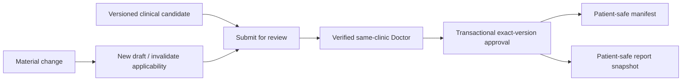

| Task | Class | Sources / preconditions | Dependencies / blocking | Scope / deliverables | Acceptance / tests | Reviews | Docs / exclusions |
|---|---|---|---|---|---|---|---|
| APPROVAL-002 — Implement reusable approval/version domain | P13; Approval; Database/Backend; P0; MVP; L; No; Not Ready | APPROVAL-SEC/API approval; schema | APPROVAL-001, planning versions, AUDIT; blocks present/reports/surgery | Submit/reject/approve/amend/supersede with exact source/dependency revisions and actor/time | Transaction/concurrency/idempotency/foreign/non-Doctor tests | Security+clinical critical; privacy; UX | Approval contract; no report generation |
| APPROVAL-003 — Implement Doctor review component and notifications | P13; Approval UX; Frontend/Backend; P0; MVP; L; Yes; Not Ready | UX-APPROVAL-001/§35/69 | APPROVAL-002, UI states | Patient/version/source/change/warning/consequence review; approve/reject reason; review notification | Keyboard/a11y/role/stale state tests | Clinical/design/security/privacy | Usage guide |
| APPROVAL-004 — Implement material-change detection and reapproval | P13; Integrity; Backend/Testing; P0; MVP; L; No; Not Ready | Product version principles; schema dependencies | APPROVAL-002; blocks safe downstream use | Dependency revision rules, new draft and current-approved pointers | Every material edit prevents old approval applying to new content | Clinical/security sign-off | Rule catalogue |
| APPROVAL-005 — Complete approval-bypass suite | P13; Testing; Security/Clinical Validation; P0; MVP; M; No; Not Ready | SECURITY threat 41; API/UX tests | APPROVAL-002–004 | Direct request, combined role, stale, replay, source change and notification tests | Zero unauthorised final approval; audit complete | Security+Dr Sheraz | Gate evidence |

## 36. Phase 14 — Presentation Mode

| Task | Class | Sources / preconditions | Dependencies / blocking | Scope / deliverables | Acceptance / tests | Reviews | Docs / exclusions |
|---|---|---|---|---|---|---|---|
| PRESENT-001 — Implement approved presentation manifests | P14; Disclosure; Database/Backend; P0; MVP; L; No; Not Ready | PRESENT-SEC/API/UX; schema manifest | Approval Gate, model screenshot candidate; blocks session | One patient/consultation, allowlisted exact approved items/order/version/audit | Internal/foreign/unapproved items rejected | Security/privacy/clinical critical | Manifest docs |
| PRESENT-002 — Implement temporary presentation sessions and realtime control | P14; Presentation; Backend/Security; P0; MVP; L; No; Not Ready | API-PRESENT/REALTIME; session policy | PRESENT-001, realtime foundation | Create/pair/control/acknowledge/expire/revoke one display; scoped events | Token replay/cross-tenant/sequence/expiry/revoke tests | Security/privacy; clinical control | Session/runbook; no general patient API |
| PRESENT-003 — Implement waiting, patient-safe LED and lock screens | P14; Presentation UX; Frontend/Design; P0; MVP; L; Yes; Not Ready | UX-PRESENT-001, screens 27–28 | PRESENT-001/002, UI presentation shell | Waiting/pair/loading/visual/3D/region/hairline/graft/lock states | Target LED/contrast/overscan/disconnect/cache/a11y tests | Design+a11y+clinical+privacy | Operator guide; no downloads/search |
| PRESENT-004 — Complete presentation disclosure suite | P14; Testing; Security/Privacy; P0; MVP; M; No; Not Ready | Threat 6; patient-safe checklist | PRESENT-001–003 | Negative content, browser cache/history, expiry/revoke and shared display tests | Zero internal/contact/note/control exposure | Security/privacy/clinical/FACE | Gate evidence |

## 37. Phase 15 — Report Generation and Sharing

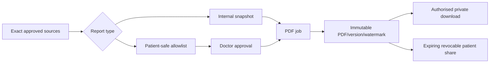

| Task | Class | Sources / preconditions | Dependencies / blocking | Scope / deliverables | Acceptance / tests | Reviews | Docs / exclusions |
|---|---|---|---|---|---|---|---|
| REPORT-001 — Implement internal and patient-safe report/version domains | P15; Reports; Database/Backend; P0; MVP; L; No; Not Ready | REPORT-SEC/API-REPORT; schema | Approval Gate; blocks builder | Separate disclosure class, sources, snapshots, status/version/report number | Internal cannot become patient share; tenant/version tests | Security/privacy/clinical | Domain docs |
| REPORT-002 — Implement report builder and exact Doctor approval | P15; Report UX; Frontend/Backend; P0; MVP; L; No; Not Ready | UX-REPORT-001/screens 29–30 | REPORT-001, APPROVAL reusable | Content checklist, clinic branding/Doctor snapshot, preview, submit/reject/approve | Unsafe content blocked; a11y/role/stale tests | Dr Sheraz/privacy/design/security | Template guide; wording approval required |
| REPORT-003 — Implement PDF job, watermark and failure recovery | P15; Processing; Backend/Operations; P0; MVP; L; Yes; Not Ready | API report jobs; UX report standards | REPORT-001/002, job/media | Immutable render, checksum, version, metadata sanitisation, status/retry | Deterministic snapshot; no hidden fields; failure preserves approval/source | Security/privacy/design/a11y PDF | Worker/runbook; no provider assumption |
| REPORT-004 — Implement private download and report sharing | P15; Delivery; Backend/Frontend/Security; P0; MVP; L; No; Not Ready | API report share; SECURITY §§32–34 | REPORT-003; blocks Report Gate | Current-approved eligibility, expiring hashed token, recipient/expiry/download/revoke/audit | Forward/replay/expiry/revoke/supersede/rate tests | Security/privacy/legal/clinical UX | Sharing guide; no internal share/WhatsApp automation |
| REPORT-005 — Implement correction, supersession and history | P15; Versioning; Backend/Frontend; P1; MVP; M; Yes; Not Ready | UX report history; schema lineage | REPORT-003/004 | Correct-to-new-draft, reapprove, supersede, preserve delivery history | Old version clearly superseded; links obey policy | Clinical/privacy/design | History docs |
| REPORT-006 — Complete disclosure and PDF test suite | P15; Testing; Security/Privacy/QA; P0; MVP; L; No; Not Ready | Threats 7/8/40; Report Gate | REPORT-001–005 | Internal leakage, approval bypass, metadata, cache, share lifecycle, visual PDF tests | Zero patient-share exposure of internal content | Security/privacy/Dr Sheraz/design | Gate evidence |

## 38. Phase 16 — Surgery-Day Assessment

| Task | Class | Sources / preconditions | Dependencies / blocking | Scope / deliverables | Acceptance / tests | Reviews | Docs / exclusions |
|---|---|---|---|---|---|---|---|
| SURGERY-001 — Implement surgery-day episode and preserved consultation reference | P16; Surgery; Database/Backend; P0; MVP; L; No; Not Ready | Schema/API/flows surgery-day | Approval/Patient gates; blocks procedure | Reopen patient, new dated episode, exact preliminary plan link, status/revision | Original consultation immutable; tenant/version tests | Clinical+security+privacy | Domain docs |
| SURGERY-002 — Implement final capture/regions/measurements/hairline/allocation workflow | P16; Clinical workflow; Frontend/Backend; P0; MVP; L; No; Not Ready | USER_FLOWS, UX §36, DOC-009 | SURGERY-001, capture/planning reusable | Shaved protocol, calibration, final sources and comparison/deviation | Manual path works; changes explicit; concurrency tests | Dr Sheraz/FACE/design/security | Clinical protocol |
| SURGERY-003 — Implement final surgical plan approval and acknowledgement | P16; Approval; Backend/Frontend; P0; MVP; M; No; Not Ready | APPROVAL pattern; acknowledgement decision | SURGERY-002, APPROVAL | Exact Doctor approval and separate patient acknowledgement if approved | Non-Doctor/stale/missing acknowledgement policy tests | Clinical/privacy/legal/security/UX | Approval docs |

## 39. Phase 17 — Procedure Documentation

| Task | Class | Sources / preconditions | Dependencies / blocking | Scope / deliverables | Acceptance / tests | Reviews | Docs / exclusions |
|---|---|---|---|---|---|---|---|
| PROC-001 — Implement procedure/team/timing domain | P17; Procedure; Database/Backend; P0; MVP; L; No; Not Ready | Schema/API procedure; role fields | Surgery Gate; blocks counts | Link approved plan, surgeon/team, start/status/timing/revision/audit | Cannot use unapproved/foreign plan; team permission tests | Clinical/security/privacy | Domain docs |
| PROC-002 — Implement append/correct graft count events | P17; Counts; Database/Backend/Frontend; P0; MVP; L; No; Not Ready | API Graft Count; UX-PROC | PROC-001; blocks reconciliation | Extracted by type, discarded, implanted by zone, corrections/reasons/live totals | Idempotency/concurrency/arithmetic/role tests | Clinical critical; security; UX touch/a11y | Count definitions |
| PROC-003 — Implement usable calculation and reconciliation | P17; Integrity; Backend/Frontend; P0; MVP; L; No; Not Ready | UX §38; clinical exception decision | PROC-002; blocks completion | Planned/extracted/discarded/usable/implanted/difference equation, balanced/review/exception states | Mismatch blocks silent completion; exact exception/Doctor path | Dr Sheraz+security+design | Reconciliation rules |
| PROC-004 — Implement deviations and postoperative record/media | P17; Clinical record; Backend/Frontend; P1; MVP; L; Yes; Not Ready | API post-op; UX §37 | PROC-001, MEDIA; blocks final review | Deviations, sources, postoperative images, instructions version and draft | Field permissions/source/version/failure tests | Clinical/privacy/security/design | Workflow guide |
| PROC-005 — Implement Doctor review and immutable procedure snapshot | P17; Approval; Backend/Frontend; P0; MVP; M; No; Not Ready | Approval/API procedure | PROC-003/004 | Completeness review, exact counts/exceptions/post-op version and approval | Non-Doctor/stale/unbalanced-without-exception tests | Clinical+security | Approval docs |
| PROC-006 — Complete procedure integration suite | P17; Testing; Clinical/QA/Security; P0; MVP; L; No; Not Ready | Procedure Gate | PROC-001–005 | Role, offline/conflict, arithmetic, audit, source immutability and UI tests | All count concepts remain distinct and reconcilable | Dr Sheraz/FACE/security/design | Gate evidence |

## 40. Phase 18 — Follow-Ups

| Task | Class | Sources / preconditions | Dependencies / blocking | Scope / deliverables | Acceptance / tests | Reviews | Docs / exclusions |
|---|---|---|---|---|---|---|---|
| FOLLOW-001 — Implement configurable follow-up schedule and status | P18; Follow-up; Database/Backend; P1; MVP; M; Yes; Not Ready | Schema/API/UX follow-up | Procedure domain; blocks visit list | Clinic-configurable checkpoints, scheduled/missed/rescheduled/unscheduled and next visit | Timezone/status/config/tenant tests | Clinical protocol; privacy; UX | Schedule docs; listed checkpoints not hard-coded medical rules |
| FOLLOW-002 — Implement follow-up visit, capture and observations | P18; Clinical workflow; Backend/Frontend; P0; MVP; L; No; Not Ready | UX §39; flows | FOLLOW-001, capture/media reusable | Actual date, standard images, conditions, donor/recipient observations, patient report, drafts | Role/source/offline/conflict/a11y tests | Clinical+privacy+design/FACE | Visit guide |
| FOLLOW-003 — Implement Doctor assessment, next follow-up and report link | P18; Clinical approval; Backend/Frontend; P1; MVP; M; No; Not Ready | API follow-up; approval/report patterns | FOLLOW-002 | Doctor section/version, next schedule, optional report draft and timeline event | Staff cannot write Doctor assessment; report approval separate | Clinical/security/privacy | Workflow docs |
| FOLLOW-004 — Complete follow-up lifecycle tests | P18; Testing; QA/Clinical; P1; MVP; M; No; Not Ready | Clinical validation matrix | FOLLOW-001–003 | Due/missed/unscheduled/media/timeline/permissions/manual recovery | Synthetic checkpoints pass; no implied outcome | Dr Sheraz/FACE | Evidence |

## 41. Phase 19 — Longitudinal Comparison

| Task | Class | Sources / preconditions | Dependencies / blocking | Scope / deliverables | Acceptance / tests | Reviews | Docs / exclusions |
|---|---|---|---|---|---|---|---|
| COMPARE-001 — Implement baseline/source selection and suitability metadata | P19; Comparison; Database/Backend; P1; MVP; M; No; Not Ready | API/UX comparison; product honest claims | FOLLOW-002, media; blocks workspace | Exact baseline/follow-up views, dates/stages/conditions/alignment/suitability/version | Foreign/incompatible/stale sources rejected | Clinical/privacy/security | Suitability docs; no growth claim |
| COMPARE-002 — Implement side-by-side, slider, overlay and timeline | P19; Comparison UX; Frontend; P1; MVP; L; Yes; Not Ready | UX §40/82/83; accessibility | COMPARE-001 | Standard-angle grouping, modes, warnings and keyboard/static alternatives | Responsive/a11y/source-label tests; reduced reliability visible | Clinical/design/a11y/privacy | Usage guide; 3D only if compatible |
| COMPARE-003 — Implement patient-safe comparison candidate and progress report path | P19; Disclosure; Backend/Frontend; P1; MVP; M; No; Not Ready | Report/presentation patient-safe rules | COMPARE-001/002, REPORT domain | Reviewed candidate with exact sources/limitations; optional report draft | Cannot share without report/Doctor approval | Clinical/privacy/security/design | Disclosure docs |
| COMPARE-004 — Validate no unsupported outcome claims | P19; Clinical Validation/Testing; P0; MVP; S; No; Not Ready | Vision/PRD/UX claim principles | COMPARE-002/003 | Copy/visual/source-condition review and inconsistent-image cases | No quantitative claim from unsuitable sources | Dr Sheraz+privacy/design | Evidence |

## 42. Phase 20 — Audit, Export, Archive, and Deletion

| Task | Class | Sources / preconditions | Dependencies / blocking | Scope / deliverables | Acceptance / tests | Reviews | Docs / exclusions |
|---|---|---|---|---|---|---|---|
| AUDIT-002 — Implement domain audit catalogue and role-based read views | P20; Audit; Backend/Frontend; P0; MVP; L; Yes; Not Ready | AUDIT-SEC/API-AUDIT; UX §73 | AUDIT-001, domain actions; blocks governance gate | Events for sensitive actions; tenant/patient/action/date filters and masking | Completeness/tamper/cross-tenant/access tests | Security/privacy; UX a11y; clinical content minimised | Audit catalogue |
| EXPORT-001 — Implement governed export request/approval/job | P20; Export; Backend/Database; P0; MVP; L; No; Not Ready | EXPORT-SEC/API-EXPORT; ownership | Core domains, jobs, DOC-010 policy; blocks download | Scope manifest, authority/step-up/separation, protected package job/status | Cross-tenant/platform-IP/hold/idempotency tests | Security/privacy/legal/product | Export format/runbook |
| EXPORT-002 — Implement expiring export delivery and cleanup | P20; Export delivery; Backend/Frontend; P0; MVP; M; No; Not Ready | API download; UX export | EXPORT-001 | Named notification, private expiring grant, download audit, expiry/cleanup | Revoked/expired/foreign/shared-device tests | Security/privacy/UX | Operator guide |
| DELETE-001 — Implement archive/restore across eligible resources | P20; Lifecycle; Backend/Frontend; P1; MVP; M; Yes; Not Ready | DELETE-SEC/API archive; UX §49 | Domain archive states | Consistent reversible action/status/reason/audit | Permission/relationship/restore tests | Security/privacy/clinical visibility | Lifecycle docs |
| DELETE-002 — Implement deletion request, hold, approval and schedule | P20; Deletion; Database/Backend/Frontend; P0; MVP; L; No; Not Ready | DELETE-SEC/API deletion; DOC-010 | Retention/legal decision, DELETE-001; blocks execution | Multi-stage scope/reason/hold/separation/cancel/schedule states | Simple DELETE impossible; hold/stale/role/idempotency tests | Privacy/legal+security+clinical+UX | Policy mapping; no execution before approval |
| DELETE-003 — Implement deletion worker and backup/tombstone reconciliation | P20; Deletion operations; Backend/Operations; P0; MVP; L; No; Not Ready | Security §§70–77; schema lifecycle | DELETE-002, backup foundation; production blocker | Scoped manifest, derived/storage/share/session cleanup and restore reconciliation | Rehearsal proves no foreign deletion and approved residual backup handling | Security/privacy/legal/operations | Runbook/evidence |

## 43. Phase 21 — Support Access

| Task | Class | Sources / preconditions | Dependencies / blocking | Scope / deliverables | Acceptance / tests | Reviews | Docs / exclusions |
|---|---|---|---|---|---|---|---|
| SUPPORT-001 — Implement support request and approval domain | P21; Support; Database/Backend; P0; MVP; L; No; Not Ready | SUPPORT-SEC/API/roles; policy decision | Auth/RBAC, DOC-010; blocks activation | Named engineer, clinic/module/patient/actions/reason/duration/approver/status/audit | Self/broad/foreign/invalid-duration tests | Security/privacy/clinical/product | Grant policy docs |
| SUPPORT-002 — Implement activation, banner, expiry and revoke | P21; Support UX; Backend/Frontend; P0; MVP; L; No; Not Ready | UX §47; API support | SUPPORT-001, session/audit | User identity+grant recheck, persistent scope banner, immediate expiry/revoke | Every sensitive action matches grant; client/realtime revoke tests | Security/privacy/design/a11y | Support runbook |
| SUPPORT-003 — Implement event review and forbidden-action controls | P21; Support governance; Backend/Testing; P0; MVP; M; No; Not Ready | Role permissions; threat 5/49 | SUPPORT-002 | Clinic-visible events; deny Doctor approval, roles, share, unrestricted export/delete | Bypass/direct-call tests pass | Security+clinic+clinical | Post-access review guide |

## 44. Phase 22 — Subscription Entitlements and Usage

| Task | Class | Sources / preconditions | Dependencies / blocking | Scope / deliverables | Acceptance / tests | Reviews | Docs / exclusions |
|---|---|---|---|---|---|---|---|
| ENTITLEMENT-001 — Implement plan definitions and clinic subscription state | P22; Entitlements; Database/Backend; P1; MVP; M; No; Not Ready | PRD pilot offer; API entitlement; UX §50 | Clinic domain, product decisions | Trial/active/suspended/inactive, effective plan/version/manual activation | State/tenant/audit tests; pilot pricing not global constant without decision | Product/security/privacy | Commercial ops docs; no billing/payment |
| ENTITLEMENT-002 — Implement feature/user/storage/consultation limits | P22; Entitlements; Backend; P1; MVP; L; No; Not Ready | PRD limits unresolved; API entitlements | ENTITLEMENT-001 | Central capability/limit checks and approved override lineage | Limits cannot weaken safety/export ownership; boundary tests | Product/security/UX | Catalogue; exact limits proposed |
| ENTITLEMENT-003 — Implement minimum usage events/dashboard | P22; Usage; Data/Frontend; P2; MVP limited; M; Yes; Not Ready | API usage; UX analytics/privacy | ENTITLEMENT-001, audit/observability | Safe aggregate events and clinic/platform projections | No patient content; dedupe/tenant/masking tests | Privacy/security/product/design | Event catalogue; no finance ledger |

## 45. Phase 23 — Platform Administration

| Task | Class | Sources / preconditions | Dependencies / blocking | Scope / deliverables | Acceptance / tests | Reviews | Docs / exclusions |
|---|---|---|---|---|---|---|---|
| PLATFORM-001 — Implement platform clinic list/detail and lifecycle actions | P23; Platform admin; Backend/Frontend; P0; MVP; L; No; Not Ready | API/UX platform; role boundaries | RBAC-002, CLINIC, entitlements | Metadata-only list/detail, plan/status/suspend/reactivate and audit | Platform roles cannot query clinical data; step-up/role tests | Security/privacy/design | Admin runbook |
| PLATFORM-002 — Implement platform user management and health/usage views | P23; Platform ops; Backend/Frontend; P1; MVP; L; Yes; Not Ready | UX screens 50–52; API health/usage | PLATFORM-001, OBSERVE foundation | Platform memberships, safe operational health, usage and support queue summaries | MFA/permission/masking/a11y tests | Security/privacy/operations | Operator guide |
| PLATFORM-003 — Complete platform/clinic isolation tests | P23; Testing; Security; P0; MVP; M; No; Not Ready | SECURITY platform boundaries | PLATFORM-001/002 | Direct access, support-grant requirement, audit and suspension tests | No default patient access | Security sign-off | Evidence |

## 46. Phase 24 — Observability and Operations

| Task | Class | Sources / preconditions | Dependencies / blocking | Scope / deliverables | Acceptance / tests | Reviews | Docs / exclusions |
|---|---|---|---|---|---|---|---|
| OBSERVE-001 — Define structured logging and correlation | P24; Observability; Operations/Backend; P0; MVP; M; Yes; Not Ready | MONITOR/AUDIT/LOG security; API correlation | Foundation, audit; blocks operational release | Safe fields, request/job/event correlation and redaction contract | Tokens/clinical content absent; correlation test | Security/privacy/operations | Logging standard |
| OBSERVE-002 — Implement error, job, queue, storage and database monitoring | P24; Monitoring; Operations; P0; MVP; L; Yes; Not Ready | SECURITY §§67–69; API observability | OBSERVE-001 and relevant providers | Error tracking/metrics/dashboards/alerts with tenant-safe metadata | Injected failures reach owner; no sensitive payload | Security/privacy; clinical escalation routes | Alert catalogue/runbooks |
| OBSERVE-003 — Implement liveness/readiness and uptime checks | P24; Reliability; Backend/Operations; P1; MVP; M; Yes; Not Ready | API health; architecture | Provider foundation | Minimum public health and restricted diagnostics | Dependency/degraded-mode tests; AI/3D optional outage does not fail core | Security disclosure review | Operations guide |
| OBSERVE-004 — Implement backup monitoring and restore drill | P24; Recovery; Operations/Security; P0; MVP; L; No; Not Ready | BACKUP-SEC-001; restore/DR sections | Database/storage providers, DOC-010 retention; production blocker | Backup evidence, access, integrity, synthetic restore and RLS/share/deletion reconciliation | Documented successful restore with tenant integrity | Security/privacy/legal/operations | Restore/DR runbooks |

## 47. Phase 25 — Security Hardening

| Task | Class | Sources / preconditions | Dependencies / blocking | Scope / deliverables | Acceptance / tests | Reviews | Docs / exclusions |
|---|---|---|---|---|---|---|---|
| SECURITY-001 — Implement browser/API security headers and CSRF/CSP policy | P25; App security; Security; P0; MVP; M; Yes; Not Ready | SECURITY §§41–49; API security | App shells/auth/routes | Headers, origin/CSRF/content policy design and implementation | Automated header/CSRF/XSS-safe rendering tests | Security+frontend; a11y no breakage | Security config docs |
| SECURITY-002 — Implement rate, brute-force and abuse controls | P25; Abuse; Security/Backend; P0; MVP; L; Yes; Not Ready | RATE-SEC-001; threat auth/tokens/cost | Auth and sensitive endpoints | Actor/IP/tenant/action limits, generic errors, alert signals | Distributed/replay/lockout-denial tests | Security/privacy/UX recovery | Limit catalogue; exact values approved |
| SECURITY-003 — Implement secrets/dependency/file-malware hardening | P25; Supply chain/files; Security/Operations; P0; MVP; L; Yes; Not Ready | SECRET/VULN/FILE controls | Tooling/media/providers | Secret scanning/rotation process, dependency gates, quarantine/malware capability | Seeded secret/vulnerability/malicious file checks | Security/privacy | Runbooks; no unapproved vendor |
| SECURITY-004 — Expand RLS, session, token and protected-module regression | P25; Security testing; Testing/Security; P0; MVP; L; No; Not Ready | Security test matrix | All MVP modules | Cross-tenant/patient/RBAC/session/share/support/export/deletion tests | Zero unresolved Critical/High bypass | Security+privacy+clinical | Release evidence |
| SECURITY-005 — Conduct penetration test and incident exercise | P25; Assurance; Security/Operations; P0; MVP; L; No; Not Ready | VULN/INCIDENT-SEC; production gate | Stabilised pilot candidate, contacts/runbooks | Approved-scope penetration assessment and tabletop/technical drill | Findings triaged; blockers fixed/accepted; evidence preserved | Product/security/privacy/legal/clinical | Reports/runbook updates |

## 48. Phase 26 — Accessibility and UX Hardening

| Task | Class | Sources / preconditions | Dependencies / blocking | Scope / deliverables | Acceptance / tests | Reviews | Docs / exclusions |
|---|---|---|---|---|---|---|---|
| ACCESSIBILITY-001 — Audit keyboard, focus, semantics and screen readers | P26; Accessibility; Testing/Frontend; P0; MVP; L; Yes; Not Ready | UX-A11Y-001/§76 | Implemented MVP screens | Full critical journeys, dialogs, forms, tables, notifications and errors | No blocking keyboard/focus/name/role/value issue | Accessibility+design+clinical tool alternatives | Audit/fixes |
| ACCESSIBILITY-002 — Audit contrast, non-colour, zoom, touch and motion | P26; Accessibility; Design/Testing; P0; MVP; L; Yes; Not Ready | UX colour/motion/responsive | UI implementation/device matrix | Semantic/anatomical states, 200%+ zoom/reflow, touch, reduced motion | AA-target evidence or documented approved limitation | Accessibility/design/clinical | Token updates |
| ACCESSIBILITY-003 — Validate canvas, 3D, charts, PDF and LED alternatives | P26; Accessibility; Design/Engineering; P1; MVP; L; Yes; Not Ready | UX §§76/82–86 | Feature screens | Standard-view buttons, text summaries, manual alternatives, report reading order | Critical information/action has viable alternative | Accessibility+Dr Sheraz+engineering | Limitation register |
| UX-HARDEN-001 — Run shared-device and usability QA | P26; UX QA; Design/Clinical Validation; P0; MVP; L; No; Not Ready | UX §§91/94/95 | Feature-complete staging | Wrong patient, timeout, denial, offline/conflict, role workflows on target devices | P0/P1 usability/privacy findings resolved | FACE+design+security+a11y | QA evidence |

## 49. Phase 27 — Pilot Data and Clinic Validation

| Task | Class | Sources / preconditions | Dependencies / blocking | Scope / deliverables | Acceptance / tests | Reviews | Docs / exclusions |
|---|---|---|---|---|---|---|---|
| PILOT-001 — Configure FACE clinic synthetic workspace and thirteen-role users | P27; Pilot data; Data/Operations; P0; MVP; M; No; Not Ready | Pilot context; schema seeds | Core MVP/security gates | Synthetic clinic, Dr Sheraz role, staff roles, test patients/episodes/media | No real patient data; all roles log in and see correct projections | Security/privacy/clinical | Seed guide |
| PILOT-002 — Approve clinical protocols/templates/rules | P27; Clinical Validation; P0; MVP; L; No; Not Ready | DOC-009; capture/calibration/report/procedure/follow-up | Implemented workflows | Approved photography, calibration, report/presentation, reconciliation and follow-up versions | Dr Sheraz decision evidence and synthetic case pass | Clinical+privacy/design/security | Protocol pack |
| PILOT-003 — Create training and onboarding materials | P27; Documentation/Operations; P1; MVP; L; Yes; Not Ready | UX/flows/runbooks | PILOT-001/002 | Role-specific training, shared-device/privacy, scan, report, incident/support guides | Staff comprehension/rehearsal checklist passes | Clinic+security+privacy+a11y | Training pack |
| PILOT-004 — Conduct full clinic workflow rehearsal | P27; Clinical Validation/QA; P0; MVP; L; No; Not Ready | All MVP gates | PILOT-001–003 | New/returning patient through follow-up plus failures, denial, incident and restore evidence | No P0; blocking P1 owned/fixed; sign-offs recorded | All approvers | Rehearsal report |

## 50. Phase 28 — Pilot Release

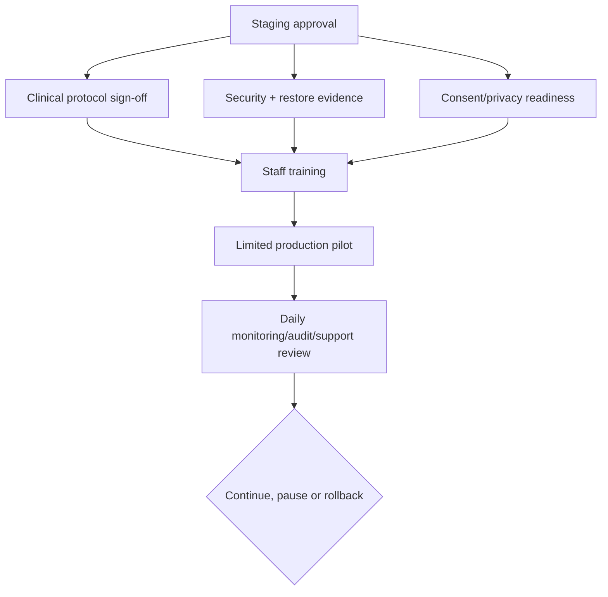

| Task | Class | Sources / preconditions | Dependencies / blocking | Scope / deliverables | Acceptance / tests | Reviews | Docs / exclusions |
|---|---|---|---|---|---|---|---|
| RELEASE-001 — Approve staging release candidate | P28; Release; QA; P0; MVP; M; No; Not Ready | Release gates | PILOT-004, security/a11y/ops gates | Versioned release evidence, migrations plan, rollback, known issues | All blocking suites pass; no open P0 | Product/clinical/security/privacy/design/ops | Release notes |
| RELEASE-002 — Onboard and train pilot clinic | P28; Operations; P0; MVP; M; No; Not Ready | Onboarding/training pack | RELEASE-001 | Named clinic/users/devices/support/incident contacts and training | Completion acknowledged; shared-device/patient-safe drills pass | FACE+security+privacy | Onboarding record |
| RELEASE-003 — Conduct limited patient pilot with daily controls | P28; Pilot Operations; P0; MVP; L; No; Not Ready | Consent/legal/security approval | RELEASE-002 | Limited approved use, issue capture, daily audit/monitoring/support review | Scope adhered; incidents handled; rollback ready | All accountable owners | Daily log; no broad launch |

## 51. Phase 29 — Pilot Feedback and Stabilisation

| Task | Class | Sources / preconditions | Dependencies / blocking | Scope / deliverables | Acceptance / tests | Reviews | Docs / exclusions |
|---|---|---|---|---|---|---|---|
| STABILISE-001 — Triage pilot feedback and defects | P29; Product/QA; P0/P1; MVP; M; No; Not Ready | Pilot issue data | RELEASE-003 | Categorise security/clinical/privacy/UX/device/performance/support findings with source task | Every issue severity/owner/reproduction/decision | Cross-functional | Triage log |
| STABILISE-002 — Resolve release-blocking defects through focused tasks | P29; Engineering; Testing; P0; MVP; L; Yes; Not Ready | Approved triage | STABILISE-001 | One task per bug/friction/schema/API change; approved migrations only | Regression plus original scenario passes | Review by category | Changelog; no opportunistic features |
| STABILISE-003 — Revalidate clinic workflow and support load | P29; Validation/Operations; P0; MVP; M; No; Not Ready | Fixes deployed staging/pilot | STABILISE-002 | Repeat affected workflows, device matrix, audit and support metrics | No open Critical/P0; acceptable P1 plan | FACE+owners | Stabilisation report |

## 52. Phase 30 — Production Readiness

| Task | Class | Sources / preconditions | Dependencies / blocking | Scope / deliverables | Acceptance / tests | Reviews | Docs / exclusions |
|---|---|---|---|---|---|---|---|
| PROD-001 — Complete Pakistan legal/privacy/contracts readiness | P30; Governance; Product Decision; P0; MVP; L; No; Not Ready | SECURITY §111; PRD/Vision | Stabilised product; qualified counsel | Consent, roles, hosting, export/deletion, breach, retention, photography/AI, DPA/contracts decisions | Written approvals/blockers resolved | Legal/privacy+clinical+product | Legal readiness record; no unsupported claim |
| PROD-002 — Approve RPO/RTO, backup/restore and operational ownership | P30; Operations; P0; MVP; M; No; Not Ready | Security DR; operations | OBSERVE-004, pilot evidence | Targets, owner/on-call, monitoring, incident contacts, restore evidence | Exercise meets approved objectives | Security/ops/product | Runbooks |
| PROD-003 — Complete final security/penetration/release review | P30; Security; P0; MVP; M; No; Not Ready | Production gate | SECURITY-005, STABILISE | Findings, secrets, access reviews, monitoring, providers, dependencies | No unaccepted Critical/High blocker | Security/privacy/product | Evidence |
| PROD-004 — Finalise support, billing operations, marketing and onboarding playbook | P30; Operations/Product; P1; MVP; L; Yes; Not Ready | Manual commercial model | Legal/security/product readiness | Manual billing process, support SLA/process, truthful marketing, repeatable onboarding | No automatic billing/public signup; staff ownership clear | Product/legal/privacy/security/design | Playbooks |
| PROD-005 — Approve production release | P30; Release; P0; MVP; S; No; Not Ready | Production checklist | PROD-001–004 | Signed gate record, rollout/rollback, monitoring and issue policy | All mandatory approvals complete | All approvers | Release/changelog |

## 53. Phase 31 — AI-Assisted Image Quality

| Task | Class | Sources / preconditions | Dependencies / blocking | Scope / deliverables | Acceptance / tests | Reviews | Docs / exclusions |
|---|---|---|---|---|---|---|---|
| AI-QUALITY-001 — Define approved dataset, labels and quality rules | P31; AI quality; Data/Clinical Validation; P3; Post-MVP; L; No; Deferred | AI roadmap principles; API-AI; privacy | Production core stable, vendor/data approvals | Consent-governed dataset plan, label guide, source/version/split | No cross-tenant/unauthorised data; inter-review evidence | Clinical+privacy/security/AI | Dataset card; no model deployment |
| AI-QUALITY-002 — Evaluate model and confidence/fallback | P31; AI; AI/Testing; P3; Post-MVP; L; No; Deferred | AI-QUALITY-001 | Dataset task | Offline evaluation, thresholds, subgroup/device/error analysis and manual fallback | Approved metrics/limitations; no final clinical state | Clinical/security/privacy/product | Model card |
| AI-QUALITY-003 — Implement limited assistive rollout and feedback | P31; AI integration; AI/Backend/Frontend; P3; Post-MVP; L; No; Deferred | API/UX AI contracts | Evaluation approval | Scoped job, AI label, accept/edit/reject, correction capture, flags/cost | Failure does not block capture; no approval authority | Full review | Runbook; no autonomous acceptance |

## 54. Phase 32 — AI-Assisted Region Suggestions

| Task | Class | Sources / preconditions | Dependencies / blocking | Scope / deliverables | Acceptance / tests | Reviews | Docs / exclusions |
|---|---|---|---|---|---|---|---|
| AI-REGION-001 — Define Doctor-labelled segmentation dataset | P32; AI region; Data/Clinical; P3; Post-MVP; L; No; Deferred | AI-SEC/API-AI; region versions | Region production data governance | Label/version/consent/tenant split and correction capture plan | Approved dataset integrity/privacy | Dr Sheraz/privacy/security | Dataset card |
| AI-REGION-002 — Evaluate segmentation and uncertainty | P32; AI; AI/Testing; P3; Post-MVP; L; No; Deferred | AI-REGION-001 | Dataset | Geometry metrics, clinical review, failure cases, confidence presentation | Thresholds/limitations approved | Clinical+AI+design | Model card |
| AI-REGION-003 — Implement suggestion review path | P32; AI integration; Backend/Frontend; P3; Post-MVP; L; No; Deferred | UX AI/region, API suggestion | Evaluation | Separate suggestion overlay, accept-to-edit/reject/invalidate and provenance | Cannot approve; manual region always available | Security/privacy/clinical/a11y | Integration docs |

## 55. Phase 33 — Advanced 3D Reconstruction

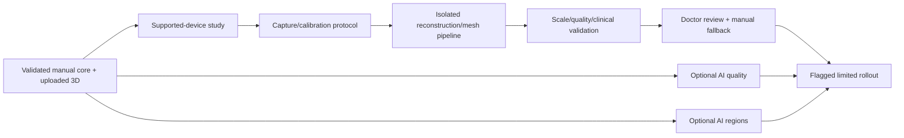

| Task | Class | Sources / preconditions | Dependencies / blocking | Scope / deliverables | Acceptance / tests | Reviews | Docs / exclusions |
|---|---|---|---|---|---|---|---|
| RECONSTRUCT-001 — Evaluate devices, photogrammetry/depth and calibration | P33; 3D research; 3D Processing/Clinical; P3; Post-MVP; L; No; Deferred | AI roadmap, model/security/UX | Uploaded model core stable | Supported-device/protocol/cost/scale/failure study | No claim beyond evidence; manual fallback defined | Clinical+security/privacy/product | Technical evaluation |
| RECONSTRUCT-002 — Build isolated reconstruction/mesh job prototype | P33; 3D processing; Architecture/3D; P3; Post-MVP; L; No; Deferred | RECONSTRUCT-001; provider approval | Protocol | Scoped worker, processing/validation/simplification/versioning, cost controls | Cross-tenant/job/file/failure tests | Security/privacy/clinical | Processor docs |
| RECONSTRUCT-003 — Conduct clinical validation and limited rollout | P33; Validation; Clinical/Testing; P3; Post-MVP; L; No; Deferred | RECONSTRUCT-002 | Prototype | Synthetic/authorised cases, scale/compatibility/limitations, fallback and flag | Dr Sheraz/product/security approval; no mandatory dependency | All | Validation report |

## 56. Phase 34 — Advanced Clinical Comparison

| Task | Class | Sources / preconditions | Dependencies / blocking | Scope / deliverables | Acceptance / tests | Reviews | Docs / exclusions |
|---|---|---|---|---|---|---|---|
| ADV-COMPARE-001 — Define validated alignment/quantification claims | P34; Comparison research; Clinical/Data; P3; Post-MVP; L; No; Deferred | Vision claim principles | Core comparison data/protocol | Research question, source consistency, endpoints, exclusions | Claims approved before UI | Clinical/privacy/legal/product | Study protocol |
| ADV-COMPARE-002 — Implement compatible 3D/advanced comparison job | P34; Processing; Backend/3D/AI; P3; Post-MVP; L; No; Deferred | ADV-COMPARE-001, reconstruction if used | Validation inputs | Versioned derived output with uncertainty/provenance | Manual visual comparison remains; tenant/source tests | Security/clinical/design | Model/processor card |
| ADV-COMPARE-003 — Validate patient-facing wording and report use | P34; Disclosure; Design/Clinical; P3; Post-MVP; M; No; Deferred | Output evaluation | ADV-COMPARE-002 | Safe UX/report/presentation candidate and limitations | No unsupported growth prediction | Clinical/privacy/legal/design | Wording approval |

## 57. Phase 35 — Public SaaS Expansion

| Task | Class | Sources / preconditions | Dependencies / blocking | Scope / deliverables | Acceptance / tests | Reviews | Docs / exclusions |
|---|---|---|---|---|---|---|---|
| EXPAND-001 — Evaluate public signup, billing and onboarding prerequisites | P35; Expansion; Product/Architecture; P3; Post-MVP; L; No; Deferred | Vision future phases; current exclusions | Production operations mature | Fraud, identity, contracts, billing, provisioning, support and UX analysis | Separate approved PRD/architecture/security scope | Product/legal/security/privacy/ops | Decision pack; no implementation |
| EXPAND-002 — Evaluate multi-branch, portal and external API scope | P35; Expansion; Product/Architecture; P3; Post-MVP; L; Yes; Deferred | Deferred PRD/API items | Mature tenant model | New role/tenant/consent/API/version implications | No assumption fits current clinic model automatically | Full cross-functional | New docs required |
| EXPAND-003 — Plan regional/legal/localisation readiness | P35; Expansion; Product Decision; P3; Post-MVP; L; Yes; Deferred | Vision; UX i18n; security residency | Target market selected | Market clinical/legal/privacy/hosting/language/support assessment | Explicit market approval before launch | Legal/privacy/clinical/design/security | Market readiness pack |

## 58. Cross-Cutting Tasks

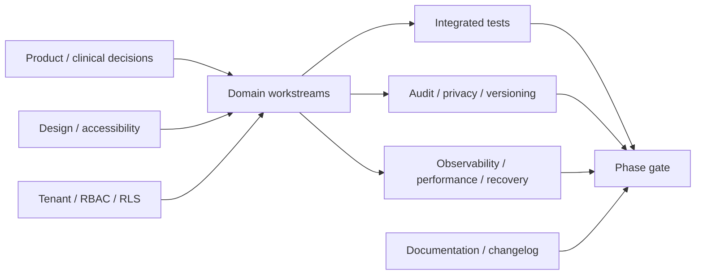

The IDs below are cross-cutting control groups, not directly executable engineering tasks. Each affected phase must create or reference a focused child task using the full phase task-record format before setting work Ready; this prevents an umbrella item from authorising repository-wide changes.

| Task | Class | Scope and dependency | Acceptance / review |
|---|---|---|---|
| CROSS-TENANT-001 — Extend tenant isolation with every resource | Cross-cutting Security; P0; MVP; M per phase; parallel; Not Ready | Each domain task adds trusted clinic context, scoped relationships/RLS/storage/events/jobs/search/cache/export tests; depends on TENANT gate | No domain closes until two-clinic negative tests pass; security sign-off |
| CROSS-AUDIT-001 — Add sensitive-action audit with each feature | Cross-cutting Backend/Security; P0; MVP; S per phase; parallel | Map action/outcome/version/reason to AUDIT catalogue without clinical payload | Completeness/redaction/tamper tests; privacy/security review |
| CROSS-A11Y-001 — Apply accessibility at component and screen creation | Cross-cutting Design/Testing; P0; MVP; S/M per phase; parallel | Keyboard/focus/semantic/contrast/zoom/touch/error work accompanies UI task | No deferral of blocking a11y to Phase 26; accessibility review |
| CROSS-ERROR-001 — Implement safe error/recovery/manual fallback | Cross-cutting Backend/Frontend; P0; MVP; S per phase; parallel | Use API stable errors and UX saved/not-saved/retry/manual patterns | Failure tests prove no false success or lost confirmed evidence |
| CROSS-PERF-001 — Define performance budgets and truthful progress | Cross-cutting Engineering/Operations; P1; MVP; M; parallel | Route/page/media/job budgets and measurements; optional work cannot block manual core | Target device/load evidence and no stale patient cache |
| CROSS-I18N-001 — Preserve externalised, RTL-ready content | Cross-cutting Frontend/Design; P2; MVP readiness; S per phase; parallel | Avoid concatenated copy/layout assumptions; locale-safe date/unit functions | English works; layout stress with long/RTL pseudo-content |
| CROSS-PRIVACY-001 — Minimise projections, analytics and device persistence | Cross-cutting Privacy/Security; P0; MVP; S per phase; parallel | Review fields/logs/events/downloads/local data/provider transfers | No raw clinical analytics; patient-safe remains allowlist |
| CROSS-VERSION-001 — Preserve source, derived, draft and approved lineage | Cross-cutting Database/Backend; P0; MVP; M per domain; parallel | Resource revision, immutable approval, supersession and stale-dependency rules | Material changes require new version/reapproval |
| CROSS-NOTIFY-001 — Add minimum-data notifications where approved | Cross-cutting Backend/Product; P2; MVP limited; M; parallel | Review assignment, job status and follow-up prompts using approved templates | No raw report/note; delivery not treated as consent |
| CROSS-FLAG-001 — Govern incomplete/optional capability | Cross-cutting Architecture/Operations; P1; MVP; S; parallel | Flags for conditional AI/3D/provider capability, environment and clinic rollout | Flags cannot weaken baseline security or conceal incomplete core |
| CROSS-DOC-001 — Maintain docs, ADRs, runbooks and changelog | Cross-cutting Documentation; P1; MVP; XS/S per task; parallel | Every behavioural change updates relevant source/operation guide | Documentation matches implementation and contains no secrets/data |
| CROSS-DEMO-001 — Maintain deterministic synthetic demo journeys | Cross-cutting Data/Testing; P1; MVP; M; parallel | Two clinics, roles, states, failures, approvals, reports, procedure/follow-ups | Resettable, no real patient metadata, validates presentations |

## 59. Test Matrix

| Layer | Required coverage | Initial owner/task |
|---|---|---|
| Static/workspace | Format, lint, types, manifests, package boundaries, builds | TOOLING/FOUNDATION |
| Unit | Calculations, status rules, permissions, validation, projection helpers | Each domain task |
| Database | Constraints, RLS, versions, transactions, idempotency, concurrency | TENANT/DB/domain |
| API/contract | Auth, tenant, role, request/response/error, pagination, action state | AUTH and domain tasks |
| Integration | DB/storage/job/realtime/provider adapters with synthetic fixtures | Media/scan/report/ops |
| Browser | Critical role journeys, responsive states, shared-device behaviour | UX and feature tasks |
| Accessibility | Keyboard, screen reader, contrast, zoom, touch, reduced motion | CROSS-A11Y/Phase 26 |
| Security | Cross-tenant/patient, token, file, share, support, export, deletion | Phase 25 plus modules |
| Clinical | Capture, calibration, measurement, planning, counts, reports, follow-up | Dr Sheraz/FACE matrix |
| Recovery | Offline, timeout, retry, duplicate, conflict, failed job, restore | Each critical workflow |
| Visual output | PDF/print, LED, clinical image, region/3D legend | Reports/presentation/design |
| Operational | Alerts, backup/restore, incident, rollout/rollback | Observability/release |

Every P0 task has automated negative evidence where technically applicable and a named manual review only where automation cannot establish the outcome.

## 60. Security Test Matrix

| Area | Required attacks/failures | Gate |
|---|---|---|
| Tenant/RLS | Foreign IDs, joins, direct DB policies, caches, search, events, jobs, storage, exports/restores | Tenant and every domain gate |
| Authentication | Enumeration, stuffing/brute controls, recovery/invite replay, session theft/rotation/revoke/deactivation | Auth Gate |
| RBAC/approval | All thirteen roles, combined roles, Reception private notes, Assistant/Technician approve attempts, stale Doctor | Auth/Approval Gates |
| Scan/presentation | Guess/replay, wrong patient, expired/revoked token, foreign channel, cache/history, patient search | Scan/Presentation Gates |
| Files/media/3D | MIME/signature mismatch, decompression/resource abuse, active content, traversal, public object/list, malicious model | Media/Model Gates |
| Reports/shares | Internal report link, unapproved/stale version, forwarded/replayed/expired/revoked token, hidden metadata | Report Gate |
| Support/platform | No grant, self/broad/expired grant, forbidden approval/export/role/delete, default platform clinical read | Support/Platform Gates |
| Export/deletion | Foreign data/IP, hold bypass, one-step deletion, stale approval, retry/replay, backup reconciliation | Governance Gate |
| Secrets/supply chain | Committed/build/client/log secret, vulnerable dependency, callback forgery, CI exposure | Foundation/Security Gates |
| Availability/recovery | Rate abuse, queue retry storm, provider timeout, backup failure, restore isolation | Ops/Pilot/Production Gates |

Confirmed tenant-isolation and patient-disclosure incidents target zero. A failing isolation test is a P0 blocker, not a deferred defect.

## 61. Clinical Validation Matrix

| Clinical area | Evidence | Reviewer / blocking phase |
|---|---|---|
| Patient/consultation terminology | Synthetic forms, field catalogue, privacy projection | Dr Sheraz; Patient/Consultation |
| Photography protocol | Required/optional views, position/distance/lighting/hair guidance, exceptions | Dr Sheraz + FACE; Scan/Pilot |
| 3D/calibration | Supported source, scale state, failure and manual alternative | Dr Sheraz; Model/Measurement |
| Regions/measurements | Labels, geometry workflow, units, precision, unavailable state | Dr Sheraz; Phase 11 |
| Hairline/graft plan | Options, illustrative wording, formula/range, donor note, adjustment | Dr Sheraz; Phase 12 |
| Approval/reapproval | Exact version, change materiality, rejection/supersession | Dr Sheraz + security; Phase 13 |
| Reports/presentation | Allowed content, wording, disclaimer, patient-safe selection | Dr Sheraz + privacy; Phases 14–15 |
| Surgery-day | Shaved protocol, final assessment and deviation | Dr Sheraz; Phase 16 |
| Procedure counts | Extracted types, discarded, usable, implanted, difference, exception | Dr Sheraz + procedure team; Phase 17 |
| Follow-up/comparison | Checkpoints, observations, satisfaction, conditions, limitations | Dr Sheraz + FACE; Phases 18–19 |

Validation records the reviewed version and does not convert one clinic’s workflow into universal medical evidence.

## 62. Device and Browser Matrix

| Context | Required checks | Fallback |
|---|---|---|
| Clinic desktop/laptop | Supported browser, secure cookies, keyboard, zoom, print, realtime, 3D capability | Manual 2D workflow; alternate supported browser |
| Shared tablet | Touch, orientation, numeric entry, lock/timeout, patient context, camera where used | Desktop or phone scan pairing |
| Android phone browser | Camera permission, capture quality, background/lock, weak network, local cleanup | Alternate phone/manual clinic upload |
| iOS phone browser | Same plus platform media/camera lifecycle and safe-area/orientation | Alternate device/manual path |
| LED/projector browser | Aspect ratios, overscan, contrast/glare, full-screen, reconnect, expiry/blank | Laptop patient-safe view without private shell |
| PDF/print viewers | Fonts, page breaks, images, metadata, watermark, grayscale, accessibility | Approved alternative delivery |
| Unsupported/low-memory/WebGL | Detection before critical action, failure state | Static images/manual regions/measurements |

Exact versions are approved after tooling/provider selection and pilot testing; unsupported devices never receive false completion.

## 63. Data Migration Tasks

These are migration-planning groups. Each concrete migration must receive a new non-reused focused ID and full task record before execution.

| ID | Task | Stage / rule |
|---|---|---|
| MIGRATION-001 | Define migration review, forward/rollback and RLS impact checklist | Phase 3; P0; no clinical destructive change without approval |
| MIGRATION-002 | Build synthetic migration rehearsal and invariant checks | Each schema phase; tenant/version/audit/count/report relationships |
| MIGRATION-003 | Define tenant-scoped backfill/checkpoint/restart pattern | Before any backfill; never an unscoped batch |
| MIGRATION-004 | Define imported legacy data provenance and approval mapping | Conditional onboarding; imported approval is not assumed |
| MIGRATION-005 | Reconcile storage, jobs, shares, deletion and backups during change | Governance/production gate |

Each concrete migration becomes its own focused task with affected versions, locks, rollback, synthetic fixtures, metrics and approvals. No production migration is created by this backlog.

## 64. Demo and Seed Data Tasks

These are data-work groups; implementation children must use the full task record and remain synthetic-data-only.

| ID | Task | Acceptance |
|---|---|---|
| DATA-001 | Two tenant clinics with thirteen roles and multi-membership users | Cross-tenant and combined-role tests exercise real boundaries |
| DATA-002 | Patient/consultation/capture/planning states | Includes drafts, approved/superseded, missing calibration and failures |
| DATA-003 | Procedure/follow-up/comparison states | Counts reconcile and fail; visits span synthetic checkpoints |
| DATA-004 | Report/presentation/share/support/export/deletion states | Includes internal/patient-safe, expired/revoked grants and holds |
| DATA-005 | Synthetic media and 3D fixtures | No real person or embedded real metadata; safe/malformed variants |
| DATA-006 | Demo reset and deterministic scenario guide | Repeatable locally/staging without production credentials |

## 65. Documentation Backlog

| ID | Deliverable | Blocking point |
|---|---|---|
| DOC-BACKLOG-001 | Contributor setup, test and workspace guide | Foundation Gate |
| DOC-BACKLOG-002 | ADR index and provider decisions | Tenant/Auth implementation |
| DOC-BACKLOG-003 | Permission, RLS, audit and security test catalogues | Tenant/Auth Gates |
| DOC-BACKLOG-004 | Clinical protocol and terminology pack | Capture/planning/pilot |
| DOC-BACKLOG-005 | API/OpenAPI implementation contract and change guide | First endpoint family |
| DOC-BACKLOG-006 | Design-system/accessibility usage guide | First feature screens |
| DOC-BACKLOG-007 | Scan, report, presentation and support operator guides | Respective gates |
| DOC-BACKLOG-008 | Backup/restore, incident, release and rollback runbooks | Pilot/production |
| DOC-BACKLOG-009 | Clinic onboarding/training and privacy-safe support guide | Pilot |
| DOC-BACKLOG-010 | Data export/deletion/closure operations guide | Governance/production |

## 66. Technical Debt Register

Debt entries require ID, source task, reason, impact, risk, owner, workaround, removal trigger, priority and affected gate. Security/tenant/clinical integrity defects are not ordinary debt and cannot be accepted without authorised risk decision.

| ID | Potential debt to monitor | Trigger |
|---|---|---|
| DEBT-001 | Duplicated authorisation between transports | Any permission drift; consolidate immediately |
| DEBT-002 | Temporary UI primitive without full accessibility | Before reuse/Phase 26 |
| DEBT-003 | Provider-specific storage/auth/job coupling | Second provider/regional requirement or test friction |
| DEBT-004 | Polling where realtime is specified | Load/latency or scan/presentation usability evidence |
| DEBT-005 | Manual operational step without runbook/audit | Before pilot |
| DEBT-006 | Unbounded clinical free text or generic relationship | Schema/clinical review before module gate |

## 67. Risk Register

| Risk | Probability/impact (qualitative) | Mitigation / owner |
|---|---|---|
| Tenant isolation defect | Medium/Critical | RLS+server+storage/event/job tests; Security/Engineering |
| Documentation decisions remain unresolved | High/High | Phase 0 gate; Haris/Dr Sheraz/reviewers |
| Overlarge tasks create uncontrolled changes | Medium/High | Definition of Ready, split XL, one ID per Codex run |
| Wrong-patient capture | Medium/Critical | Pair confirmation, context, tests, FACE validation |
| Approval/report contamination | Medium/Critical | Exact versions, separate patient-safe snapshot, negative tests |
| Graft counts conflated | Medium/Critical | Domain separation/reconciliation/clinical validation |
| Shared-device/privacy exposure | Medium/High | Lock/expiry/context/download controls and training |
| Provider cost or outage blocks workflow | Medium/High | Manual core, queues, limits, provider review |
| File/3D parser risk | Medium/High | Validation/quarantine/isolation/patching |
| Pilot overfits one clinic | Medium/Medium | Bounded configuration and later clinic validation |
| Legal/privacy uncertainty in Pakistan | Medium/Critical | Qualified review before patient pilot/production |
| AI/3D scope pulled into MVP | Medium/High | Phases 31–34 Deferred and gate enforcement |

## 68. Deferred Features

- [ ] Public self-service clinic signup.
- [ ] Automatic recurring billing and clinic finance.
- [ ] Patient payments.
- [ ] Patient portal.
- [ ] Native mobile application.
- [ ] Multi-branch hierarchy.
- [ ] Public external API and general webhooks.
- [ ] Fully automated WhatsApp delivery.
- [ ] Automatic 3D reconstruction as a required path.
- [ ] Autonomous diagnosis, planning, approval or patient publication.
- [ ] AI quality/regions before approved datasets and validation.
- [ ] Advanced quantified comparison before evidence and claim review.
- [ ] Clinic-authored arbitrary permissions/design forks.

Deferred means excluded from MVP, not silently implemented behind an incomplete flag.

## 69. Release Gates

| Gate | Mandatory evidence |
|---|---|
| Foundation Gate | Clean install; format/lint/typecheck/test/build; environment validation; no secrets; contributor guide |
| Tenant Gate | Two-clinic RLS/constraint/storage/search/cache/realtime/job negative tests; audit foundation |
| Auth/RBAC Gate | Unique login; invite/recovery; session expiry/revoke; deactivation; thirteen roles; protected-route tests |
| Patient Gate | Registration, duplicate control, masking, archive/restore, audit, tenant tests |
| Consultation Gate | History/private notes, drafts/resume/conflict/completion, manual path and permissions |
| Capture/Planning Gate | Secure pairing, private media, uploaded 3D optional, manual regions/measurements/hairline/graft plan |
| Approval Gate | Verified Doctor, exact version, reject/amend/supersede/reapproval, bypass tests |
| Report/Presentation Gate | Separate internal/patient-safe, immutable snapshot/manifest, expiry/revoke/no internal leakage |
| Procedure Gate | Plan preserved; count concepts separate; reconciliation/exception; Doctor review; audit |
| Governance Gate | Audit views, export, archive/restore/deletion, support grants, platform boundaries |
| Pilot Gate | Clinical/security/privacy/design/a11y approvals, restore, training, consent process, incident/rollback, no P0 |
| Production Gate | Legal review, penetration test, RPO/RTO, monitoring/backups, operations/contracts/support/onboarding |

## 70. MVP Completion Checklist

- [ ] Phases 0–27 required MVP tasks and all intermediate gates are Done.
- [ ] Manual patient-to-consultation-to-planning-to-approval workflow works without AI/reconstruction.
- [ ] Secure scan/media recovery and uploaded 3D optional viewing work on approved devices.
- [ ] Internal/patient-safe reports and private presentation remain separate and revocable.
- [ ] Surgery-day, procedure counts, reconciliation, postoperative, follow-up and basic comparison work longitudinally.
- [ ] Audit, support, export, archive/deletion, entitlements, platform admin and observability meet scope.
- [ ] Tenant/RBAC/RLS/storage/realtime/job/share tests have zero unresolved isolation failure.
- [ ] Accessibility and shared-device critical journeys pass.
- [ ] No production data is needed for development/staging.
- [ ] Deferred features remain outside MVP.

## 71. Pilot Readiness Checklist

- [ ] FACE clinic workspace, roles, devices and synthetic rehearsal are complete.
- [ ] Dr Sheraz approves capture, calibration, measurement/planning, procedure, follow-up, report and presentation protocols.
- [ ] Consent/privacy/legal basis for limited patient use is approved.
- [ ] Security review, dependency/file controls, backup restore and incident drill pass.
- [ ] Staff complete role-specific training, wrong-patient, shared-device, support and patient-safe drills.
- [ ] Support contacts, monitoring, daily audit review and rollback are ready.
- [ ] No open P0/Critical issue; every accepted P1 has owner and explicit pilot decision.
- [ ] Pilot scope, patient count/selection and feedback handling are documented without broad launch.

## 72. Production Readiness Checklist

- [ ] Production Gate and PROD-001–005 are Done.
- [ ] Qualified Pakistan legal/privacy review and clinic/platform contracts are complete.
- [ ] Production regions/providers/subprocessors, secrets, access and data-processing terms are approved.
- [ ] RPO/RTO, backups, restore, deletion reconciliation and disaster recovery evidence meet approved targets.
- [ ] Penetration findings and vulnerability/access reviews have no unaccepted blocker.
- [ ] Monitoring, on-call/incident contacts, clinic notification, support SLA and runbooks are owned.
- [ ] Manual billing, truthful marketing and repeatable onboarding are ready; public signup remains excluded.
- [ ] Rollout, rollback, migration compatibility, training and changelog/release notes are approved.

## 73. Post-MVP Roadmap

1. Phase 31: assistive image-quality evaluation and limited rollout.
2. Phase 32: Doctor-reviewed region suggestions.
3. Phase 33: validated optional reconstruction with calibration and failure fallback.
4. Phase 34: advanced comparison only after claim validation.
5. Phase 35: separately documented public SaaS, portal, branch, external API and regional expansion.

Each phase starts at Not Ready/Deferred and requires a new decision gate. Post-MVP work cannot borrow production clinic data, bypass consent/provider review, or become clinically final.

## 74. Open Planning Decisions

| Decision | Blocks | Required approval |
|---|---|---|
| Package manager and foundational tools | FOUNDATION-001 successors | Engineering/architecture |
| Database/auth/storage/jobs/realtime providers and regions | Phases 3, 8–10, 15, production | Product+engineering+security+privacy |
| Exact MFA/session/device policy | Auth Gate/pilot | Product+security+clinic+a11y |
| Doctor verification/combined-role/separation rules | Approval and clinical phases | Product+clinical+security |
| Pakistan consent, retention, deletion, breach and hosting | Patient pilot/production | Legal/privacy+product+clinical |
| Clinical fields, photography/calibration/formulas/count exceptions | Phases 7–19 | Dr Sheraz+FACE+product |
| Report/presentation fields, wording, watermark, share channels/expiry | Phases 14–15 | Clinical+privacy/legal+design+security |
| File limits/malware/provider processing | Media Gate | Security+engineering |
| Entitlement limits and manual billing operations | Phases 22/30 | Product+operations |
| RPO/RTO/support SLA/incident ownership | Pilot/production | Product+operations+security |
| Supported browser/device/LED matrix | Pilot | Engineering+design+a11y+FACE |
| Accessibility alternatives for canvas/3D/PDF | MVP/Pilot | Accessibility+clinical+engineering |
| Pilot scope and acceptance thresholds | Pilot release | Haris+Dr Sheraz+security/privacy |

## 75. Backlog Approval Checklist

### Backlog summary

This backlog contains 36 dependency-ordered phases, stable non-reused task IDs, cross-cutting controls, test/validation/device/data/documentation matrices, explicit gates, and separate Deferred AI/3D/expansion work. It begins with tooling—not authentication, database, patients or AI—and keeps tasks focused for one-at-a-time Codex execution.

### Phase dependency summary

Foundation → tenant/RLS → authentication/RBAC → clinic → patient → consultation → scan/private media → uploaded 3D/manual regions/measurements → hairline/graft planning → Doctor approval → presentation/reports → surgery/procedure/follow-up/comparison → governance/operations/security/accessibility → validation/pilot/stabilisation → production. Optional intelligence follows only after production core evidence.

### First 25 executable tasks

These are the recommended early queue after each predecessor is approved; they are not permission to skip gates:

1. FOUNDATION-001 — Select/configure package manager and workspace tooling.
2. TOOLING-001 — Configure TypeScript and aliases.
3. TOOLING-002 — Configure lint/format/pre-commit policy.
4. TOOLING-003 — Configure test foundation.
5. FOUNDATION-002 — Configure Turborepo graph/builds.
6. FOUNDATION-003 — Create minimal app/package shells.
7. FOUNDATION-004 — Add environment validation/templates.
8. FOUNDATION-005 — Add contributor/clean-build verification.
9. UI-FOUNDATION-001 — Define proposed tokens/brand bounds.
10. DB-001 — Select development data/auth/storage providers.
11. DB-002 — Define migration workflow.
12. UI-FOUNDATION-002 — Specify accessible primitives.
13. UI-FOUNDATION-003 — Build shared state primitives.
14. TENANT-001 — Implement clinic/user/membership/roles.
15. DB-003 — Define private storage paths.
16. AUDIT-001 — Implement audit foundation.
17. TENANT-002 — Implement constraints/RLS.
18. TENANT-003 — Create two-clinic synthetic seeds.
19. TENANT-004 — Complete isolation suite.
20. AUTH-001 — Implement login/logout.
21. RBAC-001 — Implement permission evaluator.
22. AUTH-002 — Implement invitation/recovery.
23. SESSION-001 — Implement secure sessions.
24. RBAC-002 — Separate platform/clinic/support authority.
25. APPROVAL-001 — Implement Doctor authority predicate.

### MVP critical path

`FOUNDATION-001 → Tenant Gate → Auth/RBAC Gate → Clinic Gate → Patient Gate → Consultation Gate → Scan/Media Gate → Manual Planning → Approval Gate → Report/Presentation Gate → Surgery/Procedure/Follow-Up → Governance/Ops/Security/A11y → Pilot Gate → Stabilisation → Production Gate`.

### Parallel work recommendations

- After FOUNDATION-001, TypeScript, lint/format and test tooling can proceed in parallel.
- Design primitives may proceed beside provider/tenant planning after approved source decisions.
- Within a phase, frontend state/prototype work can parallel backend contracts only after semantics stabilise.
- Audit, security tests, accessibility, docs, fixtures and observability accompany domain work rather than waiting.
- Presentation and report foundations can parallel after Approval Gate.
- Governance, support, entitlements, platform administration and operations can overlap with later clinical phases if tenant/auth foundations pass.
- AI/3D reconstruction cannot parallel MVP critical path as release-required work.

### MVP completion checklist

Section 70 is the authoritative checklist. Before MVP completion, confirm the manual clinical journey, all tenant/security gates, patient-safe separation, procedure/follow-up continuity, governance/operations, accessibility, synthetic-data independence, and deferred-scope exclusions.

### Pilot readiness checklist

Section 71 is authoritative. Pilot release requires FACE clinic configuration and training, Dr Sheraz’s protocol approval, consent/privacy readiness, security and restore evidence, incident/rollback capability, and no open P0/Critical issue.

### Production readiness checklist

Section 72 is authoritative. Production requires legal/privacy/contracts, provider and access approval, RPO/RTO and restore evidence, penetration/security closure, owned monitoring/support/incident processes, manual commercial operations, onboarding and rollback.

### Deferred feature checklist

- [ ] Public signup, automatic billing, patient payments, patient portal, native app, multi-branch and public API remain excluded.
- [ ] AI quality, AI regions, reconstruction and advanced comparison remain post-MVP Deferred.
- [ ] No optional provider or hidden feature flag makes deferred capability necessary for the manual core.

### Outstanding planning decisions

Section 74 remains open. A downstream task stays Not Ready whenever its provider, clinical protocol, security policy, legal/privacy duty, device support or acceptance threshold is unresolved.

### Backlog approval checklist

- [ ] Haris Liaqat approves scope, phase order, priorities, commercial/entitlement work, pilot and production gates.
- [ ] Dr Sheraz approves clinical task boundaries, protocols, calculations, approvals, reports/presentation and validation matrix.
- [ ] FACE Aesthetic Clinic Lahore accepts pilot workflows, roles, devices, training and rehearsal plan.
- [ ] Engineering approves task size, dependencies, likely packages, testing/build workflow and provider decision plan.
- [ ] Security approves tenant-first ordering, module security work, matrices, gates, penetration and incident tasks.
- [ ] Privacy/legal reviewers approve decision blockers, data lifecycle, patient pilot and production prerequisites.
- [ ] Design/accessibility reviewers approve UI foundation, per-feature review and Phase 26 evidence.
- [ ] QA/operations approve matrices, observability, restore, release, rollback and readiness checklists.
- [ ] No task ID is reused; no XL task is Ready; every implementation task satisfies the task-record fields.

## 76. Recommended First Development Task

The first development task is:

**FOUNDATION-001 — Select and configure the package manager and workspace tooling**

It begins only after the relevant Phase 0 approval, and its full task card is in section 23. It must review `package.json` and `turbo.json`, choose and document npm or pnpm, create the canonical lockfile, install only foundational development dependencies, configure workspace/typecheck/lint/test/build/dev commands, validate app/package manifests, update README setup, verify clean installation and build, and record assumptions/follow-ups. It must not implement authentication, database, patient screens, clinical workflows, reports, 3D or AI.

### Recommended Codex execution method

1. Give Codex one task ID at a time.
2. Require Codex to read the task’s source documents and current affected files.
3. Prohibit unrelated changes and preserve existing user work.
4. Require the task’s specified tests plus relevant lint, typecheck and build checks.
5. Require a concise completion report listing files, tests, assumptions, unresolved items and documentation changes.
6. Review the task against acceptance criteria and phase gate before starting the next blocking task.
7. If a task expands beyond focused scope or becomes XL, stop and split it into new approved, non-reused IDs.

The repository should now stop at backlog review. No development task is authorised by completion of this document alone.
