# GraftVision UI/UX Guidelines

## 1. Document Information

| Field | Value |
|---|---|
| Product | GraftVision |
| Document | UI/UX Guidelines |
| Version | 1.0 Draft |
| Status | Proposed for product-owner, clinical, design, accessibility, security, privacy, and engineering review |
| Date | 25 July 2026 |
| Product owner | Haris Liaqat |
| Initial clinical approver | Dr Sheraz |
| Initial validation clinic | FACE Aesthetic Clinic Lahore |
| Initial launch market | Pakistan |
| Role model | Thirteen approved roles |
| Product model | Manually onboarded, shared multi-tenant SaaS |
| Recommended next document | `docs/TASKS.md` |

This is an implementation-neutral experience specification. “Required” is a release condition, “recommended” is the preferred pattern unless an approved equivalent performs as safely, “proposed” requires validation, and “unresolved” must remain visible in design and review. Any example sizes, timing, colours, or density choices are proposed rather than production tokens.

## 2. Purpose

These guidelines define the design, interaction, usability, accessibility, privacy, responsive, hierarchy, and presentation standards for GraftVision. They guide product design, wireframes, a future design system, frontend work, mobile scan, desktop clinical planning, LED presentation, report design, accessibility/security/privacy review, QA, demonstrations, and clinic onboarding without prescribing code or changing approved product, API, schema, or architecture.

The intended outcome is a premium digital consultation room: clinically clear, calm under pressure, safe on shared devices, efficient for staff, reassuring for patients, honest about uncertainty, and useful when AI, 3D, connectivity, or processing is unavailable.

## 3. Relationship to Other Documents

| Document | UI/UX authority |
|---|---|
| `docs/VISION.md` | Enduring experience, trust, Doctor control, manual value, and patient-safe communication |
| `docs/PRD.md` | Required modules, MVP boundaries, acceptance criteria, launch context, and ownership |
| `docs/ROLE_PERMISSIONS.md` | Thirteen roles, field/action visibility, temporary access, and unresolved authority boundaries |
| `docs/PRODUCT_PRINCIPLES.md` | Safe defaults, honest precision, recovery, provenance, approval, and disclosure behaviour |
| `docs/USER_FLOWS.md` | Actors, transitions, handoffs, negative paths, and continuation rules |
| `docs/SYSTEM_ARCHITECTURE.md` | Separate web, scan, and presentation applications and realtime/job constraints |
| `docs/DATABASE_SCHEMA.md` | Resource hierarchy, statuses, versions, approvals, lineage, and disclosure classes |
| `docs/SECURITY.md` | Privacy signalling, tenant/session separation, shared devices, support, and secure delivery |
| `docs/API_SPEC.md` | Resource/action contracts, errors, concurrency, idempotency, jobs, and temporary tokens |

The sources consistently use the thirteen-role model. This document does not resolve Doctor verification, combined roles, visibility, support duration, consent, retention, or Pakistan legal policy; it provides safe interface states until those decisions are approved.

## 4. UX Principles

| ID | Requirement | Primary users | Surface | Priority | Stage | Privacy impact | Accessibility impact | Acceptance criteria |
|---|---|---|---|---|---|---|---|---|
| UX-PRINCIPLE-001 | Preserve patient, stage, save, approval, and disclosure context. | All staff | All private apps | Must | MVP | Prevents wrong-context disclosure | Repeated text and landmarks aid orientation | User can identify context without opening another panel |
| UX-NAV-001 | Show simple role-appropriate navigation and safe continuation. | Staff | Web shell | Must | MVP | Hides unauthorised modules | Keyboard landmarks and current-page semantics | No inaccessible module appears as an actionable destination |
| UX-PRIVACY-001 | Label Doctor-only, internal, patient-safe, temporary, masked, and restricted content consistently. | All | All | Must | MVP | Makes disclosure class explicit | Labels/icons do not depend on colour | Privacy class is visible before view/share/present |
| UX-PATIENT-001 | Reduce wrong-patient selection and attachment. | Clinical/reception | Patient, scan, media | Must | MVP | Prevents cross-patient disclosure | Confirmation is clear and non-visual-only | Identity is confirmed at consequential context changes |
| UX-CONSULT-001 | Make the consultation a focused staged workspace. | Doctor/team | Web | Must | MVP | Keeps private/patient-safe contexts distinct | Workflow is keyboard and zoom usable | Current stage, completion and next safe action are obvious |
| UX-SCAN-001 | Make phone capture one-purpose, one-patient, recoverable, and one-handed. | Clinical staff | Scan | Must | MVP | Minimises phone data | Large targets, clear language, orientation support | Required views complete with no clinic-wide browsing |
| UX-MODEL-001 | Show model provenance, loading, compatibility, calibration, version, and approval. | Clinical staff/patient where safe | Web/present | Must | MVP upload | Avoids misleading disclosure | Alternative views/status text exist | Unsupported precision is never shown |
| UX-MEASURE-001 | Show value, unit, source, method, scale, precision, stage, and approval. | Clinical staff/patient where safe | Web/report/present | Must | MVP | Patient-safe projection only | Numerical hierarchy remains readable at zoom | No value appears context-free or falsely precise |
| UX-GRAFT-001 | Separate area, target density, calculation, Doctor adjustment, approved plan, and procedure actuals. | Clinical/procedure team | Web/report/present | Must | MVP | Limits inappropriate disclosure | Tables have non-colour status | Planned/extracted/usable/implanted cannot be confused |
| UX-HAIRLINE-001 | Present designs as proposals until exact Doctor approval. | Doctor/patient | Web/present/report | Must | MVP | Safe patient language | Geometry has labels and alternatives | AI/proposed/approved versions are distinguishable |
| UX-AI-001 | Keep AI visually subordinate, editable, rejectable, and optional. | Clinical staff | Web | Must | Conditional | Shows data/provenance boundary | Confidence is text, not colour alone | AI never appears as final or blocks manual work |
| UX-APPROVAL-001 | Make approval explicit, version-specific, consequential, and Doctor-only where required. | Doctor/preparers | Web | Must | MVP | Prevents unsafe publication | Review summary is structured and keyboard accessible | Material changes visibly require reapproval |
| UX-PROC-001 | Support fast error-resistant procedure recording and reconciliation. | Technician/Doctor | Web/tablet | Must | MVP | Protects sensitive intraoperative data | Large inputs and accessible totals | Discrepancy cannot be silently completed |
| UX-FOLLOW-001 | Keep scheduled and actual longitudinal evidence easy to compare honestly. | Clinical staff | Web | Must | MVP | Patient-safe selection controlled | Comparisons have descriptions and non-slider option | Dates/conditions/limitations are always shown |
| UX-REPORT-001 | Separate internal and patient-safe report creation, approval, download, and sharing. | Doctor/Coordinator | Web/PDF | Must | MVP | Prevents internal leakage | Content checklist and status are accessible | Internal output never displays patient-share controls |
| UX-PRESENT-001 | Display one approved manifest without private navigation or residue. | Doctor/Presentation User/patient | Present | Must | MVP | Minimum disclosure | Large text, simple control, lock state | Expiry/revoke produces a neutral patient-free screen |
| UX-ACCESS-001 | Give safe, actionable denial without revealing hidden data. | All | All | Must | MVP | Avoids enumeration | Focus moves to heading/recovery | Denial explains allowed next step without sensitive details |
| UX-ERROR-001 | Explain failure, saved state, unsaved state, retry, manual path, actor, and privacy outcome. | All | All | Must | MVP | Confirms protection | Errors are associated, announced, and persistent | Generic “something went wrong” is not used alone |
| UX-OFFLINE-001 | Distinguish local, pending, uploading, confirmed, failed, and expired. | Capture/clinical staff | Scan/web | Must | MVP | Prevents device residue/confusion | Status uses text and icon | “Saved” never means local-only without qualification |
| UX-CONFLICT-001 | Stop silent overwrite and support deliberate conflict recovery. | Editors/Doctor | Web | Must | MVP | Prevents wrong-version disclosure | Changed sections and actions are readable | Stale write cannot replace newer clinical work |
| UX-A11Y-001 | Target WCAG 2.2 AA principles and equivalent usable alternatives. | Everyone | All | Must | MVP | Accessible controls must not expose extra data | Comprehensive | Keyboard, focus, semantics, contrast, zoom and errors pass review |
| UX-RESPONSIVE-001 | Adapt content by task and device, not by shrinking every desktop panel. | All | All | Must | MVP | Mobile reveals minimum context | Reflow/touch/zoom supported | No critical action requires horizontal page scanning |
| UX-DESIGN-001 | Use one coherent premium clinical system with bounded clinic branding. | Everyone | All | Must | MVP | Branding cannot disguise privacy/state | Contrast and readability remain fixed gates | No clinic creates an inaccessible design fork |
| UX-PERFORMANCE-001 | Show immediate acknowledgement and truthful progress for slower work. | All | All | Must | MVP | Avoids repeated disclosure/actions | Live status is announced without excessive motion | User knows whether work was accepted and can continue safely |

## 5. Design Principles

1. Clinical clarity before visual novelty.
2. The active patient and episode remain unmistakable.
3. Preliminary, derived, reviewed, approved, amended, and superseded are visible states.
4. Patient-safe output is constructed separately rather than hidden from an internal view.
5. Consequential actions explain scope and outcome before commitment.
6. Failure preserves confirmed work and shows manual continuation.
7. Progressive disclosure organises density; it does not conceal warnings or authority.
8. Visual hierarchy follows task risk: identity and state outrank decoration.
9. Colour reinforces meaning but never carries it alone.
10. Shared SaaS consistency outranks clinic-specific interface forks.

## 6. Product Personality

GraftVision is calm, clinical, premium, trustworthy, precise, modern, human, structured, reassuring, and professional. It feels advanced because evidence, hierarchy, and control are clear—not because the screen looks futuristic.

Avoid aggressive medical imagery, flashy AI effects, speculative confidence theatrics, excessive gradients, glowing dashboards, gaming conventions, intimidating darkness, crowded CRM tables, marketing claims inside care workflows, and decorative motion. Copy is direct and respectful: “Review required,” not “AI magic complete”; “Measurement unavailable—calibration required,” not an invented number.

## 7. Visual Direction

Use a light neutral application canvas, white or gently warm clinical surfaces, deep navy/charcoal text, restrained teal/blue/emerald action accents, soft borders, minimal shadows, consistent moderate corner treatment, generous spacing, and strong typographic hierarchy. Warning colours are reserved for meaning. Dense clinical information uses sections, progressive detail, summaries, and sticky context instead of visual clutter.

Four layers remain distinct:

| Layer | Ownership and visual treatment |
|---|---|
| GraftVision platform | Product shell, interaction system, security/status semantics, platform administration |
| Clinic workspace | Bounded logo/name/accent and report settings without changing navigation or safety semantics |
| Patient report | Clinic-branded, printable, immutable version/status/watermark and approved patient-safe content |
| Presentation | Minimal clinic identity, large patient-safe visuals, no private shell or general navigation |

Exact typeface, radii, spacing scale, and colours remain proposed until contrast, clinic environment, print, projector/LED, and device tests pass.

## 8. Clinical Interface Philosophy

The private clinical interface prioritises context, evidence, authorship, method, version, and next action. It permits density where it improves comparison or reconciliation, but never compresses patient identity, warnings, approval, or unsaved state. Doctor-private notes are visually separated and labelled.

The interface must help a user answer: Which patient and episode? What source am I viewing? Is this draft, preliminary, or approved? Who created and reviewed it? What changed? Is it saved to the clinic record? What is safe to show the patient? What must happen next?

## 9. Patient-Facing Interface Philosophy

Patient-facing surfaces use approved content, careful wording, legible visuals, clear dates/units, respectful clinical imagery, and Doctor-controlled pacing. They avoid internal warnings, speculative outputs, system controls, staff comments, support/audit information, or unnecessary contact details.

Presentation and patient-safe reports are not simplified screenshots of the Doctor workspace. They are separately approved disclosure products. Illustrations and simulations are labelled as illustrative; proposed hairlines and graft ranges are not guarantees.

## 10. Information Architecture

The UI reflects the domain hierarchy:

`Clinic → Patient → Episode/Consultation → Capture and evidence → Measurements/design/plan → Approval → Presentation/report → Procedure → Follow-up/comparison`.

Cross-cutting areas include Team, Clinic Settings, Reports, Audit, Support, Export, and platform-only administration. Patient identity is a persistent context, while each workspace reveals only authorised modules and projections. Sources, derived items, versions, approvals, and patient-safe artefacts remain separately navigable.

## 11. Navigation Model

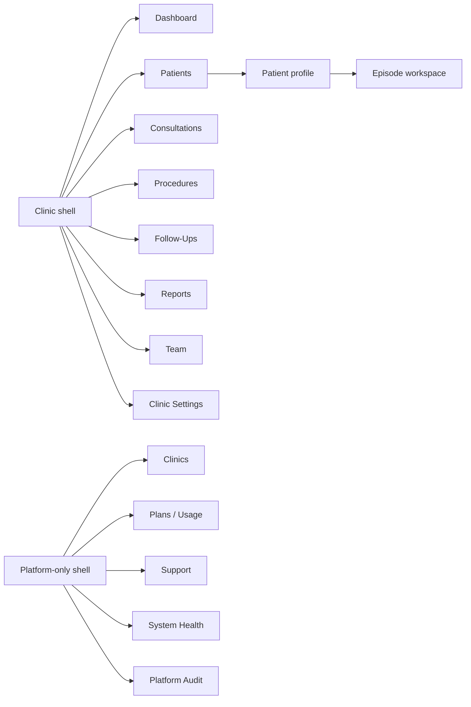

Show only accessible destinations. Disabled items are reserved for temporary state/entitlement education where revealing the feature is safe; permission-hidden modules are normally absent. Breadcrumbs communicate domain hierarchy, not arbitrary browser history. A recent/continue area may speed work but never crosses clinics or exposes masked patients to an unauthorised role.

## 12. Application Shell

`apps/web` includes public marketing, login, the clinic shell, patient/clinical workspaces, reports, clinic administration, and separate platform administration. Its header shows active clinic, active user, environment where non-production, privacy/help controls, notifications, and lock/sign-out.

The clinic shell uses a stable primary navigation, page title/breadcrumb, contextual actions, and content region. When a patient is active, a persistent patient-context banner shows approved identity summary, ID, episode, status, and privacy label. Switching clinic or patient requires deliberate navigation and clears context-specific overlays, caches, and drafts according to policy.

`apps/scan` and `apps/present` have no private clinic shell. They use a narrow temporary-session frame, explicit connection/expiry state, and one safe exit.

## 13. Responsive Behaviour

Responsive design prioritises the task:

| Width/context | Behaviour |
|---|---|
| Wide desktop | Two- or three-region clinical workspace, sticky patient context, side-by-side evidence, persistent workflow rail |
| Standard laptop | Two regions with collapsible detail, compact rail, tables retain critical columns |
| Tablet landscape | Touch-sized controls, one primary canvas plus contextual drawer, procedure/capture support |
| Tablet portrait | Stacked task panels, sticky action/status footer, tables become grouped rows |
| Phone | One focused step, minimal patient data, no desktop planning canvas forced into a narrow screen |
| LED/projector | Large patient-safe visual and limited controls; overscan and viewing distance considered |

Reflow supports zoom and larger text. Important actions do not require hover. Orientation changes preserve state safely. Responsive hiding never conceals approval, warnings, unit, save state, or disclosure class.

## 14. Desktop Experience

Desktop is the primary consultation/planning environment. It supports side-by-side images, 3D where available, region and hairline tools, measurement/graft panels, version comparison, procedure reconciliation, reports, and administration.

Keep a stable work area, avoid excessive modal chains, and use contextual drawers for supporting detail. High-frequency actions are near their evidence; global actions remain in page headers or sticky review bars. Full-width tables are used only when comparison benefits outweigh scanning cost.

## 15. Tablet Experience

Tablet supports consultation discussion, media review, procedure entry, follow-up, and limited drawing where clinically validated. Targets and numeric entry suit gloved or busy hands where applicable. The interface prevents accidental scroll/zoom gestures from editing geometry.

Shared tablet safety includes visible user and patient, fast lock, inactivity warning, no persistent downloads, and clear handoff. Complex 3D/geometry tasks may recommend landscape or desktop rather than offering a degraded unsafe tool.

## 16. Mobile Experience

Phone web use is optimised for scan pairing and guided photography. General private clinic browsing is not a mobile requirement. The scan app shows one patient, one consultation, one protocol, one current capture, and minimum recovery options.

Large targets, one-handed reach, outdoor/clinic lighting readability, camera permission guidance, connectivity state, safe-area insets, and orientation are tested. Browser navigation, back, refresh, lock, incoming calls, and camera interruption produce safe resumable states rather than duplicate uploads.

## 17. LED Presentation Experience

The presentation app starts with a neutral branded waiting screen, pairs to one approved manifest, shows large imagery/3D/region/hairline/measurement/graft-plan summaries, follows Doctor-controlled navigation, and locks/clears at expiry or revoke.

It does not resemble the Doctor dashboard: no patient search/list, contact details, private notes, internal warnings, audit, subscriptions, platform controls, download, or general browser navigation where avoidable. Viewing distance, LED colour variation, aspect ratio, glare, and network interruption require validation.

## 18. Public Marketing Experience

The marketing site is visually related but separated from authenticated clinical work. It explains value honestly, avoids medical outcome guarantees, autonomous-AI claims, patient imagery without authority, or implying certification not obtained. Calls to action support manually managed enquiries/demos rather than self-service clinic registration.

Public navigation cannot lead into tenant resources. Login is clearly distinct. Public pages use accessible content, performance-conscious media, and privacy-respecting analytics.

## 19. Platform Administration Experience

Platform administration uses a distinct shell/banner and emphasises clinic metadata, onboarding, plan/entitlement, usage, support, platform users, health, and audit. Platform roles do not see patient data by default.

Any authorised temporary clinical support context shows clinic, patient/module scope, reason, expiry, approver, and a persistent high-visibility “Support access active” banner. Leaving scope or grant expiry closes protected content. High-risk actions use step-up/confirmation as approved.

## 20. Clinic Administration Experience

Clinic administration covers clinic identity, timezone, bounded branding, templates, team, capture protocol, report/presentation settings, security/session policies where configurable, and export/closure controls. Configuration forms show effect, audience, effective version, preview, and audit consequence.

Clinic branding cannot change privacy/status colours, hide GraftVision attribution where required, reduce contrast, or create unique navigation forks. Dangerous settings are separated from everyday configuration.

## 21. Patient List Experience

The patient list shows clinic-specific ID, masked/abbreviated name where policy requires, authorised age/age range, assigned Doctor, latest consultation/procedure status, next follow-up, last activity, archive state, and a clear continuation action. Search, status filters, duplicate warnings, pagination, and role masking are supported.

It omits full history, Doctor notes, detailed plans, report content, contact details by default, and sensitive warnings. Row selection and continuation preserve visible patient identity. Similar identities receive a non-alarming duplicate/context warning; they are never automatically merged.

## 22. Patient Profile Experience

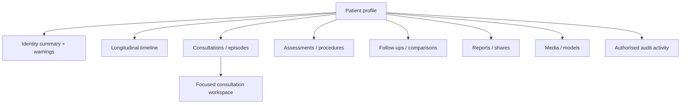

The profile is an orientation and continuation hub, not one overloaded record. The header shows identity, patient ID, active/archive status, assigned Doctor, privacy label, and last activity. Sections summarise recent/current items with clear “continue” actions. Doctor-private notes and restricted warnings are labelled and separated.

## 23. Patient Timeline Experience

The timeline orders consultations, captures, approvals, reports, procedure, follow-ups, comparisons, corrections, and important disclosure events with date, stage, author/actor category, status, and version link. Filters group clinical, media, report, and administrative events.

It does not replace audit and does not expose raw audit metadata. Superseded and corrected items remain visible through lineage. Empty periods are not interpreted as clinical absence. On mobile/tablet the timeline becomes grouped date cards rather than a compressed horizontal chart.

## 24. Consultation Workspace

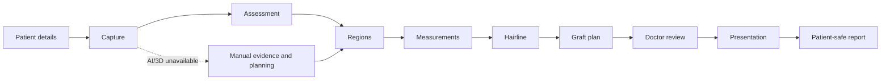

The header shows patient, ID, episode, assigned Doctor, consultation status, privacy, last saved, and active scan/presentation state. The main area contains photography, optional 3D, regions, measurements, hairline, graft planning, AI suggestions, and private notes. A workflow rail communicates completed, current, blocked, optional, and review-required steps.

The user always knows which patient and stage are open; which values are preliminary or final; whether edits are local, saving, saved, conflicted, or failed; whether Doctor approval is required; and whether a patient-facing session is active. Missing AI/3D never blocks manual completion.

## 25. Mobile Scan Experience

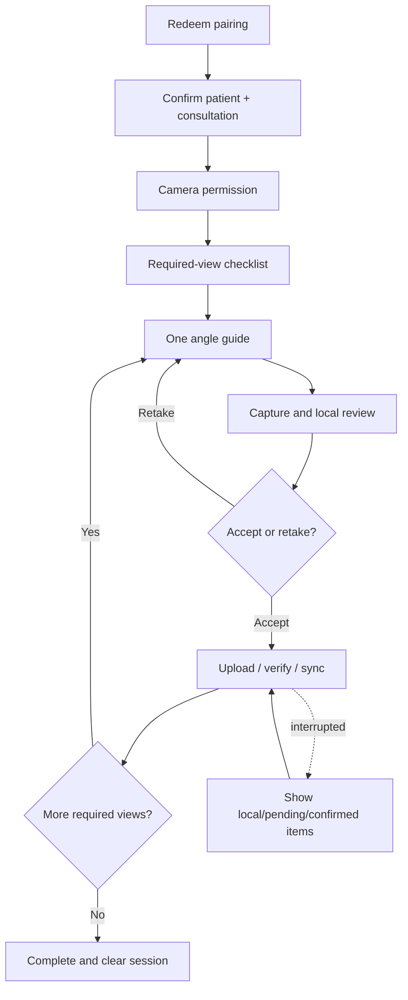

The scan screen uses a compact patient strip, capture title, angle illustration, camera preview, short position/distance/lighting/hair guidance, large capture button, retake, progress, and connectivity/sync state. Instructions do not obscure the camera.

The app has no patient list, search, unrelated media, or clinic navigation. It shows “Saved on this device,” “Waiting to upload,” “Uploading,” “Synced to clinic record,” and “Upload failed” accurately. Completion requires confirmed required views or an authorised exception recorded in the clinical app.

## 26. Phone-to-Laptop Pairing Experience

```mermaid
sequenceDiagram
  participant L as Authorised laptop user
  participant A as Trusted service
  participant P as Phone
  L->>A: Create one-patient scan session
  A-->>L: Short-lived QR/code + expiry
  P->>A: Redeem once
  A-->>P: Abbreviated patient ID/name + consultation context
  P->>P: Staff confirms patient
  P->>A: Confirmation
  A-->>L: Device paired and confirmed
  Note over L,P: Persistent compact context; any session change blocks capture
  L->>A: Complete/revoke
  A-->>P: Lock and clear patient content
```

Pairing shows expiry, connection progress, device status, and a safe regenerate option. Patient confirmation includes clinic patient ID, abbreviated name, optional authorised age, Doctor/consultation context, and a distinct session marker without unnecessary data. Changing patient/session requires a new confirmation and discards or reconciles pending captures before attachment.

## 27. Standardised Photography Experience

Proposed protocol views include front, front tilted down, left/right temple, top, crown, rear donor, left/right donor, immediate postoperative, and follow-up views. Final requirements, examples, distances, hair preparation, and exceptions require Dr Sheraz and clinic validation.

Each checklist item shows an accessible silhouette/illustration, patient head position, phone position, distance, lighting, hair condition, required/optional label, incomplete/captured/uploaded/accepted/retake state, and quality warning. Reference images avoid identifiable real patients unless properly authorised.

## 28. Media Review Experience

Media review groups items by protocol view and distinguishes original, derivative, annotation, patient-safe candidate, rejected, duplicate, and superseded. The reviewer can compare, zoom, rotate, inspect metadata/provenance, accept/retake, identify wrong view, and select patient-safe derivatives within permission.

The patient context remains sticky. Bulk selection never crosses patients or mixes internal/patient-safe actions. Failed processing preserves the original and offers safe retry or manual use. Filenames/object paths are not the primary identity.

## 29. 3D Viewer Experience

The viewer supports rotate, zoom, appropriate pan, reset, named standard views, model loading/failure, version, source, processor, compatibility, calibration/scale, preliminary/final state, approved-region visibility, and safe presentation.

Raw model, AI-suggested region, Doctor-edited region, Doctor-approved region, previous version, and current version use labelled legend entries, outlines/patterns, and status icons. No unsupported cm² appears when scale is unavailable. A 2D/manual alternative remains accessible. Keyboard, button-based standard views, instructions, and a static image alternative supplement pointer gestures.

## 30. Scalp Region-Marking Experience

The tool supports draw, close, select type, edit points, move boundary, undo/redo, hide/show, delete draft, compare suggestion, accept-to-edit, reject, submit, approve, and lock approved version. Geometry editing is deliberately distinct from canvas navigation.

Every region shows label, type, colour plus pattern/outline, source, method, version, author, calibration relationship, and status. AI acceptance creates an editable human draft; it does not approve. Deleting a draft explains scope, while approved history is superseded rather than erased.

## 31. Measurement Experience

Every measurement displays value, unit, region, source, method, calibration, precision/uncertainty where applicable, preliminary/final stage, creator, reviewer, approval, and version. Suggested source labels are Manual entry, Geometry calculated, AI suggested, Doctor corrected, and Doctor approved.

False decimal precision is avoided. When scale is missing, the primary message is “Measurement unavailable—calibration required,” with authorised manual entry and explanation; the UI never guesses cm². Changed source/calibration visibly invalidates or marks stale dependent measurements.

## 32. Graft Planning Experience

The planning view separates area, target density, calculated estimate, preliminary range, Doctor adjustment, and final approved allocation. A recommended zone table is:

| Zone | Area + source | Target density | Calculated estimate | Doctor adjustment | Final allocation | Status |
|---|---|---|---|---|---|---|

Formula/method, units, range, donor consideration, warnings, version, and approval remain visible. Planned grafts never share a total label with extracted, discarded, usable, or implanted grafts. An adjustment requires reason where policy requires and never hides the calculated baseline.

## 33. Hairline Design Experience

The designer shows existing and proposed hairline, anatomical reference points, draggable controls, symmetry guide, centre line, left/right comparison, named options, conservative/alternative concepts, source, Doctor notes, illustrative simulation label, version, and approval.

AI proposals are visually subordinate and labelled. Patient-facing language uses “Proposed hairline,” “Illustrative design,” and “Doctor-reviewed option,” never a guaranteed result. Touch and keyboard alternatives, undo, reset, and exact-version comparison reduce accidental edits.

## 34. AI Suggestion Experience

AI suggestions occupy a clearly labelled side panel or comparison layer, not the approved-value position. Each shows AI-assisted label, task/method/model where appropriate, sources, confidence/uncertainty explanation, limitations, status, and actions: compare, accept as editable draft, edit, reject, invalidate, or continue manually.

Doctor-approved information is visually dominant. Avoid sparkles, glowing animation, “best” badges, unsupported percentages, or copy implying diagnosis. Provider/job failure shows what remains usable and directs the user to manual tools.

## 35. Doctor Approval Experience

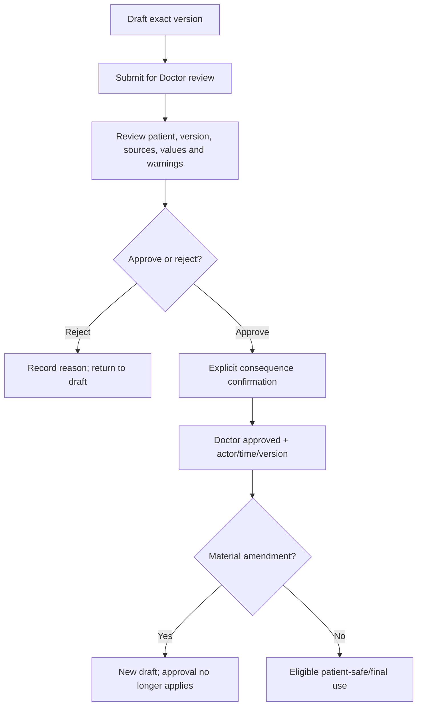

The approval component uses Draft, Review required, Doctor approved, Rejected, Amended, and Superseded. Before approval it names patient, consultation/resource, exact version, important values, sources, unresolved warnings, disclosure consequence, and what approval enables. The action is explicit, never a passive save.

Only an authorised Doctor sees an enabled clinical approve action. Preparers see who must act. Material changes create a new draft/reapproval state; the prior approved version remains traceable.

## 36. Surgery-Day Assessment Experience

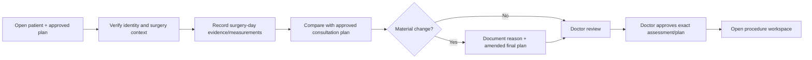

The screen makes consultation plan, surgery-day evidence, changes, and final Doctor-approved plan distinct. It shows patient/episode, dates, sources, calibration, measurements, donor/recipient findings, deviation reasons, version, and approval. It never silently overwrites the consultation.

## 37. Procedure Documentation Experience

The procedure workspace prioritises approved plan reference, active patient, team, timing, extracted counts by type, damaged/discarded, usable calculation, implanted by zone, remaining difference, exceptions, postoperative media, instructions, save/sync status, and Doctor review.

Entry is fast and error resistant: large numeric fields, explicit units, sensible focus order, keypad support, timestamps where needed, undo/correction history, and persistent totals. Unsupported defaults are absent. Team members see only permitted fields; a Technician cannot approve the final clinical record.

## 38. Graft Count Reconciliation Experience

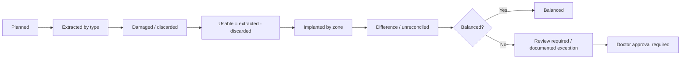

Separate cards/columns show Planned, Extracted, Damaged/discarded, Usable, Implanted, and Difference. States are Balanced, Review required, Exception documented, and Doctor approval required. Text, icons, grouping, and pattern supplement colour.

Reconciliation updates immediately from confirmed entries but distinguishes locally edited, saved, and approved totals. Mismatch blocks silent completion and provides the exact equation, affected zones/types, correction path, and authorised exception path.

## 39. Follow-Up Experience

Follow-up pages show scheduled checkpoint, actual visit, standard photography checklist, baseline, capture consistency, donor and recipient observations, Doctor assessment, patient-reported satisfaction, next visit, report option, version, and save/approval state.

Suggested checkpoints—Day 1, Day 7, Day 10–14, Month 1, 3, 6, 9, 12, and 18—remain clinic-configurable and are not implied medical requirements. Missed/rescheduled/unscheduled visits remain visible. Staff observations and Doctor assessment use distinct sections.

## 40. Longitudinal Comparison Experience

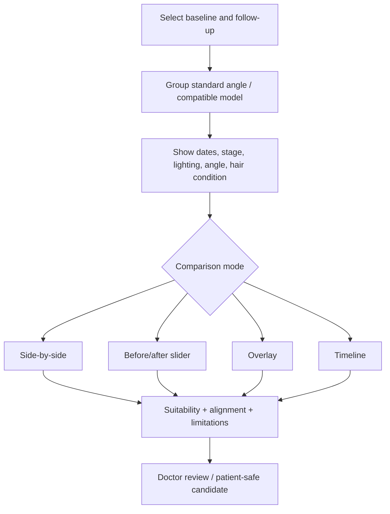

Comparison supports side-by-side, slider, overlay, timeline, standard-angle groups, and compatible 3D comparison. It always shows dates, stage, conditions, suitability, alignment quality, source/version, and warnings where reliability is reduced.

A slider has a keyboard/button alternative. The interface never implies quantitative growth accuracy from inconsistent images and never auto-selects a flattering comparison without displaying selection context.

## 41. Report Creation Experience

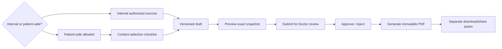

Report creation begins with an explicit disclosure class. Internal creation can use authorised clinical detail and Doctor-only material according to role but displays an “Internal—never patient share” banner. Patient-safe creation uses an allowlisted checklist of identity, images, measurements, plan, recommendation, disclaimer, watermark, report number, version, and verification reference.

Each selected item shows source/version and patient-safe eligibility. Preview renders the exact snapshot, not a live record. Template and branding preview cannot hide status, disclaimer, version, or watermark. Generation progress is asynchronous and truthful.

## 42. Report Approval Experience

The approval page shows report type, patient, report/version number, source versions, selected content, missing items, warnings, branding, watermark, disclaimer, verification reference, and the difference from the last version. The Doctor can inspect full-resolution sources without putting them into the patient-safe snapshot.

Approve and Reject are explicit. Rejection requires a useful reason and returns the version for correction. Approval freezes the patient-safe snapshot; later corrections create a new version and show the prior version as Superseded. Generated, Doctor approved, Ready, and Shared remain different states.

## 43. Report Sharing Experience

Sharing appears only for the current eligible patient-safe version and shows approved version, recipient reference/channel, expiry, watermark, download/view policy, delivery status, revoke action, and audit status. It requires recipient/context confirmation immediately before creation.

Internal reports never display sharing controls. A corrected report does not silently replace a previously delivered file; the UI shows supersession and offers an approved new share. The link token is not displayed after the creation/delivery moment where avoidable. Revocation confirms which recipient/version loses future access.

## 44. Presentation Mode Experience

```mermaid
sequenceDiagram
  participant D as Doctor/private workspace
  participant A as Approved manifest
  participant P as LED presentation
  D->>A: Select patient-safe items and exact versions
  D->>A: Review and approve manifest
  D->>P: Create short-lived one-patient session
  P-->>D: Connected waiting state
  D->>P: Advance approved slide state
  P-->>D: Display acknowledgement
  D->>P: Revoke/end
  P-->>D: Neutral lock screen; patient data cleared
```

The private content-selection screen distinguishes eligible, ineligible, and missing-approval items. The LED uses clinic branding, patient-safe title, one large clinical visual, simple summaries, hairline/region/graft-plan views, and subtle progress. Navigation is Doctor-controlled; a Presentation User receives only permitted control.

The display shows connection and expiry without private diagnostics. If connection becomes uncertain, it holds only approved current content for an approved grace period or blanks according to policy. After revoke/expiry it shows a neutral locked screen. Screenshots and physical observation remain residual risks addressed through clinic practice.

## 45. Clinic Branding Experience

Branding controls may support clinic logo, name, restrained accent, report header/footer, approved contact details, Doctor profiles, and template selection. Preview modes cover web header, patient-safe report, presentation, monochrome print, and low-contrast LED conditions.

GraftVision owns the interaction and safety semantics. Clinic choices cannot recolour warning/approval/privacy states, remove required attribution/version/watermark/disclaimer, reduce contrast, change typography beyond supported options, or create unique layouts. Unsafe assets or colours receive clear validation and an accessible fallback.

### UX-DESIGN-001 approved technical decision

The existing shared typography, spacing, radii, shadows, surfaces, responsive breakpoints, interaction states, and presentation density are the approved technical baseline. They remain unchanged unless validation proves a defect.

Clinic branding may supply a logo and clinic identity text and may override only the primary, secondary, link, and selected-control accents. Arbitrary CSS, fonts, gradients, layouts, navigation changes, unrestricted theme data, and semantic-state recolouring are prohibited.

Error, warning, destructive, privacy, restricted, lock, focus, Doctor-approved, patient-safe, AI-assisted, anatomical, disabled, and invalid meanings remain system-owned. The technical accessibility gate targets WCAG 2.2 AA: 4.5:1 for normal text and 3:1 for large text and essential UI boundaries, with visible focus, keyboard, zoom/reflow, reduced-motion, forced-colour, colour-vision, grayscale, print, RTL, and non-colour-cue evidence.

Reports preserve attribution, disclosure class, approval/version state, watermark, disclaimer, and report identity across screen, print, and grayscale fixtures. Presentation preserves attribution, disclosure class, approval/version state, expiry, and lock state across 16:9, overscan, distance-readability, low-contrast LED, revoke/expiry neutral-state, and reduced-motion fixtures.

Automated evidence is provided by the shared UI tests and `verify:ux-design-policy`. Technical validation evidence does not complete manual approvals. The approval checklist in Section 100 remains the source of truth for external human sign-off.

## 46. User and Role Management Experience

Team management lists identity, membership status, approved roles, Doctor verification state where applicable, invitation status/expiry, MFA/security status where authorised, last relevant access summary, and deactivation. It explains that roles combine but Doctor-only and separation-of-duties rules remain.

Inviting or changing roles previews permissions and sensitive consequences. High-risk role changes require confirmation/step-up according to policy. Deactivation explains immediate session/grant revocation and assigned-work impact. Shared accounts are prohibited in interface copy and onboarding.

## 47. Support Access Experience

The support request shows problem category, safe operational details, proposed engineer, clinic/module/patient scope, permitted actions, reason, requested duration, approver, and what support cannot do. Metadata-first support is the default; clinical access is requested only when necessary.

Approval summarises scope and expiry. During activation, both clinic and support user see a persistent banner with scope and remaining time. Clinic leadership can inspect actions and revoke immediately. Expired/revoked grants close content and offer a new request—not silent renewal. Support never receives clinical approval, role change, unrestricted export, sharing, or deletion controls.

## 48. Export Experience

Export is a governed asynchronous workflow: define clinic-owned scope, review inclusions/exclusions, verify authority, approve if required, generate, validate, notify, retrieve through expiring delivery, and clean up. The UI distinguishes Requested, Approval required, Processing, Ready, Failed, Expired, Cancelled, and Downloaded.

Scope preview calls out archived data, media, report/history options, holds, package format, estimated size/time, and exclusions such as platform software, algorithms, tools, other tenants, and shared configuration. Retrieval requires current authority and warns against leaving the package on a shared device.

## 49. Archive and Deletion Experience

Archive is the normal reversible action. It states what becomes hidden, what remains available, and how restoration works. Permanent deletion is a separate multi-stage request with scope review, holds, reason, approval, scheduling/cooling period, cancellation, execution status, and audit outcome.

Never place permanent deletion beside routine Save. Confirmation requires the specific patient/clinic/resource, consequences, dependencies, shares/sessions, and backup/retention limitations. No deceptive urgency or preselected destructive choices. A generic trash icon is insufficient for clinical deletion.

## 50. Subscription and Entitlement Experience

Clinic leadership may view current plan, enabled capabilities, usage summary, subscription status, effective dates, and support contact. The founding PKR 30,000 onboarding and PKR 30,000 monthly offer is pilot-stage, manually sold pricing—not permanent global pricing.

Unavailable optional features explain entitlement without exposing security-sensitive controls. Core tenant isolation, privacy, private storage, Doctor approval, audit, export ownership, and manual fallback never appear as paid safety upgrades. There is no patient payment or automatic recurring billing interface in MVP.

## 51. Status Design

Status families are consistent across modules:

| Family | Examples | Treatment |
|---|---|---|
| Neutral | Draft, Scheduled, Pending | Quiet badge, neutral icon, plain next step |
| Attention | Review required, Capture incomplete, Reconciliation required, Calibration required | Amber-like semantic role plus icon/text; remains prominent |
| Positive | Completed, Doctor approved, Ready, Balanced, Synced | Restrained positive colour plus check/label |
| Restricted | Suspended, Expired, Revoked, Archived, Superseded | Muted/restricted treatment and explanation |
| Critical | Failed, unsafe disclosure prevented, integrity conflict | High contrast, persistent explanation, safe recovery |
| Processing | Queued, Uploading, Generating, Reconstructing | Progress/status/time expectation without implying completion |

“Preliminary,” “AI-assisted,” “Internal,” “Patient-safe,” and “Doctor approved” are semantic labels, not interchangeable status colours. All badges include text and accessible names.

## 52. Form Design

Forms group related fields, use plain labels, show required/optional, reveal clinical units, display visibility/privacy, save drafts, preserve recoverable input, and show last saved state. Progressive disclosure reduces cognitive load without hiding warnings or required fields.

Validation is early but not disruptive: format help precedes errors; errors appear beside fields and in an accessible summary after submit; focus moves appropriately. No unsupported final defaults, ambiguous toggles, placeholder-only labels, or silent unit conversion. Leaving with unsaved changes offers Stay, save draft where valid, or discard with scope.

## 53. Table Design

Tables support clear headers, row selection, masking, empty/loading/error states, pagination, allowlisted filters/sorts, keyboard navigation, and sticky headers where beneficial. Numeric columns align for comparison and repeat units in headings or values. Row actions are predictable and never depend on hover alone.

At smaller widths, noncritical columns collapse into labelled row details; patient/context, status, warning, and primary action remain. Avoid showing every field or horizontal scrolling through sensitive columns. Virtualisation must preserve accessible reading and focus.

## 54. Search Design

Search states its scope—such as “Search patients in FACE Aesthetic Clinic Lahore”—and never crosses the active clinic. Results use minimum summaries, role masking, match context, and distinct patient ID. Search terms persist only as needed and do not appear in general analytics.

Short/ambiguous queries prompt refinement. No-result states distinguish empty clinic, filters, spelling, archive scope, and permission without revealing restricted records. Temporary scan, presentation, and report surfaces have no clinic search.

## 55. Filtering and Sorting

Filters use human labels, visible active chips/summary, clear reset, and bounded options. Common clinical filters include status, assigned Doctor, date, procedure/follow-up stage, report status, and archived state according to permission.

Sorting displays current direction and stable default. Filters/sorts persist within an appropriate session but clear on clinic switch. Hidden restricted fields cannot influence visible ordering in a way that leaks information. Saved views are post-MVP unless needed by validated workflow.

## 56. Cards and Panels

Cards summarise one coherent resource, status, or comparison; panels hold related work. Avoid nested card forests. Each has a clear title, optional privacy/status badge, concise metadata, primary value or content, and predictable actions.

Clinical values show units/source/stage near the number. Collapsed panels never hide a critical warning, unsaved state, or approval requirement. The consultation canvas uses panels to support evidence plus action, not dashboard decoration.

## 57. Tabs and Section Navigation

Tabs switch peer views of the same resource; workflow rails represent ordered stages; side navigation changes modules. These patterns are not interchangeable. Tab labels are concise, use counts only where meaningful, support keyboard semantics, and preserve state safely.

Deep links resolve authorised resource and active clinic. Hidden tabs do not leave content in the DOM for unauthorised users. When an item becomes inaccessible, focus and navigation recover to a safe parent with explanation.

## 58. Modals and Drawers

Modals are reserved for focused confirmation, short review, or blocking decisions. Drawers provide contextual supporting detail without losing workspace. Complex creation, clinical approval, procedure completion, export, and deletion use full pages when review requires space.

Both trap/manage focus accessibly, have labelled titles, escape/close behaviour that respects unsaved work, and do not stack multiple layers. Sensitive content disappears when closed according to session/cache policy. Destructive confirm buttons are not the default focus.

## 59. Notifications and Alerts

Notifications communicate action-relevant events—review assigned, processing finished/failed, share revoked, support active, session expiry, conflict, or scheduled follow-up. They reveal minimum patient information and link only to currently authorised contexts.

Inline alerts describe local issues; banners cover page/session-wide states; toast-like acknowledgements confirm noncritical actions but never carry the only evidence of failure or approval. Critical alerts persist until acknowledged/resolved. Notification badges do not create anxiety through noisy counts.

## 60. Empty States

Empty states explain the scope, why it may be empty, the permitted next action, and any prerequisite. Examples include no patients yet, no follow-up due, no approved patient-safe media, or no model uploaded.

They avoid fake data, marketing exaggeration, or prompting an unauthorised action. A permission-filtered list does not say the clinic has no records. Manual alternatives appear when AI/3D output is absent.

## 61. Loading States

Initial loading preserves page structure and context without displaying stale patient data from another resource. Use concise skeletons/placeholders only where they reduce layout movement. Loading indicators have accessible status text and do not animate excessively.

After a patient or clinic switch, prior sensitive content clears before new loading. Actions disable only for a reason and show acknowledgement. If loading exceeds an expected threshold, show request ID/retry/continue options safely.

## 62. Processing States

Processing communicates Queued, Running, progress where meaningful, attempt/retry, expected variability, cancellation availability, source/version, and manual continuation. Never show arbitrary smooth percentages for jobs that cannot report real progress.

AI, 3D, media, PDF, and export processing remain distinct. Late results that are stale or invalidated are labelled and cannot replace newer work. Users may leave and return; notification/realtime supplements durable status.

## 63. Error States

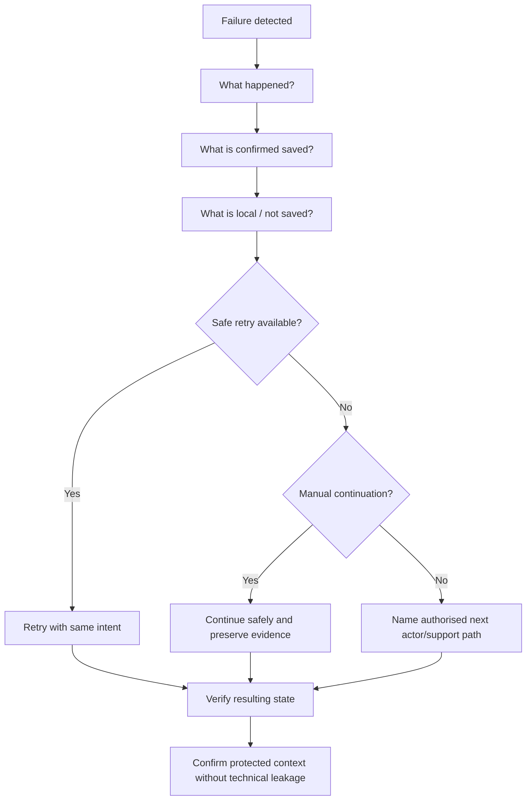

Every error answers what happened, saved/not saved, retry safety, manual path, required actor, privacy outcome, and support route. Copy is specific: “Photo remains on this phone and has not reached the clinic record,” not “Failed.” Technical internals, other tenants, tokens, provider errors, and stack details are omitted.

Field, page, temporary-session, processing, and system maintenance errors use distinct treatments. The user can copy a safe request ID without copying patient content.

## 64. Offline and Interrupted States

The state vocabulary is Online, Weak connection, Offline, Saved on this device, Waiting to upload, Uploading, Synced to clinic record, Failed, and Session expired. “Saved” alone means durable server confirmation or is qualified explicitly.

The scan app lists local/pending/confirmed captures per view and prevents attaching a local draft to a changed patient. Reconnect revalidates identity, session, patient, required views, event sequence, and expiry. If a session expired, staff return to the laptop to issue a new safe context rather than extending it from the phone.

## 65. Conflict and Concurrency States

When a newer revision exists, stop the write and show: who changed it where permitted, when, current version, affected sections, the user’s unsaved input, and approval consequence. Actions include Reload current, copy/download permitted unsaved notes, compare, or deliberately reapply to the new draft.

Never auto-merge approved clinical values, geometry, report snapshots, procedure counts, or privacy settings. Material changes mark prior approval inapplicable and require reapproval. Realtime “someone else is editing” is advisory; revision conflict is authoritative.

## 66. Success States

Success names the completed action and resulting state: “Draft saved to clinic record,” “Doctor approved version 4,” “Report share created until…,” or “Capture synced.” It does not claim processing completed when merely accepted.

High-impact success shows version, patient/resource, next action, and undo/revoke where valid. Use restrained confirmation rather than celebration that trivialises clinical work. Approval, share, export, and deletion outcomes persist in the page and audit history rather than disappearing in a toast.

## 67. Confirmation Patterns

Confirmation strength matches consequence:

| Level | Pattern | Examples |
|---|---|---|
| Low/reversible | Immediate action with inline acknowledgement/undo where safe | Dismiss filter, reorder draft |
| Moderate | Clear confirm with resource and result | Revoke scan, end presentation, archive draft |
| High | Review page, explicit scope, reason, possible step-up | Doctor approval, role change, support grant, export |
| Destructive/irreversible | Multi-stage request, separation/hold check, cooling/schedule | Permanent deletion |

Confirmations never use ambiguous “Yes/No”; buttons name actions. Repeated confirmations are avoided when they add habit rather than understanding.

## 68. Destructive Action Patterns

Archive patient, revoke share/session, remove user, cancel procedure, delete draft region, request deletion, and close clinic show exact target, current state, dependencies, reversibility, affected devices/links/users, and recovery path. Destructive actions are visually differentiated but not alarmingly dominant.

Permanent deletion requires request, review, holds, approval, scheduled execution, cancellation window, and outcome. Dark patterns, preselected consent, misleading button hierarchy, or typing a generic word without understanding are prohibited.

## 69. Approval Patterns

A standard approval header identifies item, patient, clinic, version, preparer, state, required role, and warnings. A comparison block shows changed sources/values since the previous approved version. Approval and rejection are mutually clear and keyboard accessible.

Only Doctor-approved status uses the Doctor-approved semantic treatment. Review required, prepared, generated, and Coordinator-reviewed cannot visually mimic it. An approval badge links to safe provenance where authorised.

## 70. Versioning Patterns

Version indicators show human-readable number, status, created/approved time, author/reviewer, current/superseded relationship, and source dependencies. A version history drawer/page supports compare and restore-to-new-draft where allowed, never destructive rollback of history.

The “current” item may differ from “current approved”; labels state both. Corrected reports and amended plans create successors. URLs/deep links resolve an exact version or clearly redirect with status notice; they do not silently show a different version.

## 71. Privacy Patterns

Consistent badges include Doctor-only, Internal clinic, Patient-safe, Approved for sharing, Temporary presentation, Support access active, Masked, and Restricted. Badges appear at section and action boundaries without overwhelming every field.

Before present/share/export/download, the UI summarises disclosure class, recipient/surface, content/version, expiry, and excluded internal information. Patient-safe content uses a separate preview. Privacy indicators are never solely decorative; they change available actions and explanatory copy.

## 72. Sensitive Data Masking

Role-sensitive masking applies to patient phone, email, address, medical warnings, Doctor notes, audit metadata, recipient references, and report links. The server supplies the masked projection; raw values are not hidden in DOM, attributes, client stores, analytics, or accessible descriptions.

Reveal controls are exceptional, permission checked, purposeful, time-limited where appropriate, and audited according to policy. Copy-to-clipboard respects masking and shared-device risk. Print/export uses a separate authorised projection.

## 73. Audit Visibility

Clinic-authorised audit views show actor, role, action, target, patient/resource reference, time, outcome, support grant, approval/share/export/deletion context, and safe reason. They do not display raw notes, images, reports, tokens, or secret material.

Audit is read-only and paginated. Filters explain scope. Access to audit is itself recorded. The patient timeline uses curated clinical events and does not impersonate the full audit log.

## 74. Permission-Denied Experience

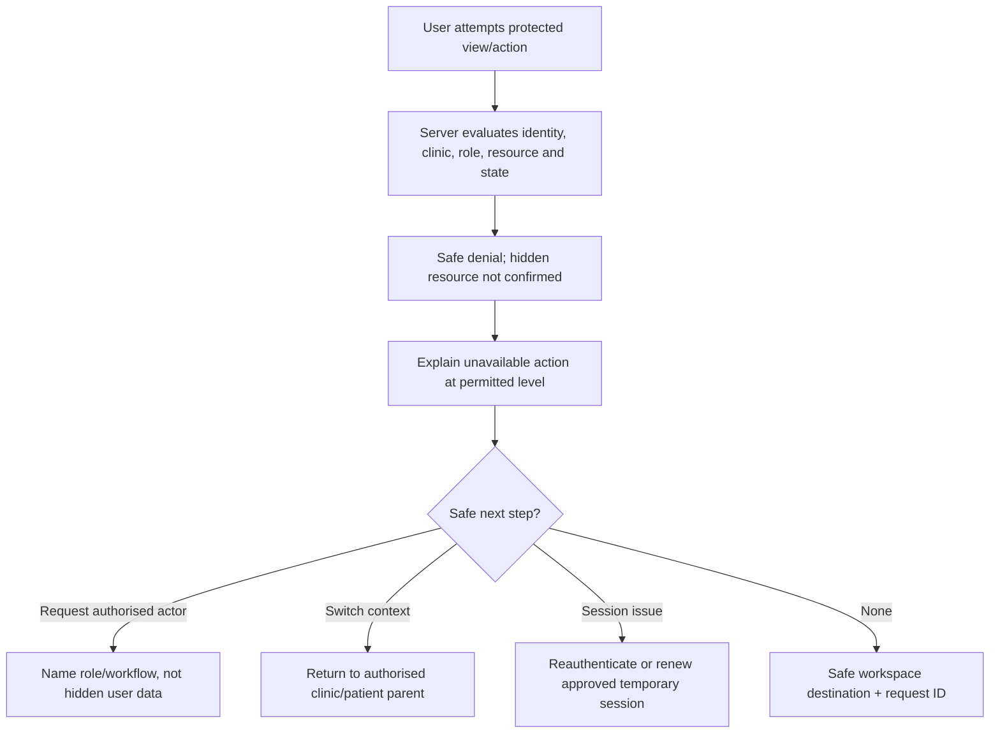

Denial distinguishes unauthenticated, expired session, insufficient permission, unavailable state, and intentionally undisclosed resource only when safe. It never suggests changing URL/ID, requesting broad access, or confirming another tenant’s record.

Focus moves to the denial heading; the primary action is a safe route. Hidden navigation remains hidden. If a preparer needs a Doctor, the UI names the required role and review workflow without enabling approval.

## 75. Session-Expiry Experience

Before interactive user-session expiry, a non-disruptive accessible warning offers Continue securely or Sign out, subject to policy. Expired sessions hide protected content, preserve only approved non-sensitive recovery state, and return after reauthentication to a revalidated context.

Scan, presentation, report-share, support, upload/download, and user sessions have distinct expiry experiences. Scan explains local unsynced items and requires laptop reissue; presentation blanks; report share gives a neutral expired/revoked message; support closes scope; signed delivery requests a new authorised grant. Client timers never imply authority beyond server expiry.

## 76. Accessibility Standards

Target WCAG 2.2 AA principles where practical across web, scan, presentation, and generated reports. Required foundations include semantic headings/landmarks, logical reading/focus order, keyboard operation, visible focus, descriptive labels, accessible names, error association/summary, sufficient contrast, zoom/reflow, large touch targets, non-colour status, reduced motion, accessible dialogs/tables/charts, and captions/descriptions where relevant.

Clinical canvas, image, geometry, and 3D interactions provide button/keyboard alternatives for core actions, textual state/provenance, named standard views, undo, and a manual data-entry/review path. Where a visual task cannot be made equivalent, document the limitation, minimise exclusion, provide an assisted workflow, and include it in accessibility approval rather than claiming compliance.

Proposed minimum touch targets, text sizes, contrast ratios, breakpoints, and focus treatments must be verified against current standards and actual devices before becoming tokens. Presentation and PDF accessibility receive separate checks.

## 77. Typography

Use a professional sans-serif system with roles for Display, Page title, Section title, Card title, Body, Label, Caption, Data value, Table text, and Clinical annotation. Limit weight/size variation; use spacing and hierarchy rather than decorative typography.

Clinical values and units remain legible together. IDs, versions, dates, counts, and formulas may use tabular numerals where supported. All-caps is reserved for short labels and not paragraphs. Clinic brand fonts are limited to approved report/brand roles and require accessible fallbacks.

## 78. Colour System

Define semantic roles: Primary action, Secondary action, Canvas, Surface, Border, Text primary/secondary, Success, Warning, Error, Information, Restricted, Preliminary, Doctor approved, AI assisted, Patient safe, and Internal. Anatomical region colours form a separate palette.

Exact values remain proposed. Every foreground/background/state combination passes contrast review in standard, hover, focus, disabled, selected, printed, projected, and colour-vision scenarios. Success is not merely green; errors are not merely red. Clinic accents cannot replace controlled semantic colours.

## 79. Iconography

Use a coherent line/filled icon family with simple familiar metaphors and consistent optical size. Icons reinforce text for privacy, approval, warning, sync, lock, expiry, AI, source, version, archive, share, and device connection. Critical actions retain visible labels.

Avoid decorative medical symbols, ambiguous scalp/body icons, robotic AI imagery, flags for language, and icon-only menus without accessible names. Anatomical view icons are paired with text/illustrations and clinically validated.

## 80. Spacing and Layout

Use a proposed consistent spacing scale with generous page rhythm, tighter internal grouping, and obvious separation between patient identity, private notes, evidence, values, and actions. Max content widths protect readability; clinical canvases and comparison tables may expand deliberately.

Grid behaviour supports 12-column-like desktop composition, stacked mobile flow, safe gutters, sticky context, and print/LED variants without prescribing CSS. Alignment communicates relationships. Excess whitespace must not force clinically linked evidence and action onto separate screens.

## 81. Motion and Animation

Motion supports scan/upload progress, panel transitions, approval acknowledgement, presentation transitions, and subtle 3D orientation. It is short, interruptible, and respects reduced-motion preference. State remains understandable without animation.

Avoid continuous decoration, dramatic AI reveals, parallax, flashing, bouncing alerts, slow workflow transitions, and motion that distracts a Doctor or patient. Progress animation never implies unreported percentage or durable completion.

## 82. Data Visualisation

Charts show title, purpose, source, date range, units, stage, legend, uncertainty/limitations, and accessible summary/table. Scales do not exaggerate change. Longitudinal charts distinguish scheduled/actual visits and missing data.

Use charts only when a relationship is clearer than a table or sentence. Graft counts favour explicit reconciliation numbers; patient outcome comparisons favour images plus conditions; usage/operations may use trends. Tooltips are keyboard/focus accessible and never contain the only critical value.

## 83. Image Display Standards

Clinical images preserve aspect ratio, orientation, original/source identity, view label, capture date/stage, version, patient context, and patient-safe status. Thumbnails never crop away essential context without indicating crop. Zoom/pan has reset and keyboard/button alternatives.

Before/after views use comparable scale where practical and disclose lighting, angle, distance, hair condition, suitability, and alignment. Patient-safe copies exclude unnecessary metadata and private annotations. Placeholder imagery is clearly synthetic/illustrative.

## 84. 3D Visualisation Standards

Show orientation control, standard views, loading/progress, failure, compatibility, source, processor/version, model version, calibration/physical scale, region legend, and preliminary/approved state. Limit visual clutter and render patient-safe overlays only in presentation.

Unsupported devices receive a static/2D/manual alternative, not a broken empty canvas. Expensive models may progressively load without treating partial geometry as ready. Visual quality does not imply measurement accuracy; wording and status make this explicit.

## 85. Hairline and Region Colours

A proposed anatomical set assigns distinguishable semantic identities to Frontal, Mid-scalp, Crown, Left temple, Right temple, Donor area, Existing hairline, and Proposed hairline. Final hues require colour-vision, clinical-image background, print, and LED testing.

Each uses label, outline, pattern/fill, legend, and status icon. Left/right remain text-labelled. AI suggestion uses a style dimension separate from anatomy, such as dashed outline; Doctor-approved uses approval status, not a conflicting anatomical colour. Never reuse region colours for error/success.

## 86. Report Visual Standards

Reports use clinic-approved header, patient/report identity, report number, version, issue/approval date, Doctor identity, disclosure class, content hierarchy, selected imagery, explicit units/source, approved plan/recommendation, disclaimers, watermark, verification reference, page numbering, and accessible reading order where supported.

Internal and patient-safe templates are visibly different. Tables avoid tiny text and split rows safely. Images include captions/view/date. Print, screen, grayscale, common paper size, and PDF metadata are tested. No hidden internal fields, comments, layer names, or unapproved metadata enter patient-safe output.

## 87. Watermark Standards

Watermarks communicate status without obscuring clinical evidence. Proposed roles include Draft/Internal, Patient-safe approved, Superseded, and Copy/verification where policy requires. Wording, opacity, position, repetition, and print behaviour remain design/legal decisions.

Watermark is not the only status mechanism and does not replace access control. A superseded report remains legible for authorised history while clearly not current. Clinic branding cannot remove required watermark or version.

## 88. Internationalisation Readiness

MVP begins in English but layouts support future Urdu, Arabic, right-to-left direction, longer translated text, locale-aware plural/grammar, dates/numbers, clinic timezone, units, and translated report templates. UI copy is externalisable and avoids concatenated phrases or direction-dependent icons.

Mirroring is tested for navigation, forms, tables, timelines, charts, canvas controls, before/after comparisons, and presentation. Patient names and clinical units retain appropriate direction/isolation. Language choice does not alter stored clinical meaning or approval.

## 89. Date, Time, Unit, and Number Formatting

Store/canonical timestamps are UTC; display uses clinic timezone with explicit zone where ambiguity matters. Prefer `25 Jul 2026`-like unambiguous dates over numeric-only dates. Event lists show absolute time; relative time supplements it.

Scalp area uses cm² when valid; grafts/follicular units use approved terminology consistently. Values show units adjacent, ranges where appropriate, and precision justified by method. Planned, extracted, discarded, usable, implanted, and difference use integers unless the domain later approves otherwise. Localised digits/separators must not change underlying values.

## 90. Device and Browser Considerations

Support policy covers modern browsers with secure cookies, camera/media APIs, WebGL where 3D is offered, accessible input, print/PDF preview, and realtime connection. Exact matrix requires engineering validation. Unsupported capabilities are detected before a critical step and show a manual/alternate-device path.

Test clinic laptops, shared tablets, common Android/iOS browser capture, camera permissions, low memory, rotation, backgrounding, locked screens, poor networks, LED browser/full-screen, zoom, high-DPI, print, and browser download behaviour. Private content is not persisted merely to improve perceived speed.

## 91. Shared-Device Safety

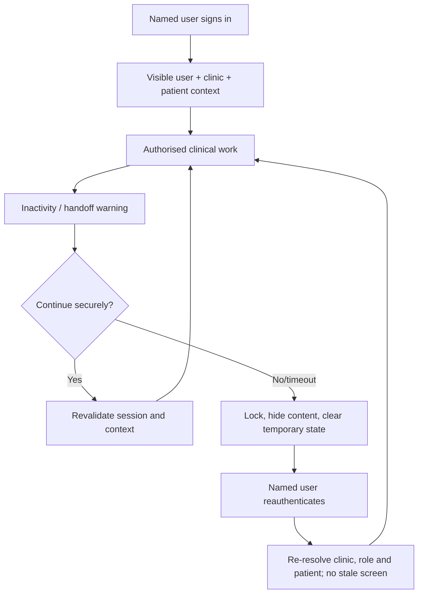

Shared devices show active user, clinic, patient, fast lock, inactivity warning, clear sign-out, privacy-screen option where feasible, and no persistent report/export download by default. Browser password exposure and shared accounts are discouraged through onboarding and product copy.

Patient context remains prominent; switching user, clinic, or patient clears sensitive overlays and requires fresh permission. Presentation locks after expiry. Local scan drafts identify patient/session and clean up after confirmed completion/policy. Physical shoulder-surfing requires clinic procedures in addition to UI.

## 92. Performance Perception

The interface acknowledges input immediately, distinguishes local interaction from accepted server work, preserves layout, and prioritises patient context and current evidence. Slow modules load independently where safe; optional AI/3D does not block manual consultation.

Use truthful progress, optimistic UI only for reversible low-risk actions, and server-confirmed state for approval, share, upload readiness, procedure finalisation, export, and deletion. Avoid repeated polling animations, disabled screens without explanation, or stale cached patient content. Proposed perception targets require measured clinic/device tests.

## 93. UX Analytics

Privacy-conscious analytics may measure workflow completion, capture failures/retakes, scan completion, report generation time, approval delay, common safe error codes, device compatibility, abandoned stages, performance, and accessibility/usability signals. Confirmed tenant-isolation and patient-disclosure incidents target zero.

General analytics excludes raw clinical content, patient identity/contact, notes, images, report contents, tokens, search text, and sensitive field values. Event catalogues, retention, tenant references, consent/legal basis, vendor, and access require privacy/security approval.

## 94. Usability Testing

Pilot testing at FACE Aesthetic Clinic Lahore includes Doctor, Clinical Assistant, Reception User, Procedure Technician, Clinic Administrator, Report Coordinator/Presentation User where applicable, and patient-facing consultation observation with appropriate authority.

Scenarios cover new/returning patient, duplicate warning, consultation, interrupted/low-quality capture, wrong-patient prevention, 3D unavailable, manual regions/measurements/planning, AI suggestion separation, Doctor approval/reapproval, report sharing, LED presentation/expiry, surgery-day change, graft reconciliation, follow-up/comparison, role denial, shared-device timeout, conflict, support access, export, and deletion request.

Measure completion, time, error/recovery, wrong selections caught, comprehension of preliminary/final and internal/patient-safe, accessibility barriers, confidence without overclaim, and staff/patient feedback. Findings from one clinic inform but do not universalise the design.

## 95. Design QA

Design QA checks source requirement/flow, role/projection, tenant/patient context, all states, responsive variants, keyboard/focus, screen reader semantics, contrast, zoom, reduced motion, copy, units/dates, privacy labels, errors, offline/conflict, loading/processing, print/LED, and realistic/synthetic data stress.

Review gates:

| Gate | Evidence |
|---|---|
| Concept | IA, role/task fit, patient-safe separation, clinical review |
| Wireframe | Primary/negative/recovery paths, screen catalogue, content hierarchy |
| Visual system | Contrast, typography, semantic states, clinic branding bounds |
| Prototype | Keyboard/touch/device, error/offline/conflict, timing comprehension |
| Pre-release | Implemented responsive/accessibility/privacy/security/design QA |
| Pilot | Observed clinic workflow, issue severity, remediation and approval |

## 96. MVP UI Scope

MVP includes login and recovery/invitation integration; clinic dashboard; patient registration/search/profile/timeline; consultations; pairing/guided capture/upload/recovery; media and uploaded 3D review; manual regions, measurements, hairline, graft planning, and Doctor approval; surgery-day/procedure/count/reconciliation/postoperative work; follow-up/comparison; internal and patient-safe reports/sharing; presentation; team/branding/settings; authorised audit; scoped support; export; archive/deletion; platform clinic administration; and all required empty/loading/error/offline/denial/expiry states.

MVP excludes public clinic self-registration, automatic recurring billing, patient payments, patient portal, native mobile application, guaranteed automatic reconstruction, autonomous diagnosis/planning, multi-branch hierarchy, and fully automated WhatsApp delivery.

### Required screen catalogue

All screens inherit the active tenant, role, privacy, accessibility, error, and audit rules. “Sensitive” identifies content requiring special projection or masking; it is not permission by itself.

#### Public, identity, clinic, and patient screens

| # / Screen name | Purpose | Primary users | Required permissions | Main content | Primary action | Secondary actions | Sensitive information | Empty state | Loading state | Error state | Mobile behaviour | Stage |
|---|---|---|---|---|---|---|---|---|---|---|---|---|
| 1. Public landing page | Explain product and invite managed enquiry | Prospective clinics | Public | Value, workflow, safety, demo/contact | Request demo | Login, learn more | No patient data | Not applicable | Lightweight skeleton only if needed | Safe contact failure | Fully responsive; fast | MVP |
| 2. Login | Establish named staff session | All staff | Public auth route | Identity credential, privacy/security copy | Sign in | Recovery, invitation help | Credentials | Not applicable | Submitting indicator | Generic auth error | Touch/keyboard/password-manager friendly | MVP |
| 3. Password recovery | Recover identity safely | Staff | Public recovery route | Account identifier, delivery confirmation | Send recovery | Return to login | Identity target | Not applicable | Submitting | Enumeration-resistant message | Single-column | MVP |
| 4. Invitation acceptance | Join one clinic with proposed roles | Invited staff | Valid invitation | Clinic name, inviter, roles, expiry, security setup | Accept invitation | Decline/help | Staff identity/role | Expired/revoked explanation | Verifying token | Safe invalid-token recovery | Single-column; large controls | MVP |
| 5. Clinic dashboard | Orient user to permitted work | Clinic roles | Dashboard projection | Assigned/active consultations, procedures, follow-ups, reports, alerts | Continue priority work | View lists, dismiss safe alerts | Patient summaries | Role-aware welcome/onboarding | Independent panel loading | Retry panels; manual navigation | Stacked cards; limited mobile use | MVP |
| 6. Patient list | Find and continue authorised patients | Reception/clinical roles | Patient list/search | Masked summary, ID, Doctor, statuses, next follow-up | Open patient | Register, filter, archive view | Identity/status | No authorised patients/filter result | Row skeleton with context cleared | Safe search/list retry | Grouped rows; no dense table | MVP |
| 7. New patient | Register one clinic patient | Reception/permitted clinical staff | Patient create | Approved identity/contact/privacy fields, duplicate check | Create patient | Save/cancel if policy | Identity/contact | Blank guided form | Duplicate check/submission | Preserve input; field summary | Single column; clear context | MVP |
| 8. Duplicate patient warning | Prevent accidental duplicate/wrong patient | Patient creator | Patient create/search summary | Possible same-clinic matches, IDs, safe distinguishing data | Use existing or confirm new | Return/edit search | Masked identity | No possible match → continue | Matching indicator | Create remains blocked or reviewed safely | Full-screen step on phone | MVP |
| 9. Patient profile | Orient and continue longitudinal record | Authorised clinic roles | Patient read projection | Identity, warnings, current episode, summaries, actions | Continue current episode | Start consultation, view sections | Identity/clinical summaries/private warnings by role | New patient guidance | Section skeletons | Keep identity + retry sections | Stacked summary; limited editing | MVP |
| 10. Patient timeline | Review chronological clinical history | Clinical roles/reviewer | Timeline projection | Events, versions, approvals, reports, procedure, follow-ups | Open event/version | Filter/group | Clinical event metadata | No events yet | Progressive date groups | Retry without stale events | Vertical date cards | MVP |

#### Consultation, scan, evidence, planning, and approval screens

| # / Screen name | Purpose | Primary users | Required permissions | Main content | Primary action | Secondary actions | Sensitive information | Empty state | Loading state | Error state | Mobile behaviour | Stage |
|---|---|---|---|---|---|---|---|---|---|---|---|---|
| 11. New consultation | Create patient episode | Reception/clinical roles | Consultation create | Type/date/Doctor/protocol/source | Create consultation | Cancel, adjust assignment | Patient/assignment | Guided defaults only where approved | Submission | Preserve form; conflict/permission | Single-column supported | MVP |
| 12. Consultation workspace | Complete staged consultation | Doctor/clinical team | Consultation/resource permissions | Sticky patient, workflow rail, media/model/regions/measures/hairline/plan/notes | Continue current stage | Present, report, history | Full clinical record/Doctor notes | Stage-specific guidance | Context-first progressive loading | Exact saved/unsaved/manual path | Desktop primary; tablet adapted | MVP |
| 13. Scan pairing | Create phone session | Doctor/Assistant/permitted staff | Scan-session create | Patient/session, QR/code, expiry, device state | Pair device | Regenerate, revoke | Abbreviated patient context/token | Waiting for device | Live connection | Expired/retry/revoke | Laptop/tablet; QR readable | MVP |
| 14. Mobile patient confirmation | Confirm correct patient after pairing | Paired capture user | Active scan token | Patient ID, abbreviated name, consultation/Doctor, session marker | Confirm patient | Cancel/end | Minimum identity | Not applicable | Token verification | Expired/mismatch locks | Phone-only focused | MVP |
| 15. Mobile capture checklist | Show required views/progress | Paired capture user | Confirmed scan session | View illustrations, required/optional, sync/quality states | Capture next view | Select incomplete/retake | Minimum patient strip/media statuses | Protocol unavailable → return laptop | Sync checklist | Offline/local states | One-handed vertical list | MVP |
| 16. Mobile camera | Guide one standard photo | Paired capture user | Active confirmed view | Preview, angle guide, instructions, patient strip, capture | Capture | Permission help, exit | Live patient imagery | Camera permission prompt | Initialising camera | Permission/device/interruption recovery | Full-screen safe areas/large button | MVP |
| 17. Mobile upload progress | Reconcile local and clinic record | Paired capture user | Active scan/upload | Per-view local/pending/uploading/synced/failed | Retry safe failures | Review/remove local before upload | Patient photos | No pending uploads → completion | Real progress | Expiry/offline/checksum rejection | Phone; persistent connectivity | MVP |
| 18. Scan recovery | Resume after interruption | Capture user/laptop initiator | Revalidated session | Confirmed/local/missing views, session/device state | Resume/reissue | Discard permitted local item, revoke | Local media and patient binding | Nothing recoverable | Reconciling events | Explain manual/new-session path | Phone and laptop variants | MVP |
| 19. Media review | Review sources and derivatives | Clinical staff | Media read/review | Protocol groups, original/derivatives, metadata, quality, patient-safe candidates | Accept/retake/review | Compare, annotate, retry processing | Clinical images/metadata | No media → start capture/upload | Thumbnail then full source | Preserve original; safe retry | Tablet review; phone limited | MVP |
| 20. 3D viewer | Inspect uploaded/derived model | Doctor/clinical roles | Model read | Model canvas, standard views, source/version/calibration/regions | Review model | Reset, screenshot candidate, compare version | 3D patient asset | No model → upload/manual path | Honest model status | Failed/unsupported → 2D/manual | Desktop/tablet landscape | MVP upload; reconstruction conditional |
| 21. Region marking | Create/edit versioned scalp regions | Doctor/Assistant within boundary | Region draft/edit | Canvas, points, legend, source/scale, AI comparison, version | Save draft/submit | Undo, redo, hide, reject AI | Clinical geometry/model/image | No source → choose valid evidence/manual method | Canvas/source loading | Preserve geometry; conflict recovery | Desktop primary; validated tablet | MVP |
| 22. Measurements | Create/review contextual values | Doctor/Assistant within boundary | Measurement draft/read | Value/unit/source/method/calibration/stage/version/approval | Save/submit measurement | Calibrate, manual entry, history | Clinical values/sources | No regions/scale guidance | Calculation/record loading | Unavailable not guessed; retry/manual | Responsive cards; desktop table | MVP |
| 23. Hairline design | Create proposed options | Doctor/Assistant within boundary | Hairline draft/edit | Existing/proposed lines, landmarks, options, notes, sources | Save design/submit | Undo, compare, reject AI | Facial/scalp imagery/design | No suitable source → guidance | Canvas loading | Preserve draft; unsupported device | Desktop/tablet landscape | MVP |
| 24. Graft planning | Create transparent allocation | Doctor/Assistant within boundary | Plan draft/edit | Zone table, area, density, estimate, adjustment, range, donor note | Save/submit plan | Show formula, compare versions | Clinical plan/measurements | Missing measurement/manual path | Dependent source loading | Validation/conflict; no hidden defaults | Desktop primary; tablet cards | MVP |
| 25. AI suggestions | Review optional derived suggestions | Doctor/clinical reviewers | Approved AI use-case | AI label, sources, confidence/limitations, compare, provenance | Accept as editable draft or reject | Continue manually, invalidate | Derived clinical output/source refs | AI disabled/unavailable → manual | Job status | Safe failure/manual continuation | Desktop panel; not presentation | Conditional |
| 26. Doctor review | Approve exact clinical version | Doctor | Doctor approval action | Patient, resource/version, sources, changes, values, warnings, consequence | Approve | Reject with reason, inspect sources | Full reviewed clinical content | Nothing submitted | Assemble exact snapshot | Stale/permission/completeness conflict | Desktop/tablet; no casual phone approval | MVP |
| 27. Presentation content selection | Build patient-safe manifest | Doctor/permitted preparer | Manifest prepare/approve | Eligible items, exclusions, order, preview, approval state | Save/approve manifest | Preview, remove item | Patient-safe candidates + eligibility | No approved items → explain prerequisites | Preview/assets | Block unsafe/internal items | Desktop/tablet | MVP |
| 28. LED presentation | Show approved content only | Patient/Doctor/Presentation User | Active presentation session | Clinic brand, large visual, simple approved summaries, progress | Doctor-controlled next/previous | 3D rotate where allowed, end | Approved patient-safe content | Neutral waiting screen | Connection/asset loading without private data | Neutral lock/disconnect | LED/full-screen responsive | MVP |

#### Report, procedure, follow-up, administration, and safety screens

| # / Screen name | Purpose | Primary users | Required permissions | Main content | Primary action | Secondary actions | Sensitive information | Empty state | Loading state | Error state | Mobile behaviour | Stage |
|---|---|---|---|---|---|---|---|---|---|---|---|---|
| 29. Report builder | Create internal/patient-safe version | Doctor/Coordinator | Report create/prepare | Disclosure class, source checklist, branding, preview, version | Save/submit draft | Change template, preview | Clinical sources; internal fields by role | No eligible sources → requirements | Preview/job | Preserve selection; block unsafe | Desktop primary | MVP |
| 30. Report approval | Doctor review exact snapshot | Doctor | Report approve | Patient-safe preview, source/version, omissions, disclaimer/watermark | Approve | Reject, inspect source | Patient/report content | No submitted version | Exact PDF/preview loading | Stale/unsafe content blocks | Tablet possible; desktop preferred | MVP |
| 31. Report history | Trace versions/artefacts/shares | Report roles | Report history read | Draft/approved/superseded versions, jobs, downloads, shares | Open current version | Compare, correct, inspect events | Report metadata/content by projection | No reports → create | Paginated history | Retry without substituting version | Responsive timeline/table | MVP |
| 32. Report sharing | Deliver eligible patient-safe version | Doctor/Coordinator/permitted role | Report share | Version, recipient ref, channel, expiry, download, watermark, revoke | Create share | Copy/deliver approved token, revoke | Patient identity/recipient/share | No approved report → approval path | Creating/delivery | Expired/revoked/provider safe recovery | Responsive; shared-device warning | MVP |
| 33. Surgery-day assessment | Record final-day evidence/change | Doctor/team | Assessment draft/edit | Approved plan comparison, findings, measurements, sources, deviations | Save/submit | Add media, amend plan | Clinical/surgery data | No approved plan → block/explain | Sources loading | Conflict/completeness/manual path | Desktop/tablet | MVP |
| 34. Final surgical plan | Review and approve surgery-day plan | Doctor | Doctor approval | Exact assessment/plan, changes, warnings, version | Approve final plan | Reject/amend | Final clinical plan | Not ready → checklist | Snapshot loading | Stale/dependency conflict | Desktop/tablet | MVP |
| 35. Procedure workspace | Record live procedure | Technician/Doctor/team | Procedure field permissions | Patient/plan/team/timing/counts/zones/exceptions/save | Record next event | Add media/note, pause | Intraoperative clinical data | Procedure not started | Independent panels/live totals | Offline/conflict/permission | Tablet/desktop; large inputs | MVP |
| 36. Graft count entry | Append type/zone count events | Technician/Doctor | Count field permission | Count type, graft type, quantity, time, running totals | Record count | Correct prior with reason | Procedure counts | No events → first entry | Saving event | Keep entry; dedupe/conflict | Touch/keypad optimised | MVP |
| 37. Reconciliation | Validate all count concepts | Technician prepares/Doctor reviews | Reconcile/finalise | Planned/extracted/discarded/usable/implanted/difference/equation | Reconcile/submit | Correct, document exception | Procedure counts/deviations | No counts → return entry | Recalculating | Mismatch explicit; no silent complete | Tablet/desktop columns/cards | MVP |
| 38. Postoperative record | Capture immediate outcome record | Procedure team/Doctor | Post-op draft/approve | Media, findings, instructions version, team, exceptions | Save/submit | Add capture, preview report | Post-op clinical data/images | Start guided record | Media/status loading | Preserve draft/manual path | Tablet/desktop | MVP |
| 39. Follow-up list | Manage due/completed visits | Reception/clinical staff | Follow-up list | Patient summary, checkpoint, due/actual, status, Doctor | Open/schedule visit | Filter, reschedule | Patient/follow-up summaries | No due visits | Page loading | Safe retry | Grouped mobile cards | MVP |
| 40. Follow-up visit | Record visit evidence | Clinical staff/Doctor | Follow-up edit/assessment | Date/checkpoint/photos/conditions/healing/patient report/Doctor assessment | Save visit | Compare, next follow-up, report | Clinical observations/images | Guided first visit | Sources/save | Offline/conflict/role boundaries | Tablet/desktop | MVP |
| 41. Comparison workspace | Compare longitudinal evidence honestly | Clinical staff/Doctor | Comparison create/read | Baseline/follow-up, modes, dates, conditions, quality, warnings | Review comparison | Choose sources, patient-safe candidate | Patient images/models/outcomes | No compatible pair → guidance | Image alignment | Reduced reliability/manual side-by-side | Desktop/tablet; mobile side-by-side cards | MVP basic |
| 42. User management | Invite/manage clinic team | Clinic Owner/Admin | Membership/role manage | Users, roles, status, invitation, verification/security summary | Invite/change member | Deactivate/reactivate | Staff identity/access | No members beyond owner → invite | Table loading | Role/separation/revocation errors | Responsive rows; high-risk desktop preferred | MVP |
| 43. Clinic branding | Configure bounded identity | Clinic Owner/Admin | Branding manage | Logo, accent, report/presentation previews, accessibility checks | Save branding | Reset/preview contexts | Clinic assets/contact | Default GraftVision-safe theme | Asset previews | Unsafe contrast/file rejection | Tablet/desktop | MVP |
| 44. Clinic settings | Configure workflow/policy | Clinic Owner/Admin/clinical approver by field | Settings manage | Timezone, templates, protocols, report/presentation, approved policies | Save version | Preview, history | Clinic configuration/security policy | Safe defaults/needs setup | Section loading | Conflict/field permission | Desktop primary | MVP |
| 45. Support request | Ask for metadata-first assistance | Clinic user | Support request | Problem, safe diagnostics, proposed scope/reason/duration | Submit request | Cancel, attach safe reference | Possible scoped patient/module ref | Guidance/contact | Submitting | Preserve request; no secret sharing | Responsive | MVP |
| 46. Support-access approval | Approve named temporary grant | Clinic authorised approver | Support approve | Engineer, scope/actions, patient/module, reason, duration, limitations | Approve | Reduce scope, reject, revoke | Scope/clinical access metadata | No pending requests | Verify current state | Expired/stale/separation denial | Desktop/tablet | MVP |
| 47. Data export | Govern clinic-owned package | Clinic Owner/approved role | Export request/approve | Scope, inclusions/exclusions, holds, format, status, retrieval | Request/approve export | Cancel, download when ready | Bulk clinic/patient data | No exports → explain | Job progress | Failure/expiry/retry | Desktop; download warning on mobile/shared | MVP |
| 48. Archive confirmation | Reversibly archive resource | Permitted clinic roles | Archive action | Target, impact, visibility, restoration | Archive | Cancel | Patient/resource summary | Not applicable | Submitting | Conflict/permission | Responsive modal/page | MVP |
| 49. Deletion request | Start governed permanent deletion | Elevated approved roles | Deletion request | Scope, reason, holds, approvals, schedule, consequences | Submit request | Place hold/cancel if permitted | Patient/clinic scope | No requests → explanation | Policy check/job | Block reason and next actor | Desktop preferred | MVP logical |
| 50. Platform clinic list | Manage onboarded clinics | Platform Owner/Admin | Platform clinic metadata | Clinic, status, plan, onboarding, safe operational health | Open clinic | Filter, create clinic | Clinic/staff metadata; no patient data | No clinics → manual onboarding | Table loading | Safe platform retry | Responsive admin table | MVP |
| 51. Platform clinic detail | Administer one tenant metadata | Platform Owner/Admin | Platform clinic manage | Profile, status, plan, usage, contacts, support metadata, audit | Update lifecycle/config | View usage/support/audit | Clinic metadata; clinical absent by default | Incomplete onboarding checklist | Panel loading | Prevent accidental clinical access | Desktop primary | MVP |
| 52. Platform usage | View minimum operational consumption | Platform/clinic authorised roles | Usage summary | Period/category aggregates, entitlement, limits | Review usage | Export approved summary | Aggregated clinic metadata | No usage yet | Chart/table loading | Retry without patient data | Responsive summaries | MVP limited |
| 53. Audit log | Review immutable authorised events | Clinic leadership/reviewer/platform security by scope | Audit read | Actor/role/action/target/time/outcome/filter/pagination | Inspect event | Filter, approved export | Audit metadata; masked resources | No matching events | Page loading | Safe query error | Responsive list; desktop detail | MVP |
| 54. Access denied | Recover from safe permission denial | All | None beyond current session | Reason category, safe next action, request ID | Return/request authorised workflow | Reauthenticate where applicable | No hidden resource details | Not applicable | Not applicable | Is the state | Single-column accessible | MVP |
| 55. Session expired | Reauthenticate or safely reissue context | All/temporary clients | Expired context | Session type, saved/local state, privacy-cleared notice | Sign in/reissue via authorised device | End/clear | No stale patient content | Not applicable | Verifying expiry | Safe neutral | Surface-specific | MVP |
| 56. Unsupported device | Offer viable alternative | Clinical/scan/presentation users | Current safe context | Missing capability, supported path, manual/alternate device | Continue with alternative | Retry check/help | Minimum context | Not applicable | Capability test | Actionable, not technical | Device-specific | MVP |
| 57. Processing failure | Preserve sources and manual work | Clinical/report/export users | Job/resource read | Failed task, sources safe, saved state, retry/manual options, request ID | Retry or continue manually | Cancel/invalidate/support | Resource/job metadata | Not applicable | Job reconciliation | Is the state | Responsive | MVP |
| 58. Empty state | Explain no content safely | All | Collection permission | Scope, reason, prerequisite, permitted action | Contextual action | Help/filter reset | None beyond projection | Is the screen | None | None | Responsive | MVP |
| 59. Offline state | Show local/pending/confirmed truth | Scan/clinical users | Existing session/context | Connectivity, local items, last confirmed, retry/reissue | Retry/reconcile | Continue permitted local/manual | Local patient-bound drafts | No local work → wait/exit | Connection check | Is the state | Mobile-first plus web banner | MVP |
| 60. Maintenance state | Protect work during unavailable service | All | Public/safe status | Generic availability, known saved-state guidance, support/status path | Retry later | Sign out/status page | No patient data | Not applicable | Periodic safe check | Is the state | Simple responsive | MVP |

### MVP screen checklist

- [ ] All 60 catalogue screens or an approved equivalent state are represented in wireframes and traceable to roles, flows, API states, and acceptance tests.
- [ ] Desktop consultation, tablet procedure work, mobile scan, LED presentation, patient-safe PDF, and shared-device expiry are validated separately.
- [ ] Every screen includes empty, loading, error, permission, responsive, and sensitive-data treatment appropriate to its scope.
- [ ] Manual capture/planning/report continuation remains available when AI, 3D, or optional processing is unavailable.
- [ ] Public signup, billing collection, patient payments, patient portal, native app, autonomous clinical decisions, and multi-branch UI remain excluded.

## 97. Post-MVP UX Evolution

Potential evolution includes patient portal, native capture, enterprise SSO/onboarding, multi-branch navigation, clinic-bounded custom roles, advanced collaborative editing, richer annotations/3D, validated reconstruction/AI, longitudinal analytics, research governance, additional notification channels, Urdu/Arabic localisation, regional variants, configurable dashboards, external integration management, and stronger device trust.

Progress depends on validated clinical usefulness, accessibility/privacy/security readiness, provider evidence, cross-clinic usability, and maintainability. It does not create clinic-specific design forks or weaken manual workflow, tenant isolation, Doctor approval, patient-safe disclosure, versioning, or audit.

## 98. Risks and Mitigations

| Risk | UX mitigation | Residual owner/decision |
|---|---|---|
| Wrong patient selected/captured | Sticky identity, ID, pairing confirmation, session marker, blocking recheck | Clinical + clinic validation |
| Internal content shown to patient | Separate manifest/report/present surfaces and disclosure badges | Privacy/security + clinical |
| Preliminary/AI mistaken for final | Explicit source/stage, subordinate AI, Doctor-approved dominance | Clinical + design |
| Approved version edited silently | Immutable version display, conflicts, new draft/reapproval | Engineering + clinical |
| Graft concepts conflated | Separate labels/cards/equation and reconciliation block | Clinical |
| Dense workspace overwhelms staff | Workflow rail, progressive detail, stable context, usability tests | Design + product |
| Responsive layout hides safety data | Never hide patient/state/unit/approval/warning; device-specific tasks | Design + accessibility |
| Colour-only meaning | Text, icon, pattern, grouping, contrast tests | Accessibility + design |
| Shared device exposes data | User/patient banner, lock/timeout, cleared context, download limits | Security + clinic |
| Phone loses unsynced photos | Local/pending/confirmed truth, patient binding, recovery | Engineering + product |
| Presentation retains content | Short session, visible control, revoke/expiry blank | Security + clinical |
| Report branding harms readability | Bounded options, previews, contrast/print gates | Design + clinic |
| Support scope misunderstood | Persistent scope/expiry banner and action history | Security + product |
| Processing appears complete early | Durable statuses and truthful progress | Engineering + design |
| 3D visual quality implies accuracy | Calibration/source/limitation labels and manual alternative | Clinical |
| Analytics captures sensitive data | Approved event catalogue and no raw clinical content | Privacy/security |
| One pilot clinic overfits design | Additional clinics/roles/devices and configurable protocols | Product + design |
| Pakistan/localisation needs emerge late | Counsel review, English clarity, RTL/layout readiness | Privacy/legal + design |

## 99. Open Design Decisions

| Decision | Safe interim position | Approval |
|---|---|---|
| Final typeface, spacing, corners, density, shadows | Restrained accessible premium clinical system | Design + product + accessibility |
| Semantic and anatomical colour palettes | Non-colour redundancy; clinic accents bounded | Design + accessibility + clinical |
| Patient-list masking and warnings | Minimum role projection; ID always distinguishes | Privacy/security + product |
| Doctor-private visibility and reviewer access | Hide unless explicitly authorised | Clinical + privacy/security |
| Doctor verification and combined-role presentation | No Doctor-only enablement without approved authority | Product + clinical + security |
| Consultation rail labels/completion | Reflect approved workflow; manual exception visible | Clinical + clinic |
| Capture protocol/views/examples/instructions | Treat listed views as proposed | Dr Sheraz + FACE clinic |
| Tablet geometry/hairline capability | Recommend desktop until validated | Clinical + design + engineering |
| AI confidence wording/visual treatment | Qualitative uncertainty; no unsupported percentage | Clinical + AI/security + design |
| Measurement precision and unavailable wording | No guessed value; explicit method/unit/scale | Clinical |
| Presentation expiry/disconnect/grace/identity | Minimum content; blank on uncertainty | Clinical + privacy/security |
| Report fields, disclaimer, watermark, verification | No share until approved patient-safe template | Product + clinical + privacy/legal |
| Support banner/scope/approver/duration | Persistent named scope and short expiry | Product + clinic + security |
| Export/deletion confirmation and step-up | Full review/multi-stage; no simple delete | Product + privacy/security |
| Session warning/timeout behaviour | Clear warning; shared devices shorter; server authoritative | Security + accessibility + clinic |
| Analytics events/vendor/retention | No clinical content; disabled until approved | Product + privacy/security |
| Supported browser/device/LED matrix | Manual alternative for unsupported capability | Engineering + clinic |
| English terminology and future Urdu/Arabic | Externalisable copy and RTL-ready layouts | Clinical + localisation/design |
| Accessibility limitations of canvas/3D/PDF | Provide alternatives and document residual gaps | Accessibility + clinical + engineering |

## 100. UI/UX Approval Checklist

### UI/UX summary

GraftVision uses one calm premium clinical design system across a private web workspace, one-purpose scan app, and visibly separate patient-safe presentation app. Persistent patient/stage/privacy context, explicit source/version/approval, truthful save/processing states, manual recovery, and role-aware actions protect clinical clarity and patient confidence.

### MVP screen checklist

- [ ] The 60-screen catalogue has approved wireframes/prototypes, state coverage, ownership, and test traceability.
- [ ] Reception-to-consultation-to-capture-to-planning-to-approval-to-report is complete without AI or reconstruction.
- [ ] Surgery-day, procedure counts/reconciliation, postoperative, follow-up, and comparison preserve one longitudinal journey.
- [ ] Clinic/platform administration, support, export, archive/deletion, audit, denial, expiry, offline, and maintenance are represented.

### Privacy UX checklist

- [ ] Active clinic/patient and disclosure class are visible before sensitive action.
- [ ] Doctor-only, Internal, Patient-safe, Temporary, Support active, Masked, and Restricted patterns are consistent.
- [ ] Raw masked data is absent from DOM/client analytics and patient-safe output is separately constructed.
- [ ] Report, presentation, download, share, export, and support previews state recipient/surface, version, scope, expiry, and exclusions.
- [ ] Clinic switch, user switch, lock, expiry, revoke, and patient change clear stale protected context.

### Clinical approval UX checklist

- [ ] Preliminary, AI-assisted, human-edited, review-required, Doctor-approved, amended, and superseded are distinguishable.
- [ ] Approval identifies patient, item, exact version, dependencies, warnings, consequences, Doctor, and time.
- [ ] Material changes visibly create a new draft and require reapproval.
- [ ] Measurements show source/method/unit/calibration/precision; unavailable scale produces no guessed cm².
- [ ] Planned, extracted, damaged/discarded, usable, implanted, and difference remain separate.

### Mobile scan UX checklist

- [ ] Pairing binds one clinic/patient/consultation and patient confirmation precedes camera use.
- [ ] Phone exposes no patient search/list or unrelated information.
- [ ] Every view has illustration, positioning, required/optional, quality, retake, and sync state.
- [ ] Local, pending, uploading, synced, failed, expired, and revoked states are truthful and recoverable.
- [ ] Backgrounding, permission denial, rotation, weak network, replay, wrong patient, and session change are tested.

### Presentation safety checklist

- [ ] Display uses one approved immutable patient-safe manifest and never the private shell.
- [ ] Search, contacts, notes, warnings, audit, subscriptions, platform controls, and downloads are absent.
- [ ] Connection, controller, expiry, revoke, lock, and neutral waiting states are tested on target LED devices.
- [ ] Clinic branding cannot reduce readability or obscure status/disclaimer.
- [ ] Disconnect/expiry policy clears or safely limits content and is understood by clinic staff.

### Accessibility checklist

- [ ] Keyboard, focus, semantics, labels, contrast, zoom/reflow, touch targets, error association, and reduced motion pass review.
- [ ] Status, anatomy, comparison, charts, sync, and approval never rely on colour or gesture alone.
- [ ] Dialogs, drawers, tables, notifications, charts, PDF, scan, presentation, canvas, and 3D have tested accessible treatment or documented alternative.
- [ ] Screen-reader/keyboard testing uses realistic workflows and role projections.
- [ ] English content supports comprehension and layouts remain ready for longer/RTL languages.

### Design risks

Highest risks are wrong-patient work, disclosure contamination, AI/final confusion, stale approval, graft-count ambiguity, workspace overload, inaccessible visual tools, shared-device residue, offline capture loss, unsafe presentation/report branding, misleading processing, and overfitting to one clinic.

### Unresolved design decisions

Section 99 remains open. Production blockers include core design tokens/contrast, clinical terminology and capture protocol, patient masking, Doctor/private boundaries, presentation/report rules, session/shared-device behaviour, device support, accessibility alternatives, privacy analytics, and Pakistan/localisation review.

### UI/UX approval checklist

- [ ] Haris Liaqat approves product personality, information architecture, MVP screen scope, branding bounds, workflows, and unresolved product decisions.
- [ ] Dr Sheraz approves clinical terminology, capture guidance, measurement/3D limitations, planning/hairline, approval, procedure/reconciliation, reports, presentation, and follow-up patterns.
- [ ] FACE Aesthetic Clinic Lahore validates Reception, Doctor, Assistant, Technician, Coordinator, Presentation, shared-device, scan, LED, and recovery usability.
- [ ] Design approves visual system, hierarchy, responsive patterns, component behaviour, content consistency, prototypes, and cross-clinic coherence.
- [ ] Accessibility review approves standards, keyboard/focus, contrast, zoom, touch, tables/charts, canvas/3D alternatives, reports, and presentation.
- [ ] Security approves patient context, masking, permission/expiry, scan/presentation/support/share, shared devices, downloads, export/deletion, and safe errors.
- [ ] Privacy/legal review approves Pakistan patient-facing wording, consent/privacy patterns, analytics, branding/disclaimer, report sharing, export, deletion, photography, AI, and localisation implications.
- [ ] Engineering approves feasibility, supported devices/browsers, performance states, offline/realtime/conflicts, PDF/LED behaviour, and faithful API-state mapping.
- [ ] QA traces every screen and state to roles, requirements, flow/API errors, accessibility, privacy, responsive variants, and acceptance evidence.

## 101. Recommended Next Document

The recommended next document is `docs/TASKS.md`.

It should convert the approved product, architecture, schema, security, API, and UI/UX requirements into sequenced, testable development work while preserving the mandated order: documentation and backlog, then authentication, patient module, consultation workflow, reports, and only later 3D and AI.
