# GraftVision User Flows

## 1. Document Information

| Field | Value |
|---|---|
| Product | GraftVision |
| Document | User Flow Specification |
| Version | 1.0 Draft |
| Status | Proposed for product-owner and clinical review |
| Product owner | Haris Liaqat |
| Initial clinical approver | Dr Sheraz |
| Initial validation clinic | FACE Aesthetic Clinic Lahore |
| Initial launch market | Pakistan |
| Role model | Thirteen roles aligned across `PRD.md`, `ROLE_PERMISSIONS.md`, this document, and `SYSTEM_ARCHITECTURE.md` |
| Scope | MVP flows plus clearly identified Post-MVP paths |

This document specifies user-visible actions, handoffs, decisions, states, failures, recovery, privacy, and outcomes. It does not select architecture, databases, APIs, frameworks, or interface design.

## 2. Purpose

These flows translate the PRD, vision, roles, and product principles into end-to-end behaviour. They guide later design, technical planning, permission enforcement, testing, onboarding, demonstrations, and backlog creation without pre-selecting implementation.

Every major flow states its ID, actors, goal, trigger, preconditions, permissions, starting state, success path, decisions, alternatives, failures, recovery, data changes, statuses, audit, notifications, privacy, presentation considerations, completion, acceptance, and stage. User action and product response are distinguished explicitly.

## 3. Relationship to Other Product Documents

- `PRD.md` defines required capability and MVP scope.
- `VISION.md` defines intended clinical and patient experience.
- `ROLE_PERMISSIONS.md` defines the authoritative working permissions.
- `PRODUCT_PRINCIPLES.md` defines behaviour under uncertainty and failure.
- This document sequences those decisions into user journeys.

The PRD, `ROLE_PERMISSIONS.md`, this document, and `SYSTEM_ARCHITECTURE.md` consistently use the thirteen-role model. These flows continue to use that model without broadening any doctor-only, tenant, support, report, or presentation boundary. Remaining workflow decisions concern authority and policy, not the number of roles.

## 4. User-Flow Principles

1. Confirm clinic and patient context before sensitive work.
2. Search before patient creation.
3. Show what is saved, pending, failed, stale, approved, or superseded.
4. Preserve source media and earlier clinical versions.
5. Keep preliminary assessment separate from the final surgical plan.
6. Require Doctor approval for final measurements, graft allocation, hairline, clinical plans, and patient-safe reports.
7. Provide manual continuation when AI-assisted or 3D processing fails.
8. Never attach retries, drafts, files, or sessions to the wrong patient.
9. Keep internal records separate from patient-safe reports and presentation.
10. Expire scan, sharing, support, and presentation access automatically.
11. Require reapproval after material changes.
12. Never imply a save, upload, calculation, approval, or share succeeded until confirmed.

## 5. User and Actor Summary

| Actor | Flow responsibility |
|---|---|
| Platform Owner | Commercial/platform governance and exceptional approvals |
| Platform Administrator | Manual clinic onboarding, status, plan, and limits |
| Platform Support Engineer | Metadata-first support and approved temporary access |
| Clinic Owner | Clinic workspace, policy, staff, branding, export, and closure |
| Clinic Administrator | Clinic users and operational configuration |
| Doctor / Hair-Transplant Surgeon | Clinical decisions, final plans, procedure review, and report approval |
| Clinical Assistant | Patient preparation, capture, uploads, and authorised drafts |
| Procedure Technician | Procedure counts, actual allocation, notes, and images |
| Reception User | Search, registration, basic details, status, and approved sharing |
| Report Coordinator | Patient-safe report preparation and approved sharing |
| Presentation User | Navigation within one temporary approved presentation |
| Read-Only Clinical Reviewer | Assigned case review without editing |
| Patient | Consent/acknowledgement and receipt/viewing of approved output |

## 6. Status Model Overview

| Entity | Allowed progression | Actors and preconditions | Terminal/recovery and audit |
|---|---|---|---|
| Clinic | Pending onboarding → Trial → Active → Suspended/Inactive → Closing → Closed | Platform Administrator; commercial approval and onboarding readiness | Suspended/Inactive may reactivate; Closing may return before closure approval; every change audited |
| User | Invited → Active → Suspended/Deactivated; Invited → Invitation expired | Clinic Owner/Administrator or platform governance; invitation accepted and role valid | Suspended may reactivate; deactivation revokes sessions; assignment changes audited |
| Patient | Active → Archived → Deletion requested → Pending permanent deletion → Deleted | Authorised clinic role; elevated deletion approval and retention checks | Archived restores to Active; deletion request may reject; permanent Deleted is terminal subject to policy |
| Consultation | Draft → In progress → Capture incomplete/Awaiting Doctor review → Preliminary plan ready → Completed; any draft → Cancelled | Clinic roles within permissions; required sections complete | Incomplete resumes; Completed amendments create new version; all clinical transitions audited |
| Scan session | Created → Paired → Capturing → Uploading → Processing → Completed | Doctor/Assistant; valid patient-bound temporary session | Incomplete/Failed may retry; Expired/Revoked are terminal; pairing and uploads audited |
| 3D model | Uploaded/Queued → Processing → Ready → Needs review → Superseded/Archived | Doctor/Assistant; source and patient context valid | Failed may retry; earlier model preserved; processing and version events audited |
| Clinical plan | Draft/AI suggested → Doctor review required → Approved or Rejected → Amended → Superseded | Doctor approves exact complete version | Rejected returns to Draft; material change creates Amended and requires reapproval |
| Report | Draft → Review required → Approved → Shared/Viewed; Approved → Corrected → Superseded; link → Expired | Doctor approval before sharing; patient-safe allowlist | Rejected returns to Draft; superseded remains traceable; generation/share audited |
| Procedure | Planned → Ready → In progress → Count reconciliation required/Doctor review required → Completed → Approved → Amended | Doctor, Technician, Assistant within permissions | Reconciliation returns to In progress; amendment creates version; approval audited |
| Follow-up | Scheduled → Due → Completed; Scheduled/Due → Missed/Rescheduled/Cancelled | Clinic staff; patient/procedure valid | Missed may reschedule; completed correction versions; activity audited |
| Support access | Requested → Approved → Active → Expired/Revoked; Requested → Rejected | Authorised clinic approver; named user, scope, reason, duration | Expired/Revoked/Rejected terminal; new access requires new request; all actions audited |

## 7. Clinic Onboarding Flows

### ONBOARD-FLOW-001 — Manually onboard a clinic

| Flow field | Definition |
|---|---|
| Primary/supporting actors | Platform Administrator; Platform Owner, Clinic Owner |
| Goal/trigger | Create an isolated clinic after an approved sale, trial, or pilot |
| Preconditions/permissions | Commercial approval; Platform Administrator clinic-create permission |
| Starting/completion state | No workspace → Trial or Active clinic with active Clinic Owner |
| Main success path | Administrator creates pending clinic, records agreed plan and founding/pilot terms where applicable, configures identity and limits, invites Clinic Owner, verifies acceptance, completes onboarding checklist, activates clinic |
| Decisions/alternatives | Trial versus paid pilot; delayed owner acceptance; approved reactivation |
| Failures/recovery | Duplicate clinic, invalid owner, incomplete settings, or failed invitation leaves Pending onboarding; correct and resume |
| Data/status/audit | Clinic profile, plan, entitlements, onboarding checklist; Pending → Trial/Active; creation, plan, inviter, activation logged |
| Notifications/privacy/presentation | Owner receives invitation/status; platform sees metadata only; no presentation content |
| Acceptance/stage | No other clinic data is visible; public self-signup is impossible; MVP |

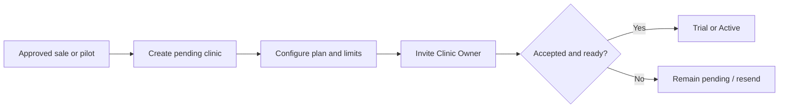

Branding is configured by Clinic Owner/Administrator after access: clinic name, logo, contacts, report defaults, and permitted wording are previewed, validated, activated, and audited without removing mandatory safety content.

## 8. Authentication Flows

### AUTH-FLOW-001 — Invitation, login, recovery, MFA, and expiry

| Flow field | Definition |
|---|---|
| Primary/supporting actors | Invited staff user; Clinic Administrator, Platform Administrator |
| Goal/trigger | Establish or recover an authorised session |
| Preconditions/permissions | Valid invitation/membership; active clinic; supported recovery method |
| Starting/completion state | Invited/unauthenticated → Active authenticated session |
| Main success path | User opens invitation, verifies identity, sets credentials, configures MFA when enabled, accepts role/clinic, signs in, selects authorised clinic, and enters permitted workspace |
| Decisions/alternatives | Reject invitation; invitation expires; forgotten-password recovery; MFA challenge; multiple authorised clinics |
| Failures/recovery | Invalid/expired token, suspended clinic, wrong MFA, or expired session shows safe guidance without account discovery; authorised administrator may resend/reactivate |
| Data/status/audit | Invitation, credential/recovery/MFA state, sessions; Invited → Active/Expired; login, recovery, MFA, expiry, denial logged |
| Notifications/privacy/presentation | User receives security notices; no patient detail in authentication messages; presentation uses separate temporary session |
| Acceptance/stage | Deactivated users cannot authenticate; recovery cannot expose other clinic accounts; MVP |

## 9. Clinic User Management Flows

### USER-FLOW-001 — Invite, change role, deactivate, and exit

The Clinic Owner/Administrator selects an email/user identity, clinic, default bundle, and optional permissions. Doctor assignment follows elevated verification. The invitee accepts or rejects; expired invitations may be resent. A role change displays gained/lost authority, requires confirmation, applies immediately, revokes incompatible sessions/grants, and is audited.

Deactivation immediately stops subsequent protected actions, scan/presentation/support sessions are revoked or re-evaluated, pending tasks are reassigned, and authorship remains. Staff exit additionally reviews devices, exports, recent sensitive activity, follow-ups, reports, and approvals. The last Clinic Owner cannot exit without transfer or closure.

## 10. Patient Registration Flows

### PATIENT-FLOW-001 — Search, duplicate check, and create patient

| Flow field | Definition |
|---|---|
| Primary/supporting actors | Reception User; Clinical Assistant, Clinic Administrator, Doctor |
| Goal/trigger | Open the correct existing record or create one patient safely |
| Preconditions/permissions | Active clinic membership and patient search/create permission |
| Starting/completion state | No selected patient → Active patient timeline |
| Main success path | Search permitted identity/contact fields; review masked matches; select existing patient or choose Create; enter identity, contact, consultation reason, assigned Doctor, consent/privacy acknowledgement; product generates clinic-specific patient ID; open timeline |
| Decisions/alternatives | Possible duplicate requires compare/confirm; incomplete consent remains visible; patient declines registration/cancels |
| Failures/recovery | Duplicate warning, validation, or interrupted save leaves no false completed record; resume draft or return to existing patient |
| Data/status/audit | Patient, consent, assignment, registration author/time; Active; creation and sensitive edits logged |
| Notifications/privacy/presentation | Assigned staff may be notified; search is clinic-bound/masked; patient never enters dashboard |
| Acceptance/stage | Cross-clinic results never appear and duplicates require deliberate override; MVP |

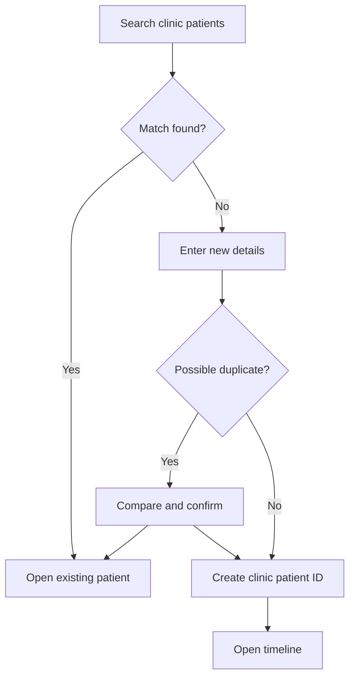

## 11. Patient Search and Reopening Flows

### PATIENT-FLOW-002 — Reopen, edit, archive, restore

An authorised user searches only permitted fields and sees masked list content appropriate to role. Opening verifies current clinic/patient permission. Identity edits preserve change history. Archive shows impact, requires confirmation, changes Active → Archived, removes the patient from normal results, and preserves all clinical data. An authorised restore records reason and returns Archived → Active. A returning patient reuses this record; a new consultation or procedure episode is linked instead of creating a duplicate.

## 12. Initial Consultation Flows

### CONSULT-FLOW-001 — Hair-present consultation

| Flow field | Definition |
|---|---|
| Primary/supporting actors | Doctor; Clinical Assistant, Reception User, Patient |
| Goal/trigger | Preserve a complete preliminary consultation while hair is present |
| Preconditions/permissions | Active patient, consent state visible, assigned/authorised Doctor |
| Starting/completion state | No consultation/Draft → Preliminary plan ready or Completed consultation |
| Main success path | Start consultation; record concern, history, hair condition, length, styling, dry/wet state, fibres/concealers/oils/products; capture standard photos; assess; draft regions and hairline; record preliminary areas/density; calculate preliminary graft range; Doctor adds private notes; complete/review |
| Decisions/alternatives | Resume draft; change Doctor with authority; capture incomplete; cancel with reason; create another linked consultation |
| Failures/recovery | Save interruption preserves confirmed draft; missing fields show exactly what remains; AI/3D failure permits manual continuation |
| Data/status/audit | Consultation, conditions, media links, draft plan, notes; Draft → In progress → Awaiting review → Preliminary plan ready/Completed |
| Notifications/privacy/presentation | Doctor review notification; doctor-only notes excluded from patient-safe contexts |
| Acceptance/stage | Preliminary output is never labelled final; original stage remains separate from surgery-day plan; MVP |

## 13. Phone-to-Laptop Pairing Flows

### SCAN-FLOW-001 — Create and pair temporary capture session

The Doctor/Assistant opens the patient consultation on laptop, creates a patient-bound session, and displays a short-lived QR or code. The phone opens the scan surface, validates clinic/session, shows minimum patient confirmation, and asks the user to confirm the correct patient/consultation. QR and code routes produce the same permissions.

Pairing transitions Created → Paired. Wrong patient, expired code, revoked device, or inactive user blocks capture and logs the denial. The laptop shows live progress without exposing the full record on the phone.

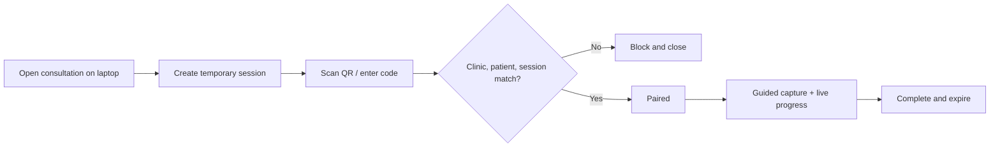

## 14. Standardised Photography Flows

### SCAN-FLOW-002 — Capture the required photograph set

The product loads the consultation, surgery-day, post-op, or follow-up checklist. The user reviews angle, distance, lighting, position, background, hair condition, and required preparation. For each view, the user captures, reviews quality, retains or retakes, and records conditions. Camera permission denial gives permission guidance, alternative supported device, or approved manual upload path.

Poor quality creates a warning, not false clinical certainty. Completion requires every required view or an authorised documented exception. Source images remain unchanged; annotations and patient-safe derivatives are separate.

## 15. Mobile Scan Session Flows

### SCAN-FLOW-003 — Run, pause, resume, complete, expire, or revoke

Start requires Paired state. Capture transitions Paired → Capturing → Uploading/Processing. The user may save Incomplete with accepted images and resume through the same verified patient context. Completion confirms accepted files and changes to Completed, then expires pairing. Manual expiry/revoke stops further uploads immediately. A user may not switch patients inside a session.

## 16. Scan Upload and Recovery Flows

### RECOVERY-FLOW-001 — Interrupted upload recovery

| Flow field | Definition |
|---|---|
| Primary/supporting actors | Clinical Assistant; Doctor |
| Goal/trigger | Recover interrupted or duplicate media safely |
| Preconditions/permissions | Valid patient-bound session or authorised resumption |
| Starting/completion state | Uploading/Failed/Incomplete → Completed or Incomplete |
| Main success path | Show item-level accepted/pending/failed state; retry only missing item; detect duplicate; retain one canonical source; update laptop progress |
| Decisions/alternatives | Network absent, session expired, source changed, or retake preferred |
| Failures/recovery | Never mark complete without confirmation; new session may securely claim verified incomplete draft |
| Data/status/audit | Source, attempt, checksum/reference, acceptance, duplicate resolution; retry events logged |
| Notifications/privacy/presentation | Non-sensitive failure message; no other patient data in cache or retry |
| Acceptance/stage | Successfully uploaded data survives; retry cannot cross patient or create silent duplicates; MVP |

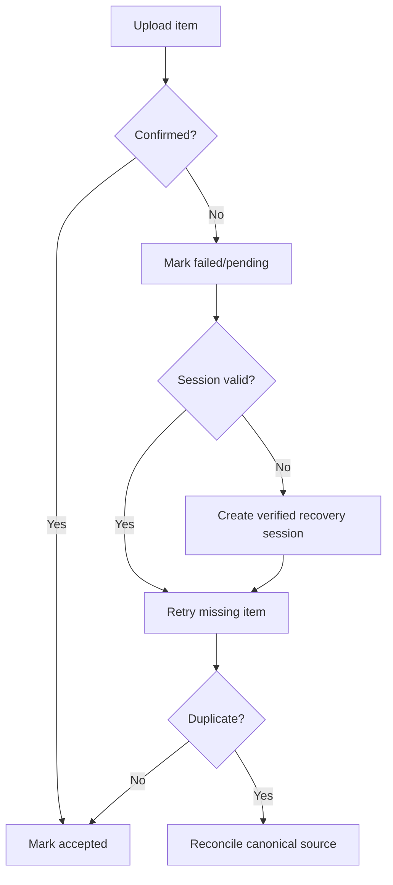

## 17. Preliminary Assessment Flows

### CONSULT-FLOW-002 — Create preliminary assessment

The Doctor reviews history, photos, quality limitations, and available model; records a non-autonomous hair-loss assessment; drafts frontal, mid-scalp, crown, temple, and donor area context as applicable; saves private notes; and marks output Preliminary. The Doctor may use or ignore AI-assisted suggestions. Missing evidence requests recapture/manual confirmation. Completion produces Doctor review required or Preliminary plan ready, never a final surgical plan.

## 18. 3D Model Flows

### MODEL-FLOW-001 — Upload, process, review, fail, and supersede model

An authorised Doctor/Assistant uploads an existing model or, where enabled, requests experimental reconstruction from confirmed source images. Status moves Uploaded/Queued → Processing → Ready/Needs review or Failed. The Doctor views/rotates a ready compatible model, verifies provenance and scale, and selects only approved screenshots for patient-safe use.

Failure preserves source images and permits retry or 2D/manual continuation. A malformed model is not used for measurement. A replacement becomes a new version; the old model is Superseded, not overwritten.

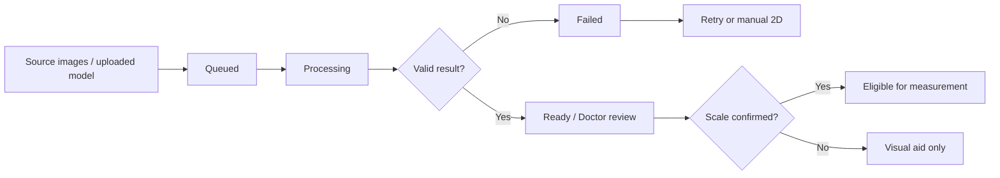

## 19. Region-Marking Flows

### MEASURE-FLOW-001 — Draw, edit, remove, and protect regions

The Doctor or authorised Assistant chooses a source view, draws and labels recipient regions, edits boundaries, or deletes a draft region. Assistant work remains draft. AI-assisted regions remain distinguishable from manual edits. The Doctor reviews the exact version and approves/locks regions for measurement. Approved regions cannot be destructively edited; change creates an amended draft and invalidates affected approval.

## 20. Area-Measurement Flows

### MEASURE-FLOW-002 — Calculate or enter area

The user selects an approved/draft region and confirms physical scaling. When reliable, the product calculates area with displayed method, units, precision, and source. If scale is unavailable, exact final cm² is withheld; the Doctor may recapture, calibrate, or enter a manual value with method/reason. Consultation values may remain Preliminary. Only the Doctor approves final surgery-day measurements.

## 21. Preliminary Graft-Planning Flows

### GRAFT-FLOW-001 — Density and preliminary graft range

The Doctor selects density ranges by zone and reviews area provenance. The product calculates a transparent preliminary graft range. The Doctor may manually adjust zone allocation with reason. Missing scale or weak capture keeps the range preliminary. Planned values remain distinct from future extracted, usable, and implanted graft counts.

## 22. Hairline-Design Flows

### HAIRLINE-FLOW-001 — Draft and compare hairline options

The Doctor draws a preliminary hairline on a derived view, edits it, saves alternatives, and compares options. Any patient-facing rendering is labelled an illustrative simulation and not a guaranteed result. Assistant-created drafts require Doctor review. Saving an option does not approve it; approval occurs only in the clinical-plan flow.

## 23. AI-Suggestion Review Flows

### AI-FLOW-001 — Request, review, accept, edit, reject, or bypass AI

The authorised user requests an available AI-assisted suggestion. The product preserves input reference, model/service version, output, confidence/limitation, and status. The Doctor reviews confidence, accepts, edits, rejects, or replaces it. A quality warning may request recapture. If unavailable or rejected, the user continues manually. Only Doctor-reviewed values may enter the approved plan.

## 24. Doctor-Approval Flows

### APPROVAL-FLOW-001 — Submit, approve, reject, amend, and reapprove

| Flow field | Definition |
|---|---|
| Primary/supporting actors | Doctor; Assistant/preparer |
| Goal/trigger | Convert a complete draft into a doctor-approved exact version |
| Preconditions/permissions | Active Doctor; required data complete; no unresolved blocking reconciliation |
| Starting/completion state | Doctor review required → Approved or Rejected |
| Main success path | Preparer submits; Doctor reviews sources, limitations, regions, measurement, density, graft allocation, hairline, notes/disclosures; Doctor approves; product records identity/time/version |
| Decisions/alternatives | Reject with reason; return for edit; request recapture; continue manual |
| Failures/recovery | Stale version or concurrent edit blocks approval; reload/reconcile; material later change creates Amended and requires reapproval |
| Data/status/audit | Submission, review, decision, reason, approval and version; all transitions audited |
| Notifications/privacy/presentation | Preparer notified; approval does not expose private notes or automatically share |
| Acceptance/stage | No non-doctor or AI can create final approval; MVP |

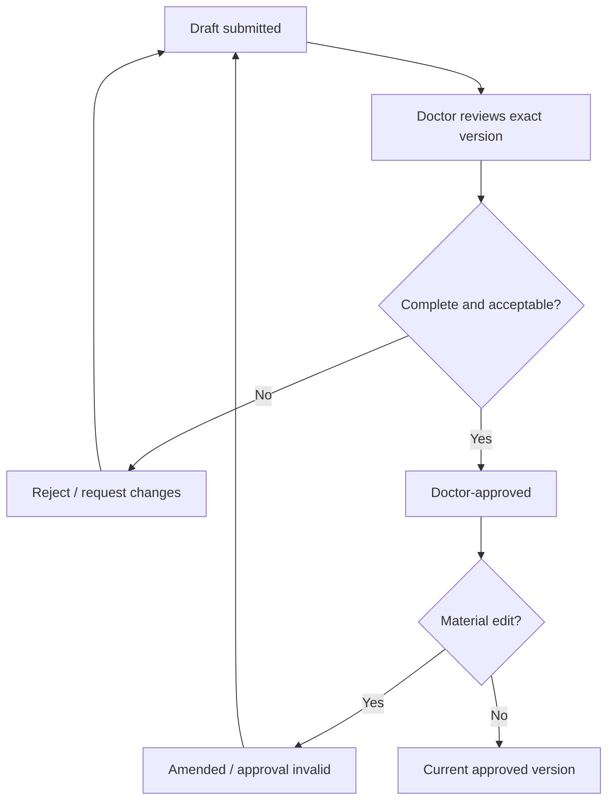

## 25. Patient-Safe Presentation Flows

### PRESENT-FLOW-001 — Create, operate, disconnect, and end presentation

The Doctor selects approved patient-safe images, region maps, hairline proposal, preliminary graft range, disclaimers, and illustrative simulation. A temporary one-patient session is created. The Presentation User opens the LED and moves only among approved slides.

Contacts, other patients, search, doctor-only notes, warnings not approved for display, staff comments, audit, subscription, downloads, and administration never enter the session. Lost connection clears/suspends content. Expiry or manual end clears display and blocks refresh. Unauthorised access is denied and logged.

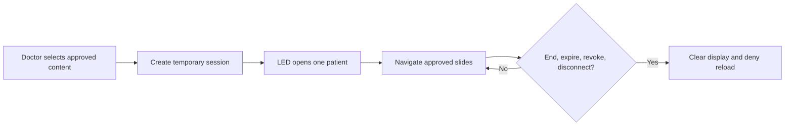

## 26. Consultation Report Flows

### REPORT-FLOW-001 — Draft, approve, download, and share consultation report

Doctor/Report Coordinator generates the correct report type from defined source versions, selects allowlisted patient-safe content, branding, watermark, number, version, verification reference, and disclaimers. The Coordinator may prepare but cannot change clinical source or approve. Doctor reviews and approves or rejects. Only Approved may download/share externally. Sharing records recipient/channel reference, sharer, time, version, expiry, and revoke. Internal and patient-safe reports remain separate.

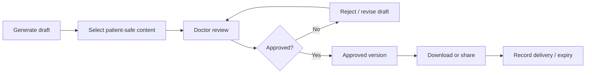

## 27. Surgery-Day Shaved Assessment Flows

### CONSULT-FLOW-003 — Create linked shaved assessment

The clinic reopens the existing patient and original consultation, creates a separate surgery-day episode, captures shaved photos, records conditions, and uploads/creates a clearer model where available. The Doctor re-marks recipient regions, confirms scale, records final areas, density, hairline, and allocation, and compares them with preliminary values. Earlier estimates remain unchanged.

## 28. Final Surgical Plan Flows

### GRAFT-FLOW-002 — Prepare and approve final surgical plan

The Doctor reviews final recipient areas, donor area considerations, density by zone, graft allocation, hairline, source evidence, and all AI-assisted dispositions. The product reconciles zone totals, displays planned values, and blocks approval for unresolved required data. Approval records Doctor and time. Later amendment creates a new version, marks the prior version Superseded where applicable, and requires reapproval.

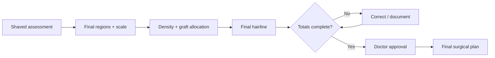

## 29. Procedure Documentation Flows

### PROC-FLOW-001 — Record the procedure

Doctor/Technician opens the approved final surgical plan, confirms patient/procedure, records date, surgeon, team, technique, extraction times, follicular-unit counts, damaged/discarded grafts, usable total, implanted allocation by zone, deviations, notes, and post-op media. Technician and Assistant may draft authorised data but cannot alter the approved plan or finalise. Doctor completes review and approves the procedure record.

## 30. Graft-Count Reconciliation Flows

### PROC-FLOW-002 — Reconcile planned, extracted, usable, and implanted values

The product keeps each count distinct and validates:

- follicular-unit breakdown against extracted total;
- extracted minus damaged/discarded against usable total, using the approved clinic rule;
- implanted zone allocation against implanted total; and
- implanted/remaining disposition against usable total.

Mismatch changes In progress → Count reconciliation required. The Technician recounts/corrects or records a reason; unresolved differences go to Doctor review. The plan is never rewritten to hide actuals.

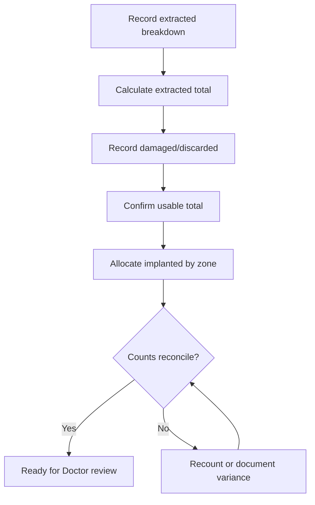

## 31. Immediate Post-Procedure Record Flows

### PROC-FLOW-003 — Complete post-operative record

Authorised staff follows the immediate post-op checklist, captures standard images, records conditions and deviations, links images to the procedure, and submits the complete record. Failed uploads remain visible and retryable. The Doctor reviews unresolved warnings/counts and approves the version. Later correction is an amendment.

## 32. Follow-Up Scheduling and Record Flows

### FOLLOW-FLOW-001 — Schedule and conduct follow-up

Clinic staff creates configured checkpoints, producing Scheduled items. When due, staff opens the correct patient/procedure and records scheduled or unscheduled follow-up, donor/recipient healing, visible coverage, Doctor assessment, patient satisfaction, and next recommendation. Status moves Scheduled → Due → Completed, or Missed/Rescheduled/Cancelled. A missed or long-absent patient can resume with a new linked follow-up without filling the gap artificially.

## 33. Standardised Follow-Up Photography Flows

### FOLLOW-FLOW-002 — Capture comparable follow-up photographs

The Assistant reviews prior baseline and guidance for angle, distance, lighting, position, background, hair condition, and device. Each new view is captured/retaken and linked to its checkpoint. Material mismatch creates a comparison warning; the user may recapture or document limitation. Earlier photos remain unaltered.

## 34. Longitudinal Comparison Flows

### COMPARE-FLOW-001 — Compare the patient journey

The Doctor selects consultation, shaved assessment, post-op, and follow-up timepoints and compatible views. Side-by-side is MVP; overlay is used when alignment supports it; timeline is available; compatible 3D comparison is Post-MVP/conditional. Capture differences remain visible. The Doctor avoids causal or guaranteed claims and may generate a progress/final-result report subject to approval.

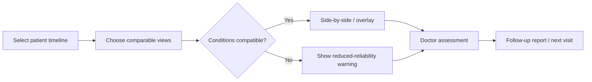

## 35. Corrected Report and Versioning Flows

### REPORT-FLOW-002 — Correct a previously approved/shared report

An authorised user identifies the source correction. The product creates a new Draft from the correct source version and keeps the shared report unchanged. Doctor approves the corrected version. Previous becomes Superseded, its links may revoke/expire under policy, and the clinic can identify recipients for manual notification. No version is silently replaced.

## 36. Patient Report Sharing Flows

### REPORT-FLOW-003 — Deliver approved patient-safe output

Reception/Coordinator/Doctor chooses the active Approved patient-safe report, verifies patient/recipient and channel, creates a private time-limited link or controlled download, shares, and records delivery. Expired link denies access; a new link requires current permission and current approved version. Internal reports are never eligible.

## 37. Clinic Data Export Flows

### EXPORT-FLOW-001 — Request, approve, generate, and retrieve export

Clinic Owner/authorised role defines patient or clinic scope, purpose, recipient, and format; identity and holds are reviewed; elevated approval is recorded. The export job shows Requested → Approved → Processing → Ready/Failed/Expired. Secure retrieval is time-limited and logged. It includes authorised clinic data, not source code, proprietary algorithms, platform tools, other clinics, or unrestricted platform configuration.

## 38. Record Archive and Deletion Flows

### DELETE-FLOW-001 — Archive, restore, request, approve, and permanently delete

Archive is the normal reversible removal from active work. Restore verifies context and reason. Permanent deletion starts with a request, shows linked impact, requires higher authority, offers/requires export, checks retention/hold, enters soft-deleted/pending state, and only then follows approved policy. Request cancellation or rejection returns the appropriate recoverable state.

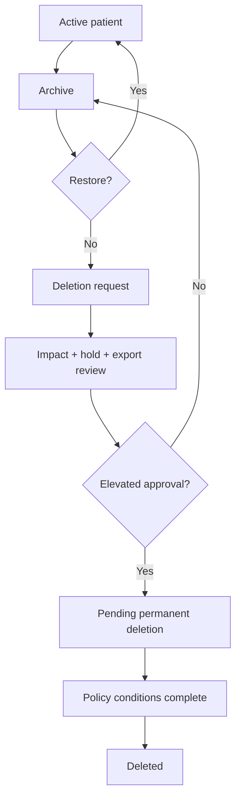

## 39. Platform Support Access Flows

### SUPPORT-FLOW-001 — Request and use temporary support access

Clinic user requests support. Platform staff first inspect operational metadata. If clinical scope is necessary, an authorised clinic user approves named Support Engineer, clinic, module/patient, permitted actions, reason, and duration. Requested → Approved → Active. Every sensitive action logs. Expiry/revoke ends access immediately; renewal is a new request. Support cannot approve clinical work, export, delete, change roles, or cross tenant without separate authority.

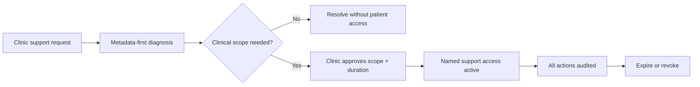

## 40. Subscription and Inactive-Clinic Flows

### SUBSCRIPTION-FLOW-001 — Suspend, inactivate, reactivate, or close clinic

Platform Administrator changes commercial status only with authority/reason. Trial/Active may become Suspended or Inactive; normal access follows approved policy, but records are not deleted. Clinic Owner receives status and resolution/closure guidance. Reactivation restores permitted access after commercial/security checks. Closing triggers export, staff access removal, retention, and deletion review before Closed. Patient payments and clinic financial management remain outside the flow.

## 41. Failure and Recovery Flows

### RECOVERY-FLOW-002 — Common interruption contract

Every recoverable failure displays the failed step, confirmed saved state, retry safety, duplicate risk, manual fallback, and escalation. Successful prior work remains. Recovery revalidates clinic, patient, user, permissions, session, and version. Cancellation is distinct from failure and retry.

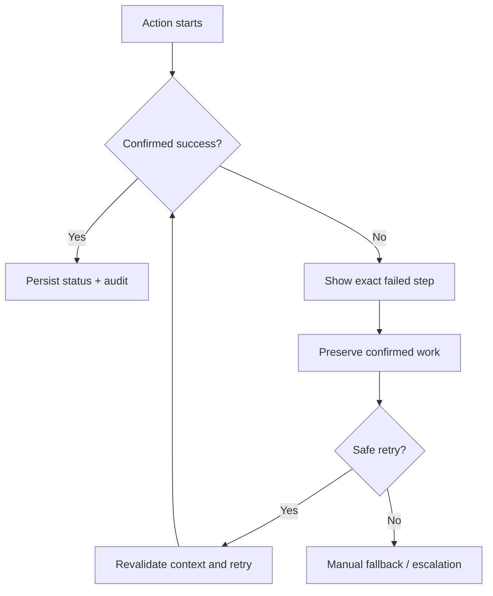

### Mandatory individual-flow catalogue

The following atomic flows are acceptance-test cases within the major flows above:

| IDs | Atomic flows |
|---|---|
| MF-001–MF-016 | Create clinic; configure branding; invite Clinic Owner; invite Doctor; invite staff; accept invitation; reject/expire invitation; login; password recovery; MFA setup; session expiry; deactivate user; role change; staff exit; suspend clinic; reactivate clinic |
| MF-017–MF-026 | Search before registration; create patient; detect duplicate; edit identity; masked patient list; open profile; archive; restore; request deletion; export patient |
| MF-027–MF-034 | Start consultation; resume draft; assign/change Doctor; record history; record consent; complete; cancel; create another linked consultation |
| MF-035–MF-047 | Generate scan session; pair by QR; pair by code; confirm patient; deny camera; capture photo; retake; save incomplete; resume; detect duplicate upload; complete; expire; revoke device |
| MF-048–MF-061 | Upload model; request reconstruction; handle failure; view/rotate; confirm scaling; unavailable scaling; draw/edit/delete draft/lock region; calculate area; manual area; preliminary measurement; approve final measurement |
| MF-062–MF-073 | Select density; calculate preliminary graft range; adjust allocation; draw/edit/compare hairline; save illustrative simulation; submit/approve/reject/amend/reapprove plan |
| MF-074–MF-080 | Request AI-assisted suggestion; review confidence; accept/edit/reject; continue without AI; recapture after warning |
| MF-081–MF-089 | Create presentation; select safe content; open LED; navigate slides; hide sensitive content; end; lost connection; expiry; unauthorised access |
| MF-090–MF-101 | Generate internal/patient-safe report; review; approve/reject; correct; supersede; download/share; expire link; record delivery; prevent internal sharing |
| MF-102–MF-115 | Start shaved assessment; compare stages; create final plan; extracted counts; follicular-unit breakdown; damaged; usable; implanted zones; reconcile; mismatch; deviation; complete; post-op images; approve procedure |
| MF-116–MF-127 | Create schedule; open scheduled; unscheduled follow-up; photos; compare baseline; inconsistency; Doctor assessment; satisfaction; report; next follow-up; missed; resume after absence |
| MF-128–MF-140 | Request support; approve support; restrict scope; begin support; expire; revoke; recover upload; recover report; reconnect consultation; resolve edit conflict; restore archive; inactive subscription; closure export |

#### MF-001–MF-016 — Clinic and access detail

Platform Administrator creates clinics only after commercial approval and records Pending onboarding before any clinic user enters. Branding remains a clinic action after invitation acceptance. Each invitation identifies one clinic and role; Doctor invitation requires elevated verification. Acceptance activates membership, while rejection/expiry grants no access. Login, recovery, optional MFA, and session expiry reveal no unrelated account or patient data. Deactivation, role change, and staff exit take effect for subsequent actions immediately, revoke incompatible temporary sessions, preserve historical authorship, and reassign pending work. Suspension restricts normal clinic access without deleting records; reactivation requires authorised commercial/security confirmation. Invitation, authentication, role, deactivation, suspension, and reactivation events are audited.

#### MF-017–MF-026 — Patient-management detail

Reception or another authorised role searches within the active clinic before creation. Masked results expose only permitted identity information. A possible duplicate pauses creation for deliberate comparison; override requires authority and reason. Creation records patient ID, identity, contact, concern, assigned Doctor, consent status, author, and time. Profile opening and editing recheck field permissions; sensitive corrections retain history. Archive removes a patient from normal active lists but preserves the full timeline. Restore requires reason and returns the same identity, not a copy. Permanent deletion and export are separate elevated workflows: neither follows from ordinary read/edit permission. Search, creation, duplicate override, sensitive edits, archive, restore, deletion request, and export are audited.

#### MF-027–MF-034 — Consultation detail

A new consultation requires an Active patient, valid clinic, authorised creator, assigned Doctor, and visible consent status. Starting produces Draft, while entering clinical content moves to In progress. Resume restores the last confirmed version and shows missing or failed items. Doctor reassignment preserves earlier authorship and notifies the old/new responsible users. Medical and hair-loss history follows clinical permissions; reception cannot enter private Doctor content. Consent changes preserve version, actor, and time. Complete means the defined preliminary consultation is documented, not that a final surgical plan exists. Cancellation requires reason and does not delete captured evidence. A later consultation for the same patient becomes a new linked episode. All status, assignment, consent, and completion events are audited.

#### MF-035–MF-047 — Mobile-capture detail

Session generation binds clinic, patient, consultation, initiating user, purpose, and expiry. QR and code pairing validate the same context and require patient confirmation before camera use. Camera denial does not create a completed scan and offers safe permission or alternate-device guidance. Each required photograph moves through capture, local review, upload confirmation, and accepted/retake state. Incomplete sessions preserve confirmed files and list missing views. Resume revalidates user, patient, session, and source draft. Duplicate detection preserves evidence until one canonical source is chosen. Complete requires confirmed required views or an authorised exception, then expires pairing. Manual expiry or device revoke blocks further upload. Session and file events are patient-bound and audited.

#### MF-048–MF-061 — Model, region, and measurement detail

Model upload or reconstruction request identifies source, patient, session, format, version, and scaling status. Experimental reconstruction moves through queued, processing, ready, needs-review, or failed without blocking manual work. Failure preserves sources and retry history. Viewing/rotation grants no measurement authority. Physical scaling requires supported confirmation; unavailable scale blocks apparently exact final cm². Region draw, edit, and draft deletion preserve source and author. Doctor approval locks the reviewed region version; later changes create an amendment. Calculation displays method, unit, precision, and scale. Manual area entry requires method/reason. Preliminary measurements remain labelled, while final surgery-day measurement requires Doctor approval. Every source, region, measurement, override, and approval transition is traceable.

#### MF-062–MF-073 — Graft and hairline detail

The Doctor selects density by zone against identified recipient areas. The product calculates a preliminary graft range using visible inputs and rules; uncertainty remains a range. Manual allocation changes preserve original value and reason. Hairline drawing uses a derived view, never destructive source editing. Options may be edited and compared; a saved illustrative simulation remains non-final and visibly non-guaranteed. Submission validates required source, area, density, allocation, and hairline versions. Only the Doctor approves. Rejection records reason and returns an owned draft. Amendment of an approved plan creates a new version, invalidates affected approval, and cannot be shared as current until reapproved. Draft, decision, amendment, and approval events are audited.

#### MF-074–MF-080 — AI-assistance detail

An AI-assisted request is optional and records the input and supported use. Returned output displays suggestion status, confidence or limitation when available, and does not edit clinical data automatically. The Doctor may accept it into a draft, edit it, reject it, or ignore it. Acceptance does not equal final-plan approval. Editing preserves the original and Doctor correction; rejection records disposition without penalising manual completion. Low-confidence or quality warnings may request a specific recapture but cannot force an unsupported conclusion. Unavailability exposes a manual path for regions, measurement, density, allocation, hairline, and report approval. Requests, outputs, corrections, rejections, and final Doctor decisions remain reconstructable for evaluation and audit.

#### MF-081–MF-089 — Presentation detail

Presentation creation starts from the correct patient and an approved content allowlist. Doctor selects content and confirms that private notes, contacts, other patients, internal warnings, staff comments, audit, subscription, and administration are absent. Opening the LED creates a temporary Presentation session rather than dashboard access. Slide navigation is limited to the approved set; hide/remove changes only the session selection, not source records. Manual end, expiry, revoke, or lost connection clears or suspends content and prevents stale reload. An unauthorised user, direct URL, wrong patient, or expired session receives no clinical data. Creation, approval, opening, navigation where required, disconnection, end, expiry, revoke, and denials are audited.

#### MF-090–MF-101 — Report detail

Internal and patient-safe generation begin from explicit source versions and never share a common disclosure assumption. The internal report follows clinical permissions; the patient-safe draft uses only allowlisted content. Doctor or Coordinator reviews completeness, branding, watermark, version, verification reference, and disclaimer, but only Doctor approves. Rejection returns to Draft with reason. Correction creates a new version and marks the previous report Superseded after reapproval; old sharing history remains. Download and sharing are separate permissions and only current Approved patient-safe output qualifies. Link expiry denies access without deleting the report. Delivery records version, recipient/channel reference, sharer, time, and expiry. Attempts to share internal output are denied and audited.

#### MF-102–MF-115 — Surgery and procedure detail

Shaved assessment links to the existing patient and consultation while preserving preliminary values. Comparison highlights changes rather than overwriting estimates. The final surgical plan requires Doctor review of recipient areas, donor considerations, density, allocation, hairline, and AI-assisted dispositions. Procedure entry opens the approved plan read-only for non-doctors. Technician/authorised Assistant records extracted grafts, follicular-unit breakdown, damaged/discarded values, usable total, implanted zone allocation, deviations, notes, and images. Reconciliation shows planned, extracted, usable, and implanted values separately. Mismatch blocks clean completion until corrected or explained for Doctor review. Procedure completion remains pending until post-op media and required fields are confirmed. Only Doctor approves; later correction is an amendment.

#### MF-116–MF-127 — Follow-up detail

Clinic configuration creates scheduled checkpoints linked to the procedure. Opening verifies patient, procedure, appointment state, and staff permission. An unscheduled visit becomes its own dated record. Photography uses the applicable standard checklist and previous views for guidance. Baseline comparison shows dates and conditions; mismatches create a reliability warning rather than a claim. Staff records donor/recipient healing and permitted observations, while Doctor records clinical assessment. Patient satisfaction is recorded as reported, not inferred. Follow-up reports require patient-safe selection and Doctor approval. The next checkpoint may be scheduled, and missed visits may reschedule without fabricating completion. After long absence, staff opens the same timeline and creates a new linked follow-up. All transitions remain auditable.

#### MF-128–MF-133 — Support detail

A clinic request states problem, clinic, requester, and urgency. Platform staff use operational metadata first. If patient/module access is necessary, the authorised clinic approver selects the named Support Engineer, exact scope, permitted actions, reason, start, and short duration. Approval never permits cross-tenant browsing, Doctor approval, role change, export, deletion, or sharing unless a separate policy expressly authorises the exact action. Active access shows its temporary state to the support user and clinic. Every sensitive view/action is logged. Expiry ends access automatically; clinic revoke ends it immediately. Unfinished diagnosis returns to metadata-only work or requires a new request. A Support Engineer cannot approve or extend their own grant.

#### MF-134–MF-138 — Recovery detail

Upload recovery retains accepted files, shows failed items, revalidates patient/session, and retries idempotently. Report recovery retains the approved source version and generation attempt; retry cannot silently select a newer source. A disconnected consultation session reopens the last confirmed draft after user, clinic, patient, and version checks. Concurrent conflict preserves both contributions, identifies the newer version, and requires deliberate reconciliation rather than last-write-wins. Accidentally archived records restore only through authorised reason and return to the same timeline. Each recovery distinguishes failure from cancellation, states what was saved, and records attempt/outcome. Recovery never bypasses Doctor approval, changes tenant/patient binding, or removes superseded history.

#### MF-139–MF-140 — Inactive clinic and closure detail

When a subscription becomes inactive, Platform Administrator records status/reason and the clinic receives clear resolution guidance. Normal feature access follows approved policy, while clinical data remains preserved and cannot be silently deleted. Authorised limited access for export, compliance, or closure is distinct from full reactivation. Closure export requires verified Clinic Owner request, approved scope, secure generation/delivery, expiry, and audit. Staff and temporary sessions are revoked as closure progresses. Retention and deletion follow approved Pakistan launch policy and legal/clinical holds. Closed is reached only after ownership, export, access, retention, and operational checks complete. Reactivation before closure requires authorised commercial and security review.

## 42. Cross-Flow Status Transitions

Cross-flow entry is allowed only from compatible status:

| From | To | Gate |
|---|---|---|
| Active patient | Draft consultation | Search/duplicate check and permission |
| Consultation capture complete | Preliminary assessment | Required views or approved exception |
| Preliminary plan ready | Presentation/report draft | Doctor-selected patient-safe content |
| Consultation completed | Surgery-day assessment | Existing patient and linked consultation |
| Final plan draft | Approved final surgical plan | Doctor review and reconciled required data |
| Approved plan | Procedure Ready | Correct patient/date/team and current plan |
| Procedure counts entered | Procedure Approved | Reconciliation or Doctor-approved variance |
| Approved procedure | Follow-up schedule | Valid checkpoints |
| Completed follow-up | Comparison/report | Compatible authorised sources |
| Material source correction | Report Corrected/Superseded | Regeneration and Doctor reapproval |
| Active record | Archived/deletion path | Elevated permissions and retention gates |

## 43. Cross-Role Handoffs

| Handoff | Required state/data | Private/permission boundary | Notification and rejection |
|---|---|---|---|
| Reception → Assistant | Active patient, identity, consent status, assigned Doctor, consultation shell | Medical/private notes remain restricted | Assistant notified; rejection returns to registration with reason |
| Assistant → Doctor | Capture status, conditions, drafts, missing warnings | Assistant cannot approve | Doctor review request; rejection returns exact missing items |
| Doctor → Report Coordinator | Doctor-reviewed source and patient-safe selections | No private notes or clinical source editing | Coordinator notified; may reject incomplete report inputs |
| Doctor → Presentation User | One approved temporary presentation | No dashboard/search/download | Session ready notice; rejection closes session |
| Doctor → Procedure Technician | Approved final surgical plan and assigned procedure | Technician cannot modify plan | Technician accepts; mismatch returns to Doctor |
| Technician → Doctor | Counts, reconciliation, deviations, post-op media | Draft until Doctor review | Review notification; rejection reopens specified fields |
| Doctor → Follow-up staff | Approved procedure and schedule | Only necessary clinical context | Due notification; staff may reschedule/return invalid assignment |
| Clinic user → Support Engineer | Request, reason, metadata, approved temporary scope | No default clinical content | Support accepts; rejection returns to metadata-only route |
| Platform Administrator → Clinic Owner | Workspace, plan, limits, settings, invitation | No patient access before clinic activation | Owner acceptance activates onboarding; rejection stays pending |
| Clinic Owner → clinic staff | Active membership, role, assignments | Least privilege; Doctor role separately verified | Invitation/task notice; rejection revokes pending assignment |

## 44. High-Risk Flow Controls

- Tenant and patient context are revalidated at every sensitive transition.
- Doctor-only approval cannot be delegated through a handoff.
- Raw images, models, internal reports, and private notes never enter patient-safe output automatically.
- Scan, presentation, report, file, and support sessions expire and revoke.
- Concurrent saves cannot silently overwrite newer clinical work.
- Material edits invalidate affected approval.
- Planned, extracted, usable, and implanted counts remain distinct.
- Export and permanent deletion require elevated approval and audit.
- Deactivation ends future authority immediately.
- Recovery never changes clinic/patient binding or hides failure.

## 45. MVP Flow Acceptance Criteria

1. All `MF-001` through `MF-140` have positive, denial, failure, and recovery tests where applicable.
2. The master journey completes from registration through follow-up and returning patient.
3. The core journey completes with AI and automatic 3D disabled.
4. Every status transition has an authorised actor, precondition, audit rule, and recovery path.
5. Cross-tenant, cross-patient, private-note, internal-report, file-link, support, and presentation negative tests pass.
6. Only a Doctor can final-approve clinical plans, hairlines, measurements, procedures, and patient-safe reports.
7. Preliminary consultation values remain separate from the final surgical plan and procedure actuals.
8. Interrupted upload, disconnected laptop/LED, delayed job, concurrent edit, failed report, inactive user, and expired sessions recover safely.
9. Clinic onboarding remains manual and patient payments remain excluded.
10. FACE Aesthetic Clinic Lahore validates the real clinic handoffs and terminology.

## 46. Post-MVP Flow Summary

Post-MVP may add validated automatic 3D reconstruction, depth/calibration, advanced AI-assisted segmentation/classification, 3D comparison, patient portal, native apps, multi-branch hierarchy, automatic platform billing, advanced notifications, and broader analytics. Each new flow retains manual fallback, Doctor approval, tenant isolation, patient-safe disclosure, versioning, and recovery. Break-glass support remains Post-MVP and requires a separate approved flow.

## 47. Open Decisions

1. Who verifies Doctor invitations and role changes?
2. May Reception start consultation shells by default?
3. Which planning fields may Assistants draft?
4. What photo views and exceptions complete each capture type?
5. What scaling methods qualify for final cm²?
6. Which 3D formats and experimental reconstruction path are supported?
7. What plan changes are “material” and require reapproval?
8. Which graft reconciliation variances may a Doctor approve?
9. Who may approve patient-specific support access and for how long?
10. What content and identity may appear on the LED?
11. Which report corrections require recipient notification/revocation?
12. Which channels are permitted for patient-safe sharing in Pakistan?
13. What access remains during Suspended or Inactive clinic states?
14. What retention, archive recovery, and permanent-deletion periods apply?
15. How are concurrent field-level conflicts reconciled?
16. What follow-up capture difference makes comparison unsuitable?
17. Which MFA roles and session durations are mandatory?
18. What approval is needed for closure export and final closure?

## 48. Approval Checklist

- [ ] Haris Liaqat approves the master journey, statuses, MVP boundaries, and open commercial flows.
- [ ] Dr Sheraz approves clinical handoffs, preliminary/final separation, graft reconciliation, and Doctor approval.
- [ ] FACE Aesthetic Clinic Lahore validates clinic onboarding, capture, consultation, procedure, and follow-up flows.
- [ ] Privacy/security review approves tenant, patient, session, file, support, export, deletion, and presentation flows.
- [ ] The aligned thirteen-role model and its remaining authority and policy decisions are approved.
- [ ] All 140 atomic flows are reviewed.
- [ ] All 15 Mermaid diagrams match the written behaviour.
- [ ] Every high-risk handoff has rejection and recovery.
- [ ] Open decisions have owners and due dates.
- [ ] This document is authorised for system-architecture planning.

## 49. Recommended Next Document

The recommended next document is `docs/SYSTEM_ARCHITECTURE.md`. It should translate these approved flows into system boundaries, responsibilities, data movement, reliability, security, and operational qualities without changing product behaviour or selecting features outside the PRD.

## Master Flow Summary

One patient record connects registration, hair-present consultation, phone capture, preliminary assessment and graft range, patient-safe presentation/report, surgery-day shaved assessment, final surgical plan, procedure actuals, post-op record, follow-ups, comparison, and later episodes. Handoffs preserve role boundaries; statuses show truth; failures preserve confirmed work; versions preserve history.

## MVP Critical-Flow Checklist

- [ ] Manual clinic onboarding and invitations work.
- [ ] Search prevents avoidable duplicate patients.
- [ ] Phone pairing is patient-bound and temporary.
- [ ] Capture resumes without duplicate or cross-patient media.
- [ ] Manual planning works without AI/automatic 3D.
- [ ] Doctor approval and amendment/reapproval work.
- [ ] Presentation is isolated and clears on end/expiry.
- [ ] Patient-safe report approval, sharing, correction, and expiry work.
- [ ] Surgery-day plan remains distinct from consultation estimate.
- [ ] Procedure totals reconcile or require Doctor review.
- [ ] Follow-ups and long-term comparison preserve conditions.
- [ ] Support, export, archive, deletion, and inactive clinic flows are controlled.

## High-Risk Handoff Checklist

- [ ] Reception cannot pass private notes it cannot view.
- [ ] Assistant drafts remain unapproved.
- [ ] Coordinator receives only patient-safe inputs.
- [ ] Presentation receives one approved session.
- [ ] Technician cannot alter the final surgical plan.
- [ ] Support receives metadata first and temporary approved scope only.
- [ ] Rejected handoffs return to a safe owned state.
- [ ] Deactivation/revocation cancels pending authority.

## Unresolved Workflow Decisions

Section 47 requires product, clinical, privacy, security, and clinic approval. Until resolved, use minimum privilege, manual fallback, no exact unscaled measurement, no autonomous clinical decision, no patient-specific support without Clinic Owner and clinical approval, no permanent deletion, and no external sharing without current Doctor-approved patient-safe output.

## User-Flow Approval Checklist

- [ ] Actors, permissions, triggers, and preconditions are approved.
- [ ] Success, alternative, failure, recovery, and cancellation paths are approved.
- [ ] Data changes, statuses, audit, and notifications are approved.
- [ ] Privacy and presentation restrictions are approved.
- [ ] Cross-flow transitions and handoffs are approved.
- [ ] MVP/Post-MVP boundaries are accepted.
- [ ] Product Owner, clinical approver, clinic validator, and privacy/security reviewer sign off.
